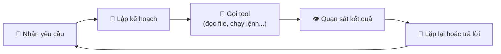
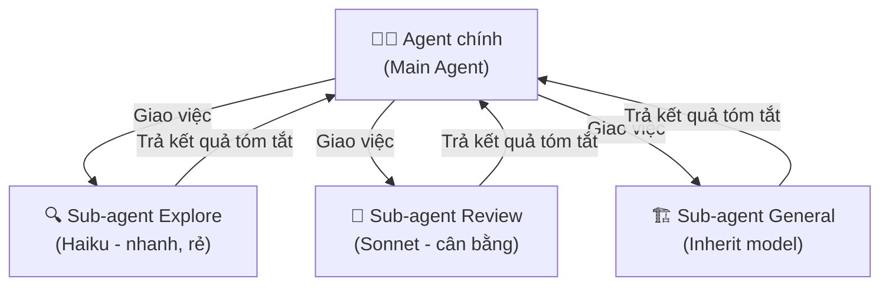

# Claude Code Cơ bản (Phần 1): Agent, Sub-agent và Skill — Khác nhau ở đâu?

## Mở đầu

Nếu bạn mới bắt đầu dùng Claude Code, có lẽ bạn đã gặp ba khái niệm liên tục xuất hiện: **Agent**, **Sub-agent**, và **Skill**. Chúng nghe có vẻ giống nhau — đều liên quan đến "AI làm việc thay bạn" — nhưng thực tế chúng phục vụ những mục đích rất khác nhau.

Hiểu sai ba khái niệm này = lãng phí token, context window bị "ô nhiễm", và kết quả kém. Hiểu đúng = bạn xây được hệ thống AI agent mạnh mẽ, tiết kiệm, và dễ bảo trì.

**Nội dung chính:**

- Agent là gì và hoạt động ra sao
- Sub-agent: tại sao cần tách riêng và cách tạo
- Skill: kiến thức tái sử dụng, không phải agent
- Bảng so sánh ba khái niệm
- Ví dụ thực tế: khi nào dùng cái nào

---

## 1. Agent — "Ông chủ" điều phối mọi thứ

### Khái niệm

Trong Claude Code, **Agent** (hay còn gọi là agent chính — main agent) là phiên Claude Code mà bạn tương tác trực tiếp. Khi bạn mở terminal gõ `claude` hoặc mở Claude Code trong VS Code, bạn đang nói chuyện với agent chính.

Agent chính hoạt động theo vòng lặp liên tục:



Agent chính có quyền truy cập đầy đủ các công cụ (tools): đọc/ghi file, chạy terminal commands, tìm kiếm code, và quan trọng nhất — nó có thể **sinh ra sub-agent** để ủy thác công việc.

### Đặc điểm chính

| Thuộc tính | Mô tả |
|------------|--------|
| **Context window** | Có giới hạn — càng làm nhiều, context càng đầy |
| **Tools** | Truy cập đầy đủ (đọc, ghi, terminal, web search...) |
| **Vai trò** | Điều phối, ra quyết định, tương tác với user |
| **Vòng đời** | Tồn tại suốt phiên làm việc |

!!! info "Vấn đề Context Rot"
    Khi bạn yêu cầu agent chính làm quá nhiều việc trong một phiên — đọc hàng chục file, chạy tests, review code — context window bị lấp đầy bởi "nhiễu" (noise). Model bắt đầu "quên" thông tin quan trọng ban đầu, dẫn đến kết quả kém dần. Đây gọi là **Context Rot**, và đó là lý do sub-agent ra đời.

---

## 2. Sub-agent — "Nhân viên chuyên trách" được giao việc cụ thể

### Khái niệm

**Sub-agent** là một instance Claude riêng biệt, được agent chính sinh ra để thực hiện một nhiệm vụ cụ thể. Sub-agent có **context window riêng**, chạy độc lập, và chỉ trả về kết quả cuối cùng cho agent chính.

Hãy hình dung: Agent chính là **quản lý dự án**, còn sub-agent là **nhân viên chuyên trách** được giao một task rõ ràng. Nhân viên làm xong → báo cáo kết quả → quản lý tiếp tục điều phối. Quản lý không cần biết chi tiết nhân viên đã đọc bao nhiêu file hay chạy bao nhiêu lệnh.



### Sub-agent có sẵn (Built-in)

Claude Code đi kèm 3 sub-agent mặc định, theo tài liệu chính thức của Anthropic:

| Sub-agent | Model | Tools | Mục đích |
|-----------|-------|-------|----------|
| **Explore** | Haiku (nhanh, rẻ) | Chỉ đọc (Read-only) | Tìm file, khám phá codebase |
| **Plan** | Inherit (giống main) | Chỉ đọc | Nghiên cứu để lập kế hoạch |
| **General-purpose** | Inherit | Tất cả tools | Nghiên cứu phức tạp, sửa code |

### Cách tạo Sub-agent tùy chỉnh

Có 2 cách tạo sub-agent:

**Cách 1: Dùng lệnh `/agents` (khuyến khích cho người mới)**

Gõ `/agents` trong phiên Claude Code → chọn tạo mới → mô tả nhiệm vụ → Claude tự tạo file cho bạn.

**Cách 2: Tạo file Markdown thủ công**

Tạo file `.md` trong thư mục `.claude/agents/` (project-level) hoặc `~/.claude/agents/` (user-level):

```markdown
---
name: code-reviewer
description: Reviews code for quality and best practices.
  Use proactively after code changes.
tools: Read, Glob, Grep
model: sonnet
---

You are a senior code reviewer. When invoked, analyze
the code and provide specific, actionable feedback on
quality, security, and best practices.
```

!!! tip "Mẹo quan trọng: Description quyết định tất cả"
    Claude sử dụng `description` để quyết định **khi nào** gọi sub-agent. Nếu description mơ hồ, Claude sẽ không biết khi nào cần dùng sub-agent đó. Hãy viết rõ ràng: *"Dùng khi nào?"* và *"Để làm gì?"*.

### Tại sao cần Sub-agent?

1. **Giữ context window sạch**: Sub-agent đọc 50 file → chỉ trả về 10 dòng tóm tắt cho main agent. Main agent không bị "ô nhiễm" context.
2. **Tiết kiệm chi phí**: Dùng model Haiku (rẻ, nhanh) cho sub-agent khám phá codebase, Sonnet cho main agent.
3. **Chuyên biệt hóa**: Mỗi sub-agent có system prompt riêng, phù hợp với vai trò (reviewer, debugger, tester...).

---

## 3. Skill — "Sổ tay hướng dẫn" để Claude đọc khi cần

### Khái niệm

**Skill** hoàn toàn khác với Agent và Sub-agent. Skill **không phải** là một instance Claude chạy riêng — nó là một **file Markdown chứa hướng dẫn** mà Claude đọc khi cần thực hiện một nhiệm vụ cụ thể.

Nếu sub-agent là *"nhân viên"*, thì skill là *"sổ tay nghiệp vụ"* mà nhân viên mở ra đọc khi làm việc.

### Cấu trúc Skill

Mỗi skill là một thư mục chứa file `SKILL.md` bắt buộc:

```
.claude/skills/
├── deploy/
│   └── SKILL.md          # Hướng dẫn deploy
├── write-tests/
│   ├── SKILL.md          # Hướng dẫn viết test
│   ├── template.md       # Template test file
│   └── examples/
│       └── sample.md     # Ví dụ test đúng chuẩn
└── code-review/
    └── SKILL.md          # Tiêu chuẩn review code
```

### Cách tạo Skill

Tạo thư mục và file `SKILL.md`:

```bash
mkdir -p .claude/skills/deploy
```

Nội dung `SKILL.md`:

```markdown
---
description: Deploy the application to production.
  Use when the user asks to deploy, ship, or release.
---

## Deploy steps

1. Run the test suite: `npm test`
2. Build the application: `npm run build`
3. Push to production: `npm run deploy`

## Rules
- NEVER deploy if tests fail
- Always create a git tag after successful deploy
- Notify the team on Slack after deploy
```

### Skill có thể chứa Dynamic Context

Một tính năng mạnh của skill là **inject dynamic context** — chèn output của lệnh shell vào hướng dẫn:

```markdown
---
description: Summarizes uncommitted changes.
---

## Current changes
!`git diff HEAD`

## Instructions
Summarize the changes above in bullet points
and list any risks you notice.
```

Ở đây `!`git diff HEAD`` sẽ được thay thế bằng output thật của `git diff` mỗi khi skill được kích hoạt. Claude đọc được diff thật, không phải template tĩnh.

### Ai kích hoạt Skill?

Có 2 kiểu:

| Kiểu | Cách kích hoạt | Config |
|------|----------------|--------|
| **User gọi** | Gõ `/skill-name` trong chat | Mặc định |
| **Claude tự gọi** | Claude đọc `description`, tự quyết định khi nào cần | Mặc định (trừ khi set `disable-model-invocation: true`) |

!!! warning "Lưu ý quan trọng"
    Nếu set `disable-model-invocation: true`, chỉ user mới có thể kích hoạt skill bằng slash command `/`. Claude sẽ không tự gọi skill đó. Hữu ích cho các skill nhạy cảm như deploy production.

---

## 4. Bảng so sánh: Agent vs Sub-agent vs Skill

| Tiêu chí | Agent (Main) | Sub-agent | Skill |
|----------|--------------|-----------|-------|
| **Bản chất** | Instance Claude đang chạy | Instance Claude riêng biệt | File Markdown hướng dẫn |
| **Context window** | Chung (dễ bị đầy) | Riêng (cách ly) | Không có — dùng chung context của agent/sub-agent |
| **Có thể chạy code?** | ✅ Có | ✅ Có | ❌ Không — chỉ là hướng dẫn |
| **Tạo ở đâu?** | Tự động khi mở Claude Code | `.claude/agents/` hoặc `~/.claude/agents/` | `.claude/skills/<name>/SKILL.md` |
| **Chi phí token** | Cao (session dài) | Có thể thấp (dùng Haiku) | Rất thấp (chỉ thêm text vào context) |
| **Khi nào dùng?** | Luôn luôn (mặc định) | Task cần cách ly context | Task cần hướng dẫn/quy trình chuẩn |
| **Ai gọi?** | User trực tiếp | Agent chính gọi | User (`/name`) hoặc Claude tự gọi |
| **Ví dụ** | Phiên làm việc chính | Code Reviewer, Debugger | Deploy guide, Test template |

---

## 5. Ví dụ thực tế: Khi nào dùng cái nào?

### Tình huống 1: "Review code tôi vừa viết"

**Dùng: Sub-agent** ✅

Tạo sub-agent `code-reviewer` với tools Read-only. Agent chính giao task: *"Review file X, Y, Z"*. Sub-agent đọc hết các file (có thể hàng ngàn dòng), phân tích, rồi trả về báo cáo ngắn gọn. Main agent giữ context sạch.

### Tình huống 2: "Deploy lên production"

**Dùng: Skill** ✅

Deploy cần tuân theo quy trình cố định (chạy test → build → push → tag → notify). Viết thành skill `deploy` với `disable-model-invocation: true` để chỉ user mới trigger được. Không cần sub-agent vì deploy chạy tuần tự trong main agent.

### Tình huống 3: "Khám phá codebase mới, tìm hiểu cấu trúc"

**Dùng: Sub-agent Explore (built-in)** ✅

Sub-agent Explore dùng model Haiku (nhanh, rẻ), chỉ đọc file — phù hợp để lướt qua hàng chục thư mục mà không làm ô nhiễm context chính.

### Tình huống 4: "Viết bài blog theo chuẩn của tôi"

**Dùng: Skill** ✅

Tạo skill `write-blog-post` chứa: template bài viết, quy tắc format, frontmatter chuẩn, checklist kiểm chứng. Khi Claude viết bài, nó đọc skill để biết phải tuân theo format nào.

### Tình huống 5: "Tìm và sửa bug phức tạp"

**Dùng: Sub-agent + Skill kết hợp** ✅

1. Sub-agent `debugger` được sinh ra để phân tích stack trace, đọc logs, tìm root cause
2. Sub-agent tham chiếu skill `debugging-conventions` để biết coding standards cần tuân thủ khi fix bug
3. Trả kết quả cho main agent → main agent áp dụng fix

> **Ví dụ thực tế**: Anthropic hỗ trợ preload skills vào sub-agent bằng field `skills` trong frontmatter. Nghĩa là sub-agent `debugger` có thể tự động đọc skill `debugging-conventions` mỗi khi được gọi.

---

## Kết luận

Ba khái niệm Agent, Sub-agent, và Skill trong Claude Code phục vụ ba tầng khác nhau:

1. **Agent** = Bộ não chính, điều phối mọi thứ
2. **Sub-agent** = Nhân viên chuyên trách, cách ly context, tiết kiệm chi phí
3. **Skill** = Sổ tay nghiệp vụ, kiến thức tái sử dụng

Quy tắc ngón tay cái:

- Cần **cách ly context** hoặc **dùng model khác** → Sub-agent
- Cần **hướng dẫn chuẩn** hoặc **quy trình lặp lại** → Skill
- Cả hai đều phục vụ agent chính để nó làm việc hiệu quả hơn

Trong **Phần 2**, chúng ta sẽ đi sâu vào **Agent Teams** — cách nhiều agent phối hợp với nhau như một team engineering thực thụ, và **MCP (Model Context Protocol)** — giao thức kết nối agent với thế giới bên ngoài.

---

## Tham khảo

- [Claude Code Overview — Anthropic Documentation](https://docs.anthropic.com/en/docs/claude-code/overview) — Tài liệu tổng quan chính thức từ Anthropic.
- [Create Custom Subagents — Anthropic Documentation](https://docs.anthropic.com/en/docs/claude-code/sub-agents) — Hướng dẫn chi tiết tạo và cấu hình sub-agent.
- [Extend Claude with Skills — Anthropic Documentation](https://docs.anthropic.com/en/docs/claude-code/skills) — Tài liệu chính thức về skill system.
- [Store Instructions and Memories — Anthropic Documentation](https://docs.anthropic.com/en/docs/claude-code/memory) — Hướng dẫn sử dụng CLAUDE.md và auto memory.
