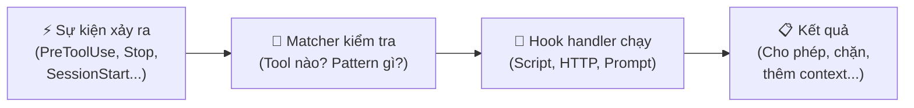
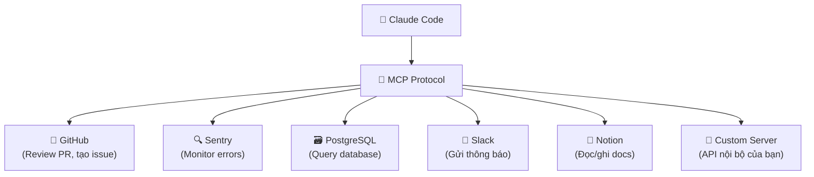
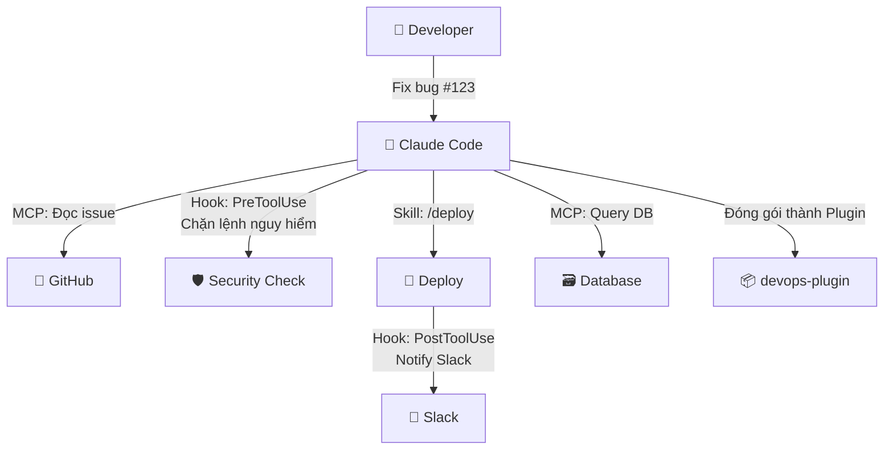

# Claude Code Cơ bản (Phần 2): Hooks, MCP và Plugins — Mở rộng sức mạnh cho Agent

## Mở đầu

Ở [Phần 1](2026-05-05-claude-code-co-ban-agent-subagent-skill.md), chúng ta đã phân biệt Agent, Sub-agent, và Skill — ba thành phần cốt lõi để Claude Code hoạt động. Nhưng một agent thực sự mạnh mẽ không chỉ biết đọc/ghi file — nó cần:

- **Tự động phản ứng** khi có sự kiện xảy ra (→ Hooks)
- **Kết nối với thế giới bên ngoài**: database, GitHub, Sentry, Slack... (→ MCP)
- **Đóng gói và chia sẻ** toàn bộ giải pháp cho team (→ Plugins)

Bài viết này sẽ giải thích đầy đủ ba khái niệm trên, cách xây dựng từng cái, và ứng dụng thực tế.

**Nội dung chính:**

- Hooks: phản ứng tự động với sự kiện trong Claude Code
- MCP: giao thức kết nối agent với công cụ bên ngoài
- Plugins: đóng gói skills + agents + hooks + MCP thành một package
- Bảng so sánh và ví dụ thực tế

---

## 1. Hooks — Tự động hóa phản ứng theo sự kiện

### Khái niệm

**Hooks** là các đoạn mã (shell script, HTTP request, hoặc prompt) được kích hoạt tự động khi một **sự kiện** (event) xảy ra trong Claude Code. Hãy hiểu hooks giống như **webhook trong lập trình web** — bạn đăng ký sự kiện, khi sự kiện xảy ra, code của bạn tự động chạy.



### Các sự kiện quan trọng

Claude Code cung cấp nhiều hook events, theo tài liệu chính thức từ Anthropic. Dưới đây là những event thường dùng nhất:

| Event | Khi nào kích hoạt | Ví dụ ứng dụng |
|-------|-------------------|----------------|
| `SessionStart` | Claude Code bắt đầu phiên mới | Setup môi trường, load config |
| `UserPromptSubmit` | User gửi prompt | Validate input, thêm context |
| `PreToolUse` | **Trước khi** Claude dùng tool | Chặn lệnh nguy hiểm (`rm -rf`) |
| `PostToolUse` | **Sau khi** tool chạy xong | Ghi log, notify team |
| `Stop` | Claude hoàn thành task | Kiểm tra chất lượng output |
| `SubagentStart` | Sub-agent được sinh ra | Monitor, audit |
| `SessionEnd` | Phiên kết thúc | Cleanup, tổng kết |

### Cách tạo Hook

Hooks được cấu hình trong `settings.json` (project hoặc user level). Dưới đây là ví dụ tạo hook **chặn lệnh `rm -rf`**:

**Bước 1: Tạo script**

```bash
#!/bin/bash
# File: .claude/hooks/block-rm.sh
COMMAND=$(jq -r '.tool_input.command')

if echo "$COMMAND" | grep -q 'rm -rf'; then
  jq -n '{
    hookSpecificOutput: {
      hookEventName: "PreToolUse",
      permissionDecision: "deny",
      permissionDecisionReason: "Lệnh rm -rf bị chặn bởi hook"
    }
  }'
else
  exit 0  # Cho phép
fi
```

**Bước 2: Cấu hình trong settings.json**

```json
{
  "hooks": {
    "PreToolUse": [
      {
        "matcher": "Bash",
        "hooks": [
          {
            "type": "command",
            "command": ".claude/hooks/block-rm.sh"
          }
        ]
      }
    ]
  }
}
```

Khi Claude cố chạy `rm -rf /tmp/build`, hook sẽ:

1. Event `PreToolUse` kích hoạt
2. Matcher kiểm tra: đây là tool `Bash` → match
3. Script `block-rm.sh` chạy, phát hiện `rm -rf`
4. Trả về `permissionDecision: "deny"` → Claude bị chặn

!!! tip "3 loại Hook handler"
    - **Command**: Chạy shell script — linh hoạt nhất, dùng cho logic phức tạp
    - **HTTP**: Gửi request đến URL — tích hợp với hệ thống bên ngoài (Slack, webhook...)
    - **Prompt**: Dùng Claude model để đánh giá — phù hợp cho các kiểm tra phức tạp cần AI suy luận

### Ứng dụng thực tế

1. **Bảo mật**: Chặn mọi lệnh `rm -rf`, `DROP TABLE`, hoặc truy cập file nhạy cảm
2. **Logging**: Ghi lại mọi lệnh Claude chạy vào audit log
3. **Quality gate**: Khi Claude hoàn thành task (`Stop` event), hook tự động kiểm tra tests có pass không
4. **Notification**: Sau khi Claude sửa file (`PostToolUse`), gửi thông báo Slack cho team

---

## 2. MCP — Kết nối Agent với thế giới bên ngoài

### Khái niệm

**MCP (Model Context Protocol)** là giao thức chuẩn (open standard) do Anthropic phát triển, cho phép Claude Code kết nối với các công cụ và dữ liệu bên ngoài. MCP biến Claude từ một agent chỉ biết đọc/ghi file thành một agent có thể **tương tác với cả hệ sinh thái phần mềm** của bạn.



### MCP hoạt động như thế nào?

MCP theo mô hình **Client — Server**:

- **Client**: Claude Code (tự động đóng vai client)
- **Server**: Các MCP server cung cấp "tools" mà Claude có thể gọi
- **Protocol**: Giao tiếp qua stdio (local), SSE, hoặc HTTP

Khi bạn cài một MCP server (ví dụ: GitHub), Claude Code sẽ nhận được danh sách các tools mới (ví dụ: `create_issue`, `review_pr`, `list_repos`). Claude tự quyết định khi nào gọi tool nào, giống như nó dùng các tools built-in (Read, Write, Bash...).

### Cách cài MCP server

Có 3 cách, theo tài liệu Anthropic:

**Cách 1: Remote HTTP server (phổ biến nhất)**

```bash
# Kết nối với Sentry để monitor errors
claude mcp add --transport http sentry https://mcp.sentry.dev/mcp

# Kết nối với Notion
claude mcp add --transport http notion https://mcp.notion.com/mcp
```

**Cách 2: Remote SSE server**

```bash
claude mcp add --transport sse asana https://mcp.asana.com/sse
```

**Cách 3: Local stdio server**

```bash
# Kết nối PostgreSQL database
claude mcp add --transport stdio \
  --env DATABASE_URL=postgresql://localhost/mydb \
  postgres -- npx -y @modelcontextprotocol/server-postgres
```

### Quản lý MCP servers

```bash
# Xem danh sách servers đã cài
claude mcp list

# Xem chi tiết 1 server
claude mcp get github

# Xoá server
claude mcp remove github

# Trong Claude Code: kiểm tra trạng thái
/mcp
```

### MCP Scopes — Phạm vi cài đặt

| Scope | Lưu ở đâu | Ai thấy | Cách cài |
|-------|-----------|---------|----------|
| **Local** (mặc định) | `~/.claude.json` | Chỉ bạn, trong project hiện tại | `--scope local` |
| **Project** | `.mcp.json` (commit vào Git) | Cả team, trong project này | `--scope project` |
| **User** | `~/.claude.json` | Chỉ bạn, trong mọi project | `--scope user` |

!!! info "MCP Server Marketplace"
    Anthropic duy trì một kho MCP servers tại [github.com/modelcontextprotocol/servers](https://github.com/modelcontextprotocol/servers). Tại thời điểm viết bài, đã có hàng trăm server cho các dịch vụ phổ biến như GitHub, Sentry, Slack, Notion, PostgreSQL, Google Drive, và nhiều hơn nữa.

### Ứng dụng thực tế

**Ví dụ 1: Debug production error**
```
Bạn: "Check Sentry xem có error nào mới trong 24h không, nếu có thì tìm root cause trong code"

Claude: 
1. Gọi MCP tool `sentry.list_issues` → tìm 3 errors mới
2. Đọc stack trace qua `sentry.get_issue_details`
3. Dùng built-in Read tool đọc file code liên quan
4. Phân tích root cause → đề xuất fix
```

**Ví dụ 2: Review PR tự động**
```
Bạn: "Review PR #456 trên GitHub, nếu OK thì approve"

Claude:
1. Gọi `github.get_pull_request` → đọc diff
2. Phân tích code changes
3. Gọi `github.create_review` → approve hoặc request changes
```

**Ví dụ 3: Query database rồi viết report**
```
Bạn: "Query database tìm 10 users active nhất tháng này, viết report"

Claude:
1. Gọi `postgres.query` → SELECT top 10 users
2. Phân tích dữ liệu
3. Viết report Markdown
```

---

## 3. Plugins — Đóng gói tất cả thành một package

### Khái niệm

**Plugin** là cách đóng gói tất cả các thành phần — skills, agents, hooks, MCP servers — thành một **package hoàn chỉnh** có thể cài đặt, chia sẻ, và quản lý phiên bản.

Nếu Skill là "sổ tay", Agent là "nhân viên", Hook là "chuông báo", MCP là "đường dây nóng" — thì **Plugin là "bộ kit" chứa tất cả** những thứ đó, đóng hộp sẵn để ai cũng cài được.

### Cấu trúc Plugin

```
my-plugin/
├── .claude-plugin/
│   └── plugin.json          # Manifest: tên, mô tả, phiên bản
├── skills/
│   ├── code-review/
│   │   └── SKILL.md          # Skill review code
│   └── deploy/
│       └── SKILL.md          # Skill deploy
├── agents/
│   └── security-reviewer.md  # Sub-agent chuyên security
├── hooks/
│   └── hooks.json            # Hook configurations
├── .mcp.json                 # MCP server configs
├── monitors/
│   └── monitors.json         # Background monitors
├── settings.json             # Default settings
└── README.md                 # Documentation
```

### Cách tạo Plugin

**Bước 1: Tạo thư mục và manifest**

```bash
mkdir -p my-plugin/.claude-plugin
```

Tạo file `my-plugin/.claude-plugin/plugin.json`:

```json
{
  "name": "my-plugin",
  "description": "Plugin tổng hợp tools cho team dev",
  "version": "1.0.0",
  "author": { "name": "Your Name" }
}
```

**Bước 2: Thêm Skills, Agents, Hooks...**

Tạo các thư mục `skills/`, `agents/`, `hooks/` như cấu trúc trên.

**Bước 3: Test local**

```bash
claude --plugin-dir ./my-plugin
```

Thử gọi skill: `/my-plugin:code-review`

**Bước 4: Chia sẻ**

Push lên Git → team cài qua marketplace hoặc `--plugin-dir`.

### Plugin vs Standalone: Khi nào dùng cái nào?

| Tiêu chí | Standalone (`.claude/`) | Plugin |
|----------|------------------------|--------|
| **Đối tượng** | Cá nhân hoặc 1 project | Team, nhiều project |
| **Chia sẻ** | Copy-paste thủ công | Cài qua marketplace/Git |
| **Namespace** | `/deploy` | `/my-plugin:deploy` |
| **Quản lý phiên bản** | Không | Có (semver) |
| **Khi nào dùng** | Đang thử nghiệm | Đã ổn định, cần chia sẻ |

!!! tip "Lộ trình đề xuất"
    Bắt đầu với standalone (`.claude/`) → Khi ổn định → [Convert sang plugin](https://docs.anthropic.com/en/docs/claude-code/plugins#convert-existing-configurations-to-plugins) → Chia sẻ cho team.

---

## 4. Bảng tổng hợp: Hooks vs MCP vs Plugins

| Tiêu chí | Hooks | MCP | Plugins |
|----------|-------|-----|---------|
| **Bản chất** | Code chạy khi có sự kiện | Giao thức kết nối dịch vụ | Package đóng gói |
| **Mục đích** | Tự động hóa, kiểm soát | Mở rộng khả năng truy cập | Đóng gói và chia sẻ |
| **Cấu hình ở đâu** | `settings.json` | `.mcp.json` hoặc CLI | `.claude-plugin/plugin.json` |
| **Ví dụ** | Chặn `rm -rf` | Kết nối Sentry, GitHub | Plugin "DevOps toolkit" |
| **Cần code?** | Có (shell script/HTTP) | Không (cài MCP server có sẵn) | Tuỳ (gộp các thành phần) |
| **Chia sẻ team** | Qua `settings.json` | Qua `.mcp.json` (scope: project) | Qua marketplace/Git |

---

## 5. Kịch bản thực tế: Xây dựng workflow DevOps hoàn chỉnh

Hãy kết hợp cả 3 để xây một workflow thực tế:



1. **MCP** kết nối GitHub → Claude đọc issue #123, hiểu bug cần fix
2. **Hook** (`PreToolUse`) → chặn nếu Claude cố xoá file quan trọng
3. Claude fix bug, chạy tests
4. **Skill** `/deploy` → hướng dẫn Claude deploy theo quy trình chuẩn
5. **Hook** (`PostToolUse`) → sau khi deploy xong, gửi thông báo Slack
6. Đóng gói tất cả thành **Plugin** `devops-plugin` → team cài 1 lần, dùng mãi

---

## Kết luận

Hooks, MCP, và Plugins là ba cơ chế mở rộng Claude Code, mỗi cái giải quyết một vấn đề khác nhau:

1. **Hooks** = Tự động phản ứng → *"Khi X xảy ra, tự động làm Y"*
2. **MCP** = Kết nối bên ngoài → *"Claude có thể nói chuyện với GitHub, Sentry, Database..."*
3. **Plugins** = Đóng gói chia sẻ → *"Gộp tất cả lại, cài 1 lần cho cả team"*

Kết hợp 3 cơ chế này với Agents, Sub-agents, và Skills từ Phần 1, bạn có đủ "vũ khí" để xây dựng hệ thống AI agent mạnh mẽ, an toàn, và dễ bảo trì.

---

## Tham khảo

- [Hooks Reference — Anthropic Documentation](https://docs.anthropic.com/en/docs/claude-code/hooks) — Tài liệu tham chiếu đầy đủ về hook events, cấu hình, và ví dụ.
- [Automate with Hooks — Anthropic Documentation](https://docs.anthropic.com/en/docs/claude-code/hooks-guide) — Hướng dẫn thực hành xây dựng hooks.
- [Connect Claude Code to Tools via MCP — Anthropic Documentation](https://docs.anthropic.com/en/docs/claude-code/mcp) — Hướng dẫn cài đặt và sử dụng MCP servers.
- [Model Context Protocol — Official Website](https://modelcontextprotocol.io/introduction) — Trang chính thức của MCP protocol.
- [Create Plugins — Anthropic Documentation](https://docs.anthropic.com/en/docs/claude-code/plugins) — Hướng dẫn tạo và chia sẻ plugins.
- [MCP Servers Repository — GitHub](https://github.com/modelcontextprotocol/servers) — Kho MCP servers mã nguồn mở.
