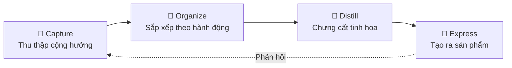
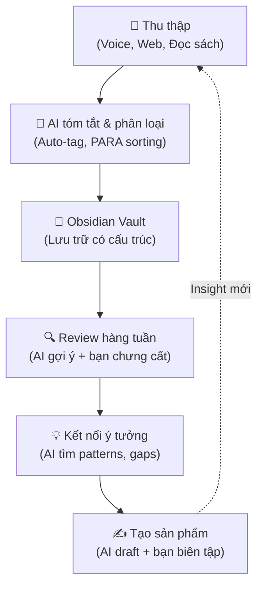

# Xây dựng Second Brain hiệu quả với AI — Không chỉ là mở Obsidian rồi ghi chú

## Mở đầu

Bạn đã bao giờ dành cả tuần đọc hàng chục bài viết về AI, bookmark đầy trình duyệt, lưu note dày đặc trong Obsidian… rồi vài tháng sau không nhớ nổi mình đã đọc gì?

Đó không phải lỗi của bạn. Đó là **Collector's Fallacy** — ảo tưởng rằng *lưu trữ thông tin* đồng nghĩa với *hiểu biết*. Nhà nghiên cứu Christian Tietze từ Zettelkasten.de đã mô tả hiện tượng này: *"Biết về sự tồn tại của một thứ không có nghĩa là bạn biết thứ đó. Cho đến khi chúng ta hòa nhập nội dung, ý tưởng, suy nghĩ của người khác vào tri thức của mình, chúng ta chưa thực sự học được gì."*

Vấn đề không nằm ở công cụ. Obsidian, Notion, hay bất kỳ app nào cũng chỉ là **container** — cái hộp chứa đồ. Nếu bạn chỉ đổ thông tin vào mà không xử lý, hệ thống của bạn sẽ trở thành một **bãi rác số** (digital landfill) thay vì bộ não thứ hai.

Bài viết này sẽ hướng dẫn bạn cách xây dựng Second Brain **thực sự hiệu quả** bằng cách kết hợp phương pháp luận đã được chứng minh với sức mạnh của AI.

**Nội dung chính:**

- Tại sao chỉ dùng công cụ là không đủ
- Framework CODE của Tiago Forte — nền tảng phương pháp luận
- Cách AI nâng cấp từng bước trong quy trình CODE
- Workflow thực tế kết hợp Obsidian + AI
- 3 sai lầm phổ biến và cách tránh

---

## 1. Công cụ chỉ là 20% — Phương pháp luận mới là 80%

Nhiều người bắt đầu hành trình Second Brain bằng cách cài Obsidian, tải theme đẹp, cài đầy plugin, thiết kế hệ thống thư mục phức tạp… rồi dừng lại ở đó. Đây là cái mà cộng đồng PKM (Personal Knowledge Management) gọi là **Bẫy bảo trì** (Maintenance Trap) — dành nhiều thời gian chỉnh sửa hệ thống hơn là thực sự sử dụng nó.

!!! warning "Dấu hiệu bạn đang rơi vào Maintenance Trap"
    - Bạn dành > 30 phút/ngày để chỉnh tag, folder, template
    - Bạn đã thay đổi hệ thống tổ chức > 3 lần trong 6 tháng
    - Bạn có > 500 notes nhưng không thể kể tên 5 insight hữu ích nhất

Tiago Forte — tác giả cuốn sách bestseller **"Building a Second Brain"** (xuất bản 2022, New York Times Bestseller) — đã phát triển framework **CODE** như một giải pháp có hệ thống. CODE không phụ thuộc vào bất kỳ công cụ cụ thể nào, mà tập trung vào **quy trình tư duy**.

---

## 2. Framework CODE — Bản đồ xây dựng Second Brain

CODE là viết tắt của 4 bước: **Capture → Organize → Distill → Express**.

### 2.1 Capture — Thu thập những gì cộng hưởng

Forte khuyên: **đừng cố thu thập mọi thứ**. Chỉ giữ lại những gì *cộng hưởng* (resonate) với bạn — những thông tin khiến bạn dừng lại, suy nghĩ, hoặc cảm thấy liên quan đến công việc và cuộc sống hiện tại.

> **Ví dụ thực tế**: Khi đọc một bài về Transformer Architecture, thay vì copy nguyên bài vào Obsidian, chỉ capture đoạn giải thích *tại sao Self-Attention hiệu quả hơn RNN* — vì đây là insight giúp bạn giải thích cho đồng nghiệp, không phải toàn bộ công thức toán học.

### 2.2 Organize — Sắp xếp theo hành động, không theo chủ đề

Đây là điểm mà hầu hết mọi người làm sai. Chúng ta có xu hướng sắp xếp theo chủ đề (AI, Machine Learning, Python...) giống như thư viện. Nhưng Forte đề xuất phương pháp **PARA** — sắp xếp theo mức độ *hành động*:

| Loại | Mô tả | Ví dụ |
|------|--------|-------|
| **P**rojects | Dự án ngắn hạn, có deadline | "Viết báo cáo AI cho sếp tuần sau" |
| **A**reas | Trách nhiệm dài hạn | "Nghiên cứu LLM", "Sức khỏe" |
| **R**esources | Chủ đề quan tâm cho tương lai | "Prompt Engineering tips" |
| **A**rchive | Những thứ đã hoàn thành/không còn liên quan | Dự án cũ, notes không dùng nữa |

!!! tip "Mẹo thực tế"
    Khi lưu một note mới, tự hỏi theo thứ tự: *"Note này phục vụ project nào đang chạy?"* → Nếu không → *"Thuộc area trách nhiệm nào?"* → Nếu không → *"Để vào resource nào?"* → Nếu vẫn không → Archive hoặc bỏ.

### 2.3 Distill — Chưng cất tinh hoa

Đây là bước quan trọng nhất mà đa số bỏ qua. Forte gọi kỹ thuật này là **Progressive Summarization** — tóm tắt dần qua nhiều lớp:

- **Lớp 1**: Lưu note gốc
- **Lớp 2**: **Bold** các câu quan trọng nhất
- **Lớp 3**: ==Highlight== phần cốt lõi trong phần đã bold
- **Lớp 4**: Viết tóm tắt bằng lời của bạn ở đầu note

Mỗi lần bạn quay lại note, bạn thêm 1 lớp. Theo thời gian, những note quan trọng tự nhiên nổi lên, còn note ít giá trị sẽ chìm xuống — giống đường trượt tuyết: *con đường được đi nhiều nhất tự nhiên trở nên sâu hơn*.

### 2.4 Express — Biến kiến thức thành sản phẩm

Second Brain chỉ thực sự có giá trị khi bạn **tạo ra thứ gì đó** từ nó: bài blog, báo cáo, video, sản phẩm, hoặc quyết định tốt hơn. Forte gọi những sản phẩm trung gian này là **Intermediate Packets** — những gói kiến thức nhỏ có thể tái sử dụng.

> **Ví dụ thực tế**: Thay vì ngồi 4 tiếng viết một bài thuyết trình về RAG từ đầu, bạn ghép từ các Intermediate Packets: note tóm tắt RAG pipeline + ví dụ code đã lưu + sơ đồ architecture đã vẽ trước đó → Hoàn thành trong 1 tiếng.

---

## 3. AI nâng cấp CODE — Từ thụ động sang chủ động

Đến đây bạn có thể thắc mắc: framework CODE hay nhưng vẫn đòi hỏi nhiều công sức thủ công. Đúng — và đây chính là nơi AI tạo ra sự khác biệt lớn nhất. AI không thay thế tư duy của bạn, mà **khuếch đại** nó bằng cách đảm nhận những công việc lặp đi lặp lại.

### 3.1 AI + Capture: Thu thập thông minh hơn

**Trước đây (không có AI):** Đọc bài → Copy-paste thủ công → Tự phân loại.

**Bây giờ (có AI):**

- **Voice-to-text**: Nói ý tưởng khi đang đi bộ → AI tự phiên âm, phân loại, và lưu vào đúng thư mục. Các công cụ như Remi8 AI hay AudioNotes chuyên cho việc này.
- **Auto-capture từ nhiều nguồn**: Dùng Readwise tự đồng bộ highlights từ sách, bài viết, podcast vào Obsidian.
- **AI tóm tắt nhanh**: Paste URL bài viết dài → AI tóm tắt 5 điểm chính → Bạn chỉ lưu những gì cộng hưởng.

### 3.2 AI + Organize: Tự động sắp xếp

**Trước đây:** Tự kéo thả note vào đúng folder PARA.

**Bây giờ:**

- **Semantic search**: Thay vì tìm kiếm bằng keyword, bạn hỏi bằng ngôn ngữ tự nhiên: *"Những note nào liên quan đến việc triển khai RAG cho dự án chatbot?"* → AI trả về kết quả theo ngữ nghĩa, không phải từ khóa chính xác.
- **Auto-linking**: AI phát hiện các notes có nội dung liên quan và tự tạo liên kết, giúp bạn thấy những kết nối mà mắt thường bỏ sót.
- **Gợi ý phân loại**: Khi bạn tạo note mới, AI gợi ý nên đặt vào Project, Area, hay Resource nào dựa trên nội dung.

### 3.3 AI + Distill: Chưng cất tự động

Đây là nơi AI mạnh nhất:

- **Progressive Summarization tự động**: AI đọc note gốc dài 2000 từ → tạo sẵn bản tóm tắt 200 từ + highlight 5 điểm chính → Bạn chỉ cần review và chỉnh sửa.
- **Phát hiện patterns**: AI phân tích hàng trăm notes của bạn → chỉ ra: *"Bạn đã viết 15 notes về Fine-tuning nhưng chưa có note nào về Evaluation Metrics — đây có thể là knowledge gap."*
- **Đặt câu hỏi ngược**: Thay vì bạn hỏi AI, AI hỏi bạn: *"Note này kết nối với note về Prompt Engineering như thế nào? Bạn có insight gì mới không?"* — đẩy bạn từ *passive reader* sang *active thinker*.

!!! info "Minh hoạ: AI như đồng đội tư duy"
    Hãy tưởng tượng bạn có một đồng nghiệp đã đọc hết tất cả notes của bạn, nhớ mọi thứ, và luôn sẵn sàng nói: *"Ê, cái này liên quan đến thứ bạn nghiên cứu tháng trước đấy!"* — Đó chính là vai trò của AI trong Second Brain.

### 3.4 AI + Express: Tạo sản phẩm nhanh hơn

- **Drafting**: Từ các notes đã chưng cất, AI tạo draft đầu tiên cho bài viết, slide, hoặc báo cáo.
- **Multi-format**: Cùng một bộ notes, AI giúp bạn tạo: bài blog, tweet thread, script video, email cho sếp — mỗi format phù hợp với đối tượng khác nhau.
- **Phản biện**: AI review bài viết của bạn, chỉ ra: lập luận yếu, thiếu nguồn dẫn chứng, hoặc mâu thuẫn nội tại.

---

## 4. Workflow thực tế: Obsidian + AI Agent

Dưới đây là workflow mà bạn có thể áp dụng ngay hôm nay, kết hợp Obsidian (hoặc bất kỳ app markdown nào) với AI:

**Bước thực hành cụ thể:**

1. **Capture daily** (5 phút/ngày): Ghi lại 1-3 điều học được. Dùng voice note nếu đang di chuyển.
2. **Process weekly** (30 phút/tuần): Duyệt inbox notes, phân loại theo PARA, nhờ AI tóm tắt các notes dài.
3. **Connect monthly** (1 giờ/tháng): Nhìn lại tổng thể, nhờ AI phân tích patterns và knowledge gaps.
4. **Create regularly**: Biến kiến thức thành output cụ thể — bài viết, dự án, quyết định.

!!! example "Ví dụ thực tế: Từ note rời rạc đến bài viết"
    **Tuần 1-2**: Capture 10 notes về RAG (từ paper, blog, podcast).
    **Tuần 3**: AI tóm tắt + highlight, bạn viết 3 câu tóm tắt bằng lời mình.
    **Tuần 4**: AI gợi ý kết nối → phát hiện RAG liên quan đến Embedding model mà bạn note tháng trước.
    **Kết quả**: Ghép các Intermediate Packets → Viết bài blog 1500 từ về RAG trong 1 giờ thay vì 4 giờ.

---

## 5. Ba sai lầm phổ biến và cách tránh

### ❌ Sai lầm 1: Để AI nghĩ thay bạn

AI giỏi tóm tắt, tổng hợp, và tìm patterns. Nhưng **suy nghĩ phản biện, đưa ra quan điểm, và tạo kết nối sáng tạo** vẫn là việc của bạn. Nếu bạn chỉ đọc bản tóm tắt của AI mà không bao giờ đọc nội dung gốc, bạn đang rơi vào một dạng Collector's Fallacy mới — **AI Summarization Fallacy**.

!!! tip "Nguyên tắc 70/30"
    AI xử lý 70% công việc nặng nhọc (tóm tắt, phân loại, tìm kiếm). Bạn đầu tư 30% vào tư duy chất lượng cao (phản biện, kết nối, sáng tạo).

### ❌ Sai lầm 2: Xây hệ thống quá phức tạp

Bạn không cần 10 plugin Obsidian, 5 automation workflows, và 3 AI tools chạy đồng thời. Bắt đầu với setup tối giản:

- **1 app ghi chú** (Obsidian, Notion, hoặc thậm chí Apple Notes)
- **1 AI assistant** (Claude, ChatGPT, hoặc Gemini)
- **1 phương pháp** (CODE + PARA)

Mở rộng dần khi bạn thực sự cảm thấy cần, không phải vì FOMO.

### ❌ Sai lầm 3: Thu thập mà không Express

Second Brain tốt nhất trên thế giới cũng vô nghĩa nếu bạn không bao giờ tạo ra thứ gì từ nó. Đo lường hiệu quả bằng **output** (bài viết, dự án hoàn thành, quyết định tốt hơn), không phải bằng số notes.

> *"Information only becomes knowledge when we put it to use."* — Tiago Forte

---

## Kết luận

Xây dựng Second Brain hiệu quả không phải là câu chuyện về công cụ. Obsidian, Notion, hay bất kỳ app nào cũng chỉ là phương tiện. Điều quan trọng là **phương pháp luận** (CODE + PARA) và cách bạn sử dụng **AI như đồng đội tư duy**, không phải người thay thế.

Hãy nhớ ba nguyên tắc cốt lõi:

1. **Thu thập có chọn lọc** — chỉ giữ những gì cộng hưởng
2. **Chưng cất tích cực** — biến thông tin thành insight bằng lời của bạn
3. **Tạo ra sản phẩm** — kiến thức chỉ có giá trị khi được sử dụng

AI sẽ khuếch đại hiệu quả ở mọi bước, nhưng không thể thay thế việc bạn **suy nghĩ thực sự**. Hệ thống tốt nhất là hệ thống mà bạn thực sự sử dụng — đơn giản, nhất quán, và hướng đến hành động.

---

## Tham khảo

- [Building a Second Brain: The Definitive Introductory Guide](https://fortelabs.com/blog/basboverview/) — Tiago Forte, Forte Labs. Bài tổng quan chính thức về phương pháp BASB và framework CODE.
- [The Collector's Fallacy](https://zettelkasten.de/posts/collectors-fallacy/) — Christian Tietze, Zettelkasten.de. Phân tích sâu về ảo tưởng thu thập thông tin.
- [AI-Augmented Personal Knowledge Management](https://buildin.ai) — BuildIn.ai. Tổng hợp xu hướng PKM kết hợp AI năm 2025-2026.
- [Remi8 AI — Voice-First Knowledge Management](https://remi8.ai) — Platform PKM ưu tiên giọng nói với AI tự động tổ chức.
- [Taskade — AI-Powered Productivity](https://taskade.com) — Nền tảng kết hợp notes, AI agents, và project automation.
