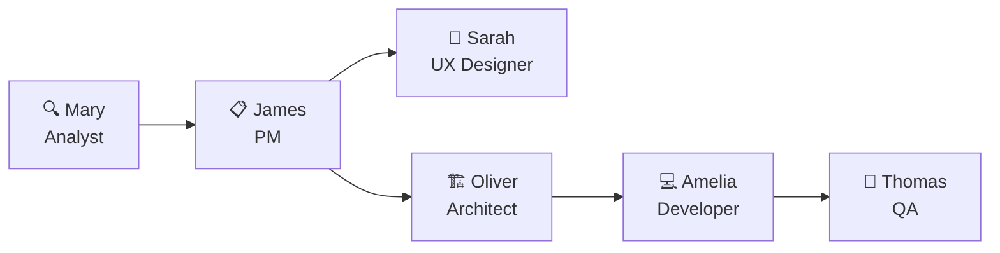
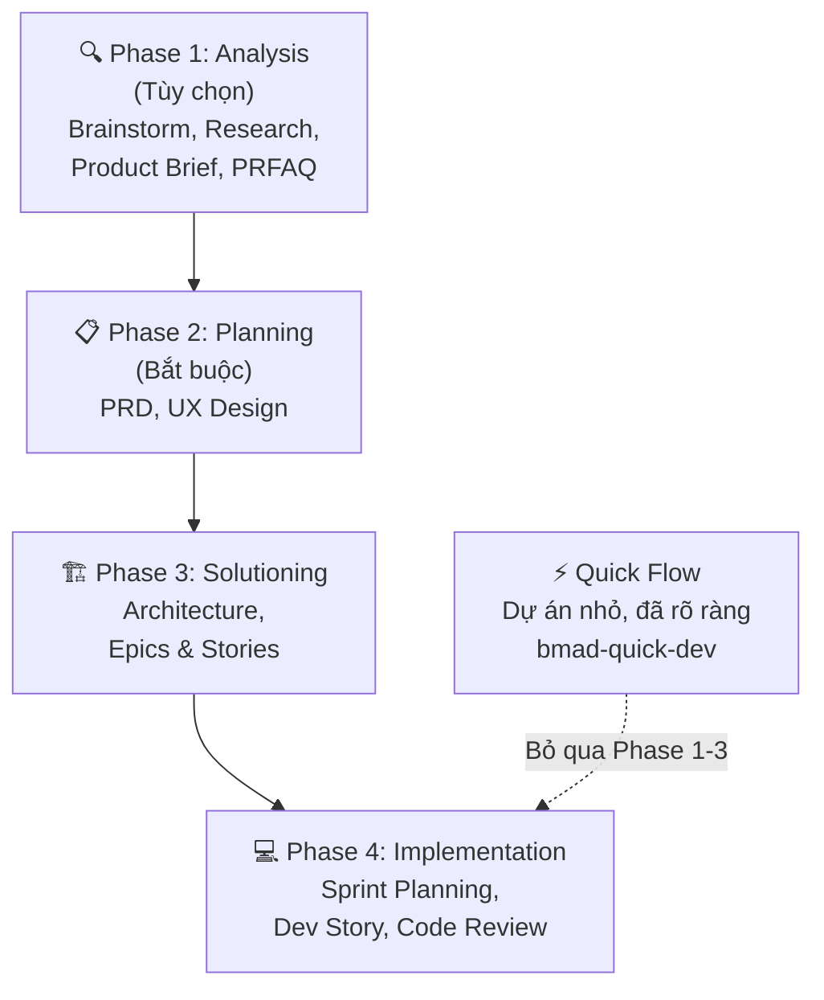

# BMad Method — Framework Phát triển Phần mềm Bằng AI Agent Chuyên biệt

## Mở đầu: Tại sao cần một "phương pháp" khi đã có AI?

Bạn có thể mở Claude Code, Cursor hay GitHub Copilot và bắt đầu code ngay. Nhưng khi dự án lớn hơn vài trăm dòng, bạn sẽ gặp một vấn đề quen thuộc: **AI không nhớ bạn muốn gì, code ra thiếu nhất quán, và mỗi lần mở chat mới là một lần bắt đầu lại từ đầu.**

Nguyên nhân gốc rễ: AI hoạt động tốt khi có **context rõ ràng và có cấu trúc**. Không có context → AI đoán mò → kết quả kém.

**BMad Method** (Build More Architect Dreams) ra đời để giải quyết đúng vấn đề này. Đây là một **framework phát triển phần mềm dựa trên AI agent**, cung cấp quy trình có cấu trúc từ ý tưởng → lập kế hoạch → kiến trúc → triển khai, với các AI agent chuyên biệt hỗ trợ từng giai đoạn.

**Nội dung bài viết:**

- BMad Method là gì — tổng quan và triết lý
- 6 AI Agent chuyên biệt trong BMad
- Quy trình 4 Phase chi tiết
- Ưu và nhược điểm
- Áp dụng vào các lĩnh vực ngoài phần mềm
- Hướng dẫn cài đặt step-by-step
- **Demo thực hành ~1 tiếng**: Xây dựng ứng dụng Task Manager CLI

---

## 1. BMad Method là gì?

### Định nghĩa

BMad Method là một **module trong hệ sinh thái BMad** (BMad Ecosystem), hoạt động như một framework phát triển phần mềm theo hướng AI-driven. Nó cung cấp:

- **AI Agent chuyên biệt** — mỗi agent có tên, tính cách, và chuyên môn riêng
- **Workflow có hướng dẫn** — quy trình từng bước, không cần nhớ
- **Context engineering** — mỗi document tạo ra là context cho phase tiếp theo
- **Skill system** — các lệnh `bmad-*` để kích hoạt workflow cụ thể

### Triết lý cốt lõi

> *"AI agents hoạt động tốt nhất khi có context rõ ràng, có cấu trúc. BMad xây dựng context đó một cách tuần tự qua 4 phase — mỗi phase tạo ra tài liệu cung cấp thông tin cho phase sau."*

Nói đơn giản: **Thay vì ném một ý tưởng mơ hồ cho AI và hy vọng nó hiểu**, BMad buộc bạn (với sự hỗ trợ của AI) đi qua từng bước: phân tích → lập kế hoạch → thiết kế kiến trúc → triển khai. Mỗi bước tạo ra một tài liệu chuẩn, và tài liệu đó trở thành "bản đồ" cho AI ở bước tiếp theo.

### BMad hoạt động với công cụ nào?

BMad tương thích với bất kỳ AI coding assistant nào hỗ trợ custom system prompt hoặc project context:

| Công cụ | Ghi chú |
|---------|---------|
| **Claude Code** | Khuyến nghị — tương thích tốt nhất |
| **Github Copilot** | Tương thích tốt |
| **Cursor** | AI-first code editor |
| **Codex CLI** | OpenAI terminal agent |

---

## 2. Đội ngũ 6 AI Agent chuyên biệt

Điểm đặc biệt nhất của BMad là hệ thống **Named Agents** — 6 agent AI có tên, tính cách, và vai trò cụ thể. Bạn không cần nhớ lệnh — chỉ cần nói chuyện với đúng "người":



| Agent | Tên | Vai trò | Phase |
|-------|-----|---------|-------|
| 🔍 Analyst | **Mary** | Brainstorming, nghiên cứu, phân tích | Phase 1 |
| 📋 PM | **James** | Viết PRD, tạo Epic & Story | Phase 2 |
| 🎨 UX Designer | **Sarah** | Thiết kế UX/UI | Phase 2 |
| 🏗️ Architect | **Oliver** | Thiết kế kiến trúc kỹ thuật | Phase 3 |
| 💻 Developer | **Amelia** | Sprint planning, code, code review | Phase 4 |
| 🔎 QA | **Thomas** | Kiểm thử, đảm bảo chất lượng | Phase 4 |

### Tại sao dùng Named Agent thay vì prompt thông thường?

**So với blank prompt**: Bạn không cần prompt engineering — agent đã biết vai trò, có khả năng discoverable (xem menu), và `bmad-help` luôn sẵn sàng hướng dẫn.

**So với menu-driven**: Bạn không cần nhớ code hay navigate menu. Chỉ cần nói: *"Hey Mary, let's brainstorm"* → Mary tự kích hoạt và bắt đầu brainstorm.

**Có thể tùy chỉnh**: Mỗi agent có file `customize.toml` cho team override và `.user.toml` cho cá nhân. Brand recognition được giữ nguyên (tên không đổi), nhưng hành vi có thể tùy chỉnh hoàn toàn.

---

## 3. Quy trình 4 Phase

Đây là trái tim của BMad Method — một pipeline tuần tự, mỗi phase tạo context cho phase sau:



### Phase 1: Analysis (Tùy chọn)

Khám phá không gian vấn đề trước khi cam kết lập kế hoạch. Có 4 công cụ:

| Công cụ | Skill | Khi nào dùng |
|---------|-------|-------------|
| **Brainstorming** | `bmad-brainstorming` | Có ý tưởng mơ hồ, muốn khám phá |
| **Research** | `bmad-market-research`, `bmad-domain-research`, `bmad-technical-research` | Cần nghiên cứu thị trường, domain, kỹ thuật |
| **Product Brief** | `bmad-product-brief` | Đã rõ concept, muốn tóm tắt executive |
| **PRFAQ** | `bmad-prfaq` | Muốn stress-test ý tưởng kiểu Amazon Working Backwards |

!!! tip "Product Brief vs PRFAQ"
    Cả hai đều tạo input cho PRD. **Product Brief** = collaborative discovery (nhẹ nhàng). **PRFAQ** = gauntlet (thử thách gay gắt). Chọn dựa trên mức độ challenge bạn muốn.

### Phase 2: Planning (Bắt buộc)

Xác định **xây gì** và **cho ai**.

1. Gọi PM agent → chạy `bmad-create-prd` → tạo **PRD.md**
2. (Tùy chọn) Gọi UX Designer → chạy `bmad-create-ux-design` → tạo **ux-spec.md**

### Phase 3: Solutioning

Xác định **xây như thế nào** và chia nhỏ công việc.

1. Gọi Architect → `bmad-create-architecture` → tạo **architecture.md**
2. Gọi PM → `bmad-create-epics-and-stories` → tạo **epics & stories**
3. (Khuyến nghị) `bmad-check-implementation-readiness` → kiểm tra tính sẵn sàng

### Phase 4: Implementation

Xây dựng, từng story một.

```
bmad-sprint-planning → sprint-status.yaml
    ↓
bmad-create-story → story-[slug].md  (lặp lại cho mỗi story)
    ↓
bmad-dev-story → code changes
    ↓
bmad-code-review → review findings
    ↓
bmad-retrospective → lessons learned (sau mỗi epic)
```

### Quick Flow — Đường tắt cho dự án nhỏ

Dự án nhỏ, đã rõ ràng, dưới ~5 stories? Dùng `bmad-quick-dev` — bỏ qua Phase 1-3, đi thẳng vào code với spec tối thiểu.

---

## 4. Ưu điểm và Nhược điểm

### ✅ Ưu điểm

| Ưu điểm | Giải thích |
|----------|-----------|
| **Context Engineering xuất sắc** | Mỗi document là context cho phase sau — AI luôn biết đang xây gì và tại sao |
| **Agent chuyên biệt** | Mỗi agent có expertise riêng, giảm "hallucination" so với general-purpose prompt |
| **Quy trình rõ ràng** | Không cần nhớ — `bmad-help` luôn chỉ đường bước tiếp theo |
| **Linh hoạt** | 3 track (Quick Flow / Method / Enterprise), tùy chỉnh agent, mở rộng bằng BMad Builder |
| **IDE-agnostic** | Hoạt động với Claude Code, Cursor, Codex CLI |
| **Adversarial Review** | Có cơ chế review "phản biện" — agent reviewer thách thức output để tìm lỗ hổng |
| **Miễn phí, mã nguồn mở** | GitHub public, community Discord active |

### ❌ Nhược điểm

| Nhược điểm | Giải thích |
|-----------|-----------|
| **Learning curve ban đầu** | Nhiều agent, nhiều skill, nhiều phase — cần thời gian làm quen |
| **Overhead cho dự án nhỏ** | Full BMad Method cho app 50 dòng code = overkill (dùng Quick Flow thay thế) |
| **Phụ thuộc vào LLM quality** | Output chỉ tốt khi model đủ mạnh — model yếu = document chất lượng kém |
| **Tốn token** | Mỗi phase là nhiều conversation, mỗi conversation tốn token |
| **Chưa hỗ trợ team collaboration tốt** | Chủ yếu thiết kế cho individual developer hoặc small team |
| **Ecosystem còn non trẻ** | V6 mới ra, community module còn ít |

---

## 5. Áp dụng ngoài phát triển phần mềm

Dù BMad được thiết kế cho software development, triết lý **"phân tích → lập kế hoạch → thiết kế giải pháp → triển khai"** có thể áp dụng rộng hơn:

| Lĩnh vực | Cách áp dụng tư duy BMad |
|----------|--------------------------|
| **Content Creation** | Analysis (nghiên cứu topic) → Planning (outline/brief) → Solutioning (cấu trúc bài) → Implementation (viết & edit) |
| **Marketing Campaign** | Market Research → Campaign Brief (PRD) → Channel Architecture → Sprint triển khai |
| **Product Design** | User Research → PRD → UX Architecture → Design Sprints |
| **Data Science** | Domain Research → Problem Definition → Solution Architecture → Sprint phân tích |
| **Game Development** | BMad có module riêng: **Game Dev Studio** — mở rộng quy trình cho game dev |

!!! info "BMad Ecosystem mở rộng"
    Ngoài BMad Method cho phần mềm, hệ sinh thái BMad còn có:
    
    - **BMad Builder** — tạo module/agent tùy chỉnh
    - **Creative Intelligence Suite** — cho creative work
    - **Game Dev Studio** — cho phát triển game
    - **Test Architect (TEA)** — cho enterprise testing

---

## 6. Hướng dẫn cài đặt BMad Method

### Yêu cầu hệ thống

- **Node.js 20+** — bắt buộc cho installer
- **Git** — khuyến nghị cho version control
- **AI IDE** — Claude Code (khuyến nghị), Cursor, hoặc tương tự

### Bước 1: Tạo thư mục dự án

```bash
mkdir my-bmad-project
cd my-bmad-project
git init
```

### Bước 2: Cài đặt BMad Method

```bash
npx bmad-method install
```

Installer sẽ hỏi 5 câu:

1. **Thư mục cài đặt** — mặc định là thư mục hiện tại
2. **Modules** — chọn **BMad Method** (bmm)
3. **Phiên bản** — Yes để dùng stable mới nhất
4. **AI tool** — chọn `claude-code`, `cursor`, hoặc tool bạn dùng
5. **Config** — tên, ngôn ngữ, thư mục output

!!! tip "Cài đặt nhanh không tương tác"
    ```bash
    npx bmad-method install --yes --modules bmm --tools claude-code
    ```

### Bước 3: Kiểm tra cấu trúc

Sau cài đặt, bạn sẽ thấy 2 thư mục mới:

```
my-bmad-project/
├── _bmad/              # Agents, workflows, tasks, config
│   ├── config.toml
│   ├── config.user.toml
│   └── ...
├── _bmad-output/       # Nơi lưu artifacts (PRD, architecture, stories...)
│   ├── planning-artifacts/
│   └── implementation-artifacts/
└── .claude/            # Skills cho Claude Code
    └── skills/
        └── bmad-*/
```

### Bước 4: Bắt đầu với bmad-help

Mở Claude Code trong thư mục project và gõ:

```
bmad-help
```

BMad-Help sẽ kiểm tra project, phát hiện những gì đã hoàn thành, và **hướng dẫn chính xác bước tiếp theo**.

---

## 7. Demo thực hành: Xây dựng Task Manager CLI (~1 tiếng)

Dưới đây là kịch bản demo từng bước, sử dụng **BMad Method track** (không phải Quick Flow) để trải nghiệm đầy đủ quy trình. Dự án: một **CLI Task Manager** đơn giản bằng Node.js.

### Timeline tổng quan

| Thời gian | Giai đoạn | Việc cần làm |
|-----------|-----------|-------------|
| 0:00 – 0:05 | Setup | Cài đặt BMad, init project |
| 0:05 – 0:15 | Phase 1 | Brainstorming ý tưởng |
| 0:15 – 0:30 | Phase 2 | Tạo PRD |
| 0:30 – 0:40 | Phase 3a | Tạo Architecture |
| 0:40 – 0:50 | Phase 3b | Tạo Epics & Stories |
| 0:50 – 1:05 | Phase 4 | Sprint Planning → Dev Story → Code Review |
| 1:05 – 1:10 | Wrap-up | Retrospective, tổng kết |

### Bước 1: Setup (5 phút)

```bash
# Tạo project
mkdir task-manager-cli
cd task-manager-cli
git init
npm init -y

# Cài BMad
npx bmad-method install --yes --modules bmm --tools claude-code
```

Mở Claude Code:

```bash
claude
```

Gõ ngay:

```
bmad-help
```

BMad-Help sẽ nhận diện đây là project mới và gợi ý bắt đầu từ Phase 1 (Analysis) hoặc Phase 2 (Planning).

### Bước 2: Phase 1 — Brainstorming (10 phút)

Mở chat **mới** trong Claude Code, gõ:

```
bmad-brainstorming
```

Mary (Analyst agent) sẽ chào bạn và bắt đầu session brainstorming. Mô tả ý tưởng:

> *"Tôi muốn xây dựng một CLI task manager đơn giản bằng Node.js. Người dùng có thể thêm, xem, hoàn thành, và xóa task. Dữ liệu lưu trong file JSON local. Có thể lọc task theo trạng thái."*

Mary sẽ dẫn dắt bạn qua các câu hỏi để làm rõ ý tưởng. Cuối session, Mary tạo file `brainstorming-report.md` trong `_bmad-output/`.

!!! warning "Luôn mở chat mới cho mỗi workflow"
    Đây là quy tắc quan trọng nhất trong BMad. Mỗi workflow cần fresh context để tránh context pollution.

### Bước 3: Phase 2 — Tạo PRD (15 phút)

Mở chat **mới**, gõ:

```
bmad-create-prd
```

James (PM agent) sẽ kích hoạt. James đọc brainstorming report từ Phase 1, sau đó hỏi bạn để làm rõ requirements:

- Target users là ai?
- Các features cốt lõi?
- Out of scope?
- Success metrics?

Cuối cùng James tạo **PRD.md** — tài liệu requirements hoàn chỉnh với:

- Problem statement
- User personas
- Feature list với priority (Must have / Should have / Nice to have)
- Success criteria
- Constraints & assumptions

### Bước 4: Phase 3a — Architecture (10 phút)

Mở chat **mới**, gõ:

```
bmad-create-architecture
```

Oliver (Architect agent) đọc PRD.md và tạo architecture document:

- **Tech stack**: Node.js, Commander.js (CLI framework), JSON file storage
- **Cấu trúc thư mục**: `src/`, `data/`, `tests/`
- **Data model**: Task schema (id, title, status, createdAt, completedAt)
- **Module design**: CLI parser → Task Service → Storage Layer
- **Error handling strategy**

Output: **architecture.md**

### Bước 5: Phase 3b — Epics & Stories (10 phút)

Mở chat **mới**, gõ:

```
bmad-create-epics-and-stories
```

James (PM) đọc cả PRD và Architecture để tạo epics và stories phù hợp về mặt kỹ thuật. Ví dụ output:

**Epic 1: Core Task Management**

- Story 1.1: Setup project structure và storage layer
- Story 1.2: Implement "add task" command
- Story 1.3: Implement "list tasks" command với filtering
- Story 1.4: Implement "complete task" command
- Story 1.5: Implement "delete task" command

**Epic 2: UX Polish**

- Story 2.1: Add colorized output
- Story 2.2: Add input validation và error messages

Sau đó chạy (khuyến nghị):

```
bmad-check-implementation-readiness
```

Oliver kiểm tra tính nhất quán giữa PRD, Architecture, và Stories.

### Bước 6: Phase 4 — Implementation (15 phút)

#### Sprint Planning

Mở chat **mới**, gõ:

```
bmad-sprint-planning
```

Amelia (Developer agent) tạo `sprint-status.yaml` để tracking.

#### Dev Story (focus vào Story 1.1 + 1.2 cho demo)

Mở chat **mới**, gõ:

```
bmad-create-story
```

Chọn Story 1.1. Amelia tạo file story chi tiết với acceptance criteria, technical notes, và test requirements.

Mở chat **mới** nữa, gõ:

```
bmad-dev-story
```

Amelia đọc story file và **bắt đầu code**. Với Story 1.1, Amelia sẽ:

1. Tạo cấu trúc thư mục `src/`
2. Implement `StorageService` — đọc/ghi file JSON
3. Implement `TaskService` — CRUD operations
4. Setup `Commander.js` CLI entry point
5. Viết tests cơ bản

#### Code Review

Mở chat **mới**, gõ:

```
bmad-code-review
```

Agent review code vừa viết, kiểm tra:

- Code quality và conventions
- Test coverage
- Consistency với architecture document
- Edge cases

### Bước 7: Wrap-up — Retrospective (5 phút)

Sau khi hoàn thành epic, gõ:

```
bmad-retrospective
```

Agent tổng hợp:

- Lessons learned
- Cải thiện cho sprint sau
- Đánh giá chất lượng output

### Kết quả demo

Sau ~1 tiếng, bạn có:

```
task-manager-cli/
├── _bmad/                          # BMad config
├── _bmad-output/
│   ├── planning-artifacts/
│   │   ├── brainstorming-report.md  # Từ Phase 1
│   │   ├── PRD.md                   # Từ Phase 2
│   │   ├── architecture.md          # Từ Phase 3
│   │   └── epics/                   # Stories
│   └── implementation-artifacts/
│       └── sprint-status.yaml
├── src/
│   ├── index.js                     # CLI entry point
│   ├── services/
│   │   ├── task-service.js
│   │   └── storage-service.js
│   └── models/
│       └── task.js
├── data/
│   └── tasks.json
├── tests/
│   └── task-service.test.js
└── package.json
```

Chạy thử:

```bash
node src/index.js add "Học BMad Method"
node src/index.js list
node src/index.js complete 1
node src/index.js list --status done
```

---

## 8. Quick Reference — Các lệnh BMad thường dùng

| Lệnh | Mục đích |
|-------|---------|
| `bmad-help` | Hướng dẫn bước tiếp theo |
| `bmad-brainstorming` | Brainstorm ý tưởng (Phase 1) |
| `bmad-product-brief` | Tạo product brief (Phase 1) |
| `bmad-create-prd` | Tạo PRD (Phase 2) |
| `bmad-create-architecture` | Tạo architecture (Phase 3) |
| `bmad-create-epics-and-stories` | Tạo epics & stories (Phase 3) |
| `bmad-check-implementation-readiness` | Kiểm tra sẵn sàng (Phase 3) |
| `bmad-sprint-planning` | Lập kế hoạch sprint (Phase 4) |
| `bmad-create-story` | Tạo story chi tiết (Phase 4) |
| `bmad-dev-story` | Code theo story (Phase 4) |
| `bmad-code-review` | Review code (Phase 4) |
| `bmad-quick-dev` | Quick Flow — bỏ qua Phase 1-3 |
| `bmad-correct-course` | Thay đổi scope giữa chừng |
| `bmad-retrospective` | Tổng kết sau epic |

---

## Kết luận

BMad Method không chỉ là một bộ prompt hay một collection of agents — nó là một **hệ thống context engineering hoàn chỉnh** cho phát triển phần mềm với AI.

**3 điểm cốt lõi cần nhớ:**

1. **Context là vua** — Mỗi phase tạo document là context cho phase sau. Không có context → AI đoán mò.
2. **Agent chuyên biệt > General prompt** — Mary biết cách brainstorm, Oliver biết cách thiết kế architecture, Amelia biết cách code. Chuyên môn hóa = chất lượng cao hơn.
3. **Quy trình linh hoạt** — Dự án nhỏ dùng Quick Flow, dự án lớn dùng full 4 phase. Không one-size-fits-all.

BMad đang ở V6 và phát triển rất nhanh. Nếu bạn đang dùng AI coding assistant hàng ngày, đây là framework đáng thử nghiệm để nâng cấp quy trình làm việc của mình.

---

## Tham khảo

- [BMad Method — Official Documentation](https://docs.bmad-method.org/) — Tài liệu chính thức đầy đủ.
- [BMad Method — GitHub Repository](https://github.com/bmad-code-org/BMAD-METHOD) — Mã nguồn mở.
- [Getting Started Tutorial](https://docs.bmad-method.org/tutorials/getting-started/) — Hướng dẫn bắt đầu nhanh.
- [Workflow Map](https://docs.bmad-method.org/reference/workflow-map/) — Bản đồ workflow trực quan.
- [Named Agents Explained](https://docs.bmad-method.org/explanation/named-agents/) — Giải thích hệ thống agent.
- [BMad YouTube Channel](https://www.youtube.com/@BMadCode) — Video tutorials và walkthroughs.
- [BMad Discord Community](https://discord.gg/gk8jAdXWmj) — Cộng đồng hỗ trợ.
