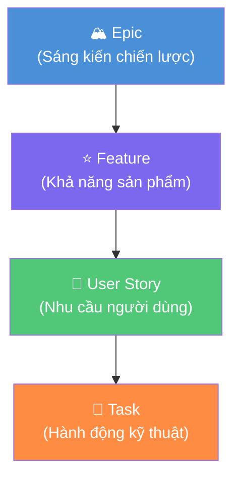
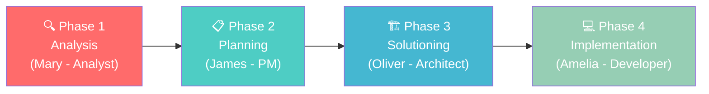
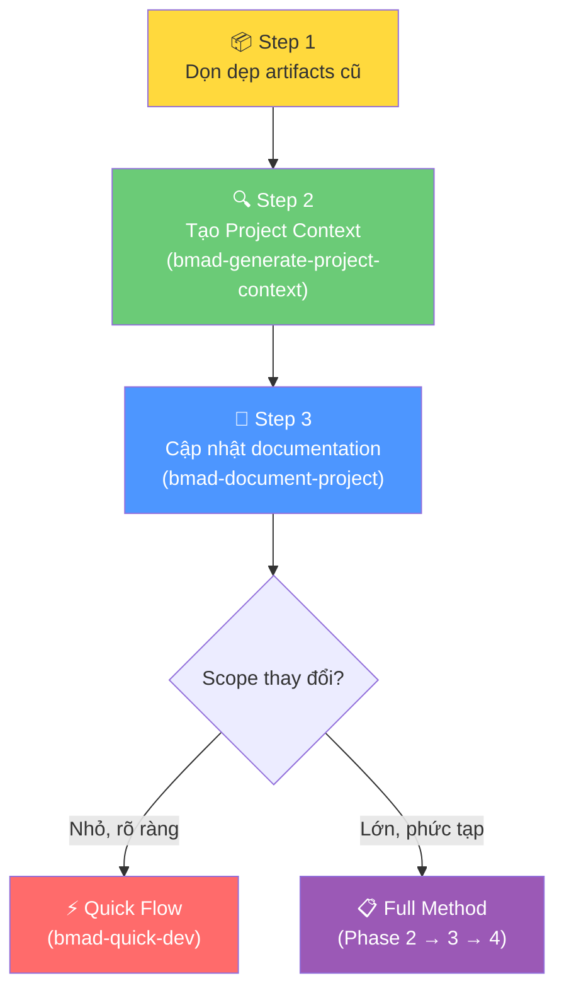

# Epic, Feature, User Story — Hiểu Đúng Để Làm Đúng Trong Agile & BMad Method

## Mở đầu: Khi "User Story" trở thành từ cửa miệng nhưng ai cũng hiểu khác nhau

Bạn đã bao giờ ngồi trong một buổi Sprint Planning và nghe ai đó nói: *"Cái này nên là Epic hay Feature nhỉ?"* — rồi cả phòng tranh luận 20 phút mà không đi đến đâu?

Đây là vấn đề phổ biến trong các team Agile: **mọi người dùng chung thuật ngữ nhưng hiểu khác nhau.** Epic, Feature, User Story, Task — bốn khái niệm tưởng đơn giản nhưng ranh giới giữa chúng thường bị nhập nhằng, đặc biệt khi team chưa thống nhất tiêu chuẩn.

Bài viết này sẽ giúp bạn:

**Nội dung chính:**

- Hiểu rõ bản chất và mối quan hệ phân cấp của Epic → Feature → User Story → Task
- So sánh trực quan qua bảng đặc trưng — dễ nhớ, dễ tra cứu
- Nắm vững kỹ thuật estimation (Story Points, T-Shirt Sizing)
- Áp dụng BMad Method để quản lý dự án Greenfield và Brownfield hiệu quả

---

## 1. Hệ thống phân cấp công việc trong Agile

Trong Agile, công việc được tổ chức theo một **hệ thống phân cấp** (hierarchy) từ trừu tượng đến cụ thể. Mục đích: giúp team nhìn thấy bức tranh toàn cảnh (big picture) ở cấp cao, đồng thời có đủ chi tiết để thực thi ở cấp thấp.



### 1.1 Epic — Tầm nhìn chiến lược

**Epic** là một khối công việc lớn, thường **kéo dài qua nhiều Sprint** (thậm chí nhiều quý). Epic đại diện cho một **sáng kiến kinh doanh chiến lược** — trả lời câu hỏi *"Tại sao chúng ta làm điều này?"*

!!! example "Ví dụ thực tế — Sàn thương mại điện tử"
    **Epic:** "Triển khai hệ thống Guest Checkout"
    
    *Mục tiêu:* Giảm 30% tỷ lệ bỏ giỏ hàng bằng cách cho phép mua hàng không cần tạo tài khoản.
    
    *Thời gian dự kiến:* 2-3 Sprint (6-9 tuần).

**Đặc điểm nhận dạng Epic:**

- Không thể hoàn thành trong 1 Sprint
- Gắn với mục tiêu kinh doanh cụ thể (KPI, OKR)
- Cần chia nhỏ trước khi team có thể bắt tay làm

### 1.2 Feature — Khả năng sản phẩm cụ thể

**Feature** là một đơn vị chức năng có ý nghĩa mà người dùng có thể **trải nghiệm trực tiếp**. Feature nằm giữa Epic (quá lớn) và User Story (quá chi tiết) — nó trả lời câu hỏi *"Chúng ta sẽ giao cái gì?"*

!!! example "Ví dụ — Tiếp tục từ Epic Guest Checkout"
    - **Feature 1:** Thu thập và xác thực email khách hàng
    - **Feature 2:** Luồng nhập địa chỉ giao hàng cho khách vãng lai
    - **Feature 3:** Tích hợp cổng thanh toán cho đơn hàng không cần đăng nhập
    - **Feature 4:** Trang xác nhận đơn hàng và gửi email theo dõi

### 1.3 User Story — Nhu cầu từ góc nhìn người dùng

**User Story** là đơn vị công việc nhỏ nhất mang lại **giá trị cho người dùng cuối**. Nó tuân theo format kinh điển:

> *"As a [vai trò], I want [hành động], so that [lợi ích]."*

!!! example "Ví dụ — User Stories cho Feature 'Thu thập email'"
    - **Story 1:** "Là khách vãng lai, tôi muốn nhập email để nhận thông tin theo dõi đơn hàng mà không cần tạo tài khoản."
    - **Story 2:** "Là khách vãng lai, tôi muốn thấy thông báo lỗi rõ ràng khi nhập sai định dạng email."
    
    **Acceptance Criteria (Story 1):**
    
    - Hiển thị ô nhập email với placeholder rõ ràng
    - Validate format email real-time (regex)
    - Không hiển thị prompt tạo mật khẩu
    - Lưu email vào session để dùng cho bước tiếp theo

### 1.4 Task — Hành động kỹ thuật cụ thể

**Task** là đơn vị nhỏ nhất — thường hoàn thành trong **1-2 ngày** — mô tả hành động kỹ thuật cụ thể. Task trả lời câu hỏi *"Làm thế nào?"*

!!! example "Ví dụ — Tasks cho Story 'Nhập email'"
    - Task 1: Thiết kế UI component cho ô nhập email (4h)
    - Task 2: Implement regex validation cho email format (2h)
    - Task 3: Xây dựng error handler hiển thị thông báo lỗi (3h)
    - Task 4: Viết unit test cho logic validation (2h)
    - Task 5: Viết integration test cho luồng nhập email (3h)

---

## 2. Bảng so sánh đặc trưng — Nhìn một lần, nhớ cả đời

Đây là bảng tổng hợp giúp bạn phân biệt nhanh 4 cấp độ:

| Đặc trưng | 🏔️ Epic | ⭐ Feature | 📝 User Story | 🔧 Task |
|---|---|---|---|---|
| **Câu hỏi trả lời** | Tại sao? (Why) | Giao cái gì? (What) | Ai cần gì? (Who/What/Why) | Làm thế nào? (How) |
| **Quy mô** | Rất lớn | Trung bình-Lớn | Nhỏ | Rất nhỏ |
| **Thời gian** | Nhiều Sprint/Quý | 1-2 Sprint | 1 Sprint | 1-2 ngày |
| **Người quan tâm chính** | Stakeholder, Leadership | Product Owner, Team Lead | Dev Team, PO | Developer cá nhân |
| **Có thể estimate?** | T-Shirt Sizing (S/M/L/XL) | Story Points tổng hợp | Story Points chi tiết | Giờ/ngày |
| **Ai viết?** | PO + Stakeholder | PO + Team Lead | PO + Dev Team | Developer |
| **Ví dụ format** | "Triển khai Guest Checkout" | "Xác thực email khách" | "As a..., I want..." | "Implement regex validation" |
| **Trong BMad** | `bmad-create-epics-and-stories` | Phần của Epic breakdown | Story chi tiết với AC | Phần của `bmad-dev-story` |

!!! tip "Quy tắc ngón tay cái"
    **Nếu không thể hoàn thành trong 1 Sprint → chưa phải User Story** → cần chia nhỏ tiếp.
    
    **Nếu hoàn thành trong vài giờ và không mang giá trị người dùng trực tiếp → đó là Task**, không phải Story.

---

## 3. Kỹ thuật Estimation — Ước lượng thông minh, không đoán mò

### 3.1 Story Points vs T-Shirt Sizing

Hai kỹ thuật phổ biến nhất trong Agile estimation, mỗi loại phù hợp với giai đoạn khác nhau:

| Tiêu chí | T-Shirt Sizing (XS→XXL) | Story Points (Fibonacci: 1,2,3,5,8,13) |
|---|---|---|
| **Khi nào dùng** | Giai đoạn đầu, grooming backlog lớn | Sprint Planning, cam kết sprint |
| **Độ chính xác** | Thấp (định tính) | Trung bình (định lượng tương đối) |
| **Tốc độ estimate** | Rất nhanh | Cần thảo luận team |
| **Phù hợp cho** | Epic, Feature | User Story |

!!! warning "Sai lầm phổ biến nhất"
    **Không bao giờ quy đổi Story Points thành giờ/ngày.** Story Points đo **nỗ lực tương đối** (relative effort), không phải thời gian tuyệt đối. Một Story 5 điểm không có nghĩa là "5 ngày" — nó có nghĩa là "gấp đôi phức tạp so với Story 3 điểm."

### 3.2 Ba yếu tố cần cân nhắc khi estimate

Khi gán Story Points, team cần đánh giá đồng thời 3 yếu tố:

1. **Complexity (Độ phức tạp):** Logic khó đến mức nào?
2. **Effort (Khối lượng công việc):** Cần bao nhiêu code/config?
3. **Uncertainty (Rủi ro/Không chắc chắn):** Có dependency ẩn hoặc technical debt không?

!!! example "Ví dụ thực tế — Estimate cho feature Thanh toán"
    | Story | Complexity | Effort | Uncertainty | Points |
    |---|---|---|---|---|
    | Hiển thị form nhập thẻ | Thấp | Trung bình | Thấp | **3** |
    | Tích hợp API Stripe | Trung bình | Trung bình | Cao (API mới) | **8** |
    | Xử lý thanh toán thất bại | Cao | Thấp | Trung bình | **5** |

### 3.3 Calibration — Chốt "thước đo" cho team

Một best practice quan trọng: **chọn Reference Story** — một story đã hoàn thành mà cả team đều nhớ — làm điểm neo.

> *"Nhớ cái story tích hợp API gửi email lần trước không? Cái đó team đã đồng ý là 5 điểm. Story mới này so với nó thì sao?"*

Cách này giúp team giữ nhất quán theo thời gian, tránh "estimate drift" — hiện tượng cùng một team nhưng Sprint 1 estimate khác hoàn toàn Sprint 10.

---

## 4. Quản lý dự án với BMad Method — Greenfield vs Brownfield

**BMad Method** (Build More Architect Dreams) là framework phát triển phần mềm AI-driven, sử dụng các AI agent chuyên biệt để quản lý toàn bộ vòng đời phát triển. Điểm mạnh của BMad: **nó có workflow riêng cho cả dự án mới (Greenfield) lẫn dự án cũ (Brownfield).**

### 4.1 Greenfield — Xây từ đầu, tự do tối đa

**Greenfield** = dự án hoàn toàn mới, không có legacy code, không bị ràng buộc bởi hệ thống cũ.

**Workflow trong BMad:**



| Giai đoạn | Agent | Output | Mục đích |
|---|---|---|---|
| Analysis | Mary (Analyst) | Brainstorming Report, PRFAQ | Khám phá không gian vấn đề |
| Planning | James (PM) | PRD.md | Định nghĩa "xây cái gì, cho ai" |
| Solutioning | Oliver (Architect) | architecture.md, Epics & Stories | Thiết kế "xây như thế nào" |
| Implementation | Amelia (Developer) | Code, Tests | Xây dựng từng Story |

!!! example "Ví dụ Greenfield — Startup xây ứng dụng quản lý chi tiêu cá nhân"
    **Bước 1 — Analysis:** Mary brainstorm với founder: đối tượng là Gen Z, cần UX đơn giản, tích hợp ngân hàng OCR. Output: `brainstorming-report.md`.
    
    **Bước 2 — Planning:** James đọc report → tạo PRD với 3 Epic: (1) Core expense tracking, (2) OCR receipt scanning, (3) Budget insights dashboard.
    
    **Bước 3 — Solutioning:** Oliver thiết kế: React Native + Node.js + PostgreSQL. Chia Epic 1 thành 5 Stories.
    
    **Bước 4 — Implementation:** Amelia code Story 1.1 (Setup project + DB schema), Thomas (QA) review.
    
    **Kết quả:** Sau 2-3 Sprint, team có MVP hoạt động với documentation đầy đủ từ ý tưởng đến code.

**Estimation trong Greenfield:**

- **Giai đoạn đầu:** Dùng T-Shirt Sizing cho Epic (vì chưa có gì để so sánh)
- **Sau Phase 3:** Dùng Story Points cho từng Story (đã có architecture rõ ràng)
- **Ưu điểm BMad:** PRD và Architecture tạo context chi tiết → estimate chính xác hơn so với ad-hoc

**Quản lý thay đổi trong Greenfield:**

- Scope thay đổi thường xuyên ở giai đoạn đầu — **đó là bình thường**
- BMad có lệnh `bmad-correct-course` để cập nhật PRD và re-plan mà không mất context
- Mỗi thay đổi được version control trong Git → luôn có audit trail

### 4.2 Brownfield — Phát triển trên nền tảng cũ

**Brownfield** = dự án đã có codebase sẵn, cần thêm tính năng mới hoặc refactor.

BMad gọi đây là **"Established Projects"** và cung cấp workflow đặc biệt:



**Hai cách tiếp cận trong Brownfield:**

| Tiếp cận | Khi nào dùng | Workflow |
|---|---|---|
| **Code-First** | Cần hiểu codebase trước rồi mới plan | Agent scan code → tạo context → plan thay đổi |
| **PRD-First** | Đã rõ requirements, cần map vào code cũ | Viết PRD → Architect map vào architecture hiện tại |

!!! example "Ví dụ Brownfield — Thêm tính năng 2FA vào ứng dụng SaaS có 3 năm tuổi"
    **Bối cảnh:** Ứng dụng quản lý dự án (như Jira clone) viết bằng Django + React, đã có hệ thống auth bằng username/password.
    
    **Bước 1 — Tạo Project Context:**
    ```
    bmad-generate-project-context
    ```
    Agent scan codebase → phát hiện: Django REST Framework, JWT auth, React Router v5, PostgreSQL. Output: `project-context.md`.
    
    **Bước 2 — PRD cho tính năng 2FA:**
    James (PM) đọc project context → hiểu hệ thống auth hiện tại → tạo PRD **tích hợp** (không phải xây lại từ đầu): thêm TOTP 2FA bằng `django-otp`, cập nhật login flow React.
    
    **Bước 3 — Architecture:**
    Oliver đọc cả PRD lẫn project context → thiết kế architecture **tôn trọng code cũ**: mở rộng User model (không thay đổi), thêm middleware 2FA, API endpoints mới tương thích REST convention hiện tại.
    
    **Bước 4 — Implementation:**
    Amelia code theo story, mỗi story đều reference architecture hiện tại → **không break existing features**.

**Estimation trong Brownfield:**

- **Khó hơn Greenfield** vì có "hidden complexity" — dependency ẩn, technical debt
- Cần **Discovery Phase** bắt buộc: `bmad-generate-project-context` để AI hiểu codebase
- Thêm buffer 20-30% cho regression testing
- Dùng `bmad-document-project` để phát hiện undocumented business logic

**Quản lý thay đổi trong Brownfield:**

- Nguyên tắc #1: **Không break existing features** — regression testing là ưu tiên hàng đầu
- Quick Flow (`bmad-quick-dev`) cho bug fixes và thay đổi nhỏ — agent tự phát hiện convention
- Full Method cho feature lớn — đảm bảo architecture alignment
- Agent hỏi: *"Should I follow existing conventions?"* → team quyết định giữ cũ hay đổi mới

### 4.3 So sánh Greenfield vs Brownfield trong BMad

| Tiêu chí | 🌱 Greenfield | 🏗️ Brownfield |
|---|---|---|
| **Bắt đầu từ** | Phase 1 (Analysis) | Project Context generation |
| **Phase bắt buộc** | Phase 2 (Planning) | Step 2 (Project Context) |
| **Estimation** | T-Shirt → Story Points | Discovery + Story Points + Buffer |
| **Rủi ro chính** | Scope creep, over-engineering | Hidden dependencies, regression |
| **Lệnh BMad đặc trưng** | `bmad-brainstorming`, `bmad-create-prd` | `bmad-generate-project-context`, `bmad-document-project` |
| **Thay đổi scope** | `bmad-correct-course` | `bmad-correct-course` + regression check |
| **Quick Flow** | Dự án nhỏ, < 5 stories | Bug fixes, small features |
| **Thời gian setup** | 5-10 phút | 15-30 phút (cần scan codebase) |

---

## 5. Lập Plan và Quản lý Sprint thực chiến

### 5.1 Từ Epic đến Sprint — Quy trình phân rã

Dù Greenfield hay Brownfield, quy trình phân rã công việc trong BMad đều tuân theo nguyên tắc:

```
Epic (T-Shirt Size) 
  → Feature (nhóm theo capability)
    → User Story (Story Points, có Acceptance Criteria)
      → Task (giờ, assigned cho cá nhân)
```

!!! tip "Nguyên tắc INVEST cho User Story"
    Mỗi User Story tốt phải đạt 6 tiêu chí INVEST:
    
    - **I**ndependent — Độc lập, không phụ thuộc story khác
    - **N**egotiable — Có thể thương lượng scope
    - **V**aluable — Mang giá trị cho người dùng
    - **E**stimable — Có thể ước lượng effort
    - **S**mall — Đủ nhỏ để hoàn thành trong 1 Sprint
    - **T**estable — Có thể kiểm thử được

### 5.2 Sprint Planning với BMad

Trong BMad, Sprint Planning được tự động hóa bởi agent:

```
bmad-sprint-planning
```

Agent sẽ:

1. Đọc danh sách stories từ Phase 3
2. Đánh giá capacity của team (hoặc hỏi bạn)
3. Chọn stories phù hợp cho sprint tiếp theo
4. Tạo `sprint-status.yaml` để tracking

Sau đó, với mỗi story:

```
bmad-create-story    → Tạo story chi tiết với AC và technical notes
bmad-dev-story       → Agent code theo story
bmad-code-review     → Agent review code
```

### 5.3 Quản lý thay đổi giữa chừng

Thay đổi là không thể tránh khỏi. BMad có cơ chế xử lý:

| Loại thay đổi | Cách xử lý trong BMad |
|---|---|
| Bug nhỏ phát hiện giữa sprint | `bmad-quick-dev` — fix nhanh không cần full process |
| Stakeholder đổi requirement | `bmad-correct-course` — cập nhật PRD, re-evaluate stories |
| Technical blocker | Retrospective → adjust architecture → re-plan |
| Scope creep | PM agent review PRD → đánh giá impact → quyết định defer hay accept |

---

## Kết luận

Ba bài học cốt lõi:

1. **Phân cấp rõ ràng = giao tiếp hiệu quả.** Khi cả team đồng thuận Epic ≠ Story ≠ Task, buổi planning sẽ nhanh gấp đôi. Dùng bảng so sánh trong bài này làm tài liệu tham khảo cho team.

2. **Estimation là nghệ thuật, không phải khoa học chính xác.** Dùng T-Shirt Sizing cho giai đoạn đầu, Story Points khi đã rõ ràng hơn, và luôn calibrate bằng Reference Story. Không quy đổi sang giờ.

3. **BMad Method tự động hóa phần khó nhất** — tạo context, duy trì nhất quán, và thích ứng với thay đổi. Dù bạn xây mới (Greenfield) hay mở rộng hệ thống cũ (Brownfield), BMad đều có workflow phù hợp.

Hãy bắt đầu bằng việc thống nhất định nghĩa trong team của bạn. Và nếu bạn đang dùng AI coding assistant, thử áp dụng BMad Method để biến quy trình Agile từ "họp nhiều, làm ít" thành "document rõ, code nhanh."

---

## Tham khảo

- [Plane.so — Epics, Features, User Stories, and Tasks](https://plane.so/blog/epics-features-user-stories-and-tasks) — So sánh chi tiết các cấp độ trong Agile.
- [Monday.com — Epic vs Story vs Task](https://monday.com/blog/project-management/epic-vs-story-vs-task/) — Hướng dẫn phân biệt thực tế.
- [BMad Method — Official Documentation](https://docs.bmad-method.org/) — Tài liệu chính thức framework BMad.
- [BMad Method — Established Projects Guide](https://docs.bmad-method.org/how-to/established-projects/) — Hướng dẫn áp dụng BMad cho dự án Brownfield.
- [BMad Method — GitHub Repository](https://github.com/bmad-code-org/BMAD-METHOD) — Mã nguồn mở.
- [Airfocus — Feature vs Epic vs User Story](https://airfocus.com/glossary/what-is-an-epic-agile/) — Giải thích từ góc nhìn product management.
- [LeanWisdom — Agile Estimation Techniques](https://leanwisdom.com/agile-estimation-techniques/) — So sánh các phương pháp estimation.
- [Naturaily — Greenfield vs Brownfield Development](https://naturaily.com/blog/greenfield-vs-brownfield-software-development) — Phân tích ưu nhược điểm hai mô hình.
