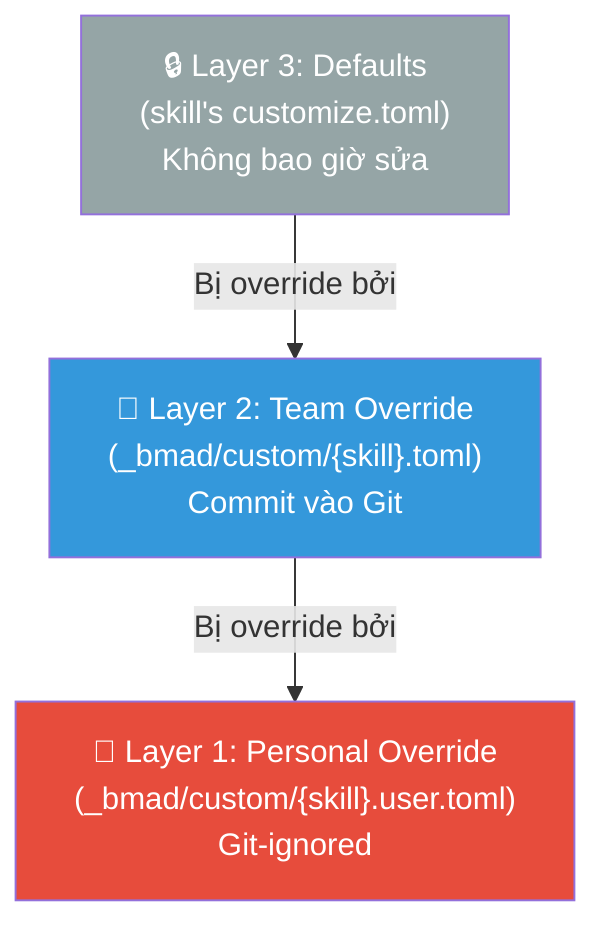
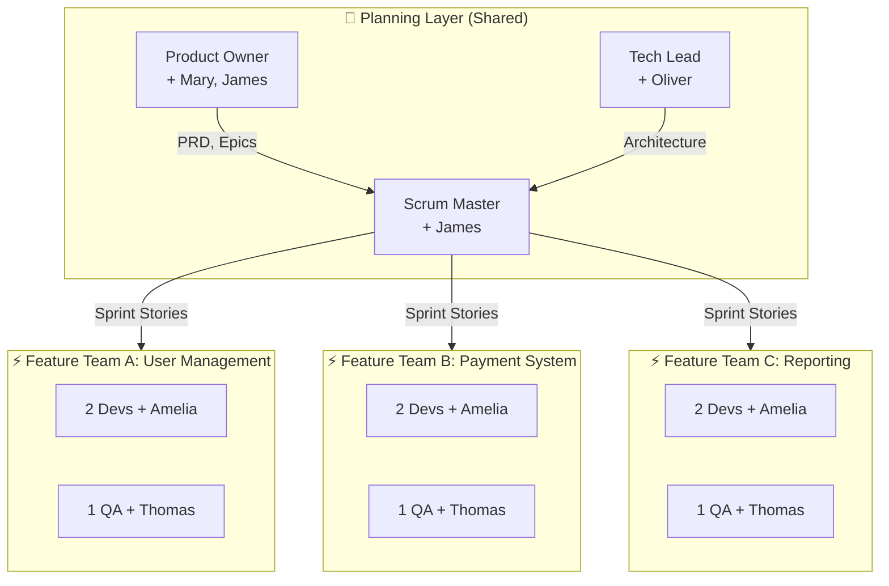
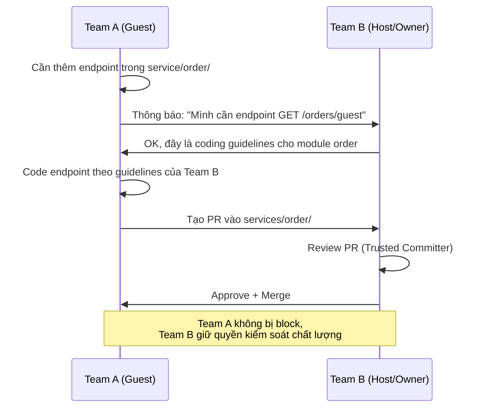
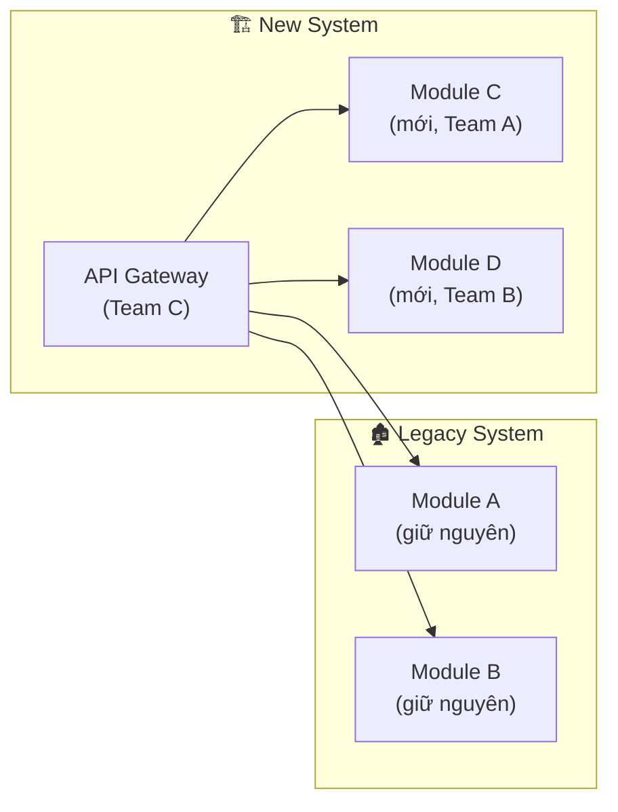

# BMad Method Thực Chiến — Customize, Đào Tạo Team, và Quản Lý Dự Án Lớn

## Mở đầu: Khi BMad gặp thực tế dự án

Bạn đã đọc về BMad Method, biết nó có 6 agent, 4 phase, và nghe rất hay trên lý thuyết. Nhưng rồi thực tế ập đến:

- Khách hàng yêu cầu PRD phải theo template riêng của họ, có thêm mục "Regulatory Review"
- Team có 15 người — 3 backend, 4 frontend, 2 QA, 1 DevOps, 2 BA, 1 PM, 1 Tech Lead, 1 Scrum Master
- Dự án brownfield với 200K dòng code legacy Django, không có documentation
- Sprint review phải export sang Confluence, task phải sync với Jira

**BMad Method được thiết kế để handle tất cả những tình huống này** — nhưng bạn cần biết cách customize nó. Bài viết này là hướng dẫn thực chiến.

**Nội dung chính:**

- Quy trình đào tạo/onboard team từ zero đến productive
- Customize agent và skill bằng hệ thống Three-Layer Override
- Phân công vai trò cho team lớn — ai dùng agent nào, khi nào
- Chiến lược tránh xung đột khi nhiều người cùng làm

---

## 1. Quy trình đào tạo team — Từ zero đến productive trong 1 tuần

### 1.1 Lộ trình onboarding 5 ngày

Đừng ném cả team vào BMad cùng lúc. Hãy **onboard theo lớp**:

| Ngày | Đối tượng | Nội dung | Output |
|------|-----------|----------|--------|
| **Ngày 1** | Tech Lead + PM | Cài đặt BMad, chạy `bmad-help`, hiểu 4 Phase | BMad đã cài, config xong |
| **Ngày 2** | Tech Lead + PM | Chạy thử full workflow trên mini project | PRD + Architecture + 1 Story hoàn chỉnh |
| **Ngày 3** | Tech Lead | Customize agent theo yêu cầu dự án | File `.toml` override đã commit |
| **Ngày 4** | BA + Scrum Master | Học Phase 1-3: Analysis → Planning → Solutioning | BA biết dùng Mary, James; SM biết sprint planning |
| **Ngày 5** | Dev Team + QA | Học Phase 4: `bmad-dev-story`, `bmad-code-review` | Mỗi dev hoàn thành 1 story thử nghiệm |

!!! tip "Nguyên tắc vàng: Đào tạo theo vai trò, không đào tạo toàn bộ"
    Developer **không cần biết** cách tạo PRD. BA **không cần biết** cách chạy `bmad-dev-story`. Mỗi người chỉ cần thành thạo agent và skill liên quan đến vai trò của mình.

### 1.2 Tài liệu nội bộ cần chuẩn bị

Trước khi onboard, Tech Lead nên chuẩn bị:

1. **Quick Reference Card** — 1 trang A4 liệt kê các lệnh BMad theo vai trò
2. **Project Context File** — `project-context.md` mô tả tech stack, conventions, và quy tắc riêng của dự án
3. **Customized Agent Config** — các file `.toml` override đã được thiết lập

!!! example "Ví dụ Quick Reference Card cho Developer"
    ```
    === DEVELOPER DAILY COMMANDS ===
    bmad-help              → Không biết làm gì tiếp? Hỏi đây
    bmad-dev-story         → Nhận story và bắt đầu code
    bmad-code-review       → Review code sau khi hoàn thành
    bmad-quick-dev         → Fix bug nhanh, không cần full process
    
    === QUY TẮC ===
    - Luôn mở chat MỚI cho mỗi workflow
    - KHÔNG sửa file trong _bmad/ trực tiếp
    - Code xong → commit → mở chat mới → bmad-code-review
    ```

---

## 2. Customize Agent & Skill — Ba tầng override không sợ mất khi update

### 2.1 Hệ thống Three-Layer Override

BMad dùng hệ thống **3 tầng override** dựa trên file TOML. Nguyên tắc: **không bao giờ sửa file gốc** — chỉ tạo file override trong `_bmad/custom/`:



**Quy tắc quan trọng:** File override phải **sparse** — chỉ chứa field bạn muốn thay đổi. **Không copy toàn bộ** `customize.toml` vào override — nếu làm vậy, bạn sẽ bị lock vào version cũ khi BMad update.

### 2.2 Ví dụ thực tế: Customize cho dự án Healthcare

**Bối cảnh:** Dự án xây hệ thống quản lý bệnh án (EHR) cho bệnh viện. Khách hàng yêu cầu:

- Mọi PRD phải có mục "HIPAA Compliance Review"
- Tech stack bắt buộc: AWS only, không Azure/GCP
- Output phải bằng tiếng Anh
- Code review phải kiểm tra security vulnerabilities

**Bước 1 — Customize PM Agent (James):**

Tạo file `_bmad/custom/bmad-agent-pm.toml`:

```toml
[agent]
icon = "🏥"
role = "Drives product discovery for a regulated healthcare domain."
communication_style = "Precise, regulatory-aware, asks compliance questions early."

persistent_facts = [
    "Our org is AWS-only -- do not propose GCP or Azure.",
    "All PRDs require HIPAA compliance review section.",
    "Target users are clinicians, not patients.",
    "file:{project-root}/docs/compliance/hipaa-overview.md",
]

principles = [
    "Ship nothing that can't pass an FDA audit.",
    "Patient data privacy is non-negotiable.",
]
```

**Bước 2 — Customize PRD Workflow:**

Tạo file `_bmad/custom/bmad-product-brief.toml`:

```toml
[workflow]
persistent_facts = [
    "Every brief must include 'Owner', 'Target Release', and 'HIPAA Review Status' fields.",
    "file:{project-root}/docs/compliance/prd-checklist.md",
]

brief_template = "{project-root}/docs/enterprise/brief-template.md"

on_complete = """
After finalizing the brief:
1. Publish to Confluence space 'PRODUCT' under 'Product Briefs'
2. Ask user if they want to create a Jira epic for this brief
"""
```

**Bước 3 — Customize Dev Agent (Amelia):**

Tạo file `_bmad/custom/bmad-agent-dev.toml`:

```toml
[agent]
persistent_facts = [
    "Always use context7 MCP tool for library docs before relying on training data.",
    "Every PR must include security review checklist.",
    "All patient data fields must be encrypted at rest and in transit.",
    "Use parameterized queries only -- no string concatenation for SQL.",
]

activation_steps_append = [
    "Read {project-root}/docs/security/coding-guidelines.md if it exists.",
]
```

!!! warning "Đừng quên: Reinforce trong CLAUDE.md"
    Các quy tắc quan trọng nhất nên được lặp lại trong file `CLAUDE.md` (hoặc `AGENTS.md` cho Cursor) ở root project. Vì `CLAUDE.md` được load **mọi session**, kể cả khi không chạy BMad skill:
    
    ```markdown
    <!-- SECURITY RULES -->
    <!-- All patient data must be encrypted. No string concatenation for SQL. -->
    <!-- Use context7 MCP tool for library docs before training-data knowledge. -->
    ```

### 2.3 Customize menu — Thêm/bớt step theo yêu cầu khách hàng

Khách hàng muốn thêm bước "Compliance Pre-check" vào menu của PM agent? Thêm vào file override:

```toml
# Thêm menu item mới cho PM agent
[[agent.menu]]
code = "CC"
description = "Run compliance pre-check against HIPAA requirements"
prompt = """
Read {project-root}/docs/compliance/hipaa-checklist.md
and scan all documents in {planning_artifacts} against it.
Report any gaps and cite the relevant regulatory section.
"""
```

Muốn **thay thế** menu item có sẵn? Override bằng cùng `code`:

```toml
# Override menu item "CE" (Create Epics) với custom skill
[[agent.menu]]
code = "CE"
description = "Create Epics using our delivery framework"
skill = "custom-create-epics"
```

### 2.4 Swap output template

Khách hàng có template PRD riêng? Chỉ cần trỏ workflow vào template mới:

```toml
[workflow]
brief_template = "{project-root}/docs/enterprise/client-prd-template.md"
```

Đặt template trong `{project-root}/docs/` hoặc `{project-root}/_bmad/custom/templates/` để version control cùng project.

---

## 3. Team lớn (10-30+ người) — Ai dùng gì, khi nào

### 3.1 Ma trận phân công Agent theo vai trò

Với team lớn, **không phải ai cũng dùng mọi agent**. Đây là ma trận phân công:

| Vai trò thực tế | BMad Agent sử dụng | BMad Skills chính | Tần suất |
|---|---|---|---|
| **Product Owner / BA** | Mary (Analyst), James (PM) | `bmad-brainstorming`, `bmad-create-prd`, `bmad-create-epics-and-stories` | Đầu sprint / khi có feature mới |
| **Tech Lead / Architect** | Oliver (Architect) | `bmad-create-architecture`, `bmad-check-implementation-readiness` | Đầu project / khi thay đổi architecture |
| **Scrum Master** | James (PM) | `bmad-sprint-planning`, `bmad-retrospective` | Mỗi sprint |
| **Senior Developer** | Amelia (Developer) | `bmad-create-story`, `bmad-dev-story`, `bmad-code-review` | Hàng ngày |
| **Junior Developer** | Amelia (Developer) | `bmad-dev-story`, `bmad-quick-dev` | Hàng ngày |
| **QA Engineer** | Thomas (QA) | `bmad-code-review`, custom QA skills | Sau mỗi story |
| **UX Designer** | Sarah (UX Designer) | `bmad-create-ux-design` | Phase 2 |
| **DevOps** | Amelia (Developer) | `bmad-dev-story` (cho infra stories) | Khi có infra task |

### 3.2 Mô hình Feature Team với BMad

Với team 15+ người, chia thành **Feature Teams** — mỗi team sở hữu end-to-end một nhóm Epic:



**Nguyên tắc phân chia:**

- **Planning Layer (3-4 người):** PO, Tech Lead, SM — dùng Phase 1-3, tạo PRD, Architecture, Epics
- **Feature Teams (3-4 người/team):** Dev + QA — dùng Phase 4, nhận story và code
- **Shared artifacts:** PRD.md, architecture.md, epics-and-stories.md là **single source of truth** — mọi team đều đọc cùng một bộ

### 3.3 Workflow cho team lớn — Step by step

**Tuần 0 (Sprint 0):**

```
PO + Tech Lead + SM:
1. bmad-brainstorming          → brainstorming-report.md
2. bmad-create-prd             → PRD.md
3. bmad-create-architecture    → architecture.md
4. bmad-create-epics-and-stories → epics/
5. bmad-check-implementation-readiness → Kiểm tra nhất quán
```

**Mỗi Sprint:**

```
SM:
1. bmad-sprint-planning → Chọn stories cho sprint, gán cho Feature Teams

Feature Team (mỗi dev làm độc lập):
2. bmad-create-story    → Tạo story chi tiết (nếu chưa có)
3. bmad-dev-story       → Code theo story
4. bmad-code-review     → Review code

QA:
5. Review + test theo acceptance criteria

SM (cuối sprint):
6. bmad-retrospective   → Lessons learned
```

!!! example "Ví dụ thực tế: Team 18 người xây E-commerce Platform"
    **Planning Layer:**
    
    - **PO (Minh):** Dùng Mary brainstorm features → James tạo PRD với 5 Epic
    - **Tech Lead (Hùng):** Dùng Oliver thiết kế microservices architecture (API Gateway + 4 services)
    - **SM (Lan):** Dùng James tạo sprint plan, phân stories cho 3 Feature Teams
    
    **Feature Team A — Catalog Service (5 người):**
    
    - 2 Backend devs: Mỗi người nhận 1-2 stories/sprint, dùng `bmad-dev-story`
    - 1 Frontend dev: Stories liên quan đến UI catalog
    - 1 QA: Review code + viết test
    - **Scope rõ ràng:** Chỉ touch code trong `services/catalog/` và `frontend/catalog/`
    
    **Feature Team B — Order Service (5 người):** Tương tự, scope `services/order/`
    
    **Feature Team C — Payment + Auth (5 người):** Scope `services/payment/` và `services/auth/`

---

## 4. Tránh xung đột — Không để team phá nát sản phẩm của nhau

### 4.1 Vấn đề cốt lõi: Codebase thay đổi liên tục, team không kịp update

Khi 15-20 người cùng push code vào 1 repo mỗi ngày, bạn sẽ gặp **bài toán đồng bộ** (synchronization problem):

- Dev A merge xong Story 1.1 → thay đổi API response format
- Dev B đang code Story 2.1 dựa trên API format cũ → **code của B bị break mà B không biết**
- QA test trên branch cũ → kết quả test không còn đúng với main
- SM nhìn `sprint-status.yaml` nhưng không phản ánh đúng thực tế

Đây không phải vấn đề của riêng BMad — mọi team lớn đều gặp. Nhưng BMad + best practices dưới đây giải quyết triệt để.

### 4.2 Xung đột phổ biến và cách phòng tránh

| Loại xung đột | Nguyên nhân | Giải pháp |
|---|---|---|
| **Merge conflict** | 2 dev sửa cùng file | Chia story theo module + trunk-based dev + CODEOWNERS |
| **API breaking change** | Team A đổi API mà Team B đang dùng | Contract-first dev + feature flags |
| **Architecture drift** | Dev code lệch architecture | `bmad-check-implementation-readiness` + `bmad-code-review` |
| **Scope creep** | Dev thêm feature ngoài story | Story file có acceptance criteria rõ — Amelia chỉ code đúng scope |
| **Convention mismatch** | Mỗi dev code khác style | `project-context.md` + `persistent_facts` + automated linting |
| **Stale context** | Dev dùng BMad agent với context cũ | Pull main trước mỗi `bmad-dev-story` + fresh chat mỗi workflow |
| **Dependency blocking** | Team A chờ Team B xong API | Inner Source model — Team A tự contribute vào module của Team B |

### 4.3 Năm lớp phòng thủ

#### Lớp 1 — Document Sharding + CODEOWNERS (Phòng ngừa)

BMad chia PRD và architecture thành các **story file nhỏ, độc lập**. Mỗi story chứa đủ context để dev có thể làm **mà không cần hỏi team khác**.

Kết hợp với file `CODEOWNERS` để **enforce ranh giới ownership** ở cấp Git:

```
_bmad-output/
├── planning-artifacts/
│   ├── PRD.md                    ← PO + Tech Lead maintain
│   ├── architecture.md           ← Tech Lead maintain
│   └── epics/
│       ├── index.md              ← Mục lục liên kết đến từng epic
│       ├── epic-1-catalog.md     ← Team A's scope
│       ├── epic-2-order.md       ← Team B's scope
│       └── epic-3-payment.md     ← Team C's scope
└── implementation-artifacts/
    ├── sprint-status.yaml        ← SM maintain
    └── stories/
        ├── story-1.1.md          ← Gán cho Dev A1
        ├── story-1.2.md          ← Gán cho Dev A2
        └── story-2.1.md          ← Gán cho Dev B1
```

!!! question "Nhưng khoan — `bmad-create-epics-and-stories` chỉ tạo ra 1 file duy nhất?"
    **Đúng.** Mặc định, BMad tạo 1 file `epics-and-stories.md` chứa toàn bộ epics và stories. Để có cấu trúc nhiều file như trên, bạn cần thực hiện thêm bước **chia nhỏ (sharding)**. Có 3 cách:

**Cách 1 — Customize workflow bằng TOML (Recommended cho team lớn):**

Tạo file `_bmad/custom/bmad-create-epics-and-stories.toml` để agent **tự động tạo nhiều file** thay vì 1 file:

```toml
[workflow]
persistent_facts = [
    "Output each epic as a separate file under {planning_artifacts}/epics/ directory.",
    "File naming convention: epic-{number}-{slug}.md (e.g., epic-1-user-management.md).",
    "Each epic file must contain: epic description, all stories with acceptance criteria, and technical notes.",
    "Create an index.md file listing all epics with brief descriptions and links.",
    "Do NOT create a single monolithic epics-and-stories.md file.",
]
```

Sau khi commit file TOML này vào Git, mọi thành viên trong team chạy `bmad-create-epics-and-stories` sẽ **tự động tạo nhiều file riêng biệt** — không cần nhắc lại mỗi lần.

**Cách 2 — Dùng `bmad-create-story` ở Phase 4 (mỗi story 1 file):**

Trong workflow thực tế, việc tách story thành file riêng thường xảy ra ở **Phase 4** — khi dev hoặc SM chạy `bmad-create-story` cho từng story cụ thể. Lệnh này tạo 1 file story chi tiết chứa:

- Acceptance criteria đầy đủ
- Technical context từ architecture doc
- API contracts liên quan
- Notes cho dev

```
# SM hoặc Senior Dev chạy cho từng story
bmad-create-story
→ Agent hỏi: "Which story?"
→ User: "Story 1.1 - Implement product search API"
→ Output: stories/story-1.1.md (file riêng, đủ context để dev code độc lập)
```

**Cách 3 — Prompt trực tiếp khi chạy workflow:**

Nếu chưa setup TOML override, bạn có thể nói trực tiếp với agent khi chạy `bmad-create-epics-and-stories`:

> *"Hãy tạo mỗi epic thành một file riêng trong thư mục `epics/`. Tạo thêm file `index.md` làm mục lục."*

!!! tip "Workflow khuyến nghị cho team lớn"
    ```
    Phase 3 (Planning Layer):
      bmad-create-epics-and-stories
        → Override bằng TOML → tạo epics/epic-1.md, epic-2.md...
        → Hoặc: tạo 1 file → prompt agent chia nhỏ
    
    Phase 4 (Feature Teams):
      bmad-create-story (chạy cho từng story cần implement)
        → Output: stories/story-X.Y.md (1 file/story, chứa đủ context)
      
      bmad-dev-story
        → Agent đọc story-X.Y.md → code theo đúng scope
        → Dev KHÔNG CẦN đọc toàn bộ epics file gốc
    ```
    
    Kết quả: mỗi dev chỉ cần đọc **1 file story** của mình — không bị overwhelm bởi toàn bộ backlog.


File `CODEOWNERS` ở root repo:

```
# Planning artifacts — chỉ Planning Layer được sửa
_bmad-output/planning-artifacts/    @po-team @tech-lead

# Code ownership theo Feature Team
services/catalog/                   @team-a
services/order/                     @team-b
services/payment/                   @team-c
frontend/catalog/                   @team-a
frontend/order/                     @team-b

# Shared code — cần approval từ Tech Lead
libs/shared/                        @tech-lead
infrastructure/                     @devops-team

# BMad config — chỉ Tech Lead sửa
_bmad/custom/                       @tech-lead
```

!!! info "CODEOWNERS hoạt động như thế nào?"
    Khi Dev từ Team B tạo PR sửa file trong `services/catalog/` (thuộc Team A), GitHub **tự động yêu cầu approval từ @team-a**. Điều này ngăn chặn việc team khác vô tình phá code của nhau mà không ai review.

#### Lớp 2 — Trunk-Based Development + Feature Flags (Cách ly)

```mermaid
gitGraph
    commit id: "main"
    branch feature/catalog-search
    commit id: "Story 1.1"
    commit id: "Story 1.2"
    checkout main
    branch feature/order-checkout
    commit id: "Story 2.1"
    checkout main
    merge feature/catalog-search id: "PR + CI"
    merge feature/order-checkout id: "PR + CI"
    commit id: "Feature flag ON"
```

**Quy tắc trunk-based development:**

- Mỗi story = 1 feature branch **ngắn** (tối đa 1-2 ngày)
- Merge vào main qua PR + `bmad-code-review` + CI pass
- **Không giữ branch quá 2 ngày** — nếu story quá lớn, chia nhỏ tiếp
- Mỗi dev **pull main vào branch ít nhất 1 lần/ngày** để phát hiện conflict sớm

**Feature Flags cho code chưa hoàn thiện:**

Khi feature cần nhiều stories mới hoàn chỉnh, dùng **feature flag** để merge code chưa xong vào main mà không ảnh hưởng production:

```javascript
// Ví dụ: Feature "Guest Checkout" cần 3 stories, mới xong 1
if (featureFlags.isEnabled('guest-checkout')) {
    renderGuestCheckoutForm();  // Story 1.1 — đã xong
} else {
    renderLoginPrompt();        // Code cũ — vẫn hoạt động
}
```

!!! tip "Lợi ích của feature flags trong team lớn"
    - **Team A merge code chưa hoàn thiện** mà không break production
    - **Team B vẫn thấy code mới nhất** khi pull main → không bị "surprise" khi merge
    - **QA test được cả 2 trạng thái** (flag on/off)
    - **Rollback tức thì** nếu có bug — chỉ cần tắt flag, không cần revert code

#### Lớp 3 — CI/CD với Affected Build Detection (Tự động phát hiện)

Trong repo lớn, chạy **toàn bộ test** cho mỗi PR là quá chậm. Dùng **affected build detection** — chỉ test những module bị ảnh hưởng:

```
PR sửa services/catalog/api.py
  → CI detect: affected modules = [catalog, frontend-catalog]
  → Chỉ chạy test cho 2 module này (2 phút thay vì 20 phút)
  → Nếu sửa libs/shared/ → chạy test TOÀN BỘ module (vì shared code)
```

Cấu hình trong CI pipeline:

```yaml
# .github/workflows/ci.yml
- name: Detect affected modules
  run: |
    # Dùng tool như Nx, Turborepo, hoặc script tự viết
    AFFECTED=$(scripts/detect-affected.sh ${{ github.event.pull_request.base.sha }})
    echo "affected=$AFFECTED" >> $GITHUB_OUTPUT

- name: Run affected tests
  run: npm test -- --projects ${{ steps.detect.outputs.affected }}
```

#### Lớp 4 — Communication Rituals (Đồng bộ con người)

Tool và automation không thể thay thế hoàn toàn **giao tiếp giữa người với người**. Ba nghi thức quan trọng:

**a) Scrum of Scrums (15 phút, 2-3 lần/tuần):**

Đại diện mỗi Feature Team (thường là SM hoặc Tech Lead) họp nhanh:

- "Team A đang sửa API catalog — response format thay đổi từ v1 sang v2"
- "Team B cần endpoint `/orders/guest` — Team C có thể ưu tiên không?"
- "Shared library `libs/auth` sẽ được refactor tuần sau — freeze các thay đổi vào lib này"

**b) System Demo (30 phút, cuối mỗi sprint):**

Mỗi team demo phần mình → tất cả thấy **sản phẩm tổng thể** hoạt động ra sao → phát hiện integration issues sớm.

**c) Communities of Practice (1 tiếng, 2 tuần/lần):**

Nhóm theo chuyên môn (frontend guild, backend guild, QA guild) — chia sẻ kiến thức, thống nhất coding standards, và đánh giá technical debt.

!!! example "Ví dụ Scrum of Scrums phát hiện xung đột sớm"
    **Tình huống:** Team A (Catalog) đang refactor database schema cho bảng `products`. Team B (Order) có query JOIN với bảng `products`.
    
    **Không có Scrum of Scrums:** Team A merge refactor → query của Team B bị break → mất 2 ngày debug.
    
    **Có Scrum of Scrums:** Đại diện Team A thông báo "Tuần này sẽ refactor bảng products, cột `price` đổi thành `base_price`." → Team B biết trước → điều chỉnh query **trước khi** Team A merge.

#### Lớp 5 — Inner Source Model (Tự giải quyết dependency)

Khi Team A cần feature trong module của Team B nhưng Team B chưa kịp làm, thay vì **chờ** (blocking) hoặc **tự ý sửa** (chaos), dùng mô hình **Inner Source**:



**Quy tắc Inner Source:**

- **Guest** (team cần feature): Code theo convention của **Host**, không phải convention riêng
- **Host** (team sở hữu module): Review và approve — có quyền yêu cầu sửa đổi
- **CODEOWNERS** enforce: PR vào module của team khác **bắt buộc** phải có approval từ team sở hữu

### 4.4 Quy trình hàng ngày cho dev trong team lớn

Để đảm bảo mọi người luôn làm việc trên context mới nhất:

```
=== MỖI SÁNG (trước khi code) ===
1. git pull origin main          ← Lấy code mới nhất
2. git rebase main               ← Rebase branch của mình (nếu có)
3. Mở chat MỚI trong AI IDE     ← Fresh context cho BMad agent
4. bmad-dev-story                ← Agent đọc story + codebase MỚI NHẤT

=== SAU KHI CODE XONG ===
5. git pull origin main          ← Lấy code mới nhất (lần nữa!)
6. Resolve conflicts (nếu có)
7. Chạy test local
8. Mở chat MỚI → bmad-code-review
9. Tạo PR → CI/CD chạy → Chờ review

=== QUAN TRỌNG ===
- KHÔNG code quá 2 ngày mà không merge
- KHÔNG giữ branch dài mà không rebase từ main
- NẾU thấy conflict lớn → báo SM ngay trong daily standup
```

!!! warning "Sai lầm phổ biến nhất: Dùng BMad agent với context cũ"
    BMad agent đọc codebase **tại thời điểm bạn gọi nó**. Nếu bạn không `git pull` trước khi gọi `bmad-dev-story`, agent sẽ code dựa trên version cũ → conflict khi merge.
    
    **Luôn pull main + mở chat mới trước mỗi workflow.**

### 4.5 Config tập trung cho team

Dùng `_bmad/custom/config.toml` để **pin cấu hình chung cho toàn team**:

```toml
[modules.bmm]
planning_artifacts = "{project-root}/shared/planning"
implementation_artifacts = "{project-root}/shared/implementation"

[core]
document_output_language = "English"
```

Cá nhân customize trong `_bmad/config.user.toml` (git-ignored):

```toml
user_name = "Nguyen Van A"
communication_language = "Vietnamese"
user_skill_level = "senior"
```

---

## 5. Greenfield vs Brownfield — Điểm khác biệt khi áp dụng cho team lớn

### 5.1 Greenfield: Tự do nhưng cần kỷ luật

**Ưu điểm:** Không legacy code → architecture sạch → chia module rõ ràng → ít xung đột.

**Rủi ro:** Over-engineering, scope creep, mỗi người hiểu requirement khác nhau.

**Chiến lược cho team lớn:**

1. **Sprint 0 bắt buộc:** PO + Tech Lead + SM dùng full Phase 1-3 tạo PRD + Architecture trước khi bất kỳ dev nào viết code
2. **Architecture-first:** Oliver (Architect) thiết kế module boundaries rõ ràng → mỗi Feature Team sở hữu 1 module
3. **Contract-first development:** Định nghĩa API contracts giữa các module trước khi code → team có thể làm song song

### 5.2 Brownfield: Hiểu trước, sửa sau

**Thách thức thêm:** Legacy code, undocumented business logic, technical debt, fear of regression.

**Bước bắt buộc trước khi bắt đầu:**

```bash
# Bước 1: Tạo project context từ codebase hiện tại
bmad-generate-project-context

# Bước 2: Document toàn bộ project (nếu chưa có docs)
bmad-document-project
```

**Chiến lược Strangler Fig cho team lớn:**

Thay vì rewrite toàn bộ, **bọc** hệ thống cũ bằng lớp mới:



!!! example "Ví dụ: Modernize hệ thống ERP 5 năm tuổi (team 20 người)"
    **Bối cảnh:** Hệ thống ERP viết bằng Java Spring Boot monolith, 300K LoC, không có test.
    
    **Phase 0 — Discovery (1 tuần):**
    
    - Tech Lead chạy `bmad-generate-project-context` → phát hiện 47 entity, 12 REST controllers, 0 unit tests
    - `bmad-document-project` → tạo architecture doc và business logic map
    
    **Phase 1 — Plan (1 tuần):**
    
    - PO + BA dùng James tạo PRD cho "Extract Inventory Service" (module đầu tiên tách ra)
    - Tech Lead dùng Oliver thiết kế architecture: microservice mới + API adapter cho monolith
    
    **Implementation — Chia team:**
    
    - **Team A (5 người):** Xây Inventory microservice mới (Greenfield approach — dùng full BMad workflow)
    - **Team B (3 người):** Tạo API adapter trong monolith cũ (Brownfield — dùng `bmad-quick-dev` cho từng change nhỏ)
    - **Team C (2 người):** Integration testing giữa old và new
    
    **Quy tắc vàng:** Team A **không touch** monolith code. Team B **không touch** microservice code. API contract là ranh giới không ai được vượt qua mà không có PR review.

---

## 6. Checklist triển khai BMad cho dự án thực tế

### Trước khi bắt đầu

- [ ] Cài BMad và chạy `bmad-help` thành công
- [ ] Tạo `project-context.md` (brownfield) hoặc chạy Phase 1 (greenfield)
- [ ] Customize agent theo yêu cầu dự án (file `.toml` trong `_bmad/custom/`)
- [ ] Chuẩn bị Quick Reference Card cho từng vai trò
- [ ] Setup CI/CD pipeline với automated testing

### Trong Sprint 0

- [ ] PO + Tech Lead hoàn thành PRD và Architecture
- [ ] SM tạo Epics & Stories, phân cho Feature Teams
- [ ] Mỗi dev chạy thử 1 story để làm quen workflow
- [ ] QA review process đã được tích hợp

### Mỗi Sprint

- [ ] SM chạy `bmad-sprint-planning` đầu sprint
- [ ] Mỗi dev dùng `bmad-dev-story` → `bmad-code-review`
- [ ] PR review bắt buộc trước merge
- [ ] SM chạy `bmad-retrospective` cuối sprint
- [ ] Cập nhật `project-context.md` nếu có thay đổi architecture

---

## Kết luận

Ba bài học thực chiến:

1. **Customize trước, code sau.** Dành 1-2 ngày để Tech Lead setup đúng `persistent_facts`, template, và convention cho agent. Khoản đầu tư này tiết kiệm hàng tuần debug và refactor sau này.

2. **Phân vai trò rõ ràng = giảm xung đột.** Không phải ai cũng cần dùng mọi agent. PO dùng Mary + James, Dev dùng Amelia, QA dùng Thomas. Mỗi người thành thạo 2-3 skills là đủ.

3. **Document là ranh giới.** Trong team lớn, PRD, Architecture, và Story files không chỉ là tài liệu — chúng là **hàng rào** ngăn team phá nát sản phẩm của nhau. BMad enforce điều này bằng cách buộc mọi agent đọc và tuân thủ cùng một bộ artifacts.

---

## Tham khảo

- [BMad Method — How to Customize](https://docs.bmad-method.org/how-to/customize-bmad/) — Hướng dẫn chi tiết hệ thống Three-Layer Override.
- [BMad Method — Expand for Your Organization](https://docs.bmad-method.org/how-to/expand-bmad-for-your-org/) — 5 recipes mở rộng BMad cho enterprise.
- [BMad Method — Established Projects](https://docs.bmad-method.org/how-to/established-projects/) — Workflow cho dự án brownfield.
- [BMad Method — Preventing Agent Conflicts](https://docs.bmad-method.org/explanation/preventing-agent-conflicts/) — Cơ chế phòng tránh xung đột giữa các agent.
- [BMad Method — Document Sharding Guide](https://docs.bmad-method.org/how-to/shard-large-documents/) — Chia nhỏ document cho team lớn.
- [BMad Method — GitHub Repository](https://github.com/bmad-code-org/BMAD-METHOD) — Mã nguồn mở, MIT License.
- [Trunk-Based Development](https://trunkbaseddevelopment.com/) — Branching strategy cho team lớn.
- [James Shore — Collective Code Ownership](https://www.jamesshore.com/v2/books/aoad2/collective-code-ownership) — Mô hình code ownership trong Agile.
- [GitHub — About CODEOWNERS](https://docs.github.com/en/repositories/managing-your-repositorys-settings-and-features/customizing-your-repository/about-code-owners) — Thiết lập code ownership boundaries trên GitHub.
- [InnerSource Commons](https://innersourcecommons.org/) — Framework Inner Source cho collaboration xuyên team.
- [Flagsmith — Feature Flags Best Practices](https://www.flagsmith.com/blog/feature-flag-best-practices) — Hướng dẫn dùng feature flags an toàn.
- [Atlassian — Scrum of Scrums](https://www.atlassian.com/agile/scrum/scrum-of-scrums) — Coordination ritual cho multi-team Agile.

