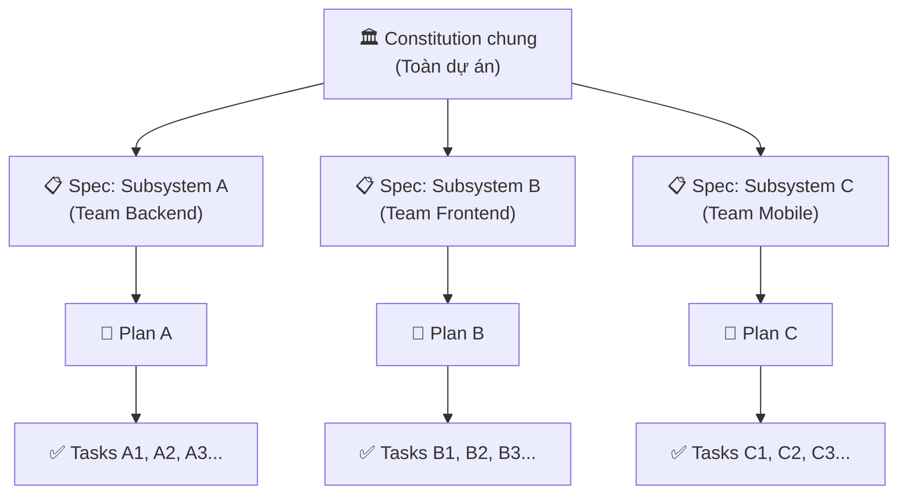

# Tạm Biệt "Vibe Coding" - Chào Đón Kỷ Nguyên Spec-Driven Development Với GitHub Spec Kit

## Mở đầu
Bạn đã bao giờ gõ một đoạn prompt dài ngoằng cho ChatGPT hoặc GitHub Copilot, cầu nguyện nó sinh ra đoạn code đúng ý, rồi sau đó ngập chìm trong hàng tá bug vì AI phá vỡ toàn bộ kiến trúc dự án? 

Chào mừng bạn đến với thực trạng **"Vibe Coding"** (code theo cảm giác). AI hiện nay có thể viết code rất nhanh, nhưng lại thường thiếu đi khả năng nắm bắt bức tranh tổng thể (Big Picture). Để giải quyết bài toán nhức nhối này, GitHub vừa giới thiệu một "vũ khí" mã nguồn mở cực kỳ mạnh mẽ: **[Spec Kit](https://github.com/github/spec-kit)**. 

Hãy cùng khám phá xem toolkit này là gì và tại sao nó đang được kỳ vọng sẽ định hình lại tiêu chuẩn của Software Engineering trong kỷ nguyên AI!

**Nội dung chính:**
- Spec Kit là gì và phương pháp Spec-Driven Development (SDD).
- Sứ mệnh và điểm đau mà công cụ này giải quyết.
- Kiến trúc cốt lõi của Spec Kit.
- Hướng dẫn thực tiễn áp dụng Spec Kit vào dự án thực tế.
- Chiến lược mở rộng cho dự án quy mô lớn (Enterprise Scale).
- So sánh với các toolkit SDD nổi tiếng: BMAD, Kiro, Superpowers.

---

## 1. Spec Kit là gì? Đưa Spec-Driven Development vào thực tiễn

Về bản chất, **Spec Kit không phải là một AI Agent mới**. Nó là một **toolkit (bộ công cụ) mã nguồn mở** giúp bạn áp dụng phương pháp **Spec-Driven Development (SDD)** khi làm việc với AI.

Trong hàng thập kỷ, tài liệu đặc tả (Specifications/Specs) thường chỉ là những file Word hoặc Jira tickets dùng để "đọc cho biết", sau đó bị vứt xó khi Developer bắt đầu gõ code. SDD lật ngược kịch bản này: Với Spec Kit, các bản đặc tả trở thành những **hợp đồng thực thi được (executable contracts)**. AI Agent sẽ đọc trực tiếp các Spec này và dùng chúng làm "kim chỉ nam" để sinh ra mã nguồn, đảm bảo code output bám sát 100% yêu cầu nghiệp vụ và cấu trúc kỹ thuật.

!!! info "Spec-Driven Development (SDD)"
    SDD là một phương pháp trong đó việc định nghĩa rõ ràng cái gì cần làm (What) và tại sao (Why) được đặt lên hàng đầu. Code sinh ra chỉ là hệ quả (How) của bản đặc tả tốt.

## 2. Sứ mệnh và Nỗi đau (Pain Points) mà Spec Kit giải quyết

Việc sử dụng các công cụ như Cursor, Copilot, hay Claude Code hiện nay chủ yếu mang tính chất "ném prompt và hy vọng". Tuy nhiên, cách tiếp cận này lộ rõ nhiều yếu điểm:

*   **Nỗi đau (Pain Points):** Khi dự án phình to, việc prompt tự do tạo ra mã nguồn chắp vá, kiến trúc lộn xộn, vi phạm các tiêu chuẩn bảo mật của công ty và cực kỳ khó bảo trì. Những lập trình viên thiếu kinh nghiệm rất dễ bị AI dẫn định đi sai hướng.
*   **Sứ mệnh của Spec Kit:** Chuyển đổi việc lập trình với AI từ trạng thái "đoán mò, hên xui" sang một **quy trình có cấu trúc, chuẩn mực và dự đoán được kết quả**. Nó ép AI phải tuân thủ kỷ luật: *Suy nghĩ -> Thiết kế kiến trúc -> Lên kế hoạch -> Mới được viết code.*

## 3. Kiến trúc Cốt lõi của Spec Kit

Spec Kit đóng vai trò như một người "nhạc trưởng" điều phối hơn 30 AI Coding Agents khác nhau (bao gồm GitHub Copilot, Claude Code, Aider, v.v.). Kiến trúc của nó cực kỳ linh hoạt với 3 thành phần cốt lõi:

1.  **Specify CLI (`specify-cli`):** Công cụ dòng lệnh trung tâm dùng để khởi tạo và quản lý quy trình SDD trực tiếp trong repository của bạn. Khi chạy, nó cung cấp các template đặc tả có sẵn.
2.  **Slash Commands Workflow (Luồng lệnh nội suy):** Cung cấp các lệnh có cấu trúc như `/speckit.constitution`, `/speckit.specify`, `/speckit.plan`, `/speckit.tasks`, `/speckit.implement`. Thay vì chat tự do, bạn điều khiển AI qua các lệnh này để từng bước xây dựng tính năng.
3.  **Hệ sinh thái Extensions & Presets:** Khả năng mở rộng vô hạn. Bạn có thể cài thêm *Extensions* để AI tự động liên kết với Jira, thực hiện Review Gate, chạy Security Checks; hoặc dùng *Presets* để định nghĩa quy chuẩn code riêng cho dự án (ví dụ ép AI dùng Tailwind thay vì CSS thuần).

## 4. Ứng dụng thực tiễn: 5 Bước Xây dựng Web App Quản lý Ảnh

Để thấy Spec Kit mạnh mẽ cỡ nào, hãy xem cách nó ép AI triển khai một ứng dụng quản lý ảnh (Photo Album App) một cách vô cùng bài bản:

### Bước 1: Khởi tạo (Initialization)
Trong terminal của dự án, bạn chạy lệnh sau để khởi tạo cấu trúc `.specify`:
```bash
uv tool install specify-cli --from git+https://github.com/github/spec-kit.git
specify init . --integration copilot
```
*Lưu ý: Bạn có thể thay `--integration copilot` bằng `claude` hoặc các agent hỗ trợ.*

### Bước 2: Thiết lập "Hiến pháp" dự án (Constitution)
Bạn gọi AI Agent trong IDE và nhập:
> `/speckit.constitution Xây dựng nguyên tắc dự án: Chỉ dùng Vanilla JavaScript và CSS thuần, không dùng thư viện ngoài. Code phải tối ưu hiệu năng và tuân thủ nguyên tắc SOLID.`

!!! tip "Quy tắc vàng"
    `constitution.md` là "luật vua". Mọi dòng code AI viết ra sau này đều sẽ bị ép phải đối chiếu với tài liệu này.

### Bước 3: Viết Đặc tả Nghiệp vụ (Specify)
> `/speckit.specify Xây dựng ứng dụng quản lý ảnh. Ảnh được nhóm theo ngày, có tính năng kéo thả (drag & drop) để thay đổi album. Giao diện dạng lưới (grid) hiển thị thumbnail.`

AI sẽ không vội vàng viết logic kéo thả ngay, mà sẽ phân tích yêu cầu nghiệp vụ và sinh ra file `spec.md` chi tiết.

### Bước 4: Lên Kế hoạch Kỹ thuật (Plan)
> `/speckit.plan Sử dụng Vite làm build tool. Lưu trữ metadata bằng API IndexedDB ở local.`

Dựa trên bản Spec, AI sẽ sinh ra bản vẽ kiến trúc hệ thống và cấu trúc thư mục dự kiến.

### Bước 5: Chia nhỏ Task & Thực thi (Tasks & Implement)
*   **Chạy `/speckit.tasks`**: AI tự động chia nhỏ bản Plan thành các task Jira/Trello siêu chi tiết (VD: Tạo HTML shell, viết CSS Grid, viết logic IndexedDB).
*   **Chạy `/speckit.implement`**: Lúc này, AI mới chính thức gõ code cho từng task. Code sinh ra sẽ chính xác tuyệt đối vì nó đã được "nuôi dưỡng" bởi Hiến pháp, Đặc tả và Kế hoạch từ các bước trước.

---

## 5. Spec Kit phù hợp với những loại dự án nào?

Nhờ đặc tính áp đặt tính kỷ luật, Spec Kit cực kỳ tỏa sáng trong các trường hợp:

*   **Dự án Enterprise & Mission-critical:** Các hệ thống tài chính, y tế, nội bộ doanh nghiệp yêu cầu khắt khe về bảo mật, kiến trúc đồng nhất và rủi ro sai sót bằng 0.
*   **Dự án Brownfield (Bảo trì/Nâng cấp Legacy):** Bạn có thể dùng Spec Kit thiết lập "Hiến pháp" dựa trên codebase cũ, ép AI khi viết code mới phải tuân theo đúng design pattern đang có, tránh phá vỡ hệ thống thay vì đập đi xây lại.
*   **Làm việc nhóm lớn:** Đồng bộ hóa chất lượng code giữa các thành viên khi tất cả mọi người (kể cả AI của họ) đều tuân theo chung một bộ luật `constitution.md`.

## 6. Chiến lược mở rộng cho Dự án Quy mô Lớn (Enterprise Scale)

Đây là câu hỏi mà bất kỳ Engineering Manager nào cũng sẽ đặt ra: *"OK, Spec Kit rất hay cho 1 developer và 1 tính năng. Nhưng dự án của tôi có 20 subsystems, 150 developers, và hàng chục testers. Làm sao để không hỗn loạn?"*

Spec Kit giải quyết bài toán này thông qua **chiến lược phân tầng đặc tả (Hierarchical Specification)** kết hợp với các **Community Extensions** chuyên dụng cho quy mô lớn.

### 6.1. Nguyên tắc: Phân tầng Spec theo Subsystem

Với dự án lớn, bạn KHÔNG viết một file `spec.md` khổng lồ cho toàn bộ hệ thống. Thay vào đó, áp dụng mô hình phân tầng:



> **Ví dụ thực tế — Hệ thống E-commerce lớn:**
>
> *   **Constitution chung** (1 file duy nhất): Quy định tech stack (Java/Spring Boot + React), chuẩn API (RESTful, OpenAPI 3.0), quy tắc bảo mật (OWASP Top 10), và convention đặt tên.
> *   **Spec cho Subsystem "Payment"** (Team A): Đặc tả luồng thanh toán VNPay, Stripe. Team này chạy `/speckit.specify` và `/speckit.plan` riêng.
> *   **Spec cho Subsystem "Inventory"** (Team B): Đặc tả quản lý kho, đồng bộ stock real-time. Team này cũng chạy SDD workflow riêng.
> *   Cả hai team đều bị ràng buộc bởi cùng một `constitution.md`, nên API interface giữa Payment và Inventory luôn nhất quán.

### 6.2. Phân chia Tasks và Tích hợp sản phẩm: Dùng Extensions chuyên dụng

Khi đã có nhiều team cùng chạy SDD song song, vấn đề lớn nhất là **tích hợp (Integration)**. Spec Kit cung cấp các Community Extensions để giải quyết:

#### `spec-kit-fleet` — Nhạc trưởng đa pha (Multi-phase Orchestrator)

Extension này cho phép chain tối đa 10 giai đoạn (phases) vào một luồng duy nhất, bao gồm:

*   **Parallel sub-agent execution:** Phân phối task cho nhiều AI agent chạy song song (ví dụ: Agent 1 viết backend, Agent 2 viết frontend cùng lúc).
*   **Cross-model review:** Dùng một model AI thứ hai (ví dụ: GPT review code do Claude viết) để kiểm tra chéo, phát hiện blind spots.
*   **Human-in-the-loop gates:** Tại các điểm then chốt (ví dụ: sau khi Plan được tạo, trước khi Implement), hệ thống dừng lại chờ Tech Lead phê duyệt.
*   **CI remediation loops:** Nếu CI/CD pipeline fail sau implement, fleet tự động quay lại fix.

!!! example "Ví dụ workflow với `spec-kit-fleet`"
    1. Tech Lead chạy `/speckit.specify` tạo Spec cho feature "User Dashboard".
    2. Fleet tự chia Plan thành 3 nhánh: API endpoints, UI components, Database migration.
    3. 3 agents chạy song song, mỗi agent implement một nhánh.
    4. Fleet tự chạy integration tests. Nếu fail → tự retry với context lỗi.
    5. Tech Lead review lần cuối → Merge.

#### `spec-kit-squad` — Đồng bộ đội ngũ AI chuyên biệt (Team Synchronization)

Extension này tạo ra một "đội hình" (squad) gồm nhiều AI agents chuyên biệt, mỗi agent phụ trách một domain:

*   **Agent Backend:** Chỉ viết Java/Spring Boot, nắm vững Entity và Repository pattern của dự án.
*   **Agent Frontend:** Chỉ viết React/TypeScript, tuân thủ Design System.
*   **Agent Security:** Chuyên scan và review code theo OWASP checklist.

Khi spec thay đổi (ví dụ: thêm trường mới vào API), `spec-kit-squad` tự động route thông tin đến đúng agent liên quan và đảm bảo tất cả cùng cập nhật.

#### `/speckit.taskstoissues` — Cầu nối với Project Management

Đây là slash command có sẵn trong core giúp đẩy danh sách tasks đã tạo ra thành **GitHub Issues**, **Jira tickets**, hoặc **Azure DevOps Work Items**. Nhờ đó, hàng trăm developers trong team có thể nhận task, theo dõi tiến độ trên board quen thuộc mà không cần biết Spec Kit là gì.

### 6.3. Tích hợp sản phẩm: Chiến lược "Reverse-Spec" cho Legacy

Với các subsystem cũ (legacy code) mà team mới tiếp nhận, Spec Kit hỗ trợ kỹ thuật **"Reverse-Spec"**:

1.  Feed toàn bộ codebase cũ vào `/speckit.specify` với prompt: *"Phân tích codebase hiện tại và tạo đặc tả nghiệp vụ ngược (reverse spec) cho module này."*
2.  AI sẽ đọc code và sinh ra file `spec.md` mô tả hành vi hiện tại của hệ thống.
3.  Từ đặc tả ngược này, team mới có thể viết spec cho tính năng nâng cấp mà không phá vỡ logic cũ.

!!! warning "Lưu ý quan trọng cho dự án Enterprise"
    Spec Kit là toolkit mã nguồn mở, không phải SaaS platform. Với dự án quy mô rất lớn (400K+ files), bạn nên kết hợp Spec Kit với các AI platform có Context Engine mạnh (như Augment Code) để AI agent có đủ ngữ cảnh khi implement.

## 7. So sánh với các Toolkit SDD nổi tiếng khác

Spec Kit không đơn độc trong cuộc cách mạng Spec-Driven Development. Dưới đây là so sánh chi tiết với các đối thủ đáng gờm nhất, dựa trên thông tin chính thức từ GitHub và trang chủ của từng dự án.

### 7.1. BMAD Method — ⭐ 46.5K stars

**Tên đầy đủ:** Breakthrough Method for Agile AI-Driven Development.
**Repo:** [bmad-code-org/BMAD-METHOD](https://github.com/bmad-code-org/BMAD-METHOD) · **Cài đặt:** `npx bmad-method install`

Theo mô tả chính thức, BMAD tự xưng là *"framework Agile AI-Driven Development toàn diện nhất, với khả năng thích ứng thông minh từ sửa bug cho đến hệ thống enterprise."* Điểm khác biệt cốt lõi so với Spec Kit nằm ở triết lý vận hành:

| Tiêu chí | GitHub Spec Kit (92.9K ⭐) | BMAD Method (46.5K ⭐) |
| :--- | :--- | :--- |
| **Triết lý** | Specification-first — Spec là nguồn sự thật trung tâm | Role-based — AI đóng vai 12+ chuyên gia (PM, Architect, Dev, UX, QA...) |
| **Cách vận hành** | Slash commands tuyến tính: Constitution → Specify → Plan → Tasks → Implement | Structured workflows giữa các agent personas, có chế độ "Party Mode" (nhiều personas cùng thảo luận) |
| **Khả năng thích ứng** | Agent-agnostic, hỗ trợ 30+ AI agents | Scale-Domain-Adaptive — tự điều chỉnh độ sâu planning theo độ phức tạp dự án |
| **Mở rộng** | Extensions & Presets (community-driven) | Modules chuyên biệt: Test Architect, Game Dev Studio, Creative Intelligence Suite... |
| **Cài đặt** | `uv tool install specify-cli` (Python/uv) | `npx bmad-method install` (Node.js/npm) |

!!! tip "Khi nào chọn BMAD thay vì Spec Kit?"
    Nếu bạn muốn AI hoạt động như một đội Agile hoàn chỉnh (BA viết user story, Architect vẽ diagram, Dev code, QA test) với khả năng tự điều chỉnh mức độ chi tiết theo quy mô dự án, BMAD sẽ phù hợp hơn. Spec Kit mạnh hơn ở khả năng tạo ra tài liệu đặc tả chặt chẽ và tích hợp linh hoạt với nhiều AI agents khác nhau.

### 7.2. Amazon Kiro — IDE chuyên dụng cho Spec-Driven Development

**Trang chủ:** [kiro.dev](https://kiro.dev) · **Cài đặt:** `curl -fsSL https://cli.kiro.dev/install | bash`

Kiro là IDE và CLI tool từ Amazon, được thiết kế từ đầu để *"bridge the gap from AI coding to engineering"* (thu hẹp khoảng cách giữa AI coding và kỹ thuật phần mềm thực thụ). Khác với Spec Kit (là toolkit gắn vào IDE bất kỳ), Kiro là một IDE độc lập với trải nghiệm tích hợp sẵn.

| Tiêu chí | GitHub Spec Kit | Amazon Kiro |
| :--- | :--- | :--- |
| **Loại công cụ** | Toolkit mã nguồn mở (CLI + templates), gắn vào IDE bất kỳ | IDE + CLI chuyên dụng, tương thích Open VSX plugins |
| **Tạo Spec** | Slash commands (`/speckit.specify`) | Natural language prompt → Requirements tự động theo chuẩn EARS notation |
| **Tính năng nổi bật** | Extensions/Presets cộng đồng, agent-agnostic | Agent Hooks (trigger tự động khi save file), Steering Files (quy tắc dự án), Powers (dynamic MCP modules) |
| **Model AI** | Bất kỳ AI agent nào (Copilot, Claude, Aider...) | Claude Sonnet 4.5 hoặc chế độ Auto (mix nhiều frontier models) |
| **Chi phí** | Miễn phí hoàn toàn (MIT License) | Free tier + paid plans |
| **Phù hợp nhất** | Đội ngũ muốn tự do chọn AI agent và tùy biến workflow | Đội ngũ cần trải nghiệm IDE tích hợp sẵn, sử dụng hệ sinh thái AWS |

### 7.3. Superpowers — ⭐ 181K stars

**Mô tả chính thức:** *"An agentic skills framework & software development methodology that works."*
**Repo:** [obra/superpowers](https://github.com/obra/superpowers) · **Cài đặt:** Plugin marketplace (Claude Code, Codex, Cursor, Gemini CLI...)

Superpowers là dự án có số stars cao nhất trong nhóm so sánh (181K). Triết lý cốt lõi của Superpowers dựa trên 4 nguyên tắc: Test-Driven Development, Systematic over ad-hoc, Complexity reduction, và Evidence over claims.

| Tiêu chí | GitHub Spec Kit (92.9K ⭐) | Superpowers (181K ⭐) |
| :--- | :--- | :--- |
| **Trọng tâm** | Specification-Driven (đặc tả nghiệp vụ → code) | Skills-Driven (composable skills tự kích hoạt theo ngữ cảnh) |
| **Quy trình** | Constitution → Specify → Plan → Tasks → Implement | Brainstorming → Writing Plans → Subagent-Driven Development (TDD bắt buộc ở mỗi task) |
| **TDD** | Tùy chọn (phụ thuộc constitution) | Bắt buộc — Enforces RED-GREEN-REFACTOR. Code viết trước test sẽ bị xóa |
| **Cách cài** | CLI tool (`uv tool install`) | Plugin marketplace (Claude Code: `/plugin install superpowers`) |
| **Thế mạnh** | Toàn diện từ nghiệp vụ đến code, documentation-first | Code quality cực cao nhờ TDD nghiêm ngặt, subagent tự review 2 giai đoạn (spec compliance + code quality) |
| **Hạn chế** | Có thể tạo nhiều tài liệu (overhead cho dự án nhỏ) | Ít tập trung vào đặc tả nghiệp vụ; ưu tiên chất lượng code hơn documentation |

!!! info "Có thể kết hợp?"
    Hoàn toàn có thể! Một workflow phổ biến: Dùng **Spec Kit** cho giai đoạn Constitution → Specify → Plan (kiểm soát kiến trúc), sau đó dùng **Superpowers** cho giai đoạn Implementation (đảm bảo mọi task đều phải pass TDD trước khi được coi là "done").

---

## Kết luận

Sự ra đời của **GitHub Spec Kit** đánh dấu một bước trưởng thành lớn của kỷ nguyên AI Engineering. Nó chứng minh một sự thật: Sức mạnh của AI (như LLM) chỉ thực sự phát huy tối đa giá trị và tạo ra các sản phẩm chất lượng công nghiệp khi được đặt trong một khuôn khổ kỷ luật vững chắc của kỹ thuật phần mềm truyền thống. 

Điều quan trọng hơn, Spec Kit không phải là giải pháp duy nhất. Tùy theo ngữ cảnh dự án, bạn có thể chọn BMAD cho workflow Agile mạnh mẽ, Kiro cho trải nghiệm IDE tích hợp, hay Superpowers cho TDD nghiêm ngặt — hoặc kết hợp chúng lại với nhau. Đã đến lúc chúng ta ngừng "vibe coding" và bắt đầu "engineering" trở lại một cách thực thụ.

## Tham khảo
- [GitHub Spec Kit](https://github.com/github/spec-kit) — Toolkit mã nguồn mở cho Spec-Driven Development (92.9K stars, MIT License).
- [GitHub Blog: Spec-Driven Development](https://github.blog/tag/spec-driven-development/) — Các bài viết chính thức từ GitHub về SDD.
- [BMAD Method](https://github.com/bmad-code-org/BMAD-METHOD) — Breakthrough Method for Agile AI-Driven Development (46.5K stars, MIT License). Docs: [docs.bmad-method.org](https://docs.bmad-method.org).
- [Amazon Kiro](https://kiro.dev) — IDE và CLI chuyên dụng cho spec-driven agentic development từ Amazon.
- [Superpowers](https://github.com/obra/superpowers) — Agentic skills framework với TDD bắt buộc (181K stars, MIT License).
- [spec-kit-fleet](https://github.com/sharathsatish/spec-kit-fleet) — Community extension: Multi-phase orchestrator cho Spec Kit.
- [spec-kit-squad](https://github.com/jwill824/spec-kit-squad) — Community extension: Team synchronization cho Spec Kit.
