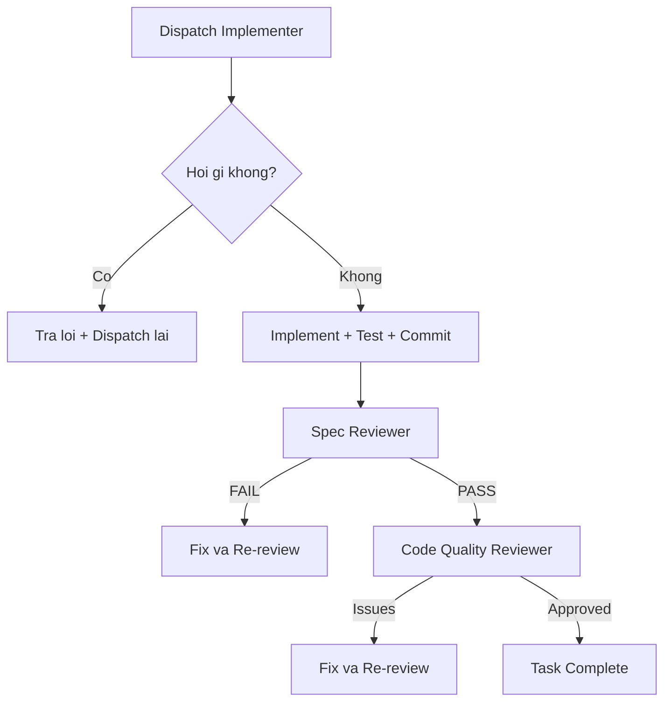
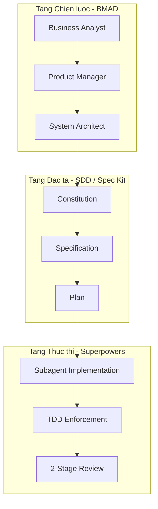
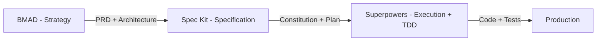

# Superpowers — Khi AI Agent Được "Lên Level" Bằng Kỷ Luật Kỹ Thuật

## Mở đầu

Bạn đã bao giờ để AI coding agent chạy tự do trong 30 phút, rồi quay lại thấy nó đã "refactor" toàn bộ kiến trúc dự án theo ý riêng, bỏ qua mọi test, và commit thẳng vào `main`? Đó chính là thực trạng **"Vibe Coding"** — AI viết code cực nhanh nhưng không có kỷ luật, không có quy trình, và không có ai kiểm soát.

**Superpowers** (181K ⭐ trên GitHub) ra đời để chấm dứt tình trạng này. Đây không phải là một AI model mới hay một IDE mới — mà là một **phương pháp luận phát triển phần mềm hoàn chỉnh** được đóng gói thành bộ "kỹ năng" (skills) bắt buộc cho AI coding agent của bạn. Khi được cài đặt, agent của bạn sẽ tự động tuân theo quy trình nghiêm ngặt: brainstorm trước khi code, viết test trước khi implement, và review trước khi merge.

**Nội dung chính:**

- Superpowers là gì và triết lý cốt lõi
- Kiến trúc 7-Phase Pipeline và các skills quan trọng
- Điểm đau mà Superpowers giải quyết và dự án phù hợp
- Hướng dẫn cài đặt và triển khai thực tế
- Kết hợp Superpowers với BMAD và SDD tạo Pipeline hoàn hảo
- Tùy biến workflow theo phong cách Âu Mỹ và Nhật Bản

---

## 1. Superpowers là gì?

**Superpowers** là một **agentic skills framework** (bộ khung kỹ năng cho AI agent) kết hợp với **software development methodology** (phương pháp luận phát triển phần mềm). Được tạo bởi **Jesse Vincent** và đội ngũ tại **Prime Radiant**, Superpowers biến AI coding agent từ "một junior developer viết code bừa bãi" thành "một kỹ sư có kỷ luật, tuân thủ quy trình từ A đến Z".

!!! info "Định nghĩa chính thức"
    *"An agentic skills framework & software development methodology that works."* — Superpowers README

### Triết lý cốt lõi

Superpowers được xây dựng trên 4 trụ cột:

| Nguyên tắc | Ý nghĩa |
| :--- | :--- |
| **Test-Driven Development** | Viết test trước, luôn luôn. Code viết trước test? Xóa đi, viết lại. |
| **Systematic over ad-hoc** | Quy trình có hệ thống thay vì đoán mò |
| **Complexity reduction** | Đơn giản là mục tiêu hàng đầu (YAGNI, DRY) |
| **Evidence over claims** | Chứng minh bằng bằng chứng, không phải lời nói |

Điều quan trọng nhất: **Skills là bắt buộc, không phải gợi ý.** Agent phải kiểm tra và tuân theo skill tương ứng trước mỗi nhiệm vụ. Nếu có skill cho việc đó, agent PHẢI sử dụng nó.

### Tại sao lại là "Skills"?

Jesse Vincent lấy cảm hứng từ cách Anthropic thiết kế "skills" cho Claude — những file Markdown dạng SKILL.md chứa hướng dẫn chi tiết mà AI đọc và tuân theo. Ông nhận ra rằng vấn đề của AI coding không phải là thiếu năng lực, mà là **thiếu quy trình nhất quán**. Giải pháp không phải làm model "thông minh hơn", mà là ép nó phải tuân theo workflow của một senior engineer.

> *"Bạn có thể đưa cho model một cuốn sách, một tài liệu, hay một codebase và nói: 'Đọc đi. Suy nghĩ về nó. Viết lại những điều mới học được.' Và nó cực kỳ mạnh mẽ."* — Jesse Vincent

---

## 2. Kiến trúc: 7-Phase Pipeline

Đây là trái tim của Superpowers. Mỗi dự án, dù đơn giản hay phức tạp, đều phải đi qua 7 giai đoạn bắt buộc:


### Phase 1: Brainstorming — Hỏi trước khi code

Đây là skill quan trọng nhất và khác biệt lớn nhất so với "vibe coding". Khi agent nhận yêu cầu, nó **KHÔNG được viết code ngay**. Thay vào đó:

1. **Khám phá context dự án** — đọc files, docs, commits gần đây
2. **Hỏi từng câu một** — ưu tiên multiple choice, mỗi message chỉ 1 câu hỏi
3. **Đề xuất 2-3 phương án** — với trade-offs và recommendation
4. **Trình bày design** — chia thành sections, xin approval từng phần
5. **Viết design doc** — lưu vào `docs/superpowers/specs/`
6. **Self-review spec** — kiểm tra placeholder, mâu thuẫn, mơ hồ

!!! warning "Hard Gate"
    *"Do NOT invoke any implementation skill, write any code, scaffold any project, or take any implementation action until you have presented a design and the user has approved it. This applies to EVERY project regardless of perceived simplicity."*

> **Ví dụ thực tế:** Khi bạn nói "Xây dựng todo app", agent Superpowers sẽ KHÔNG chạy `npx create-react-app`. Thay vào đó, nó hỏi: *"Bạn cần persist data ở đâu? LocalStorage, SQLite, hay cloud? Có cần authentication không? Multi-user hay single-user?"* — từng câu một, cho đến khi hiểu rõ 100% yêu cầu.

### Phase 2: Git Worktree — Cách ly không gian làm việc

Sau khi design được duyệt, agent tự động tạo **git worktree** trên branch mới. Điều này đảm bảo:

- Branch `main` luôn sạch
- Có thể chạy nhiều task song song mà không xung đột
- Rollback dễ dàng nếu cần

### Phase 3: Writing Plans — Chia nhỏ đến cực hạn

Agent tạo implementation plan với các task **2-5 phút mỗi task**. Mỗi task phải có:

- **Exact file paths** — không được viết "file tương ứng"
- **Complete code** — không được viết "implement logic here"
- **Verification steps** — lệnh chạy test cụ thể với expected output

!!! example "Ví dụ một task trong plan"
    ```markdown
    ### Task 3: Validate email input
    **Files:** Create: `src/validators/email.ts`, Test: `tests/validators/email.test.ts`

    - [ ] Step 1: Write failing test
    ```typescript
    test('rejects empty email', () => {
      expect(validateEmail('')).toBe(false);
    });
    ```
    - [ ] Step 2: Run test → Expected: FAIL
    - [ ] Step 3: Write minimal implementation
    - [ ] Step 4: Run test → Expected: PASS
    - [ ] Step 5: Commit
    ```

### Phase 4: Subagent-Driven Development — Mỗi task một agent mới

Đây là innovation quan trọng nhất: **mỗi task được giao cho một subagent hoàn toàn mới**, với context sạch. Tại sao?

- **Tránh context pollution** — sau nhiều task, context window bị "ô nhiễm" bởi code cũ, khiến agent mắc lỗi
- **Tối ưu chi phí** — task đơn giản dùng model rẻ, task phức tạp dùng model mạnh
- **Review 2 giai đoạn** — sau mỗi task: (1) Spec compliance review, (2) Code quality review



### Phase 5: Test-Driven Development — Luật Sắt

TDD trong Superpowers không phải "best practice" — nó là **Iron Law** (Luật Sắt):

```
NO PRODUCTION CODE WITHOUT A FAILING TEST FIRST
```

Quy trình RED-GREEN-REFACTOR:

1. **RED**: Viết test → chạy → phải FAIL
2. **GREEN**: Viết code tối thiểu → chạy → phải PASS
3. **REFACTOR**: Cải thiện code → test vẫn PASS

**Viết code trước test?** Xóa hết. Viết lại từ đầu. Không giữ làm "reference". Không "adapt" từ code cũ. **Delete means delete.**

### Phase 6 & 7: Code Review → Finish Branch

Sau tất cả tasks, agent chạy final code review toàn bộ implementation, rồi đưa ra lựa chọn: merge vào main, tạo PR, giữ branch, hoặc discard.

---

## 3. Superpowers giải quyết điểm đau nào?

### Vấn đề 1: AI viết code nhanh nhưng bừa bãi

Khi bạn prompt "build me a REST API", AI thường nhảy thẳng vào viết hàng trăm dòng code mà không hỏi: API cho ai dùng? Authentication thế nào? Error handling ra sao? → Superpowers ép agent phải brainstorm trước.

### Vấn đề 2: Context rot (thối context)

Sau 30 phút làm việc liên tục, context window của AI đầy chật thông tin cũ, dẫn đến hallucination và lỗi logic. → Superpowers dùng subagent mới cho mỗi task, đảm bảo context luôn sạch.

### Vấn đề 3: Không có test, không có review

AI thường tuyên bố "done" mà không chạy test. → Superpowers ép TDD nghiêm ngặt và 2-stage review tự động.

### Vấn đề 4: Architectural drift

Qua nhiều session, AI dần "quên" kiến trúc ban đầu và bắt đầu viết code không nhất quán. → Superpowers lưu design doc và plan, mỗi subagent đều nhận đầy đủ context từ spec.

---

## 4. Phù hợp với loại dự án nào?

| Loại dự án | Mức độ phù hợp | Lý do |
| :--- | :--- | :--- |
| **MVP / Side project** | ⭐⭐⭐⭐ | TDD và brainstorming giúp tránh technical debt ngay từ đầu |
| **SaaS product** | ⭐⭐⭐⭐⭐ | Code quality cao, regression testing tự động |
| **Enterprise backend** | ⭐⭐⭐⭐⭐ | Quy trình nghiêm ngặt, audit trail qua git commits |
| **Open source library** | ⭐⭐⭐⭐⭐ | TDD + code review đảm bảo chất lượng contribution |
| **Quick prototype** | ⭐⭐ | Overhead của brainstorming + TDD có thể quá nặng |
| **Data science / ML** | ⭐⭐⭐ | TDD khó áp dụng cho exploration, nhưng tốt cho pipeline code |

---

## 5. Cài đặt và Triển khai

Superpowers hỗ trợ hầu hết các coding agent phổ biến:

### Claude Code (phổ biến nhất)

```bash
# Cài từ Official Marketplace
/plugin install superpowers@claude-plugins-official
```

### Cursor

```text
/add-plugin superpowers
```

### Gemini CLI

```bash
gemini extensions install https://github.com/obra/superpowers
```

### OpenAI Codex CLI

```bash
/plugins
# Tìm "superpowers" → Install Plugin
```

Sau khi cài đặt, **khởi động lại agent**. Superpowers sẽ tự kích hoạt — bạn không cần làm gì thêm. Khi bắt đầu một task mới, agent tự động đọc skill tương ứng và tuân theo quy trình.

> **Ví dụ thực tế:** Sau khi cài Superpowers cho Claude Code, bạn nói: *"Thêm tính năng dark mode cho app"*. Claude sẽ KHÔNG viết CSS ngay. Nó sẽ hỏi: *"Dark mode áp dụng cho toàn bộ app hay từng component? Dùng CSS variables hay class toggle? Có cần persist preference vào localStorage không?"* — đúng quy trình brainstorming.

---

## 6. Kết hợp Superpowers với BMAD và SDD — Xây dựng Pipeline hoàn hảo

Đây là phần thú vị nhất: Superpowers, BMAD Method, và Spec-Driven Development (SDD) không cạnh tranh — chúng **bổ trợ lẫn nhau** ở các tầng khác nhau.

### Hiểu vị trí của từng framework



| Tầng | Framework | Vai trò | Output |
| :--- | :--- | :--- | :--- |
| **Chiến lược** | BMAD | Ai? Cái gì? Tại sao? | PRD, User Stories, Architecture |
| **Đặc tả** | SDD/Spec Kit | Spec chi tiết, kế hoạch | Constitution, Spec, Plan |
| **Thực thi** | Superpowers | Viết code, test, review | Production-ready code |

### Pipeline 1: BMAD → Superpowers (Phổ biến nhất)

Kịch bản: Team startup 5 người xây SaaS product.

**Giai đoạn 1 — BMAD Planning (1-2 ngày):**

1. **Business Analyst Agent** phân tích thị trường, xác định user persona
2. **Product Manager Agent** viết PRD với user stories chi tiết
3. **System Architect Agent** thiết kế system architecture, chọn tech stack

**Giai đoạn 2 — Superpowers Execution (liên tục):**

1. Chuyển PRD + Architecture từ BMAD thành **design doc** của Superpowers
2. Agent tự động brainstorm bổ sung (hỏi thêm technical details)
3. Writing Plans chia thành micro-tasks
4. Subagent-Driven Development thực thi từng task với TDD
5. 2-stage review đảm bảo code khớp spec và đạt quality

!!! example "Ví dụ: Xây dựng hệ thống Booking cho khách sạn"
    **BMAD output:**
    - PRD: Hệ thống booking real-time, hỗ trợ multi-property, tích hợp thanh toán VNPay/Stripe
    - Architecture: Microservices (Booking Service, Payment Service, Notification Service)
    - User Stories: "Là khách hàng, tôi muốn đặt phòng và nhận xác nhận qua email trong 30 giây"

    **Superpowers execution:**
    - Brainstorming: Agent hỏi thêm — "Database cho booking dùng PostgreSQL hay MongoDB? Concurrency handling thế nào khi 2 người đặt cùng phòng?"
    - Plan: 45 micro-tasks, mỗi task 2-5 phút
    - TDD: `test('prevents double booking for same room and date')` → FAIL → Implement pessimistic locking → PASS
    - Review: Spec reviewer xác nhận đúng requirement "30 giây confirmation"

### Pipeline 2: SDD (Spec Kit) → Superpowers (Documentation-heavy)

Kịch bản: Enterprise bank cần audit trail và compliance.

1. **Spec Kit** tạo Constitution (quy chuẩn bảo mật OWASP, coding standards)
2. **Spec Kit** tạo Specification chi tiết cho từng module
3. **Superpowers** nhận Plan từ Spec Kit và thực thi với TDD nghiêm ngặt

Ưu điểm: Mọi thứ được document hóa — từ requirements đến test cases — phục vụ audit.

### Pipeline 3: BMAD → Spec Kit → Superpowers (Full Stack)

Kịch bản: Dự án enterprise lớn, 50+ developers, cần cả governance lẫn execution discipline.



1. **BMAD** (Tầng chiến lược): BA phân tích, PM viết PRD, Architect thiết kế — mỗi role là một AI persona chuyên biệt
2. **Spec Kit** (Tầng đặc tả): Chuyển output BMAD thành Constitution + Specs có cấu trúc, machine-readable
3. **Superpowers** (Tầng thực thi): Subagent nhận plan, ép TDD, review 2 giai đoạn

---

## 7. Tùy biến theo phong cách khách hàng Âu Mỹ và Nhật Bản

Superpowers linh hoạt đến mức bạn có thể viết custom skills để phù hợp với văn hóa phát triển phần mềm khác nhau.

### Phong cách Âu Mỹ: "Move Fast, Ship Often"

Khách hàng Âu Mỹ thường ưu tiên **tốc độ delivery** và **iteration nhanh**. Pipeline phù hợp:

```
BMAD (Lean mode) → Superpowers (Subagent-Driven + TDD)
```

- **Brainstorming**: Ngắn gọn, tập trung vào MVP features
- **Plan**: Tasks lớn hơn (5-10 phút), ít ceremony hơn
- **Review**: Tập trung code quality, ít documentation
- **Delivery**: CI/CD tự động, deploy liên tục

Custom skill gợi ý:

```markdown
---
name: lean-delivery
description: "Streamlined delivery for fast-paced Western clients"
---
## Principles
- Ship MVP first, iterate based on user feedback
- Documentation: README + API docs only
- Sprint-based delivery (2-week cycles)
- Prefer working software over comprehensive documentation
```

### Phong cách Nhật Bản: "Build to Last" (品質第一 — Chất lượng là số một)

Khách hàng Nhật Bản thường yêu cầu **chất lượng cực cao**, **tài liệu chi tiết**, và **quy trình nghiêm ngặt**. Triết lý Kaizen (改善 — cải tiến liên tục) và Monozukuri (ものづくり — nghệ thuật chế tạo) ảnh hưởng sâu sắc đến cách họ đánh giá phần mềm.

Pipeline phù hợp:

```
BMAD (Full mode) → Spec Kit (Hierarchical) → Superpowers (Strict TDD + Extended Review)
```

- **Brainstorming**: Kỹ lưỡng, hỏi đến từng edge case
- **Specification**: Chi tiết đến cấp field-level, có bảng mapping requirement ↔ test case
- **TDD**: Nghiêm ngặt tuyệt đối, coverage > 90%
- **Review**: 3 giai đoạn (spec compliance → code quality → security audit)
- **Documentation**: Đầy đủ API spec, sequence diagrams, deployment guide

Custom skill gợi ý:

```markdown
---
name: japanese-quality-gate
description: "Extended quality gates for Japanese enterprise clients"
---
## Kaizen Integration
- After each sprint: review và cải tiến quy trình
- Defect tracking: mỗi bug phải có root cause analysis
- Documentation: mỗi API endpoint phải có sequence diagram

## Additional Review Stage
After code quality review, dispatch security-reviewer subagent:
- Check OWASP Top 10
- Verify input validation on all endpoints
- Ensure proper error handling (no stack traces leaked)

## Delivery Checklist
- [ ] Test coverage > 90%
- [ ] All edge cases documented
- [ ] API documentation bilingual (EN/JP)
- [ ] Performance benchmark report attached
```

!!! tip "So sánh nhanh"
    | Tiêu chí | Phong cách Âu Mỹ | Phong cách Nhật Bản |
    | :--- | :--- | :--- |
    | Ưu tiên | Tốc độ, iteration | Chất lượng, độ tin cậy |
    | Documentation | Tối thiểu đủ dùng | Toàn diện, chi tiết |
    | Test coverage | 70-80% | 90%+ |
    | Review rounds | 1-2 | 2-3 |
    | Delivery | Continuous, weekly | Milestone-based, monthly |

---

## 8. Ưu điểm và Hạn chế

### Ưu điểm

- **181K stars** — cộng đồng lớn nhất trong các agentic framework
- **Host-agnostic** — hoạt động trên Claude Code, Cursor, Gemini CLI, Codex, Copilot CLI
- **TDD nghiêm ngặt** — code quality cao nhất trong các framework tương tự
- **Subagent architecture** — tránh context rot, cho phép agent chạy tự động hàng giờ
- **Composable skills** — dễ mở rộng, viết skill mới chỉ cần tạo file Markdown
- **Self-improving** — có skill `writing-skills` giúp agent tự tạo skill mới

### Hạn chế

- **Overhead cho dự án nhỏ** — brainstorming + TDD cho một script 20 dòng có thể quá nặng
- **Ít tập trung nghiệp vụ** — không có persona BA/PM như BMAD
- **Đường cong học tập** — cần hiểu TDD và git worktree để tận dụng tối đa
- **Token consumption** — subagent mới cho mỗi task tốn nhiều token hơn single-session

---

## Kết luận

**Superpowers** đại diện cho một bước tiến quan trọng trong kỷ nguyên AI-assisted development: thay vì cố gắng làm AI "thông minh hơn", nó tập trung vào việc cho AI **kỷ luật hơn**. Triết lý "mandatory skills, not suggestions" đảm bảo rằng mọi dòng code đều đi qua quy trình brainstorm → plan → TDD → review.

Điều thực sự mạnh mẽ là khả năng kết hợp: dùng **BMAD** cho tầng chiến lược (phân tích nghiệp vụ, thiết kế kiến trúc), **Spec Kit/SDD** cho tầng đặc tả (specification chi tiết), và **Superpowers** cho tầng thực thi (code chất lượng cao với TDD). Pipeline này có thể tùy biến để phục vụ cả khách hàng "move fast" phong cách Âu Mỹ lẫn khách hàng "build to last" phong cách Nhật Bản.

Nếu bạn đang dùng AI coding agent mà chưa có Superpowers, hãy thử cài đặt ngay — chỉ một dòng lệnh, và agent của bạn sẽ ngay lập tức "lên level".

## Tham khảo

- [Superpowers GitHub](https://github.com/obra/superpowers) — Repository chính thức (181K stars, MIT License)
- [Superpowers: How I'm using coding agents in October 2025](https://blog.fsck.com/2025/10/09/superpowers/) — Bài viết gốc của Jesse Vincent giới thiệu Superpowers
- [BMAD Method](https://github.com/bmad-code-org/BMAD-METHOD) — Framework Agile AI-Driven Development với multi-agent personas
- [GitHub Spec Kit](https://github.com/github/spec-kit) — Toolkit Spec-Driven Development từ GitHub
- [Persuading AI - Wharton Research](https://gail.wharton.upenn.edu/research-and-insights/call-me-a-jerk-persuading-ai/) — Nghiên cứu về nguyên tắc thuyết phục Cialdini áp dụng cho LLMs, được Jesse Vincent tham khảo khi thiết kế Superpowers skills
