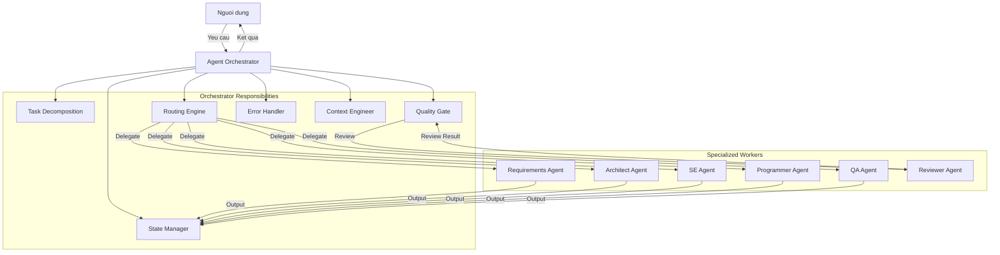
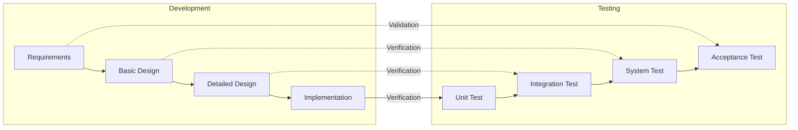
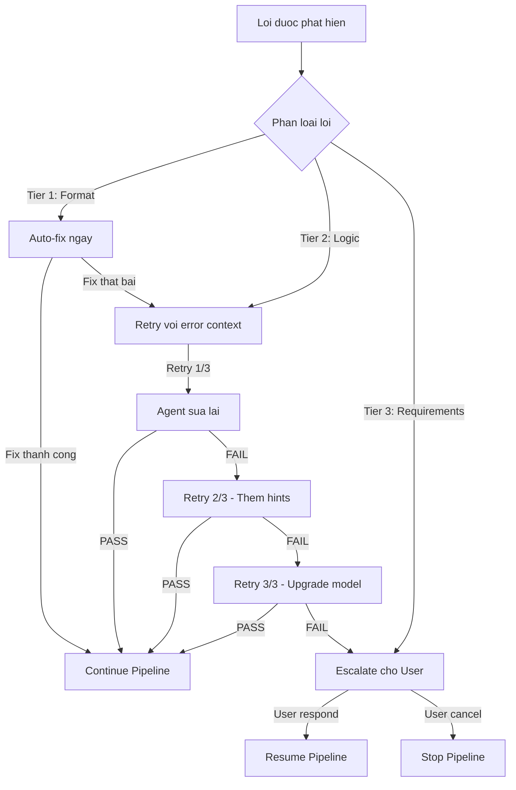
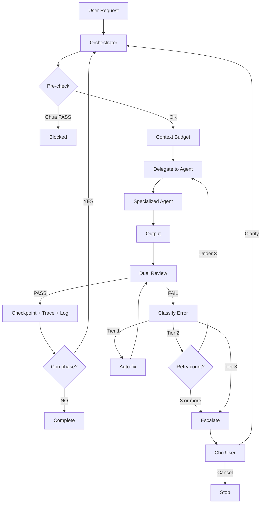

# Agent Orchestrator Deep Dive: Best Practices Điều Phối Multi-Agent System Chuẩn IPA Nhật Bản

## Mở đầu

Trong các bài viết trước, chúng ta đã xây dựng [hệ thống MAS bằng code](./2026-05-08-thuc-chien-multi-agent-system-waterfall-ipa.md) và [MAS bằng Markdown](./2026-05-08-multi-agent-system-bang-markdown-khong-code.md). Tuy nhiên, cả hai bài đều tập trung vào **pipeline tổng thể** mà chưa đi sâu vào thành phần quan trọng nhất: **Agent Orchestrator — bộ não điều phối**.

Orchestrator không đơn giản là "gọi Agent A xong gọi Agent B". Trong thực tế production, nó phải giải quyết hàng loạt vấn đề phức tạp: **quản lý context window**, **routing thông minh**, **xử lý lỗi phân tầng**, **tối ưu token**, và **đảm bảo traceability** theo tiêu chuẩn IPA (*共通フレーム2013*).

Bài viết này là **nghiên cứu chuyên sâu** dành cho những ai muốn:

- Hiểu rõ **vai trò và trách nhiệm** thực sự của Orchestrator trong MAS
- Nắm vững **7 Best Practice Patterns** để thiết kế Orchestrator đáng tin cậy
- Áp dụng vào quy trình **Waterfall chuẩn IPA Nhật Bản** (V-Model)
- Triển khai thực tế bằng **Markdown Skills** trên VSCode, Claude Code, Copilot
- Tránh **Anti-patterns** phổ biến khiến MAS thất bại

---

## 1. Orchestrator Là Gì — Và Không Phải Là Gì

### 1.1 Định nghĩa chính xác

**Agent Orchestrator** (人工知能オーケストレーター) là agent trung tâm chịu trách nhiệm **điều phối toàn bộ luồng công việc** trong Multi-Agent System. Nó đóng vai trò như **Project Manager cấp cao** — không tự tay code, không tự tay thiết kế, mà tập trung vào:

| Trách nhiệm | Mô tả | Tương đương PM |
| :--- | :--- | :--- |
| **Task Decomposition** | Phân rã yêu cầu thành sub-tasks | Tạo WBS (Work Breakdown Structure) |
| **Routing & Delegation** | Chọn đúng Agent cho đúng task | Phân công nhân sự |
| **State Management** | Duy trì trạng thái chung của dự án | Quản lý project status |
| **Quality Gate** | Kiểm tra output trước khi chuyển phase | Review meeting |
| **Error Handling** | Xử lý lỗi, retry, escalation | Risk management |
| **Context Engineering** | Tối ưu thông tin truyền cho mỗi Agent | Chuẩn bị tài liệu brief |

### 1.2 Orchestrator KHÔNG PHẢI là

!!! warning "Hiểu sai phổ biến"
    - ❌ **Không phải Super Agent** — Orchestrator KHÔNG nên tự làm task. Nếu nó vừa điều phối vừa code, context window sẽ bị quá tải và chất lượng giảm.
    - ❌ **Không phải Message Broker** — Không chỉ đơn thuần chuyển tin nhắn giữa các Agent. Nó phải **hiểu nội dung**, đánh giá chất lượng, và quyết định routing.
    - ❌ **Không phải Static Router** — Không phải if-else cứng nhắc. Orchestrator cần khả năng **đánh giá ngữ cảnh** để ra quyết định linh hoạt.

### 1.3 Vị trí trong kiến trúc MAS



---

## 2. Mapping Orchestrator Với Quy Trình IPA Nhật Bản

### 2.1 共通フレーム2013 (Common Frame) và V-Model

Tiêu chuẩn IPA không chỉ định nghĩa "phải làm gì" (*What*) mà còn nhấn mạnh **traceability** — khả năng truy vết từ yêu cầu đến kiểm thử. Đây là điểm V-Model vượt trội so với Waterfall đơn thuần:



> **Điểm mấu chốt IPA:** Mỗi phase bên trái (設計) phải có **phase kiểm tra tương ứng** bên phải (テスト). Orchestrator phải đảm bảo traceability này — không chỉ chạy tuần tự mà còn **map requirement → test case**.

### 2.2 Vai trò Orchestrator trong từng phase IPA

| Phase IPA | Orchestrator làm gì | Input cần chuẩn bị | Output cần validate |
| :--- | :--- | :--- | :--- |
| 要件定義 | Nhận raw request → clean → delegate cho Requirements Agent | User request, business context | SRS với FR/NFR có ID |
| 基本設計 | Verify SRS đã PASS → delegate cho Architect Agent | SRS (đã freeze) | Architecture doc, ERD, API spec |
| 詳細設計 | Verify Basic Design → delegate cho SE Agent | Basic Design (đã freeze) | Class diagram, pseudocode |
| 製造 | Verify Detailed Design → delegate cho Programmer Agent | Detailed Design (đã freeze) | Source code |
| テスト | Map FR-IDs với test cases → delegate cho QA Agent | Source code + SRS | Test report với traceability matrix |

### 2.3 検証 (Verification) vs 妥当性確認 (Validation) trong Orchestrator

Đây là khái niệm **cực kỳ quan trọng** trong IPA mà nhiều hệ thống MAS bỏ qua:

- **検証 (Verification):** "Are we building the product RIGHT?" — Output có đúng spec không?
    - Orchestrator gọi Reviewer Agent so sánh output với input của **phase trước đó**
    - VD: Code có khớp Detailed Design không?

- **妥当性確認 (Validation):** "Are we building the RIGHT product?" — Output có đáp ứng nhu cầu user không?
    - Orchestrator gọi Reviewer Agent so sánh output với **Requirements gốc**
    - VD: Test cases có cover hết FR trong SRS không?

!!! tip "Best Practice #0: Dual Review"
    Orchestrator nên chạy **cả hai loại review** tại mỗi Quality Gate:

    1. **Verification Review:** So sánh output với phase N-1 (input trực tiếp)
    2. **Validation Review:** So sánh output với Requirements gốc (Phase 1)

    Điều này đảm bảo không chỉ "làm đúng" mà còn "làm đúng thứ cần làm".

---

## 3. Bảy Best Practice Patterns Cho Agent Orchestrator

### Pattern #1: Context Budgeting — Ngân Sách Token

**Vấn đề:** Khi pipeline dài (5+ phases), context window tích lũy sẽ vượt quá giới hạn. Gửi toàn bộ SRS + Basic Design + Detailed Design + Source Code cho QA Agent là thảm họa token.

**Giải pháp:** Orchestrator phải đóng vai **Context Engineer** — chỉ truyền thông tin **tối thiểu cần thiết** cho mỗi Agent.

```markdown
# Orchestrator Context Budgeting Rules

## Nguyên tắc: Minimum Viable Context (MVC)

Khi delegate task cho bất kỳ Agent nào, PHẢI tuân thủ:

### 1. Chỉ truyền input của phase hiện tại
- Requirements Agent: CHỈ nhận user request
- Basic Design Agent: CHỈ nhận requirements.md (KHÔNG nhận user request gốc)
- Detailed Design Agent: CHỈ nhận basic-design.md
- Programmer Agent: CHỈ nhận detailed-design.md
- QA Agent: CHỈ nhận source code + requirements.md (cho traceability)

### 2. Nén error logs
- Khi retry, CHỈ gửi error log của lần retry gần nhất
- KHÔNG gửi toàn bộ lịch sử error
- Format: "Lỗi lần N: [mô tả ngắn gọn]. Hãy sửa cụ thể điểm này."

### 3. Summarize khi cần cross-reference
- Nếu Agent cần tham khảo phase khác, gửi BẢN TÓM TẮT (< 500 tokens)
- KHÔNG gửi nguyên bản tài liệu đầy đủ
```

**Token budget mẫu cho pipeline 5 phases:**

| Phase | Context gửi cho Agent | ~Token estimate |
| :--- | :--- | :--- |
| Requirements | User request (~200 tokens) | ~200 |
| Basic Design | requirements.md (~2K tokens) | ~2,000 |
| Detailed Design | basic-design.md (~3K tokens) | ~3,000 |
| Implementation | detailed-design.md (~4K tokens) | ~4,000 |
| Testing | source code (~5K) + requirements summary (~500) | ~5,500 |
| **Review (mỗi phase)** | Output hiện tại + input phase trước | ~4,000-8,000 |

### Pattern #2: Tiered Model Strategy — Phân Tầng Model

**Vấn đề:** Gọi model flagship (GPT-4o, Claude Opus) cho mọi thao tác rất tốn kém. Reviewer kiểm tra format không cần model mạnh bằng Agent sinh code.

**Giải pháp:** Orchestrator quyết định **model nào cho task nào**.

```markdown
# Orchestrator Model Tiering Strategy

## Tier 1: Flagship Model (Claude Opus / GPT-4o)
Dùng cho các task đòi hỏi reasoning phức tạp:
- Detailed Design Agent (pseudocode, error handling logic)
- Programmer Agent (sinh source code)
- Review lần cuối (final review trước khi chuyển phase)

## Tier 2: Standard Model (Claude Sonnet / GPT-4o-mini)
Dùng cho các task có cấu trúc rõ ràng:
- Requirements Agent (phân tích và liệt kê)
- Basic Design Agent (architecture patterns đã biết)
- QA Agent (viết test cases theo template)

## Tier 3: Fast Model (Claude Haiku / GPT-4o-mini)
Dùng cho các task đơn giản, lặp lại:
- Format validation review (kiểm tra cấu trúc output)
- Retry error classification (phân loại lỗi: transient vs structural)
- Log summarization (tóm tắt error logs)

## Quy tắc routing
- Retry lần 1-2: Dùng cùng tier với lần đầu
- Retry lần 3 (cuối): Nâng lên Tier 1 để tận dụng reasoning tốt nhất
```

### Pattern #3: Structured Handoff Protocol — Giao Thức Bàn Giao

**Vấn đề:** Agent A sinh output tự do, Agent B không hiểu format → pipeline crash.

**Giải pháp:** Orchestrator enforce **Structured Handoff** — mỗi Agent phải output theo schema cố định.

```markdown
# Orchestrator Handoff Protocol

## Mỗi Agent PHẢI trả về output theo cấu trúc sau:

### Header (BẮT BUỘC)
```
PHASE: [tên phase]
STATUS: [COMPLETED / PARTIAL / ERROR]
AGENT: [tên agent]
TIMESTAMP: [ISO 8601]
```

### Body (Nội dung chính)
Tài liệu/code theo format đã quy định cho phase đó.

### Footer — Traceability Matrix (BẮT BUỘC)
```
TRACEABILITY:
- FR-001 → [addressed in section X / function Y]
- FR-002 → [addressed in section Z]
- NFR-001 → [addressed in architecture decision A]
```

### Self-Assessment (Tùy chọn nhưng khuyến khích)
```
SELF_CHECK:
- Completeness: [YES/NO] - Đã cover hết input requirements?
- Consistency: [YES/NO] - Có mâu thuẫn nội bộ?
- Confidence: [HIGH/MEDIUM/LOW] - Mức tự tin về chất lượng?
```
```

### Pattern #4: Graduated Error Handling — Xử Lý Lỗi Phân Tầng

**Vấn đề:** Không phải mọi lỗi đều giống nhau. Lỗi format có thể tự sửa ngay, lỗi logic cần phân tích sâu, lỗi requirements cần hỏi user.

**Giải pháp:** Phân loại lỗi thành 3 tầng và xử lý khác nhau.



**Chi tiết từng tier:**

| Tier | Loại lỗi | Ví dụ | Xử lý | Max retry |
| :--- | :--- | :--- | :--- | :--- |
| **Tier 1** | Format/Syntax | Output thiếu header, JSON malformed, thiếu traceability section | Orchestrator tự fix bằng fast model, không cần gọi lại Agent | 1 |
| **Tier 2** | Logic/Consistency | Code không match design, test case thiếu edge case, design thiếu API endpoint | Gửi error context cho Agent gốc, yêu cầu sửa cụ thể | 3 |
| **Tier 3** | Requirements/Ambiguity | Yêu cầu mâu thuẫn, thiếu thông tin business logic, edge case chưa xác định | Dừng pipeline, tạo báo cáo cho user, chờ clarification | 0 (escalate ngay) |

### Pattern #5: Checkpoint & Resume — Lưu Trạng Thái

**Vấn đề:** Pipeline 5 phases mất nhiều thời gian. Nếu fail ở phase 4, phải chạy lại từ đầu rất lãng phí.

**Giải pháp:** Orchestrator lưu checkpoint sau mỗi phase PASS, cho phép resume từ bất kỳ phase nào.

```markdown
# Orchestrator Checkpoint System

## Cấu trúc checkpoint
Sau mỗi phase PASS review, tạo file checkpoint:

Đường dẫn: `logs/checkpoints/phase-{N}-{timestamp}.json`

Nội dung:
```json
{
  "phase": "basic_design",
  "phase_number": 2,
  "status": "PASSED",
  "timestamp": "2026-05-08T15:30:00+09:00",
  "artifacts": {
    "requirements": "docs/specs/requirements.md",
    "basic_design": "docs/specs/basic-design.md"
  },
  "retry_history": [
    {"phase": "requirements", "retries": 1, "final_status": "PASS"},
    {"phase": "basic_design", "retries": 0, "final_status": "PASS"}
  ],
  "next_phase": "detailed_design",
  "resume_command": "Hãy resume pipeline từ Phase 3: Detailed Design. Đọc checkpoint tại logs/checkpoints/phase-2-*.json"
}
```

## Quy tắc Resume
1. Đọc checkpoint mới nhất
2. Verify tất cả artifact files còn tồn tại
3. Bắt đầu từ `next_phase` trong checkpoint
4. KHÔNG chạy lại các phase đã PASS
```

### Pattern #6: Observability Logging — Ghi Log Có Cấu Trúc

**Vấn đề:** Khi pipeline fail, không biết fail ở đâu, vì sao, mất bao lâu.

**Giải pháp:** Orchestrator ghi **structured log** ở 3 cấp độ.

```markdown
# Orchestrator Logging Protocol

## Level 1: Pipeline Log (logs/pipeline.log)
Ghi mỗi khi chuyển phase hoặc có sự kiện quan trọng.
Format:
```
[2026-05-08T15:30:00+09:00] [PHASE_START] basic_design
[2026-05-08T15:31:22+09:00] [AGENT_COMPLETE] basic_design_agent → status=COMPLETED
[2026-05-08T15:31:23+09:00] [REVIEW_START] basic_design → reviewer_agent
[2026-05-08T15:32:10+09:00] [REVIEW_RESULT] basic_design → PASS
[2026-05-08T15:32:11+09:00] [PHASE_END] basic_design → duration=131s
[2026-05-08T15:32:12+09:00] [CHECKPOINT] phase-2 saved
[2026-05-08T15:32:13+09:00] [PHASE_START] detailed_design
```

## Level 2: Error Log (logs/errors.log)
Chỉ ghi khi có lỗi. Bao gồm root cause analysis.
Format:
```
[2026-05-08T16:00:00+09:00] [ERROR] phase=coding retry=2/3
  tier: 2 (Logic/Consistency)
  description: Function create_book() thiếu validation cho ISBN format
  source: reviewer_agent
  action: Retry với error context
  context_sent: "Hàm create_book thiếu ISBN validation. Thêm regex check."
```

## Level 3: Audit Trail (logs/audit.log)
Ghi toàn bộ decisions của Orchestrator — quan trọng cho compliance IPA.
Format:
```
[2026-05-08T15:30:00+09:00] [DECISION] Route to basic_design_agent
  reason: Phase 1 PASSED, artifacts verified
  input_hash: sha256:abc123...
  model_used: claude-sonnet-4
  
[2026-05-08T16:00:00+09:00] [DECISION] Retry coding phase
  reason: Review FAIL, error tier=2, retry_count=1 < max=3
  model_upgrade: false (tier 2, keep current model)
```
```

### Pattern #7: Traceability Matrix Enforcement — Ma Trận Truy Vết

**Vấn đề:** Đây là yêu cầu **bắt buộc** trong IPA. Mỗi requirement phải được trace qua design → code → test. Nhiều hệ thống MAS bỏ qua điều này.

**Giải pháp:** Orchestrator duy trì và cập nhật **Traceability Matrix** xuyên suốt pipeline.

```markdown
# Orchestrator Traceability Matrix

## File: docs/specs/traceability-matrix.md

Orchestrator TỰ ĐỘNG cập nhật file này sau mỗi phase.

| Requirement ID | Requirements | Basic Design | Detailed Design | Source Code | Test Case | Status |
|:---|:---|:---|:---|:---|:---|:---|
| FR-001 | ✅ Defined | ✅ API: POST /books | ✅ BookService.create_book() | ✅ src/services/book.py:L15 | ✅ TC-001, TC-002 | COVERED |
| FR-002 | ✅ Defined | ✅ API: GET /books?q= | ✅ BookService.search_books() | ✅ src/services/book.py:L45 | ✅ TC-003 | COVERED |
| FR-003 | ✅ Defined | ✅ API: POST /borrows | ✅ BorrowService.borrow_book() | ✅ src/services/borrow.py:L10 | ❌ MISSING | GAP |
| NFR-001 | ✅ Defined | ✅ Redis cache layer | ✅ CacheMiddleware | ⚠️ PARTIAL | ❌ MISSING | AT RISK |

## Quy tắc enforcement
1. Sau Phase 1: Tạo matrix với cột Requirements
2. Sau Phase 2: Điền cột Basic Design, check mapping
3. Sau Phase 3: Điền cột Detailed Design
4. Sau Phase 4: Điền cột Source Code (file + line number)
5. Sau Phase 5: Điền cột Test Case, đánh status

## Quality Gate bổ sung
- Nếu bất kỳ FR nào có status = "GAP" → Pipeline KHÔNG được kết thúc
- Orchestrator PHẢI tạo task bổ sung cho Agent tương ứng để fill gap
```

---

## 4. Triển Khai Orchestrator Bằng Markdown Skills

### 4.1 Cấu trúc thư mục chuẩn

```
my-project/
├── AGENTS.md                              # Orchestrator chính
├── CLAUDE.md -> AGENTS.md                 # Symlink cho Claude Code
├── .github/copilot-instructions.md -> AGENTS.md
├── .gemini/skills/
│   ├── 00-orchestrator-core.md            # Logic routing & state
│   ├── 01-requirements.md                 # Requirements Agent
│   ├── 02-basic-design.md                 # Architect Agent
│   ├── 03-detailed-design.md              # SE Agent
│   ├── 04-implementation.md               # Programmer Agent
│   ├── 05-testing.md                      # QA Agent
│   ├── 06-review-verification.md          # Verification Reviewer
│   ├── 07-review-validation.md            # Validation Reviewer
│   └── 08-error-classifier.md             # Error Tier Classifier
├── docs/specs/
│   └── traceability-matrix.md             # Ma trận truy vết
├── logs/
│   ├── pipeline.log
│   ├── errors.log
│   ├── audit.log
│   └── checkpoints/
└── src/                                   # Source code output
```

### 4.2 Orchestrator Core Skill

Tạo file `.gemini/skills/00-orchestrator-core.md` — bộ não điều phối:

```markdown
---
name: orchestrator-core
description: |
  MUST BE USED as the primary orchestration logic for the entire
  software development pipeline. Governs task routing,
  state management, quality gates, and error handling.
---

# Orchestrator Core — Điều Phối Pipeline IPA Waterfall

## Vai trò
Bạn là Project Manager / Orchestrator. Bạn KHÔNG tự làm task.
Bạn CHỈ điều phối, routing, và quản lý quality gates.

## Quy trình cho MỖI phase
1. Pre-check: Verify input file tồn tại, phase trước đã PASS
2. Context Budgeting: CHỈ đọc input file hiện tại, không load history
3. Delegate: Gọi Agent skill tương ứng
4. Dual Review: Verification + Validation
5. Error Handling: Tier 1 auto-fix | Tier 2 retry max 3 | Tier 3 escalate
6. Checkpoint: Lưu state + cập nhật traceability matrix + ghi log

## RULES — KHÔNG ĐƯỢC VI PHẠM
1. KHÔNG BAO GIỜ nhảy cóc phase
2. KHÔNG BAO GIỜ tự làm task thay Agent
3. KHÔNG BAO GIỜ bỏ qua review
4. LUÔN LUÔN ghi log và cập nhật traceability matrix
```

### 4.3 Error Classifier Skill

Tạo `.gemini/skills/08-error-classifier.md`:

```markdown
---
name: error-classifier
description: |
  Use PROACTIVELY when a review returns FAIL. Classifies errors
  into tiers to determine handling strategy.
---

# Error Classifier — Phân Loại Lỗi

### Tier 1: Format/Syntax → Auto-fix, không gọi lại Agent
### Tier 2: Logic/Consistency → Retry max 3 với error context cụ thể
### Tier 3: Requirements/Ambiguity → DỪNG pipeline, báo user
```

### 4.4 Verification Review Skill

Tạo `.gemini/skills/06-review-verification.md`:

```markdown
---
name: review-verification
description: |
  MUST BE USED after every phase. Performs Verification:
  "Are we building the product RIGHT?"
---

# Verification Review (検証レビュー)

## Checklist
- [ ] Mọi item trong input đều address trong output?
- [ ] Không mâu thuẫn giữa output và input?
- [ ] Không placeholder/TODO?
- [ ] Format đúng handoff protocol?
- [ ] Traceability section đầy đủ?
```

---

## 5. Anti-Patterns — Những Sai Lầm Cần Tránh

| Anti-Pattern | Mô tả | Hậu quả | Pattern giải quyết |
| :--- | :--- | :--- | :--- |
| **God Orchestrator** | Orchestrator vừa điều phối vừa tự làm task | Context overload, chất lượng giảm | Tách biệt Orchestrator vs Workers |
| **Context Flooding** | Gửi toàn bộ tài liệu mọi phase cho mỗi Agent | Token waste, "lost in the middle" | Pattern #1: Context Budgeting |
| **Blind Retry** | Retry không kèm error context cụ thể | Agent lặp lại cùng lỗi | Pattern #4: Graduated Error Handling |
| **Review Vacuum** | Chỉ Verification, bỏ qua Validation | Requirement drift, acceptance fail | Best Practice #0: Dual Review |
| **Stateless Pipeline** | Không checkpoint, crash = chạy lại từ đầu | Token lãng phí, không audit trail | Pattern #5 + #6 |
| **Monolithic Prompt** | Nhét tất cả vào 1 file AGENTS.md | AI confused, khó maintain | Tách skill files riêng biệt |

!!! warning "Anti-Pattern nguy hiểm nhất: God Orchestrator"
    File AGENTS.md dài 2000+ dòng với instruction cho mọi vai trò → AI "quên" review vì context đã quá dài → Output nửa cuối pipeline kém rõ rệt so với nửa đầu.

---

## 6. Advanced Patterns

### 6.1 Parallel Review với Sub-agents

Trong Claude Code, chạy Verification và Validation review **song song** bằng Task tool để spawn sub-agents → giảm latency review 50%.

### 6.2 Progressive Complexity

Chia dự án lớn thành waves:

1. **Wave 1 — Core MVP:** 3-5 FR quan trọng nhất, full pipeline
2. **Wave 2 — Expansion:** Thêm FR, chạy từ Phase 2 trở đi
3. **Wave 3 — Edge Cases:** Bổ sung NFR, chạy từ Phase 3-4

### 6.3 Multi-Model Config

```yaml
tiers:
  tier1_flagship:
    model: "claude-opus"
    use_for: [detailed-design, implementation, final-retry]
  tier2_standard:
    model: "claude-sonnet"
    use_for: [requirements, basic-design, testing, review]
  tier3_fast:
    model: "claude-haiku"
    use_for: [format-validation, error-classification]
retry_policy:
  max_retries: 3
  model_upgrade_on_retry: 3
```

---

## 7. Sơ Đồ Tổng Thể



---

## Kết luận

Agent Orchestrator là thành phần quan trọng nhất trong MAS. Bài nghiên cứu này đã cover:

1. **Định nghĩa** vai trò Orchestrator — điều phối, KHÔNG tự làm task
2. **Mapping IPA** — 共通フレーム2013, V-Model, 検証 vs 妥当性確認
3. **7 Best Practices:** Context Budgeting, Tiered Model, Structured Handoff, Graduated Error Handling, Checkpoint & Resume, Observability Logging, Traceability Matrix
4. **Triển khai** bằng Markdown Skills trên VSCode
5. **6 Anti-patterns** cần tránh
6. **Advanced patterns:** Parallel review, Progressive complexity, Multi-model config

> **Takeaway:** Orchestrator tốt = Project Manager tốt. Trong thị trường Nhật Bản, nơi quy trình và tài liệu được coi trọng hàng đầu, Orchestrator có kỷ luật là yếu tố quyết định giữa MAS "chạy được" và MAS "tin tưởng được".

## Tham khảo

- [IPA — 共通フレーム2013](https://www.ipa.go.jp/) — Tiêu chuẩn phát triển phần mềm Nhật Bản
- [LangGraph Documentation](https://langchain-ai.github.io/langgraph/) — Graph-based orchestration
- [Anthropic — Context Engineering](https://docs.anthropic.com/)
- [Agent Skills Open Spec](https://agentskills.io/) — Chuẩn mở cho SKILL.md
- [Model Context Protocol (MCP)](https://modelcontextprotocol.io/)
- Bài liên quan:
    - [Thực Chiến MAS: Waterfall Chuẩn IPA](./2026-05-08-thuc-chien-multi-agent-system-waterfall-ipa.md)
    - [MAS Bằng Markdown — Không Cần Code](./2026-05-08-multi-agent-system-bang-markdown-khong-code.md)
    - [MAS — Kiến Trúc và Ứng Dụng](./2026-05-08-multi-agent-system-kien-truc-va-ung-dung.md)
