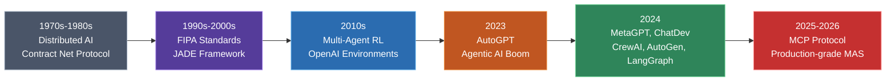
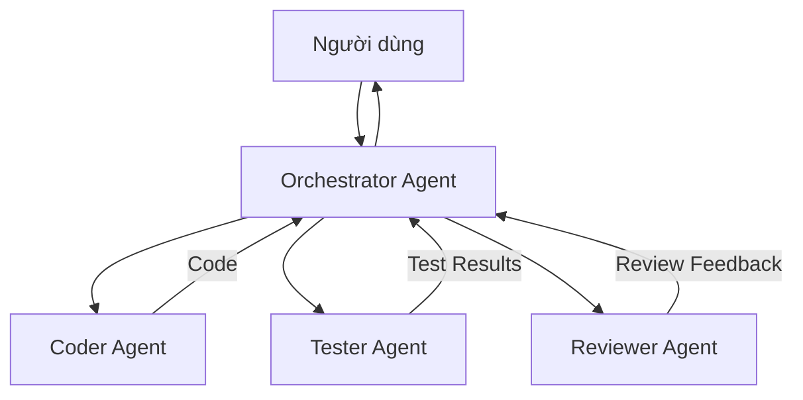
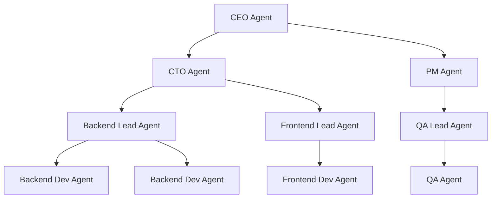
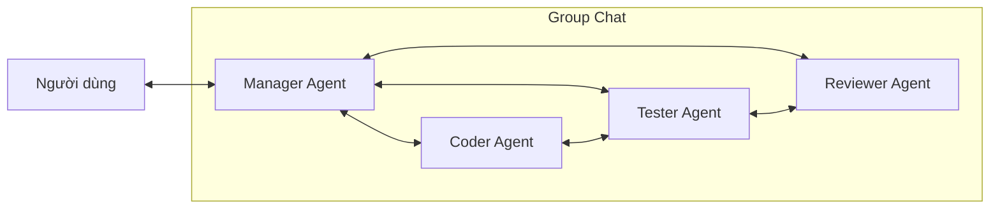
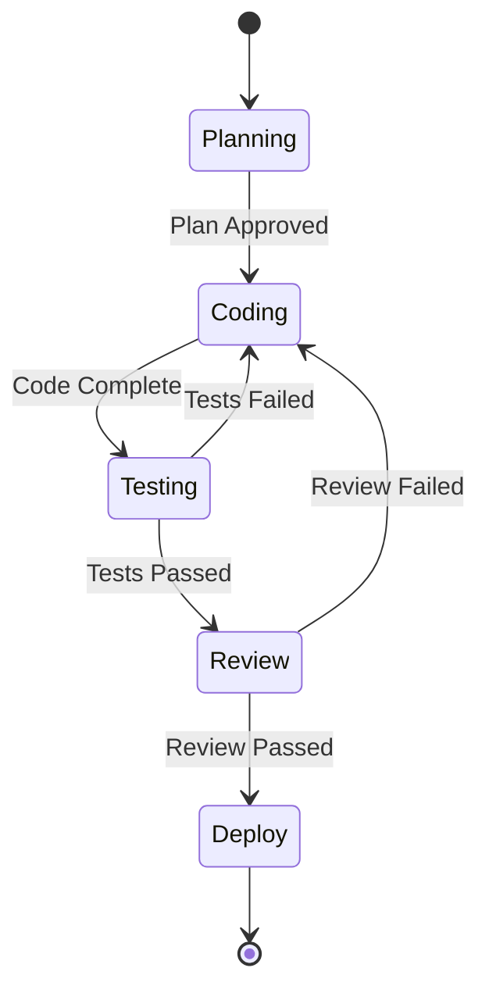
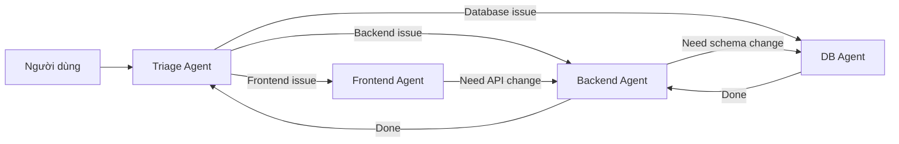
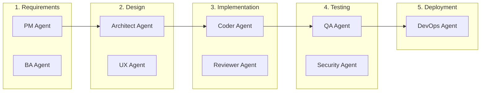

# Multi-Agent System — Khi AI Không Còn "Đơn Thương Độc Mã"

## Mở đầu

Bạn có bao giờ giao cho một AI coding agent xây dựng toàn bộ ứng dụng, rồi nhận ra nó vừa viết code, vừa tự review, vừa tự test — và tất cả đều do **một "bộ não" duy nhất** xử lý? Kết quả thường là: code chạy được nhưng thiếu nhất quán, test case bỏ sót edge case, và kiến trúc trôi dạt theo từng prompt.

Đó chính là giới hạn của **Single-Agent System** — một agent duy nhất cố gắng đóng mọi vai trò. Giải pháp? **Multi-Agent System (MAS)** — hệ thống nhiều agent chuyên biệt phối hợp với nhau, mỗi agent một vai trò, giống như một đội ngũ phát triển phần mềm thực thụ.

**Nội dung chính:**

- Multi-Agent System là gì và tại sao cần thiết
- Lịch sử hình thành và phát triển của MAS
- TOP 5 mô hình kiến trúc MAS phổ biến nhất trong phát triển phần mềm
- So sánh ưu nhược điểm từng mô hình với ví dụ thực tế
- Hướng dẫn chọn kiến trúc phù hợp cho dự án của bạn

---

## 1. Multi-Agent System (MAS) là gì?

**Multi-Agent System** là một hệ thống gồm **nhiều agent tự trị (autonomous agents)** hoạt động trong cùng một môi trường, mỗi agent có khả năng nhận thức, ra quyết định và hành động độc lập, đồng thời phối hợp với nhau để giải quyết các bài toán phức tạp mà một agent đơn lẻ không thể (hoặc không nên) xử lý một mình.

!!! info "Định nghĩa cốt lõi"
    Một MAS bao gồm: **(1)** Nhiều agent với vai trò chuyên biệt, **(2)** Cơ chế giao tiếp giữa các agent, **(3)** Môi trường chia sẻ (shared environment), và **(4)** Mục tiêu chung hoặc phối hợp.

### Tại sao cần MAS thay vì Single Agent?

| Vấn đề của Single Agent | MAS giải quyết như thế nào |
| :--- | :--- |
| **Context window bị "ô nhiễm"** sau nhiều task | Mỗi agent có context riêng, sạch sẽ |
| **Jack of all trades** — làm gì cũng được nhưng không giỏi gì | Agent chuyên biệt theo vai trò (coder, tester, reviewer) |
| **Không có kiểm tra chéo** — tự viết tự review | Agent A viết code, Agent B review — phát hiện lỗi tốt hơn |
| **Single point of failure** | Một agent lỗi không làm sập toàn hệ thống |

> **Ví dụ thực tế:** Hãy tưởng tượng bạn yêu cầu AI xây dựng hệ thống e-commerce. Với single agent, nó vừa phân tích requirement, vừa thiết kế database, vừa code backend, vừa viết test — tất cả trong một context window. Sau 30 phút, context bị đầy, agent bắt đầu "quên" requirement ban đầu và hallucinate. Với MAS, bạn có **PM Agent** phân tích yêu cầu, **Architect Agent** thiết kế hệ thống, **Coder Agent** viết code, và **QA Agent** kiểm thử — mỗi agent tập trung 100% vào nhiệm vụ của mình.

---

## 2. Lịch sử hình thành và phát triển

MAS không phải là khái niệm mới — nó có lịch sử hơn **50 năm** nghiên cứu và phát triển:

### Các giai đoạn chính

**Thập niên 1970–1980: Khởi nguồn từ Distributed AI (DAI)**

Khái niệm MAS bắt nguồn từ nghiên cứu **Distributed Artificial Intelligence** tại các đại học MIT, Stanford, và Carnegie Mellon. Năm 1980, Reid G. Smith công bố **Contract Net Protocol** — một trong những giao thức phối hợp agent đầu tiên, nơi các agent "đấu thầu" (bidding) để nhận nhiệm vụ phù hợp nhất với khả năng của mình.

**Thập niên 1990–2010: Chuẩn hóa và Trưởng thành**

Tổ chức **FIPA (Foundation for Intelligent Physical Agents)** ra đời năm 1996, thiết lập các chuẩn giao tiếp cho agent (Agent Communication Language — ACL). Framework **JADE (Java Agent DEvelopment)** trở thành công cụ phổ biến nhất. Tuy nhiên, MAS thời kỳ này chủ yếu hoạt động trong môi trường academic.

**Năm 2023: Bước ngoặt Agentic AI**

Sự xuất hiện của **AutoGPT** (30K+ stars trên GitHub chỉ trong tuần đầu) đánh dấu bước ngoặt: lần đầu tiên, LLM được sử dụng như agent tự trị có khả năng phân rã mục tiêu, sử dụng công cụ, và tự lặp lại quy trình. Dù AutoGPT còn thô sơ, nó chứng minh rằng LLM có thể vận hành như "nhân viên ảo".

**Năm 2024–2026: Kỷ nguyên MAS hiện đại**

Các framework chuyên biệt bùng nổ: **MetaGPT** mô phỏng công ty phần mềm, **ChatDev** mô phỏng quy trình waterfall, **CrewAI** đơn giản hóa việc tạo đội agent, **AutoGen** (Microsoft) mang đến kiến trúc hội thoại, và **LangGraph** cung cấp orchestration dạng đồ thị. **Model Context Protocol (MCP)** bắt đầu chuẩn hóa cách agent kết nối với dữ liệu và công cụ.

---

## 3. TOP 5 Mô hình Kiến trúc MAS cho Phát triển Phần mềm

### Mô hình 1: Orchestrator-Worker (Điều phối viên — Công nhân)

**Cách hoạt động:** Một agent trung tâm (Orchestrator) nhận yêu cầu, phân rã thành các subtask, giao cho worker agents chuyên biệt, thu thập kết quả và tổng hợp output cuối cùng.

!!! example "Ví dụ thực tế: Xây dựng REST API"
    1. **Orchestrator** nhận yêu cầu: "Xây API quản lý sản phẩm cho e-commerce"
    2. Phân rã: Task 1 (thiết kế schema) → Task 2 (viết endpoints) → Task 3 (viết tests) → Task 4 (review)
    3. **Coder Agent** nhận Task 1–2, viết code
    4. **Tester Agent** nhận Task 3, viết và chạy test
    5. **Reviewer Agent** nhận Task 4, review code quality
    6. **Orchestrator** tổng hợp và trả kết quả

**Framework đại diện:** LangGraph, CrewAI (Sequential mode)

| Ưu điểm | Nhược điểm |
| :--- | :--- |
| ✅ Dễ hiểu, dễ debug | ❌ Orchestrator là single point of failure |
| ✅ Kiểm soát flow rõ ràng | ❌ Bottleneck khi có nhiều worker |
| ✅ Phù hợp phần lớn dự án | ❌ Orchestrator cần context window lớn |

---

### Mô hình 2: Hierarchical (Phân cấp)

**Cách hoạt động:** Agent được tổ chức thành cây phân cấp nhiều tầng, giống cơ cấu tổ chức công ty. Agent cấp trên ra quyết định chiến lược, agent cấp giữa quản lý nhóm, agent cấp dưới thực thi.

!!! example "Ví dụ thực tế: MetaGPT — Công ty phần mềm ảo"
    MetaGPT mô phỏng một công ty phần mềm hoàn chỉnh:

    1. **Product Manager Agent** nhận yêu cầu "Xây ứng dụng đặt lịch hẹn cho phòng khám", tạo PRD (Product Requirement Document)
    2. **Architect Agent** đọc PRD, thiết kế system architecture, output ra class diagram và sequence diagram
    3. **Project Manager Agent** chia nhỏ thành tasks và phân bổ cho team
    4. **Engineer Agent** nhận design docs và viết code theo đúng specification
    5. **QA Engineer Agent** viết test cases và kiểm tra chất lượng

    Công thức cốt lõi: `Code = SOP(Team)` — Agent team tuân theo Standard Operating Procedures giống nhân viên thật.

**Framework đại diện:** MetaGPT, ChatDev

| Ưu điểm | Nhược điểm |
| :--- | :--- |
| ✅ Phân chia trách nhiệm rõ ràng | ❌ Rigid — khó thay đổi cấu trúc |
| ✅ Scale tốt cho dự án lớn | ❌ Giao tiếp giữa các nhánh chậm |
| ✅ Phù hợp enterprise | ❌ Agent cấp cao vẫn có thể bottleneck |

---

### Mô hình 3: Conversation-based (Dựa trên Hội thoại)

**Cách hoạt động:** Các agent giao tiếp với nhau qua tin nhắn trong một "phòng chat chung" (group chat). Một Manager Agent điều phối lượt nói (turn-taking), nhưng các agent có thể phản hồi và tranh luận trực tiếp với nhau.

!!! example "Ví dụ thực tế: AutoGen — Debug vòng lặp tự động"
    Kịch bản: Fix bug "API trả về 500 khi user upload file > 10MB"

    1. **Manager Agent**: "Coder, hãy phân tích bug này"
    2. **Coder Agent**: "Tìm thấy lỗi ở `upload_handler.py` — thiếu validation kích thước file. Đây là patch..."
    3. **Tester Agent**: "Tôi đã chạy patch. Test `test_large_file_upload` vẫn FAIL — lỗi memory overflow"
    4. **Coder Agent**: "Cảm ơn feedback. Tôi đổi sang streaming upload thay vì load toàn bộ vào memory..."
    5. **Tester Agent**: "Chạy lại — tất cả test PASS ✅"
    6. **Reviewer Agent**: "Code quality OK. Đề xuất thêm rate limiting cho upload endpoint"
    7. **Manager Agent**: "Approved. Tổng hợp: fix gồm streaming upload + rate limiting"

    Điểm mạnh: Agent **tự iterate** — Coder viết code → Tester phát hiện lỗi → Coder fix → Tester confirm — không cần human can thiệp.

**Framework đại diện:** Microsoft AutoGen (AG2)

| Ưu điểm | Nhược điểm |
| :--- | :--- |
| ✅ Linh hoạt, tự iterate | ❌ Khó dự đoán số vòng hội thoại |
| ✅ Agent tự phát hiện và sửa lỗi | ❌ Token consumption cao |
| ✅ Phù hợp cho debug, refactor | ❌ Có thể "chat vòng vòng" không đi đến kết quả |

---

### Mô hình 4: Graph-based / State Machine (Đồ thị trạng thái)

**Cách hoạt động:** Workflow được mô hình hóa như một **directed graph** (đồ thị có hướng), trong đó mỗi node là một agent hoặc bước xử lý, mỗi edge là điều kiện chuyển trạng thái. State (trạng thái) được truyền và cập nhật giữa các node.

!!! example "Ví dụ thực tế: LangGraph — CI/CD Pipeline thông minh"
    Kịch bản: Pipeline tự động từ requirement đến deployment

    1. **Node: Planner** — Nhận requirement, tạo implementation plan → State: `{plan: [...tasks]}`
    2. **Node: Coder** — Đọc plan từ state, viết code → State cập nhật `{code: "...", tests: "..."}`
    3. **Node: Tester** — Chạy tests từ state
        - Nếu FAIL → **Edge quay lại Coder** (kèm error log trong state)
        - Nếu PASS → chuyển tiếp
    4. **Node: Reviewer** — Review code quality
        - Nếu có issues → **Edge quay lại Coder**
        - Nếu approved → chuyển tiếp
    5. **Node: Deployer** — Deploy lên staging

    Điểm mạnh: **Deterministic** — bạn biết chính xác flow sẽ đi theo đường nào, và có thể "time-travel debug" bằng cách quay lại bất kỳ checkpoint nào.

**Framework đại diện:** LangGraph

| Ưu điểm | Nhược điểm |
| :--- | :--- |
| ✅ Deterministic, dễ debug | ❌ Learning curve cao |
| ✅ State persistence và checkpointing | ❌ Setup phức tạp cho task đơn giản |
| ✅ Human-in-the-loop tự nhiên | ❌ Cần định nghĩa state schema trước |
| ✅ Production-ready | ❌ Khó thay đổi flow khi đang chạy |

---

### Mô hình 5: Handoff-based / Swarm (Chuyển giao)

**Cách hoạt động:** Mỗi agent là một đơn vị chuyên biệt nhỏ gọn. Khi hoàn thành phần việc của mình hoặc gặp task ngoài khả năng, agent **"chuyển giao" (handoff)** quyền điều khiển cho agent phù hợp tiếp theo. Không có orchestrator trung tâm — luồng công việc được quyết định bởi chính các agent.

!!! example "Ví dụ thực tế: OpenAI Swarm — Hỗ trợ kỹ thuật tự động"
    Kịch bản: Hệ thống support ticket tự động cho platform SaaS

    1. **Triage Agent** nhận ticket: "App bị chậm khi load dashboard"
    2. Triage phân tích → "Đây là vấn đề backend" → **Handoff** cho **Backend Agent**
    3. **Backend Agent** kiểm tra → "Query database quá chậm, cần optimize index" → **Handoff** cho **DB Agent**
    4. **DB Agent** phân tích query plan, thêm index, verify performance → **Handoff** lại cho **Backend Agent**
    5. **Backend Agent** confirm API response time giảm từ 3s xuống 200ms → **Handoff** về **Triage Agent**
    6. **Triage Agent** tổng hợp và respond cho user

    Điểm mạnh: Mỗi agent cực kỳ **đơn giản và dễ test** — giống microservices trong kiến trúc phần mềm.

**Framework đại diện:** OpenAI Swarm

| Ưu điểm | Nhược điểm |
| :--- | :--- |
| ✅ Đơn giản, dễ hiểu từng agent | ❌ Khó trace flow phức tạp |
| ✅ Không có single point of failure | ❌ Stateless — không giữ memory giữa các lượt |
| ✅ Dễ thêm agent mới | ❌ Chưa production-ready (experimental) |
| ✅ Giống microservices — quen thuộc với dev | ❌ Thiếu cơ chế retry và error handling |

---

## 4. So sánh tổng hợp 5 mô hình

| Tiêu chí | Orchestrator-Worker | Hierarchical | Conversation | Graph/State | Handoff/Swarm |
| :--- | :--- | :--- | :--- | :--- | :--- |
| **Độ phức tạp setup** | Thấp | Cao | Trung bình | Cao | Thấp |
| **Khả năng scale** | Trung bình | Cao | Thấp | Cao | Cao |
| **Tính dự đoán** | Cao | Cao | Thấp | Rất cao | Trung bình |
| **Fault tolerance** | Thấp | Trung bình | Trung bình | Cao | Cao |
| **Token efficiency** | Tốt | Trung bình | Kém | Tốt | Rất tốt |
| **Dự án phù hợp** | MVP, API | Enterprise | Debug, R&D | Production CI/CD | Support, Routing |
| **Framework tiêu biểu** | CrewAI | MetaGPT | AutoGen | LangGraph | OpenAI Swarm |

!!! tip "Quy tắc chọn kiến trúc"
    1. **Bắt đầu đơn giản** — Orchestrator-Worker đủ cho 80% use case
    2. **Cần nhiều tầng quản lý?** → Hierarchical (MetaGPT)
    3. **Cần agent tự iterate/debug?** → Conversation (AutoGen)
    4. **Cần production-grade, deterministic?** → Graph-based (LangGraph)
    5. **Cần routing linh hoạt?** → Handoff/Swarm

---

## 5. Ứng dụng MAS trong Quy trình Phát triển Phần mềm

MAS không chỉ là lý thuyết — nhiều framework đã áp dụng thành công vào từng giai đoạn SDLC:

| Giai đoạn SDLC | Agent chuyên biệt | Framework phù hợp |
| :--- | :--- | :--- |
| **Requirements** | PM Agent, BA Agent | BMAD Method, MetaGPT |
| **System Design** | Architect Agent | MetaGPT, BMAD |
| **Implementation** | Coder Agent, Reviewer Agent | CrewAI, Superpowers |
| **Testing** | QA Agent, Security Agent | AutoGen, LangGraph |
| **Deployment** | DevOps Agent | LangGraph |

> **Ví dụ Pipeline thực tế:** Dùng **BMAD Method** (PM + BA + Architect agents) cho giai đoạn planning → **Superpowers** (Subagent-Driven TDD) cho implementation → **LangGraph** cho CI/CD pipeline tự động. Mỗi framework mạnh ở một tầng, kết hợp lại tạo thành pipeline hoàn chỉnh.

---

## Kết luận

**Multi-Agent System** đã đi một chặng đường dài từ nghiên cứu DAI của thập niên 1970 đến kỷ nguyên LLM-powered agents ngày nay. Điểm mấu chốt cần nhớ:

1. **MAS không phải "silver bullet"** — không phải task nào cũng cần multi-agent. Với task đơn giản, single agent + tool calling là đủ.
2. **Chọn kiến trúc dựa trên bài toán**, không phải dựa trên framework "hot" nhất. Orchestrator-Worker đủ cho phần lớn trường hợp.
3. **Coordination overhead là chi phí thật** — nhiều agent hơn không đồng nghĩa với kết quả tốt hơn. Nghiên cứu cho thấy MAS xuất sắc ở task parallelizable nhưng có thể kém hơn single agent ở sequential reasoning nếu coordination kém.
4. **Xu hướng 2025–2026**: chuẩn hóa giao tiếp (MCP), production-grade tooling (LangGraph), và hybrid architecture (kết hợp nhiều pattern trong cùng hệ thống).

Hãy bắt đầu với Orchestrator-Worker đơn giản, đo lường hiệu quả, rồi mới nâng cấp lên kiến trúc phức tạp hơn khi thực sự cần thiết.

## Tham khảo

- [MetaGPT GitHub](https://github.com/geekan/MetaGPT) — Framework MAS mô phỏng công ty phần mềm với SOP-driven agents
- [Microsoft AutoGen](https://github.com/microsoft/autogen) — Framework multi-agent hội thoại từ Microsoft Research
- [LangGraph Documentation](https://langchain-ai.github.io/langgraph/) — Thư viện orchestration đồ thị trạng thái cho LLM agents
- [CrewAI](https://github.com/crewAIInc/crewAI) — Framework tạo đội agent role-based đơn giản
- [OpenAI Swarm](https://github.com/openai/swarm) — Framework thí nghiệm handoff-based multi-agent từ OpenAI
- [ChatDev: Communicative Agents for Software Development](https://arxiv.org/abs/2307.07924) — Paper nghiên cứu về multi-agent software development
- [Multi-Agent Architecture Patterns](https://redis.io/blog/multi-agent-architecture-patterns/) — Redis blog phân tích các mô hình kiến trúc MAS
