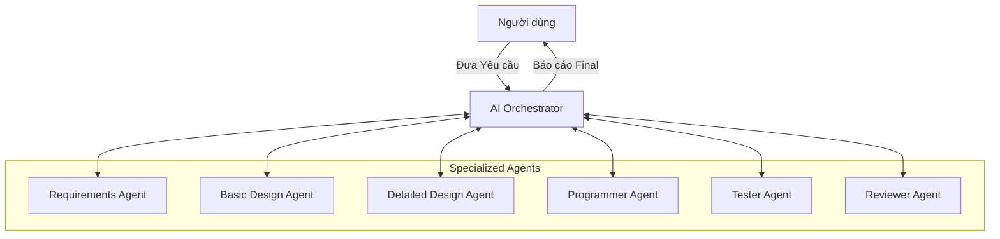
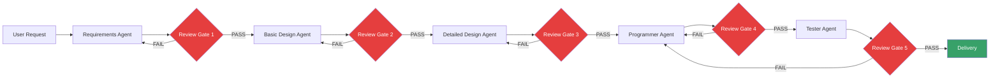
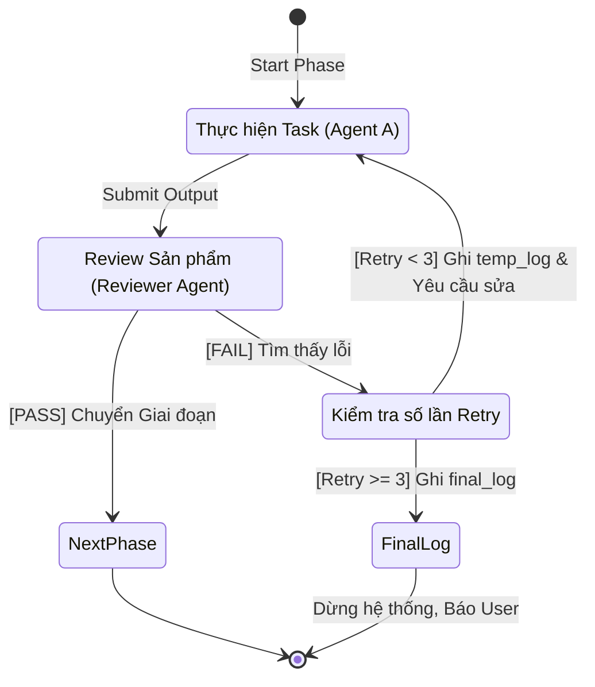

# Thực Chiến Multi-Agent System (MAS): Xây Dựng Đội Dự Án Phần Mềm Ảo Chuẩn IPA Nhật Bản

## Mở đầu

Trong bài viết trước, chúng ta đã tìm hiểu tổng quan về [Multi-Agent System (MAS)](./2026-05-08-multi-agent-system-kien-truc-va-ung-dung.md) và các mô hình kiến trúc phổ biến. Hôm nay, chúng ta sẽ đi sâu vào **thực chiến**: Thiết kế và xây dựng một hệ thống MAS hoàn chỉnh để tự động hóa quy trình phát triển phần mềm.

Đặc biệt, hệ thống này không chạy theo kiểu "Agile linh tinh" mà sẽ tuân thủ nghiêm ngặt **mô hình Waterfall theo tiêu chuẩn IPA (Information-technology Promotion Agency) của Nhật Bản** — một chuẩn mực đòi hỏi tính kỷ luật cao, tài liệu rõ ràng ở từng bước. Hơn thế nữa, chúng ta sẽ trang bị cho hệ thống một cơ chế **Self-healing (Tự phục hồi)**: khi phát hiện lỗi, AI sẽ tự động log lại, tự phân tích và tự sửa chữa lặp đi lặp lại tối đa 3 lần trước khi "báo cáo" cho con người.

**Nội dung chính:**

- Khái quát lại khái niệm cốt lõi của MAS trong bài toán này.
- Kiến trúc hệ thống: Orchestrator và các Specialized Agents.
- Quy trình Waterfall chuẩn IPA Nhật Bản được AI hóa.
- Thiết kế cơ chế Review & Tự sửa lỗi (Self-Healing Loop) 3 lần.
- Hướng dẫn từng bước thiết kế flow và logic hệ thống (áp dụng cho LangGraph/AutoGen).

---

## 1. Khái Quát Bài Toán & Kiến Trúc Hệ Thống

Thay vì dùng 1 Agent làm từ A-Z, chúng ta sẽ mô phỏng một **Software Development Team** thực thụ. 

### Các Thành Phần Chính

1. **AI Orchestrator (Điều phối viên tổng thể):** Đóng vai trò như một Project Manager (PM) cấp cao hoặc Scrum Master. Nhiệm vụ của nó không phải là code, mà là **chuyển trạng thái (state transition)**. Nó nhận yêu cầu từ User, gọi Agent phù hợp cho giai đoạn hiện tại, nhận kết quả, kiểm tra xem có cần kích hoạt vòng lặp sửa lỗi không, và chuyển sang giai đoạn tiếp theo.
2. **Specialized Agents (Đội ngũ chuyên trách):** Các Agent được prompt (huấn luyện) riêng biệt để đóng các vai trò cụ thể: PM (Yêu cầu), Architect (Thiết kế cơ bản), SE (Thiết kế chi tiết), Programmer (Code), QA (Kiểm thử).
3. **Shared Memory / State:** Trạng thái chung lưu trữ thông tin toàn bộ dự án: `user_requirement`, `basic_design`, `detailed_design`, `source_code`, `test_results`, `error_logs`, `retry_counts`.

### Sơ đồ Kiến trúc Tổng Thể



---

## 2. Quy Trình Waterfall Theo Chuẩn IPA (Nhật Bản)

Tiêu chuẩn của IPA Nhật Bản (*共通フレーム - Common Frame*) rất chú trọng đến việc định nghĩa rõ ràng **tài liệu đầu vào (Input)** và **sản phẩm đầu ra (Output/Deliverables)** ở từng giai đoạn. Trong hệ thống MAS, Orchestrator sẽ điều hướng các Agent đi qua 5 giai đoạn, **mỗi giai đoạn đều có Review Gate** bắt buộc:

### Sơ đồ Pipeline End-to-End



> **Quy tắc Vàng của IPA Waterfall:** Không bao giờ chuyển sang bước tiếp theo nếu tài liệu/sản phẩm của bước hiện tại chưa được Review và "Đóng băng" (Freeze). Mỗi **Review Gate** (hình thoi đỏ) chính là nơi Reviewer Agent hoạt động.

### Bảng Input / Output / Tiêu chí Review của từng Phase

| # | Phase (JP) | Phase (VN) | Agent | Input | Output (Deliverables) | Tiêu chí Review |
| :--- | :--- | :--- | :--- | :--- | :--- | :--- |
| 1 | 要件定義 | Định nghĩa Yêu cầu | Requirements Agent | Yêu cầu thô từ User | Tài liệu Yêu cầu (SRS) gồm: danh sách chức năng, yêu cầu phi chức năng, use cases | Yêu cầu có rõ ràng không? Có mâu thuẫn không? Có thiếu edge case không? |
| 2 | 基本設計 | Thiết kế Cơ bản | Basic Design Agent | Tài liệu SRS | Kiến trúc hệ thống, sơ đồ ERD, API endpoints, UI wireframe mức logic | Kiến trúc có cover hết requirement? Có điểm nghẽn (bottleneck) nào? |
| 3 | 詳細設計 | Thiết kế Chi tiết | Detailed Design Agent | Thiết kế Cơ bản | Class diagram, function signatures, pseudocode, cấu trúc dữ liệu chi tiết | Pseudocode có đủ chi tiết để code trực tiếp? Có hàm nào thiếu input/output? |
| 4 | 製造 | Lập trình | Programmer Agent | Thiết kế Chi tiết | Source code hoàn chỉnh | Code có khớp thiết kế? Có lỗi syntax? Có tuân thủ coding standard? |
| 5 | テスト | Kiểm thử | Tester Agent | Source code + SRS | Test cases, kết quả chạy test, báo cáo bug | Test có cover hết requirement? Có case nào FAIL? |

### Chi tiết từng Phase

#### Phase 1: 要件定義 — Định nghĩa Yêu cầu

**Requirements Agent** nhận input thô (có thể lộn xộn, mơ hồ) từ User và chuẩn hóa thành tài liệu yêu cầu có cấu trúc.

!!! example "Ví dụ: User yêu cầu xây REST API quản lý sách"
    **Input từ User:** *"Tôi muốn xây API quản lý sách cho thư viện, có thể thêm/sửa/xóa sách, tìm kiếm theo tên, và quản lý mượn/trả."*

    **Output của Requirements Agent:**

    - **FR-001:** CRUD sách (Create, Read, Update, Delete) — fields: title, author, ISBN, category, status
    - **FR-002:** Tìm kiếm sách theo tên, tác giả, ISBN (hỗ trợ partial match)
    - **FR-003:** Quản lý mượn/trả — ghi nhận ngày mượn, hạn trả, người mượn
    - **FR-004:** Cảnh báo sách quá hạn trả
    - **NFR-001:** API response time < 500ms
    - **NFR-002:** Hỗ trợ tối thiểu 100 concurrent users

#### Phase 2: 基本設計 — Thiết kế Cơ bản

**Basic Design Agent (Architect)** nhận SRS và thiết kế kiến trúc tổng thể.

!!! example "Output mẫu"
    - **Tech stack:** Python FastAPI + PostgreSQL + Redis cache
    - **API Endpoints:** `GET /books`, `POST /books`, `PUT /books/{id}`, `DELETE /books/{id}`, `POST /borrows`, `PUT /borrows/{id}/return`
    - **ERD:** Bảng `books`, `members`, `borrows` với quan hệ 1-N
    - **Architecture:** Monolith với 3 layer: Router → Service → Repository

#### Phase 3: 詳細設計 — Thiết kế Chi tiết

**Detailed Design Agent (SE)** chi tiết hóa đến mức class và hàm.

!!! example "Output mẫu"
    ```
    Class BookService:
        + create_book(title, author, isbn, category) -> Book
        + get_book(book_id) -> Book | None
        + search_books(query, field="title") -> List[Book]
        + update_book(book_id, data) -> Book
        + delete_book(book_id) -> bool

    Class BorrowService:
        + borrow_book(book_id, member_id) -> Borrow
          - Kiểm tra book.status == "available"
          - Set book.status = "borrowed"
          - Tạo record borrow với due_date = today + 14 days
        + return_book(borrow_id) -> Borrow
          - Set book.status = "available"
          - Cập nhật borrow.returned_at = now
    ```

#### Phase 4: 製造 — Lập trình

**Programmer Agent** dịch thiết kế chi tiết thành source code thực tế.

#### Phase 5: テスト — Kiểm thử

**Tester Agent** viết test cases dựa trên SRS và chạy kiểm tra source code.

!!! example "Output mẫu"
    ```
    TEST-001: test_create_book           → PASS ✅
    TEST-002: test_search_book_by_title  → PASS ✅
    TEST-003: test_borrow_available_book → PASS ✅
    TEST-004: test_borrow_already_borrowed_book → FAIL ❌
      → Expected: HTTP 400 "Book not available"
      → Actual: HTTP 500 Internal Server Error
    TEST-005: test_overdue_warning       → PASS ✅
    ```

---

## 3. Cơ Chế Review và Self-Healing 3 Lần

Đây là phần "thực chiến" giá trị nhất. Thay vì để hệ thống crash hoặc nhổ toẹt ra kết quả sai, chúng ta xây dựng logic **Tự phát hiện lỗi -> Tự sửa -> Giới hạn lặp lại (Max 3 retries)**.

### Logic của Vòng Lặp Self-Healing

1. **Thực thi:** Agent A (VD: Programmer) sinh ra `Output_A`.
2. **Review:** Orchestrator gửi `Output_A` cùng `Input_A` (VD: Detailed Design) cho **Reviewer Agent**.
3. **Phát hiện lỗi:** Reviewer Agent phát hiện lỗi (Thiếu hàm, code sai logic, tài liệu thiếu sót...).
4. **Log & Retry:**
   - Hệ thống tự động ghi lỗi vào file `temp_error.log`.
   - Biến đếm `retry_count` tăng thêm 1.
   - Orchestrator gửi lại `temp_error.log` + `Output_A` cho Agent A với chỉ thị: *"Mày đã làm sai các điểm sau, hãy tự sửa lại!"*.
5. **Giới hạn (Max 3):**
   - Nếu Agent A sửa thành công (Reviewer đánh giá PASS) -> Chuyển sang bước tiếp theo.
   - Nếu `retry_count` đạt tới 3 mà vẫn lỗi -> Orchestrator dừng quy trình, ghi lỗi vào `final_error_report.log` và báo cáo cho con người (User) để can thiệp.

### Sơ đồ Máy Trạng Thái (State Machine Graph)



---

## 4. Hướng Dẫn Từng Bước Thiết Kế Hệ Thống MAS

Dưới đây là mô hình thiết kế logic sử dụng khái niệm **Đồ thị (Graph-based orchestration)**, rất phù hợp nếu bạn sử dụng các framework như `LangGraph`.

### Bước 4.1: Định nghĩa State (Trạng thái chung)

Mọi Agent đều đọc và ghi vào chung một "bộ nhớ" gọi là State.

```python
class ProjectState(TypedDict):
    user_request: str
    current_phase: str            # 'requirements', 'basic_design', 'detailed_design', 'coding', 'testing'
    
    # Tài liệu & Code
    requirements_doc: str
    basic_design_doc: str
    detailed_design_doc: str
    source_code: str
    test_results: str
    
    # Error Handling
    current_draft: str            # Bản nháp đang làm của phase hiện tại
    retry_count: int              # Đếm số lần sửa lỗi trong phase (0 -> 3)
    temp_error_logs: list[str]    # Chứa log lỗi để nhắc AI sửa
    final_error_log: str          # Lỗi chí mạng nếu fail quá 3 lần
```

### Bước 4.2: Xây dựng các Node (Agents)

Mỗi Agent là một hàm nhận vào `State`, xử lý bằng LLM, và trả về `State` mới. Dưới đây là code cho **tất cả 5 Agent** trong pipeline:

#### Requirements Agent (PM)

```python
def requirements_agent(state: ProjectState):
    user_request = state["user_request"]
    retry_errors = state.get("temp_error_logs", [])

    prompt = f"""Bạn là Business Analyst chuẩn IPA Nhật Bản.
    Từ yêu cầu sau của khách hàng, hãy viết tài liệu Yêu cầu (SRS):
    - Liệt kê từng Functional Requirement (FR-001, FR-002...)
    - Liệt kê Non-Functional Requirements (NFR-001...)
    - Viết Use Cases cho các chức năng chính

    Yêu cầu khách hàng: {user_request}"""

    if state["retry_count"] > 0:
        prompt += f"\n\nLỖI TỪ LẦN REVIEW TRƯỚC (hãy sửa):\n{retry_errors[-1]}"

    return {"current_draft": llm.invoke(prompt), "current_phase": "requirements"}
```

#### Basic Design Agent (Architect)

```python
def basic_design_agent(state: ProjectState):
    requirements = state["requirements_doc"]
    retry_errors = state.get("temp_error_logs", [])

    prompt = f"""Bạn là System Architect.
    Dựa vào tài liệu Yêu cầu dưới đây, hãy thiết kế:
    1. Tech stack và lý do chọn
    2. Kiến trúc hệ thống (layers, modules)
    3. API endpoints (method, path, request/response)
    4. Database schema (ERD dạng text)
    
    Tài liệu Yêu cầu: {requirements}"""

    if state["retry_count"] > 0:
        prompt += f"\n\nLỖI TỪ LẦN REVIEW TRƯỚC:\n{retry_errors[-1]}"

    return {"current_draft": llm.invoke(prompt), "current_phase": "basic_design"}
```

#### Detailed Design Agent (SE)

```python
def detailed_design_agent(state: ProjectState):
    basic_design = state["basic_design_doc"]
    retry_errors = state.get("temp_error_logs", [])

    prompt = f"""Bạn là System Engineer chuẩn IPA Nhật Bản.
    Dựa vào Thiết kế cơ bản, hãy viết Thiết kế chi tiết:
    1. Class diagram (tên class, methods, attributes)
    2. Function signatures với input/output types
    3. Pseudocode cho mỗi hàm quan trọng
    4. Xử lý lỗi (error handling) cho từng hàm
    
    Thiết kế cơ bản: {basic_design}"""

    if state["retry_count"] > 0:
        prompt += f"\n\nLỖI TỪ LẦN REVIEW TRƯỚC:\n{retry_errors[-1]}"

    return {"current_draft": llm.invoke(prompt), "current_phase": "detailed_design"}
```

#### Programmer Agent

```python
def programmer_agent(state: ProjectState):
    detailed_design = state["detailed_design_doc"]
    retry_errors = state.get("temp_error_logs", [])

    prompt = f"""Bạn là Senior Programmer.
    Dựa vào tài liệu Thiết kế chi tiết, hãy viết source code hoàn chỉnh:
    - Tuân thủ 100% class/function signatures trong thiết kế
    - Implement đầy đủ error handling
    - Viết docstrings cho mỗi class và function
    - Code phải chạy được, không có placeholder

    Thiết kế chi tiết: {detailed_design}"""

    if state["retry_count"] > 0:
        prompt += f"\n\nLỖI TỪ LẦN REVIEW TRƯỚC:\n{retry_errors[-1]}"

    return {"current_draft": llm.invoke(prompt), "current_phase": "coding"}
```

#### Tester Agent (QA)

```python
def tester_agent(state: ProjectState):
    source_code = state["source_code"]
    requirements = state["requirements_doc"]
    retry_errors = state.get("temp_error_logs", [])

    prompt = f"""Bạn là QA Engineer.
    Dựa vào Source code và Tài liệu Yêu cầu, hãy:
    1. Viết test cases cho MỖI Functional Requirement (FR)
    2. Viết edge case tests (input rỗng, duplicate, giá trị biên)
    3. Chạy thử logic và báo cáo PASS/FAIL cho từng test
    4. Nếu có test FAIL, mô tả Expected vs Actual

    Source code: {source_code}
    Tài liệu Yêu cầu: {requirements}"""

    if state["retry_count"] > 0:
        prompt += f"\n\nLỖI TỪ LẦN REVIEW TRƯỚC:\n{retry_errors[-1]}"

    return {"current_draft": llm.invoke(prompt), "current_phase": "testing"}
```

### Bước 4.3: Xây dựng Reviewer & Logger Node

Reviewer là "người gác cổng" khắt khe — nhận cả **output hiện tại** lẫn **tài liệu giai đoạn trước** để kiểm tra tính nhất quán.

```python
def reviewer_agent(state: ProjectState):
    phase = state["current_phase"]
    draft = state["current_draft"]
    
    # Lấy tài liệu giai đoạn trước để so sánh
    prev_doc_map = {
        "requirements": state["user_request"],
        "basic_design": state["requirements_doc"],
        "detailed_design": state["basic_design_doc"],
        "coding": state["detailed_design_doc"],
        "testing": state["requirements_doc"],  # Test so với requirement gốc
    }
    prev_doc = prev_doc_map.get(phase, "")

    prompt = f"""Bạn là Senior Reviewer chuẩn IPA Nhật Bản. Nhiệm vụ:
    1. Kiểm tra bản nháp của giai đoạn [{phase}] dưới đây
    2. So sánh với tài liệu giai đoạn trước để đảm bảo NHẤT QUÁN
    3. Tìm: lỗi logic, thiếu sót, mâu thuẫn, placeholder chưa hoàn thành

    Tài liệu giai đoạn trước: {prev_doc}
    Bản nháp cần review: {draft}

    Trả về JSON: {{"status": "PASS" hoặc "FAIL", "errors": "danh sách lỗi nếu có"}}"""

    review = llm.invoke(prompt)

    if review.status == "PASS":
        return {
            "status": "PASS",
            f"{phase}_doc": draft,
            "retry_count": 0,
            "temp_error_logs": []
        }
    else:
        new_count = state["retry_count"] + 1
        new_log = f"[{phase}] Lần {new_count}/{3}: {review.errors}"
        
        # Ghi log ra file thực tế
        with open("temp_error.log", "a") as f:
            f.write(new_log + "\n")

        return {
            "status": "FAIL",
            "retry_count": new_count,
            "temp_error_logs": state["temp_error_logs"] + [new_log]
        }
```

### Bước 4.4: Xây dựng Orchestrator Routing Logic

Orchestrator là hàm **Routing** quyết định Graph đi tiếp, quay lại, hay dừng hẳn.

```python
# Map thứ tự Waterfall
PHASE_ORDER = ["requirements", "basic_design", "detailed_design", "coding", "testing"]

def orchestrator_router(state: ProjectState) -> str:
    status = state.get("status")
    retry_count = state.get("retry_count", 0)
    current_phase = state.get("current_phase")

    if status == "FAIL":
        if retry_count >= 3:
            # === ESCALATE: Ghi final log, dừng hệ thống ===
            with open("final_error.log", "w") as f:
                f.write(f"=== FAILED AT PHASE: {current_phase} ===\n")
                f.write(f"=== SAU 3 LẦN RETRY VẪN KHÔNG SỬA ĐƯỢC ===\n\n")
                for log in state["temp_error_logs"]:
                    f.write(log + "\n")
            return "HumanIntervention"
        else:
            # === RETRY: Quay lại Agent hiện tại ===
            return f"Retry_{current_phase}"

    elif status == "PASS":
        # === NEXT: Chuyển sang phase tiếp theo ===
        idx = PHASE_ORDER.index(current_phase)
        if idx >= len(PHASE_ORDER) - 1:
            return "ProjectComplete"
        return PHASE_ORDER[idx + 1]
```

### Bước 4.5: Ráp nối thành Graph hoàn chỉnh

Dưới đây là pseudocode ráp toàn bộ hệ thống dùng khái niệm LangGraph `StateGraph`:

```python
from langgraph.graph import StateGraph, END

# Khởi tạo Graph
graph = StateGraph(ProjectState)

# 1. Đăng ký tất cả Nodes
graph.add_node("requirements", requirements_agent)
graph.add_node("basic_design", basic_design_agent)
graph.add_node("detailed_design", detailed_design_agent)
graph.add_node("coding", programmer_agent)
graph.add_node("testing", tester_agent)
graph.add_node("reviewer", reviewer_agent)
graph.add_node("human_intervention", lambda s: {"final_error_log": "Cần can thiệp"})

# 2. Luồng chính: Mỗi Agent → Reviewer
for phase in PHASE_ORDER:
    graph.add_edge(phase, "reviewer")

# 3. Từ Reviewer → Orchestrator Router quyết định đi đâu
graph.add_conditional_edges("reviewer", orchestrator_router, {
    # Retry: quay lại Agent tương ứng
    "Retry_requirements": "requirements",
    "Retry_basic_design": "basic_design",
    "Retry_detailed_design": "detailed_design",
    "Retry_coding": "coding",
    "Retry_testing": "testing",
    # Next phase: đi tiếp
    "basic_design": "basic_design",
    "detailed_design": "detailed_design",
    "coding": "coding",
    "testing": "testing",
    # Kết thúc
    "ProjectComplete": END,
    "HumanIntervention": "human_intervention",
})

# 4. Entry point
graph.set_entry_point("requirements")
graph.add_edge("human_intervention", END)

# 5. Compile & Run
app = graph.compile()
result = app.invoke({"user_request": "Xây REST API quản lý sách cho thư viện"})
```

!!! tip "Giải thích luồng chạy"
    1. Graph bắt đầu tại `requirements` → Agent sinh SRS → chuyển đến `reviewer`
    2. Reviewer kiểm tra → nếu PASS, `orchestrator_router` trả `"basic_design"` → graph chạy `basic_design` agent
    3. Nếu FAIL, router trả `"Retry_requirements"` → graph quay lại `requirements` agent (kèm error log)
    4. Nếu fail 3 lần → router trả `"HumanIntervention"` → graph ghi `final_error.log` và dừng
    5. Quy trình lặp lại cho mỗi phase cho đến khi `testing` PASS → `ProjectComplete` → END

---

## 5. Ưu Điểm, Hạn Chế và Khi Nào Nên Dùng

### Ưu điểm

| Ưu điểm | Giải thích |
| :--- | :--- |
| **Triệt tiêu Hallucination** | Reviewer Agent đóng vai "phe đối lập" (Adversarial Agent), so sánh output với input giai đoạn trước — phát hiện lỗi mà Agent tự tạo không nhận ra |
| **Tuân thủ chuẩn IPA** | Mỗi phase bắt buộc có tài liệu Input/Output rõ ràng, tránh "Vibe Coding" |
| **Log lỗi thông minh** | `temp_error.log` lưu quá trình AI tự sửa, `final_error.log` chốt lý do thất bại — con người không phải đọc hàng nghìn dòng chat |
| **Fault tolerance** | Hệ thống tự phục hồi 3 lần trước khi escalate, giảm tải cho con người |
| **Tái sử dụng** | Thay LLM backend (GPT → Claude → Gemini) mà không cần đổi kiến trúc |

### Hạn chế

| Hạn chế | Giải pháp gợi ý |
| :--- | :--- |
| **Token consumption cao** | Mỗi phase gọi LLM ít nhất 2 lần (Agent + Reviewer), retry thì gấp đôi. Cân nhắc dùng model nhỏ cho review, model lớn cho sinh code |
| **Waterfall = Rigid** | Không phù hợp dự án cần iterate nhanh. Có thể mở rộng thêm feedback loop từ Testing quay về Requirements |
| **Reviewer có thể sai** | Reviewer cũng là LLM, có thể đánh PASS sai hoặc FAIL oan. Giải pháp: thêm Human-in-the-loop tại các phase quan trọng |
| **Latency cao** | 5 phases × (Agent + Reviewer) × retry = nhiều LLM calls. Phù hợp cho batch processing hơn real-time |

### Khi nào nên dùng kiến trúc này?

!!! tip "Checklist quyết định"
    - ✅ Dự án cần **tài liệu rõ ràng** ở mỗi giai đoạn (outsourcing, compliance)
    - ✅ Khách hàng Nhật Bản yêu cầu tuân thủ **chuẩn IPA / V-Model**
    - ✅ Team muốn **tự động hóa 80%** quy trình nhưng vẫn giữ kiểm soát
    - ❌ **Không phù hợp** cho prototype nhanh hoặc dự án < 1 tuần
    - ❌ **Không phù hợp** cho bài toán research/exploration không rõ yêu cầu

---

## Kết luận

Xây dựng Multi-Agent System không chỉ đơn thuần là "gọi nhiều API của OpenAI cùng lúc". Nó là nghệ thuật thiết kế phần mềm, đòi hỏi bạn phải áp dụng các kỹ thuật quản lý dự án thực thụ vào cấu trúc của các Agents.

Trong bài viết này, chúng ta đã thiết kế một hệ thống MAS hoàn chỉnh với:

1. **1 Orchestrator** điều phối luồng Waterfall qua 5 giai đoạn chuẩn IPA
2. **5 Specialized Agents** đóng vai trò PM, Architect, SE, Programmer, QA
3. **1 Reviewer Agent** làm "người gác cổng" giữa mỗi giai đoạn
4. **Cơ chế Self-Healing** tự sửa lỗi tối đa 3 lần trước khi escalate
5. **Hệ thống Log** phân tầng: `temp_error.log` (quá trình sửa) → `final_error.log` (báo cáo cuối)

Bằng cách định nghĩa rõ ràng **Roles** (Vai trò), **State** (Trạng thái chia sẻ), **Input/Output per Phase** (Tài liệu đầu vào/ra), và **SOP** (Quy trình chuẩn) với cơ chế tự kiểm tra, bạn đang biến những LLM đơn thuần thành một đội dự án phần mềm tự động, có kỷ luật và đáng tin cậy.

## Tham khảo

- [IPA - Cơ quan Xúc tiến Công nghệ Thông tin Nhật Bản (共通フレーム)](https://www.ipa.go.jp/) — Tiêu chuẩn phát triển phần mềm Nhật Bản
- [LangGraph Documentation](https://langchain-ai.github.io/langgraph/) — Framework graph-based orchestration cho LLM agents
- [Microsoft AutoGen](https://github.com/microsoft/autogen) — Framework multi-agent hội thoại
- Bài viết liên quan: [Multi-Agent System — Kiến trúc và Ứng dụng](./2026-05-08-multi-agent-system-kien-truc-va-ung-dung.md)

