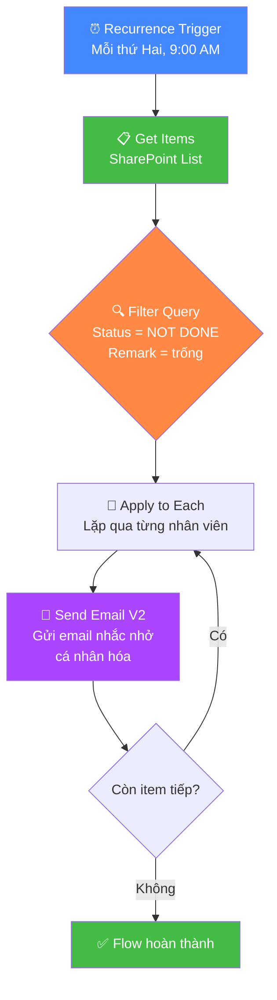

# Power Automate Thực Chiến: Gửi Email Nhắc Nhở Tự Động Từ Danh Sách SharePoint

## Mở Đầu: Khi "Gửi Mail Nhắc Nhở" Trở Thành Cơn Ác Mộng

Bạn là HR, Admin, hoặc Project Lead — mỗi tuần phải mở file Excel trên SharePoint, lọc xem ai chưa hoàn thành, soạn mail nhắc từng người. Danh sách 50 người? 100 người? **Thủ công không scale được.**

Microsoft 365 Copilot Premium đi kèm bộ công cụ mạnh mẽ — trong đó **Power Automate** cho phép bạn tạo **Scheduled Flow** (luồng tự động chạy định kỳ) để:

1. Tự động lọc nhân viên có `Status = NOT DONE` từ danh sách SharePoint
2. Gửi email nhắc nhở đến từng người với nội dung cá nhân hóa
3. Loại trừ những nhân viên ngoài đối tượng (cột `Remark`)
4. Chạy định kỳ mỗi ngày/tuần — **không cần can thiệp thủ công**

**Nội dung chính:**

- Giới thiệu các công cụ sử dụng (SharePoint List, Power Automate, Copilot trong Power Automate)
- Hướng dẫn từng bước tạo Scheduled Flow — **có hình minh hoạ luồng xử lý**
- Cách viết OData Filter Query để lọc chính xác
- Soạn email template chuyên nghiệp với dynamic content
- Best practices và xử lý lỗi thường gặp

---

## 1. Giới Thiệu Công Cụ

### 1.1 SharePoint List — "Nguồn Dữ Liệu" Của Bạn

**SharePoint List** là bảng dữ liệu trực tuyến trong hệ sinh thái Microsoft 365. Nó hoạt động tương tự Excel nhưng có ưu điểm vượt trội khi kết nối với Power Automate:

- **Có cấu trúc cột rõ ràng**: Mỗi cột có kiểu dữ liệu cố định (Text, Choice, Person...)
- **Có Internal Name**: Mỗi cột có tên nội bộ dùng cho OData Filter — đây là key để lọc dữ liệu tự động
- **Real-time sync**: Dữ liệu cập nhật tức thì, flow luôn lấy data mới nhất

Trong bài toán của chúng ta, SharePoint List có cấu trúc:

| Cột | Kiểu dữ liệu | Ví dụ |
|:---|:---|:---|
| **Email** | Single line of text | tranvantruong@gmail.com |
| **HoTen** | Single line of text | Trần Văn Trường |
| **Status** | Choice | `DONE` / `NOT DONE` |
| **PhongBan** | Single line of text hoặc Choice | Phòng Kế Toán |
| **Remark** | Single line of text | `Ngoài đối tượng` (hoặc để trống) |

!!! tip "Mẹo quan trọng: Internal Name"
    Khi bạn tạo cột trên SharePoint bằng tiếng Việt, **Internal Name** (tên nội bộ) sẽ khác tên hiển thị. Ví dụ cột "Họ Tên" có thể có Internal Name là `H_x1ecd_T_x00ea_n`. Để tránh rắc rối, **hãy đặt tên cột bằng tiếng Anh không dấu** (Email, HoTen, Status, PhongBan, Remark) ngay từ đầu.

### 1.2 Power Automate — "Bộ Não Tự Động Hoá"

**Power Automate** (trước đây là Microsoft Flow) là nền tảng automation no-code/low-code của Microsoft. Bạn tạo **Flow** — một chuỗi các bước tự động — bằng cách kéo thả và cấu hình.

Với Microsoft 365 Copilot Premium, bạn có:

- **Copilot trong Power Automate**: Mô tả yêu cầu bằng ngôn ngữ tự nhiên → Copilot tự tạo flow
- **Connectors**: Kết nối sẵn với SharePoint, Outlook, Teams, và 1.400+ ứng dụng khác
- **Scheduled Cloud Flow**: Loại flow chạy định kỳ theo lịch (hàng ngày, hàng tuần, hàng tháng)

### 1.3 Kiến Trúc Tổng Quan

```
┌──────────────────────────────────────────────────────────┐
│                    POWER AUTOMATE FLOW                    │
│                                                          │
│  ┌──────────────┐    ┌──────────────┐    ┌────────────┐ │
│  │  Recurrence  │───▶│  Get Items   │───▶│ Apply to   │ │
│  │  (Trigger)   │    │  (SharePoint)│    │   each     │ │
│  │  Mỗi ngày    │    │  Filter:     │    │            │ │
│  │  9:00 AM     │    │  Status =    │    │ ┌────────┐ │ │
│  │              │    │  NOT DONE    │    │ │Send    │ │ │
│  │              │    │  Remark =    │    │ │Email V2│ │ │
│  │              │    │  trống       │    │ └────────┘ │ │
│  └──────────────┘    └──────────────┘    └────────────┘ │
│                                                          │
│  Nguồn dữ liệu: SharePoint List                        │
│  Đích: Outlook (gửi email)                              │
└──────────────────────────────────────────────────────────┘
```

---

## 2. Cách 1 — Tạo Flow Nhanh Với Copilot Trong Power Automate

Nếu bạn có Microsoft 365 Copilot, cách nhanh nhất là dùng **Copilot trong Power Automate** để tạo flow bằng ngôn ngữ tự nhiên.

### Bước 2.1: Truy cập Power Automate

1. Mở trình duyệt → Truy cập **[make.powerautomate.com](https://make.powerautomate.com)**
2. Đăng nhập bằng tài khoản Microsoft 365 của bạn
3. Tại trang **Home**, bạn sẽ thấy ô nhập liệu **"Describe your automation with Copilot"**

### Bước 2.2: Nhập Prompt Cho Copilot

Gõ prompt sau vào ô mô tả (bạn có thể điều chỉnh cho phù hợp):

```
Create a scheduled flow that runs every Monday at 9:00 AM. 
The flow should get items from a SharePoint list where Status equals 'NOT DONE' 
and Remark is empty. 
For each item, send an email using Office 365 Outlook to the Email column 
with a reminder about an incomplete task and a deadline of May 30, 2026.
```

Nhấn **Generate**.

### Bước 2.3: Review Flow Được Tạo

Copilot sẽ đề xuất một flow với cấu trúc:

1. **Recurrence** — trigger chạy mỗi thứ Hai lúc 9:00 AM
2. **Get items** — lấy items từ SharePoint List
3. **Apply to each** — lặp qua từng item
4. **Send an email (V2)** — gửi email cho mỗi item

Nhấn **Next** → Kiểm tra tất cả connections (SharePoint, Outlook) đều có **dấu tick xanh** ✅ → Nhấn **Create flow**.

### Bước 2.4: Tinh Chỉnh Trong Designer

Sau khi flow được tạo, bạn cần tinh chỉnh một số chi tiết mà Copilot có thể chưa cấu hình chính xác:

**Cấu hình Get items:**

- **Site Address**: Chọn đúng SharePoint site chứa danh sách
- **List Name**: Chọn đúng tên danh sách
- Mở **Show advanced options** → Nhập **Filter Query** (xem phần 3.3 bên dưới)

**Cấu hình Send an email (V2):**

- **To**: Chọn dynamic content → cột **Email** từ Get items
- **Subject** và **Body**: Soạn nội dung (xem phần 3.5 bên dưới)

!!! warning "Copilot tạo khung — bạn cần kiểm tra chi tiết"
    Copilot trong Power Automate giúp bạn tạo cấu trúc flow nhanh chóng, nhưng **bạn vẫn cần kiểm tra và cấu hình chính xác** các tham số như Site Address, List Name, Filter Query, và nội dung email. Không nên bỏ qua bước review.

---

## 3. Cách 2 — Tạo Flow Thủ Công (Từng Bước Chi Tiết)

Nếu bạn muốn kiểm soát hoàn toàn hoặc Copilot chưa tạo đúng ý, hãy tạo flow thủ công. Đây cũng là cách giúp bạn **hiểu rõ cơ chế hoạt động** để debug khi cần.

### Bước 3.1: Tạo Scheduled Cloud Flow

1. Truy cập **[make.powerautomate.com](https://make.powerautomate.com)**
2. Click **+ Create** ở menu bên trái
3. Chọn **Scheduled cloud flow**
4. Cấu hình:
   - **Flow name**: `Nhắc nhở hoàn thành công việc`
   - **Starting**: Chọn ngày bắt đầu (ví dụ: 19/05/2026, 09:00 AM)
   - **Repeat every**: `1 Week` (hoặc `1 Day` nếu muốn gửi hàng ngày)
5. Click **Create**

### Bước 3.2: Cấu Hình Trigger — Recurrence

Sau khi tạo, flow mở ra với trigger **Recurrence** đã sẵn sàng. Kiểm tra lại:

- **Interval**: `1`
- **Frequency**: `Week` (hoặc `Day`)
- **Time zone**: `(UTC+09:00) Osaka, Sapporo, Tokyo` — chọn đúng múi giờ của bạn
- **At these hours**: `9` (chạy lúc 9:00 AM)
- **On these days**: `Monday` (nếu chọn weekly)

!!! info "Về múi giờ"
    Mặc định Power Automate dùng UTC. Nếu bạn ở Việt Nam (UTC+7) hoặc Nhật Bản (UTC+9), **nhớ chọn đúng Time zone** trong Recurrence trigger để flow chạy đúng giờ mong muốn.

### Bước 3.3: Thêm Action — Get Items (SharePoint)

1. Click **+ New step**
2. Tìm kiếm **SharePoint** → Chọn action **Get items**
3. Cấu hình:
   - **Site Address**: Chọn SharePoint site chứa danh sách (dropdown sẽ hiển thị các site bạn có quyền truy cập)
   - **List Name**: Chọn tên danh sách từ dropdown

4. Click **Show advanced options** → Tìm ô **Filter Query**

5. Nhập **OData Filter Query**:

```
Status eq 'NOT DONE' and Remark eq null
```

**Giải thích:**

| Phần | Ý nghĩa |
|:---|:---|
| `Status eq 'NOT DONE'` | Lọc các dòng có cột Status = "NOT DONE" |
| `and` | Điều kiện AND — cả hai điều kiện phải đúng |
| `Remark eq null` | Lọc các dòng có cột Remark **trống** (loại trừ nhân viên ngoài đối tượng) |

!!! tip "Nếu cột Remark chứa giá trị cụ thể"
    Nếu nhân viên ngoài đối tượng được đánh dấu bằng giá trị cụ thể (ví dụ: "Ngoài đối tượng"), dùng:
    ```
    Status eq 'NOT DONE' and Remark ne 'Ngoài đối tượng'
    ```
    Trong đó `ne` nghĩa là **not equal** (khác).

!!! warning "Internal Name vs Display Name"
    OData Filter Query dùng **Internal Name** của cột, không phải tên hiển thị. Nếu filter không hoạt động, kiểm tra Internal Name bằng cách: vào **SharePoint List Settings** → click vào cột → xem URL trên trình duyệt, phần sau `Field=` chính là Internal Name.

### Bước 3.4: Thêm Action — Apply to Each

1. Click **+ New step**
2. Tìm kiếm **Apply to each** (trong nhóm Control)
3. Trong ô **Select an output from previous steps**: Click vào → chọn **value** từ dynamic content của bước **Get items**

Bước này tạo vòng lặp — mỗi item trong danh sách đã lọc sẽ được xử lý riêng biệt.

### Bước 3.5: Thêm Action — Send an Email (V2)

**Bên trong** khối **Apply to each**:

1. Click **Add an action**
2. Tìm kiếm **Office 365 Outlook** → Chọn **Send an email (V2)**
3. Cấu hình:

**To (Người nhận):**
Click vào ô → Chọn **Dynamic content** (biểu tượng ⚡) → Chọn cột **Email** từ bước Get items

**Subject (Tiêu đề):**

```
[NHẮC NHỞ] Vui lòng hoàn thành trước 30/05/2026 — {HoTen}
```

(Trong đó `{HoTen}` là dynamic content — click biểu tượng ⚡ và chọn cột **HoTen**)

**Body (Nội dung email):**

Chuyển sang chế độ **Code View** bằng cách click biểu tượng **`</>`** trên thanh công cụ soạn thảo, rồi dán nội dung HTML sau:

```html
<p>Kính gửi Anh/Chị <b>{HoTen}</b>,</p>

<p>Phòng ban: <b>{PhongBan}</b></p>

<p>Hệ thống ghi nhận Anh/Chị <b>chưa hoàn thành</b> công việc được giao. 
Kính nhờ Anh/Chị vui lòng hoàn thành <b>trước ngày 30/05/2026</b>.</p>

<p><b>Hướng dẫn để hoàn thành:</b></p>
<ol>
  <li>Truy cập link danh sách công việc: [Chèn link SharePoint List tại đây]</li>
  <li>Tìm tên của Anh/Chị trong danh sách</li>
  <li>Thực hiện theo hướng dẫn đính kèm</li>
  <li>Sau khi hoàn thành, cập nhật cột Status thành "DONE"</li>
</ol>

<p>Nếu gặp khó khăn hoặc cần hỗ trợ, vui lòng liên hệ 
[Tên người phụ trách] qua email [email người phụ trách].</p>

<p>Rất mong nhận được sự hợp tác của Anh/Chị. Xin cảm ơn!</p>

<p>Trân trọng,<br/>
[Tên bạn / Tên phòng ban]</p>
```

Trong nội dung trên, thay `{HoTen}` và `{PhongBan}` bằng **Dynamic content** tương ứng từ bước Get items (click biểu tượng ⚡ để chọn).

!!! tip "Cá nhân hóa email"
    Sử dụng Dynamic content để chèn tên, phòng ban vào email giúp mỗi nhân viên nhận email như được viết riêng cho mình — tăng hiệu quả nhắc nhở đáng kể so với email chung.

### Bước 3.6: Lưu và Test

1. Click **Save** (góc trên bên phải)
2. Click **Test** → Chọn **Manually** → Click **Test**
3. Flow sẽ chạy ngay lập tức (không cần chờ đến lịch Recurrence)
4. Kiểm tra kết quả:
   - Mỗi bước hiển thị **✅ dấu tick xanh** = thành công
   - Mỗi bước hiển thị **❌ dấu X đỏ** = có lỗi — click vào để xem chi tiết

---

## 4. Luồng Xử Lý Tổng Quan



---

## 5. Best Practices Và Xử Lý Lỗi

### 5.1 Pagination — Khi Danh Sách Lớn

Mặc định, action **Get items** chỉ trả về tối đa **100 items**. Nếu danh sách có hơn 100 nhân viên:

1. Click vào action **Get items** → Click biểu tượng **⋮** (menu) → **Settings**
2. Bật **Pagination** → Đặt **Threshold** = `5000`
3. Click **Done**

### 5.2 Xử Lý Lỗi Filter Query

| Lỗi | Nguyên nhân | Cách fix |
|:---|:---|:---|
| `The query is not valid` | Sai Internal Name cột | Kiểm tra Internal Name trong List Settings |
| `Column not found` | Tên cột có ký tự đặc biệt | Đặt tên cột bằng tiếng Anh không dấu |
| Filter trả về 0 kết quả | Giá trị filter sai case | OData phân biệt HOA/thường — đảm bảo `'NOT DONE'` khớp chính xác |
| `Remark eq null` không hoạt động | Cột Remark chứa chuỗi rỗng `""` thay vì null | Thử `Remark eq ''` hoặc bỏ điều kiện Remark, dùng **Condition** action bên trong Apply to each |

### 5.3 Tránh Gửi Email Trùng Lặp

Nếu flow chạy hàng ngày nhưng bạn không muốn nhân viên nhận mail mỗi ngày:

- **Cách 1**: Chạy flow **hàng tuần** thay vì hàng ngày (ví dụ: chỉ thứ Hai)
- **Cách 2**: Thêm cột `LastReminded` (kiểu Date) trên SharePoint List → Trong flow, thêm **Condition** kiểm tra ngày gửi lần cuối cách hôm nay > 7 ngày → Sau khi gửi email, thêm action **Update item** để cập nhật `LastReminded`

### 5.4 Giới Hạn Cần Lưu Ý

| Giới hạn | Chi tiết |
|:---|:---|
| **Email/ngày** | Office 365 cho phép gửi tối đa **10.000 email/ngày** qua Power Automate |
| **Flow runs/tháng** | Tuỳ gói license — M365 Copilot Premium bao gồm quota lớn |
| **Get items** | Tối đa **5.000 items** với Pagination bật (dùng **Top Count** nếu cần giới hạn) |
| **Thời gian chạy** | Mỗi flow run có thời gian tối đa **30 ngày** (thừa sức cho bài toán này) |

---

## 6. Nâng Cao — Gửi Một Email Tổng Hợp Cho Quản Lý

Ngoài việc gửi email cho từng nhân viên, bạn có thể muốn gửi **một email tổng hợp** cho quản lý hoặc chính bạn — liệt kê toàn bộ nhân viên chưa hoàn thành.

### Cách thực hiện:

1. Sau action **Get items**, thêm action **Select** (Data Operations):
   - **From**: `value` từ Get items
   - **Map**: Tạo các cặp key-value:
     - Key: `Họ Tên` → Value: dynamic content **HoTen**
     - Key: `Email` → Value: dynamic content **Email**
     - Key: `Phòng Ban` → Value: dynamic content **PhongBan**

2. Thêm action **Create HTML table** (Data Operations):
   - **From**: Output của bước **Select**
   - **Columns**: Automatic

3. Thêm action **Send an email (V2)** (ngoài Apply to each):
   - **To**: Email quản lý
   - **Subject**: `[BÁO CÁO] Danh sách nhân viên chưa hoàn thành — {ngày}`
   - **Body**: Chèn output của **Create HTML table**

!!! tip "CSS cho bảng đẹp hơn"
    Bảng HTML mặc định trông khá đơn giản. Thêm một action **Compose** trước Send email, dán CSS styling:
    ```html
    <style>
      table { border-collapse: collapse; width: 100%; font-family: Arial; }
      th { background-color: #0078D4; color: white; padding: 10px; }
      td { border: 1px solid #ddd; padding: 8px; }
      tr:nth-child(even) { background-color: #f2f2f2; }
    </style>
    ```
    Rồi nối CSS + output bảng HTML vào body email.

---

## 7. Tổng Kết Các Bước

| # | Bước | Action trong Power Automate | Mục đích |
|:---|:---|:---|:---|
| 1 | Tạo trigger định kỳ | **Recurrence** | Flow tự chạy theo lịch |
| 2 | Lấy danh sách và lọc | **Get items** + Filter Query | Chỉ lấy nhân viên chưa hoàn thành |
| 3 | Lặp qua từng người | **Apply to each** | Xử lý từng nhân viên riêng biệt |
| 4 | Gửi email cá nhân | **Send an email (V2)** | Email nhắc nhở với tên, phòng ban |
| 5 | Test và lưu | **Test** → **Save** | Xác nhận flow hoạt động đúng |

---

## Kết Luận

Power Automate biến một task thủ công lặp đi lặp lại thành quy trình **hoàn toàn tự động, chạy đúng giờ, không bỏ sót ai**.

Với Microsoft 365 Copilot Premium, bạn có thêm lợi thế:

- **Copilot trong Power Automate** giúp tạo flow bằng prompt ngôn ngữ tự nhiên — nhanh hơn drag-and-drop
- **Troubleshoot với Copilot** — khi flow lỗi, hỏi Copilot trực tiếp trong designer để tìm nguyên nhân
- **Mở rộng dễ dàng** — kết hợp thêm Teams notification, Approval workflow, hoặc Copilot Agent

> [!IMPORTANT]
> **Bước quan trọng nhất:** Đảm bảo SharePoint List có cấu trúc cột rõ ràng, tên cột bằng tiếng Anh không dấu, và dữ liệu nhất quán (ví dụ: `NOT DONE` thay vì `not done` hay `Not Done`). Dữ liệu sạch = Flow chạy đúng.

Hãy bắt đầu bằng cách tạo một flow đơn giản — Recurrence + Get items + Send email. Chạy test. Xác nhận email gửi đúng người. Rồi từ đó mở rộng thêm tính năng nâng cao.

---

## Tham Khảo

- [Power Automate Documentation](https://learn.microsoft.com/power-automate/) — Tài liệu chính thức từ Microsoft
- [SharePoint Get Items — OData Filter Query](https://learn.microsoft.com/sharepoint/dev/business-apps/power-automate/guidance/working-with-get-items-and-get-files) — Hướng dẫn lọc dữ liệu SharePoint
- [Office 365 Outlook Connector](https://learn.microsoft.com/connectors/office365/) — Send an email (V2) action reference
- [Copilot in Power Automate](https://learn.microsoft.com/power-automate/get-started-with-copilot) — Tạo flow bằng ngôn ngữ tự nhiên
- Bài liên quan:
    - [Microsoft 365 Copilot Thực Chiến: Agent và Cowork](./2026-05-09-microsoft-365-copilot-agent-cowork.md)
