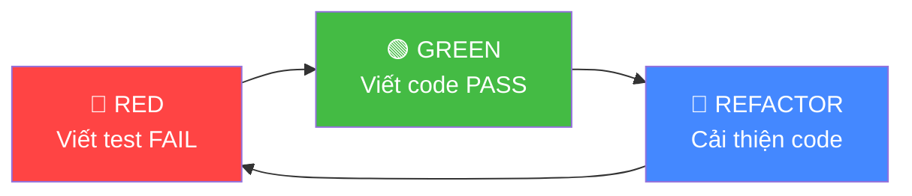
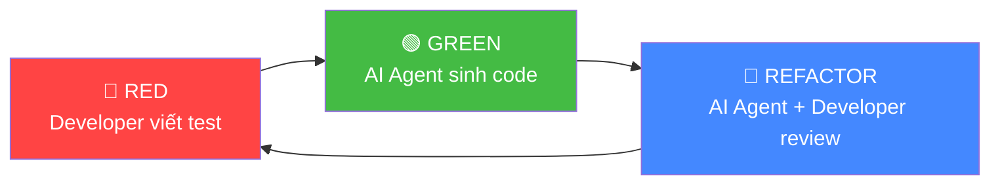
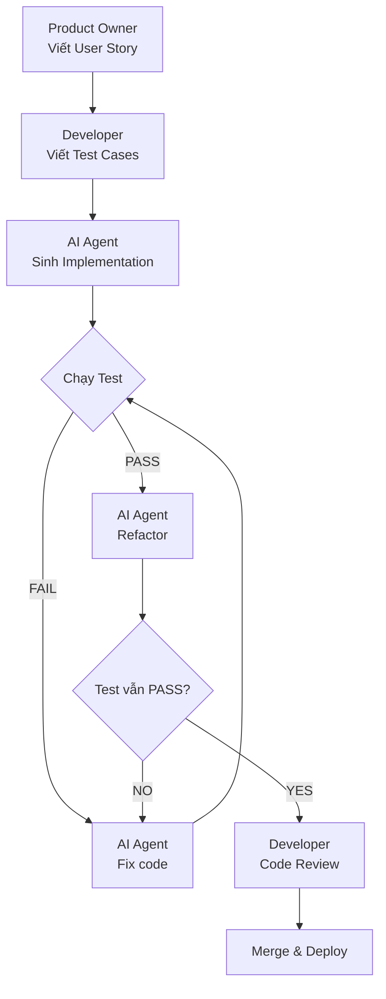

# Test-Driven Development với AI Agent: Viết Test trước, để Agent tự code

## Mở Đầu: Tại Sao TDD + AI Agent Là Combo Hoàn Hảo?

Hầu hết developer dùng AI Agent theo cách: **mô tả yêu cầu → nhận code → hy vọng nó đúng**. Cách này có một vấn đề lớn — bạn đang tin tưởng AI mà không có cơ chế kiểm chứng tự động.

**Test-Driven Development (TDD)** giải quyết chính xác vấn đề đó. Khi bạn viết test trước, bạn tạo ra một "hợp đồng" rõ ràng mà code phải tuân thủ. AI Agent không còn "đoán" bạn muốn gì — nó có một tiêu chuẩn khách quan để đạt được.

> [!IMPORTANT]
> **Insight cốt lõi:** TDD biến AI Agent từ "công cụ sinh code" thành "lập trình viên có specification rõ ràng". Test chính là specification — và AI rất giỏi implement theo spec.

Bài viết này hướng dẫn bạn workflow thực tế để kết hợp TDD với Claude Code và GitHub Copilot, kèm ví dụ code chạy được ngay.

---

## Phần 1: Tư Duy TDD Kết Hợp AI Agent

### 1.1 TDD Truyền Thống: Red-Green-Refactor

TDD truyền thống gồm 3 bước lặp lại:



| Bước | Mục đích | Ai làm? (Truyền thống) |
|:---|:---|:---|
| **🔴 RED** | Viết test mô tả behavior mong muốn. Test phải FAIL | Developer |
| **🟢 GREEN** | Viết code tối thiểu để test PASS | Developer |
| **🔵 REFACTOR** | Cải thiện code mà không thay đổi behavior | Developer |

### 1.2 TDD + AI Agent: Con Người Viết Test, AI Viết Code

Khi có AI Agent, workflow thay đổi đáng kể:



| Bước | Ai làm? | Chi tiết |
|:---|:---|:---|
| **🔴 RED** | **Developer** | Viết test case — đây là nơi expertise của bạn tỏa sáng |
| **🟢 GREEN** | **AI Agent** | Đọc test, sinh code thỏa mãn — AI rất giỏi việc này |
| **🔵 REFACTOR** | **AI Agent + Developer** | AI đề xuất refactor, developer review và approve |

> [!TIP]
> **Lợi ích then chốt:** Developer tập trung vào **"WHAT"** (hệ thống cần làm gì — qua test), AI lo phần **"HOW"** (implement như thế nào). Đây là phân công lao động tối ưu nhất giữa người và máy.

### 1.3 Tại Sao Combo Này Hiệu Quả?

**Vấn đề khi dùng AI không có test:**

- AI có thể "hallucinate" — sinh code trông đúng nhưng sai logic
- Không có cách tự động verify output
- Mỗi lần prompt lại phải đọc toàn bộ code để kiểm tra

**Giải pháp khi dùng TDD + AI:**

- ✅ Test là "source of truth" — AI phải thỏa mãn, không có chỗ cho hallucination
- ✅ Feedback loop tự động — chạy test biết ngay đúng/sai
- ✅ Refactor an toàn — test đảm bảo behavior không đổi sau refactor
- ✅ Documentation sống — test chính là tài liệu mô tả behavior

---

## Phần 2: Hướng Dẫn Step-by-Step

### Step 1: Xác Định Requirements và Viết Test

Trước khi mở AI Agent, bạn cần:

1. **Xác định rõ feature** cần implement
2. **Chia nhỏ** thành các behavior cụ thể
3. **Viết test** cho từng behavior

**Nguyên tắc viết test cho AI:**

```
✅ TỐT: Test cụ thể, rõ ràng, có input/output rõ
   expect(calculateDiscount(1000, 'VIP')).toBe(200)

❌ XẤU: Test mơ hồ, không rõ expected behavior
   expect(calculateDiscount(amount, type)).toBeTruthy()
```

> [!WARNING]
> **Sai lầm phổ biến:** Viết test quá chung chung khiến AI sinh code "pass test nhưng sai logic". Test càng cụ thể, code AI sinh ra càng chính xác.

### Step 2: Cho AI Agent Đọc Test và Sinh Code

**Với Claude Code (CLI):**

```bash
# Chạy trong terminal, tại thư mục project
claude "Đọc file tests/discount.test.js và implement 
       src/discount.js sao cho tất cả test PASS. 
       Chạy npm test để verify."
```

**Với GitHub Copilot Workspace:**

1. Tạo Issue trên GitHub: "Implement discount calculator"
2. Attach test file vào Issue
3. Mở Copilot Workspace → Copilot đọc test → sinh code → tạo PR

**Với Cursor AI:**

1. Mở test file trong Cursor
2. Mở Agent mode (Cmd+I)
3. Prompt: "Implement the module that makes all tests in this file pass"

### Step 3: Chạy Test — Verify Kết Quả

```bash
# Chạy test suite
npm test          # Jest
pytest             # PyTest
./gradlew test     # JUnit
```

**Kịch bản có thể xảy ra:**

| Kết quả | Hành động |
|:---|:---|
| ✅ Tất cả test PASS | Chuyển sang Step 4 (Refactor) |
| ❌ Một số test FAIL | Gửi error message cho AI Agent, yêu cầu sửa |
| ❌ Code không compile | Gửi compiler error cho AI Agent |

**Ví dụ khi test fail, prompt Claude Code:**

```bash
claude "Test discount.test.js đang fail ở test case 'should apply 
       20% for VIP'. Error: Expected 200, received 100. 
       Fix src/discount.js."
```

### Step 4: Refactor với AI Agent

Sau khi tất cả test PASS:

```bash
claude "Refactor src/discount.js để code clean hơn, 
       dễ đọc hơn. Giữ nguyên tất cả test PASS. 
       Chạy npm test sau khi refactor để confirm."
```

> [!NOTE]
> Claude Code và Cursor AI đều có khả năng tự chạy test sau khi refactor — đây là lợi thế lớn của agentic tools so với copilot thuần túy.

### Step 5: Lặp Lại — Thêm Test Mới

Viết thêm test cho edge cases, rồi lại cho AI implement:

```
Loop:
  1. Developer viết test mới (edge case, error handling)
  2. AI Agent implement code mới
  3. Chạy test → verify
  4. AI refactor nếu cần
```

---

## Phần 3: Ví Dụ Thực Tế — Discount Calculator

### 3.1 Bài Toán

Xây dựng hệ thống tính chiết khấu cho đơn hàng:

- Khách VIP: giảm 20%
- Khách Regular: giảm 5%
- Đơn hàng trên 1,000,000đ: giảm thêm 10%
- Chiết khấu tối đa 30%
- Số tiền phải dương

### 3.2 Bước 1 — 🔴 RED: Viết Test Trước

=== "Jest (JavaScript)"

    ```javascript
    // tests/discount.test.js

    const { calculateDiscount, applyDiscount } = require('../src/discount');

    describe('calculateDiscount', () => {
      // --- Chiết khấu theo loại khách hàng ---
      test('VIP customer gets 20% discount', () => {
        expect(calculateDiscount(500000, 'VIP')).toBe(20);
      });

      test('Regular customer gets 5% discount', () => {
        expect(calculateDiscount(500000, 'REGULAR')).toBe(5);
      });

      // --- Chiết khấu theo giá trị đơn hàng ---
      test('Order over 1,000,000 gets additional 10%', () => {
        expect(calculateDiscount(1500000, 'REGULAR')).toBe(15);
      });

      test('VIP + high value order caps at 30%', () => {
        // VIP(20%) + high-value(10%) = 30% → cap at 30%
        expect(calculateDiscount(2000000, 'VIP')).toBe(30);
      });

      // --- Edge cases ---
      test('throws error for negative amount', () => {
        expect(() => calculateDiscount(-100, 'VIP')).toThrow('Amount must be positive');
      });

      test('throws error for unknown customer type', () => {
        expect(() => calculateDiscount(1000, 'UNKNOWN')).toThrow('Invalid customer type');
      });

      test('zero amount returns 0 discount', () => {
        expect(calculateDiscount(0, 'VIP')).toBe(0);
      });
    });

    describe('applyDiscount', () => {
      test('applies calculated discount to amount', () => {
        // 500,000 × (1 - 20/100) = 400,000
        expect(applyDiscount(500000, 'VIP')).toBe(400000);
      });

      test('applies combined discount correctly', () => {
        // 1,500,000 × (1 - 15/100) = 1,275,000
        expect(applyDiscount(1500000, 'REGULAR')).toBe(1275000);
      });

      test('caps discount at 30% for VIP high-value', () => {
        // 2,000,000 × (1 - 30/100) = 1,400,000
        expect(applyDiscount(2000000, 'VIP')).toBe(1400000);
      });
    });
    ```

=== "PyTest (Python)"

    ```python
    # tests/test_discount.py

    import pytest
    from src.discount import calculate_discount, apply_discount

    class TestCalculateDiscount:
        """Test chiết khấu theo loại khách hàng."""

        def test_vip_gets_20_percent(self):
            assert calculate_discount(500_000, "VIP") == 20

        def test_regular_gets_5_percent(self):
            assert calculate_discount(500_000, "REGULAR") == 5

        def test_high_value_order_adds_10_percent(self):
            assert calculate_discount(1_500_000, "REGULAR") == 15

        def test_vip_high_value_caps_at_30(self):
            assert calculate_discount(2_000_000, "VIP") == 30

        def test_negative_amount_raises_error(self):
            with pytest.raises(ValueError, match="Amount must be positive"):
                calculate_discount(-100, "VIP")

        def test_unknown_type_raises_error(self):
            with pytest.raises(ValueError, match="Invalid customer type"):
                calculate_discount(1000, "UNKNOWN")

        def test_zero_amount_returns_zero(self):
            assert calculate_discount(0, "VIP") == 0


    class TestApplyDiscount:
        """Test áp dụng chiết khấu vào đơn hàng."""

        def test_apply_vip_discount(self):
            assert apply_discount(500_000, "VIP") == 400_000

        def test_apply_combined_discount(self):
            assert apply_discount(1_500_000, "REGULAR") == 1_275_000

        def test_apply_capped_discount(self):
            assert apply_discount(2_000_000, "VIP") == 1_400_000
    ```

Chạy test — tất cả sẽ **FAIL** (🔴 RED) vì chưa có implementation:

```bash
$ npm test
# FAIL tests/discount.test.js
# ● Cannot find module '../src/discount'
# Tests: 10 failed, 10 total
```

### 3.3 Bước 2 — 🟢 GREEN: Để AI Agent Sinh Code

**Prompt cho Claude Code:**

```bash
claude "Đọc file tests/discount.test.js. 
       Implement src/discount.js với 2 functions: 
       calculateDiscount(amount, customerType) và 
       applyDiscount(amount, customerType).
       Chạy 'npm test' để verify tất cả test PASS."
```

**AI Agent sẽ sinh ra code như sau:**

=== "JavaScript (Jest)"

    ```javascript
    // src/discount.js — Generated by AI Agent

    const CUSTOMER_DISCOUNTS = {
      VIP: 20,
      REGULAR: 5,
    };

    const HIGH_VALUE_THRESHOLD = 1_000_000;
    const HIGH_VALUE_BONUS = 10;
    const MAX_DISCOUNT = 30;

    function calculateDiscount(amount, customerType) {
      if (amount < 0) {
        throw new Error('Amount must be positive');
      }

      if (amount === 0) {
        return 0;
      }

      const baseDiscount = CUSTOMER_DISCOUNTS[customerType];
      if (baseDiscount === undefined) {
        throw new Error('Invalid customer type');
      }

      let totalDiscount = baseDiscount;

      if (amount > HIGH_VALUE_THRESHOLD) {
        totalDiscount += HIGH_VALUE_BONUS;
      }

      return Math.min(totalDiscount, MAX_DISCOUNT);
    }

    function applyDiscount(amount, customerType) {
      const discountPercent = calculateDiscount(amount, customerType);
      return amount * (1 - discountPercent / 100);
    }

    module.exports = { calculateDiscount, applyDiscount };
    ```

=== "Python (PyTest)"

    ```python
    # src/discount.py — Generated by AI Agent

    CUSTOMER_DISCOUNTS = {
        "VIP": 20,
        "REGULAR": 5,
    }

    HIGH_VALUE_THRESHOLD = 1_000_000
    HIGH_VALUE_BONUS = 10
    MAX_DISCOUNT = 30


    def calculate_discount(amount: int, customer_type: str) -> int:
        if amount < 0:
            raise ValueError("Amount must be positive")

        if amount == 0:
            return 0

        base_discount = CUSTOMER_DISCOUNTS.get(customer_type)
        if base_discount is None:
            raise ValueError("Invalid customer type")

        total_discount = base_discount

        if amount > HIGH_VALUE_THRESHOLD:
            total_discount += HIGH_VALUE_BONUS

        return min(total_discount, MAX_DISCOUNT)


    def apply_discount(amount: int, customer_type: str) -> int:
        discount_percent = calculate_discount(amount, customer_type)
        return int(amount * (1 - discount_percent / 100))
    ```

Chạy test — tất cả **PASS** (🟢 GREEN):

```bash
$ npm test
# PASS tests/discount.test.js
#   calculateDiscount
#     ✓ VIP customer gets 20% discount
#     ✓ Regular customer gets 5% discount
#     ✓ Order over 1,000,000 gets additional 10%
#     ✓ VIP + high value order caps at 30%
#     ✓ throws error for negative amount
#     ✓ throws error for unknown customer type
#     ✓ zero amount returns 0 discount
#   applyDiscount
#     ✓ applies calculated discount to amount
#     ✓ applies combined discount correctly
#     ✓ caps discount at 30% for VIP high-value
# Tests: 10 passed, 10 total
```

### 3.4 Bước 3 — 🔵 REFACTOR: Cải Thiện Code

```bash
claude "Tất cả 10 test đã PASS. Hãy refactor src/discount.js:
       1. Thêm JSDoc comments
       2. Dùng TypeScript-style validation
       3. Giữ nguyên tất cả test PASS
       Chạy 'npm test' sau khi refactor."
```

### 3.5 Bước 4 — Thêm Edge Cases

Viết thêm test cho tình huống mới:

```javascript
// Thêm vào tests/discount.test.js

test('GOLD customer gets 10% discount', () => {
  expect(calculateDiscount(500000, 'GOLD')).toBe(10);
});

test('discount rounds to integer', () => {
  expect(Number.isInteger(applyDiscount(333333, 'VIP'))).toBe(true);
});
```

Rồi lại cho AI Agent implement — vòng lặp TDD tiếp tục.

---

## Phần 4: Prompt Templates Cho Từng Tool

### 4.1 Claude Code

```bash
# Bước GREEN — Sinh code từ test
claude "Đọc file [TEST_FILE]. Implement [SOURCE_FILE] 
       sao cho tất cả test PASS. Chạy [TEST_COMMAND] để verify."

# Bước REFACTOR
claude "Tất cả test PASS. Refactor [SOURCE_FILE]:
       - [Yêu cầu cụ thể]
       Chạy [TEST_COMMAND] sau refactor để confirm không break gì."

# Khi test FAIL
claude "Test [TEST_NAME] đang fail: [ERROR_MESSAGE]. 
       Fix [SOURCE_FILE] và chạy lại test."
```

### 4.2 Cursor AI (Agent Mode)

```
Đọc file tests/ trong project này.
Implement tất cả source files cần thiết trong src/ 
sao cho toàn bộ test suite PASS.
Chạy test sau khi implement để verify.
```

### 4.3 GitHub Copilot Workspace

```
## Issue: Implement Discount Calculator

### Test Specification
See: tests/discount.test.js

### Requirements
- Implement src/discount.js
- All 10 tests must pass
- Follow project conventions
```

---

## Phần 5: Best Practices

### 5.1 Nguyên Tắc Viết Test Cho AI

| Nguyên tắc | Giải thích |
|:---|:---|
| **Test phải cụ thể** | Dùng giá trị cụ thể, không dùng random |
| **Tên test mô tả behavior** | `test('VIP gets 20%')` không phải `test('test1')` |
| **Cover edge cases** | Negative input, zero, null, boundary values |
| **Một test — một assertion** | Dễ debug khi AI sinh code sai |
| **Test độc lập** | Không phụ thuộc thứ tự chạy |

### 5.2 Khi Nào KHÔNG Nên Dùng TDD + AI?

- **Prototyping nhanh:** Khi chưa rõ requirement, viết test sớm là lãng phí
- **UI/UX code:** Visual behavior khó test bằng unit test
- **Exploratory coding:** Khi đang thử nghiệm ý tưởng mới

### 5.3 Workflow Tối Ưu Cho Team



> [!TIP]
> **Pro tip cho team:** Tạo template test file cho từng loại module (API endpoint, service, utility). Junior dev chỉ cần điền test case cụ thể, AI lo phần implement. Đây là cách tốt nhất để đào tạo tư duy TDD cho team.

---

## Kết Luận: Test Là Specification Tốt Nhất Cho AI

TDD + AI Agent không chỉ là kỹ thuật — đó là **thay đổi tư duy**:

1. **Bạn không viết code nữa** — bạn viết specification (dưới dạng test)
2. **AI không đoán nữa** — nó implement theo spec rõ ràng
3. **Quality tăng** — vì mọi dòng code đều có test coverage
4. **Tốc độ tăng** — developer focus vào logic, AI lo syntax

> [!IMPORTANT]
> **Takeaway:** Đầu tư thời gian viết test tốt là đầu tư có ROI cao nhất khi làm việc với AI Agent. Test càng rõ ràng, code AI sinh ra càng chính xác, thời gian review càng ít.

Bắt đầu với một module nhỏ trong project hiện tại. Viết 5 test cases. Cho Claude Code hoặc Cursor implement. Chạy test. Bạn sẽ thấy sự khác biệt ngay lập tức.

---

## Tham Khảo

- [Kent Beck — Test-Driven Development: By Example](https://www.oreilly.com/library/view/test-driven-development/0321146530/)
- [Claude Code Documentation](https://docs.anthropic.com/claude-code)
- [Jest Documentation](https://jestjs.io/docs/getting-started)
- [PyTest Documentation](https://docs.pytest.org/)
- Bài liên quan:
    - [Cursor AI vs Claude Code vs GitHub Copilot](./2026-05-15-cursor-ai-vs-claude-code-vs-github-copilot.md)
    - [Claude Code Cơ Bản: Agent, Sub-Agent, Skill](./2026-05-05-claude-code-co-ban-agent-subagent-skill.md)
