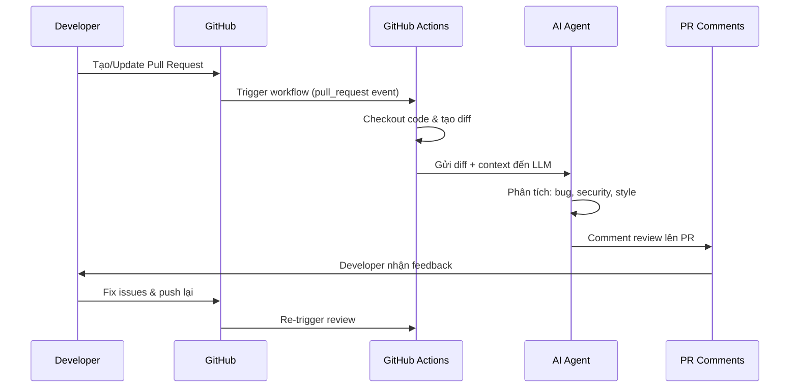
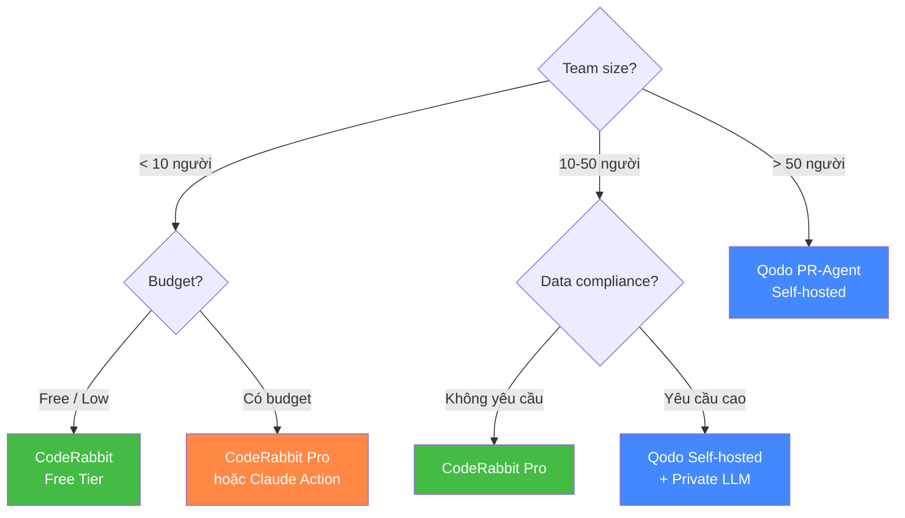
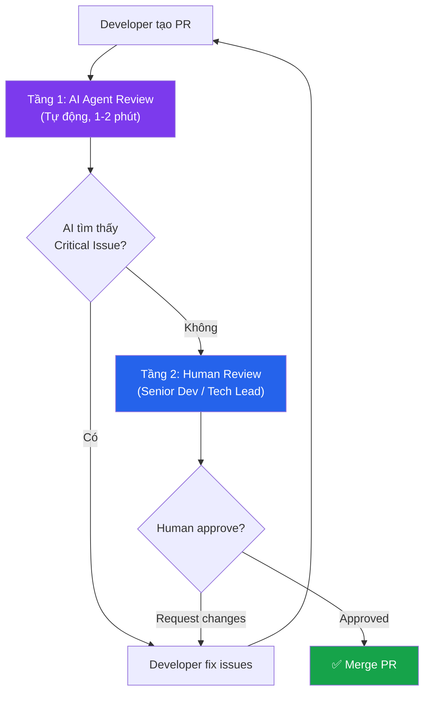

# AI Agent cho Code Review: Tự động hóa quy trình review Pull Request với GitHub Actions + AI

## Mở Đầu: Code Review — Nút Thắt Cổ Chai Của Mọi Team

Bạn đã bao giờ chờ **2–3 ngày** để một PR được review? Hoặc merge code mà reviewer chỉ comment "LGTM" mà không thực sự đọc kỹ? Đây là thực trạng phổ biến ở hầu hết engineering team.

Theo nghiên cứu năm 2025, **45% code do AI generate chứa lỗi bảo mật**, trong khi tỷ lệ phát hiện bug của human reviewer thường chỉ dưới 20% cho các logic error phức tạp. Code review truyền thống đang gặp 3 vấn đề lớn:

- **Bottleneck thời gian:** Senior dev dành 4–6 giờ/ngày review PR thay vì code
- **Inconsistency:** Chất lượng review phụ thuộc tâm trạng, workload và kinh nghiệm reviewer
- **Blind spots:** Con người rất khó phát hiện security vulnerability ẩn trong diff lớn

AI Agent cho Code Review không thay thế human reviewer — mà đóng vai trò **"first-pass filter"**, giúp team phát hiện bug sớm, enforce coding standards tự động, và để con người tập trung vào logic nghiệp vụ.

**Nội dung chính:**

- Kiến trúc và luồng hoạt động của AI Code Review Agent
- So sánh 3 giải pháp: CodeRabbit, Qodo PR-Agent, Claude Code Action
- Hướng dẫn thiết lập pipeline trên GitHub Actions (YAML đầy đủ)
- Cấu hình custom rules phát hiện bug logic, security issue
- Best practices bảo mật token và quản lý chi phí

---

## 1. Kiến Trúc: AI Agent Review Code Hoạt Động Như Thế Nào?

### 1.1 Luồng Tổng Quan

Khi một developer tạo Pull Request, AI Agent sẽ tự động kích hoạt qua GitHub Actions và thực hiện chuỗi hành động sau:



### 1.2 Hai Kiến Trúc Chính

Có 2 cách tiếp cận để tích hợp AI vào quy trình review:

| Tiếp cận | Ưu điểm | Nhược điểm | Phù hợp với |
|:---|:---|:---|:---|
| **Managed App** (CodeRabbit, Qodo) | Zero-config, cập nhật tự động, UI dashboard | Ít kiểm soát, data đi qua bên thứ 3 | Team nhỏ-vừa, startup |
| **Custom Agent** (Claude API, OpenAI) | Toàn quyền kiểm soát, data sovereignty | Phải tự maintain, cần DevOps skill | Enterprise, regulated industries |

!!! tip "Gợi ý thực tế"
    Nếu team bạn dưới 20 người và không có yêu cầu compliance đặc biệt, hãy bắt đầu với **Managed App** (CodeRabbit hoặc Qodo). Chỉ build custom agent khi cần kiểm soát hoàn toàn data flow.

---

## 2. Giải Pháp 1: CodeRabbit — Market Leader

[CodeRabbit](https://coderabbit.ai) là công cụ AI code review phổ biến nhất hiện tại, hỗ trợ GitHub, GitLab và Azure DevOps.

### 2.1 Cài Đặt Nhanh

**Bước 1:** Truy cập [coderabbit.ai](https://coderabbit.ai) → Sign in bằng GitHub

**Bước 2:** Authorize và chọn repositories cần review

**Bước 3:** Tạo file cấu hình `.coderabbit.yaml` tại root repository:

```yaml
# .coderabbit.yaml
language: "vi" # Review bằng tiếng Việt
reviews:
  profile: "assertive" # Mức độ review: chill | assertive | followup
  auto_review:
    enabled: true
    drafts: false # Không review draft PR

# Bỏ qua các file không cần review
path_filters:
  - "!**/dist/**"
  - "!**/node_modules/**"
  - "!**/*.lock"
  - "!**/*.min.js"

# Tùy chỉnh hướng dẫn review
path_instructions:
  - path: "src/api/**"
    instructions: |
      Kiểm tra kỹ input validation, SQL injection, 
      và xác thực authentication cho mọi endpoint.
  - path: "src/utils/**"
    instructions: |
      Đảm bảo mọi function có error handling phù hợp 
      và không có side effects bất ngờ.
```

Sau khi cài đặt, CodeRabbit sẽ tự động review mọi PR mới. Bạn có thể tương tác bằng cách comment `@coderabbitai` trên PR.

### 2.2 Tích Hợp Qua GitHub Actions (Tùy Chọn)

Nếu muốn kiểm soát nhiều hơn, bạn có thể dùng action `coderabbitai/ai-pr-reviewer`:

```yaml
# .github/workflows/coderabbit-review.yml
name: CodeRabbit PR Review

on:
  pull_request:
    types: [opened, synchronize, reopened]

permissions:
  contents: read
  pull-requests: write

jobs:
  review:
    runs-on: ubuntu-latest
    steps:
      - name: Checkout
        uses: actions/checkout@v4

      - name: AI Code Review
        uses: coderabbitai/ai-pr-reviewer@latest
        env:
          GITHUB_TOKEN: ${{ secrets.GITHUB_TOKEN }}
```

---

## 3. Giải Pháp 2: Qodo PR-Agent — Enterprise-Grade

[Qodo PR-Agent](https://github.com/Codium-ai/pr-agent) (trước đây là CodiumAI) là giải pháp open-source mạnh mẽ, cho phép self-host và tùy chỉnh sâu.

### 3.1 Thiết Lập GitHub Actions

```yaml
# .github/workflows/pr-agent.yml
name: PR-Agent Review

on:
  pull_request:
    types: [opened, synchronize, reopened]
  issue_comment:
    types: [created]

permissions:
  contents: read
  pull-requests: write
  issues: write

jobs:
  pr-agent:
    runs-on: ubuntu-latest
    if: >
      github.event_name == 'pull_request' ||
      (github.event_name == 'issue_comment' && 
       contains(github.event.comment.body, '/review'))
    steps:
      - name: PR Agent Review
        uses: qodo-ai/pr-agent@main
        env:
          OPENAI_KEY: ${{ secrets.OPENAI_KEY }}
          GITHUB_TOKEN: ${{ secrets.GITHUB_TOKEN }}
```

### 3.2 Cấu Hình Custom Rules

Tạo file `.pr_agent.toml` tại root repository:

```toml
# .pr_agent.toml

[pr_reviewer]
# Số lượng comment tối đa
max_number_of_calls = 5
# Yêu cầu review chi tiết
extra_instructions = """
1. Luôn kiểm tra SQL injection trong mọi database query
2. Phát hiện hardcoded secrets hoặc API keys
3. Kiểm tra null pointer / undefined access
4. Đánh giá error handling — không được swallow exceptions
5. Flag bất kỳ console.log/print nào còn sót lại
"""

[pr_description]
# Tự động tạo mô tả PR
enable_auto_description = true

[pr_code_suggestions]
# Gợi ý cải thiện code
num_code_suggestions = 4
```

Kết hợp thêm file `best_practices.md` để PR-Agent tham chiếu:

```markdown
<!-- best_practices.md -->
# Coding Standards

## Security
- Mọi user input phải được sanitize trước khi sử dụng
- Không sử dụng eval() hoặc dynamic code execution
- Mọi API endpoint phải có authentication middleware

## Error Handling
- Sử dụng custom error classes, không throw generic Error
- Mọi async function phải có try-catch hoặc .catch()
- Log error với context đầy đủ (userId, requestId, timestamp)
```

---

## 4. Giải Pháp 3: Claude Code Action — Custom AI Agent

[anthropics/claude-code-action](https://github.com/anthropics/claude-code-action) cho phép bạn dùng Claude trực tiếp làm AI reviewer, với khả năng tùy chỉnh prompt sâu nhất.

### 4.1 Thiết Lập Cơ Bản

```yaml
# .github/workflows/claude-review.yml
name: Claude Code Review

on:
  pull_request:
    types: [opened, synchronize]
  issue_comment:
    types: [created]

permissions:
  contents: read
  pull-requests: write

jobs:
  claude-review:
    runs-on: ubuntu-latest
    # Chỉ chạy khi PR mở hoặc khi có comment "@claude"
    if: >
      github.event_name == 'pull_request' ||
      (github.event_name == 'issue_comment' &&
       contains(github.event.comment.body, '@claude'))
    steps:
      - name: Checkout repository
        uses: actions/checkout@v4
        with:
          fetch-depth: 0

      - name: Run Claude Code Review
        uses: anthropics/claude-code-action@v1
        with:
          anthropic_api_key: ${{ secrets.ANTHROPIC_API_KEY }}
```

### 4.2 Cấu Hình Review Nâng Cao Với Custom Prompt

Sức mạnh thực sự của Claude Code Action nằm ở khả năng custom prompt. Tạo file hướng dẫn review:

```yaml
# .github/workflows/claude-review-advanced.yml
name: Claude Advanced Review

on:
  pull_request:
    types: [opened, synchronize]
    paths:
      - 'src/**'
      - 'lib/**'
      - '!**/*.md'
      - '!**/*.txt'

permissions:
  contents: read
  pull-requests: write

jobs:
  security-review:
    runs-on: ubuntu-latest
    steps:
      - uses: actions/checkout@v4
        with:
          fetch-depth: 0

      - name: Claude Security Review
        uses: anthropics/claude-code-action@v1
        with:
          anthropic_api_key: ${{ secrets.ANTHROPIC_API_KEY }}
          prompt: |
            Bạn là Senior Security Engineer. Review PR này với focus:

            ## Bug Logic
            - Race conditions trong async/concurrent code
            - Off-by-one errors trong loops và array access
            - Null/undefined handling thiếu sót
            - Type coercion bugs (JavaScript == vs ===)

            ## Security
            - SQL Injection, XSS, CSRF
            - Hardcoded secrets, API keys, passwords
            - Insecure deserialization
            - Path traversal vulnerabilities
            - Missing input validation/sanitization

            ## Performance
            - N+1 queries trong database operations
            - Memory leaks (event listeners, subscriptions)
            - Blocking operations trong async context

            Format output:
            🔴 CRITICAL: Issues phải fix trước khi merge
            🟡 WARNING: Nên fix nhưng không blocking
            🟢 SUGGESTION: Nice-to-have improvements

            Nếu không tìm thấy issue nào, comment: 
            "✅ No critical issues found. LGTM!"
```

!!! example "Ví dụ output của Claude trên PR"
    ```
    🔴 CRITICAL — SQL Injection (src/api/users.js:42)
    
    const query = `SELECT * FROM users WHERE id = ${req.params.id}`;
    
    → User input được inject trực tiếp vào SQL query.
    Fix: Sử dụng parameterized query:
    const query = 'SELECT * FROM users WHERE id = $1';
    const result = await db.query(query, [req.params.id]);
    
    🟡 WARNING — Missing Error Handler (src/api/users.js:58)
    
    await db.query(updateQuery) // Không có try-catch
    
    → Nếu query fail, error sẽ crash toàn bộ process.
    
    🟢 SUGGESTION — Magic Number (src/utils/pricing.js:15)
    
    if (discount > 30) { ... }
    
    → Nên extract 30 thành constant MAX_DISCOUNT_PERCENT
    ```

---

## 5. So Sánh 3 Giải Pháp

| Tiêu chí | CodeRabbit | Qodo PR-Agent | Claude Code Action |
|:---|:---|:---|:---|
| **Setup** | 5 phút (GitHub App) | 15 phút (Actions) | 10 phút (Actions) |
| **Self-host** | ❌ SaaS only | ✅ Open-source | ⚠️ Cần API key |
| **Custom rules** | `.coderabbit.yaml` | `.pr_agent.toml` | Custom prompt |
| **LLM backend** | Multi-model | OpenAI/custom | Claude (Anthropic) |
| **Chi phí** | Free tier + $19/user/mo | Free (OSS) + LLM cost | Pay-per-use API |
| **Data privacy** | Data qua server CR | Self-host = full control | Data qua Anthropic API |
| **Tương tác** | `@coderabbitai` comment | `/review` command | `@claude` comment |
| **Auto-fix** | ✅ Có | ⚠️ Gợi ý code | ✅ Có |



---

## 6. Build Custom Agent Từ Scratch (Advanced)

Nếu cần kiểm soát hoàn toàn, bạn có thể tự build agent bằng script:

### 6.1 Workflow YAML

```yaml
# .github/workflows/custom-ai-review.yml
name: Custom AI Code Review

on:
  pull_request:
    types: [opened, synchronize]
    paths:
      - '**.ts'
      - '**.js'
      - '**.py'

permissions:
  pull-requests: write
  contents: read

jobs:
  ai-review:
    runs-on: ubuntu-latest
    steps:
      - name: Checkout
        uses: actions/checkout@v4
        with:
          fetch-depth: 0

      - name: Setup Node.js
        uses: actions/setup-node@v4
        with:
          node-version: '20'

      - name: Install dependencies
        run: npm install @anthropic-ai/sdk @octokit/rest

      - name: Generate diff
        run: |
          git diff origin/${{ github.base_ref }}...HEAD \
            -- '*.ts' '*.js' '*.py' > pr_diff.txt

      - name: Run AI Review
        env:
          ANTHROPIC_API_KEY: ${{ secrets.ANTHROPIC_API_KEY }}
          GITHUB_TOKEN: ${{ secrets.GITHUB_TOKEN }}
          PR_NUMBER: ${{ github.event.pull_request.number }}
          REPO: ${{ github.repository }}
        run: node scripts/ai-reviewer.js
```

### 6.2 Script Review Agent

```javascript
// scripts/ai-reviewer.js
const Anthropic = require("@anthropic-ai/sdk");
const { Octokit } = require("@octokit/rest");
const fs = require("fs");

const anthropic = new Anthropic();
const octokit = new Octokit({ auth: process.env.GITHUB_TOKEN });
const [owner, repo] = process.env.REPO.split("/");
const prNumber = parseInt(process.env.PR_NUMBER);

async function review() {
  const diff = fs.readFileSync("pr_diff.txt", "utf-8");

  // Giới hạn diff size để tránh token quá lớn
  const truncatedDiff = diff.slice(0, 12000);

  const message = await anthropic.messages.create({
    model: "claude-sonnet-4-20250514",
    max_tokens: 2048,
    messages: [
      {
        role: "user",
        content: `Review PR diff sau. Tìm bug logic, security issues, 
        và gợi ý cải thiện. Format output dùng Markdown.
        
        DIFF:
        ${truncatedDiff}`,
      },
    ],
  });

  const reviewContent = message.content[0].text;

  // Post comment lên PR
  await octokit.issues.createComment({
    owner,
    repo,
    issue_number: prNumber,
    body: `## 🤖 AI Code Review\n\n${reviewContent}`,
  });

  console.log("Review posted successfully!");
}

review().catch(console.error);
```

!!! warning "Lưu ý về Prompt Injection"
    Khi build custom agent, diff từ PR có thể chứa **prompt injection** — attacker cố tình đưa text vào code để manipulate AI reviewer. Luôn sanitize diff trước khi gửi đến LLM và **không bao giờ** cho phép AI thực thi code từ diff.

---

## 7. Bảo Mật Token và Best Practices

> [!CAUTION]
> **KHÔNG BAO GIỜ** hardcode API key trong file YAML hoặc commit vào repository. Một lần lộ key = toàn bộ API bị compromise. Luôn sử dụng **GitHub Secrets**.

### 7.1 Thiết Lập GitHub Secrets

```
Repository Settings → Secrets and variables → Actions → New repository secret
```

| Secret Name | Giá trị | Dùng cho |
|:---|:---|:---|
| `ANTHROPIC_API_KEY` | `sk-ant-...` | Claude Code Action |
| `OPENAI_KEY` | `sk-...` | Qodo PR-Agent |
| `GITHUB_TOKEN` | Auto-generated | Mọi workflow |

!!! warning "Bảo mật token — Checklist bắt buộc"
    - [ ] **Dùng GitHub Secrets** — không env variable trong code
    - [ ] **Rotation định kỳ** — đổi API key mỗi 90 ngày
    - [ ] **Least privilege** — `GITHUB_TOKEN` chỉ cần `pull-requests: write`
    - [ ] **Audit log** — theo dõi API usage để phát hiện bất thường
    - [ ] **Secret scanning** — bật GitHub Secret Scanning trên repository
    - [ ] **Branch protection** — yêu cầu review trước khi merge vào main

### 7.2 Kiểm Soát Chi Phí

```yaml
# Giới hạn AI review chỉ chạy cho file quan trọng
on:
  pull_request:
    paths:
      - 'src/**'
      - 'lib/**'
      - '!**/*.test.*'    # Bỏ qua test files
      - '!**/*.spec.*'    # Bỏ qua spec files
      - '!**/*.md'        # Bỏ qua documentation
```

!!! tip "Tip tiết kiệm chi phí"
    Với Claude API, mỗi lần review ~500 dòng diff tốn khoảng $0.01–0.05. Một team 10 người, 20 PR/ngày sẽ tốn ~$10–30/tháng — rẻ hơn rất nhiều so với thời gian senior dev dành cho manual review.

---

## 8. Thực Tế: Kết Hợp AI + Human Review

AI Agent không thay thế human reviewer — mà tạo ra workflow **2 tầng**:



**Kết quả thực tế khi áp dụng workflow 2 tầng:**

- Thời gian review trung bình giảm từ **4 giờ → 45 phút**
- Human reviewer tập trung vào **business logic** thay vì tìm typo, style issues
- Số lượng bug lọt vào production giảm nhờ phát hiện sớm ở tầng AI
- Junior developer nhận feedback nhanh hơn, học coding standards nhanh hơn

---

## Kết Luận

AI Agent cho Code Review là một trong những ứng dụng thực tế và **ROI cao nhất** của AI trong software engineering. Không cần đầu tư lớn, không cần thay đổi workflow — chỉ cần thêm một file YAML.

**Roadmap áp dụng đề xuất:**

1. **Tuần 1:** Cài CodeRabbit (free tier) cho 1 repository thử nghiệm
2. **Tuần 2-3:** Tinh chỉnh `.coderabbit.yaml` hoặc custom rules theo coding standards của team
3. **Tháng 2:** Mở rộng cho toàn bộ repositories, kết hợp thêm Claude Code Action cho security-focused review
4. **Tháng 3+:** Đánh giá metrics (review time, bug detection rate) và tối ưu

> [!IMPORTANT]
> **Takeaway:** AI review code không phải "nice-to-have" — đó là **competitive advantage**. Team nào adopt sớm sẽ ship nhanh hơn, ít bug hơn, và developer hạnh phúc hơn vì không phải chờ review. Bắt đầu với 1 repository, 1 tool. Kết quả sẽ tự nói.

---

## Tham Khảo

- [CodeRabbit Documentation](https://docs.coderabbit.ai/getting-started/quickstart) — Hướng dẫn cài đặt và cấu hình CodeRabbit
- [Qodo PR-Agent GitHub](https://github.com/Codium-ai/pr-agent) — Source code và docs của PR-Agent (open-source)
- [anthropics/claude-code-action](https://github.com/anthropics/claude-code-action) — GitHub Action chính thức của Anthropic
- [Veracode State of Software Security 2025](https://www.veracode.com/state-of-software-security-report) — Nghiên cứu về tỷ lệ vulnerability trong AI-generated code
- Bài liên quan:
    - [TDD với AI Agent](./2026-05-16-tdd-voi-ai-agent.md)
    - [Cursor AI vs Claude Code vs GitHub Copilot](./2026-05-15-cursor-ai-vs-claude-code-vs-github-copilot.md)
