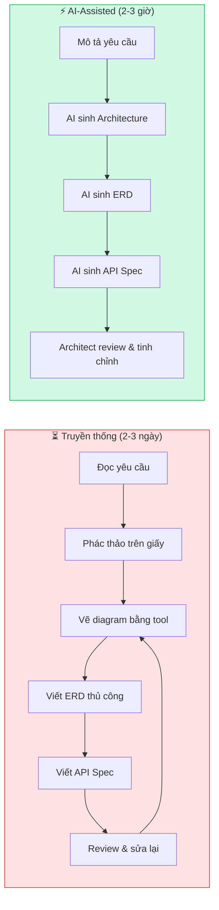
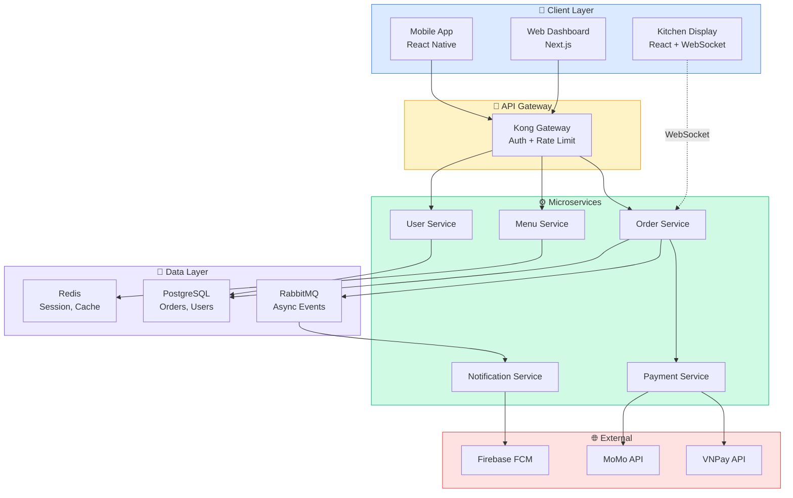
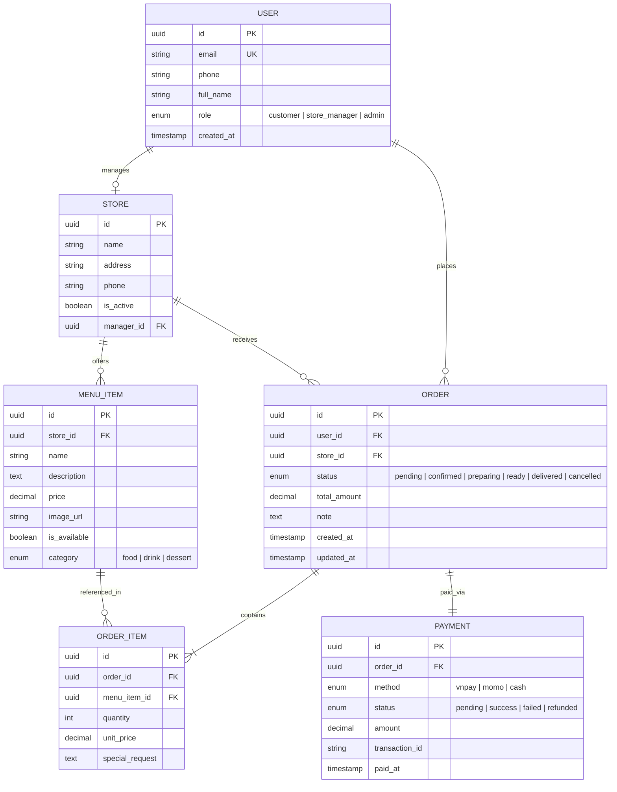
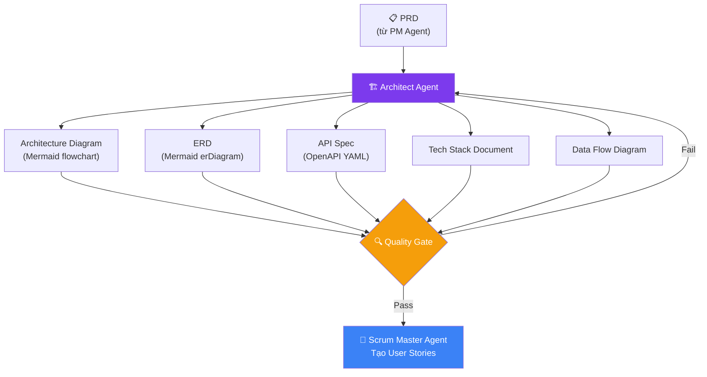

# Thiết kế Hệ thống với AI: Dùng Agent để tạo Architecture Diagram, ERD và API Spec từ mô tả yêu cầu

## Mở Đầu: Khi Architect Cũng Cần "Copilot"

Bạn đã bao giờ mất **2–3 ngày** chỉ để vẽ System Architecture, thiết kế ERD và viết OpenAPI Spec cho một dự án mới? Rồi khi stakeholder thay đổi yêu cầu, tất cả phải vẽ lại từ đầu?

Thực tế cho thấy: phần lớn thời gian của Architect không phải dành cho **quyết định thiết kế** — mà cho việc **chuyển đổi ý tưởng thành diagram và document**. Đây chính là nơi AI Agent phát huy sức mạnh: biến mô tả yêu cầu bằng ngôn ngữ tự nhiên (kể cả tiếng Việt) thành artifact kỹ thuật có cấu trúc chỉ trong vài phút.

**Nội dung chính:**

- Cách dùng **Eraser.io DiagramGPT**, **Mermaid + LLM**, và **Claude** để sinh Architecture Diagram, ERD, OpenAPI Spec
- Kết hợp phương pháp **BMAD** để chuẩn hóa đầu ra, tránh "vibe designing"
- **Prompt mẫu** copy-paste để dùng ngay cho dự án thực tế

---

## 1. Bức Tranh Tổng Quan: AI-Assisted System Design

### 1.1 Workflow Truyền Thống vs AI-Assisted



### 1.2 Bộ Công Cụ Được Đề Xuất

| Artifact | Tool chính | Backup / Alternative |
|:---|:---|:---|
| **System Architecture** | Eraser.io DiagramGPT | Claude + Mermaid |
| **ERD** | Claude + Mermaid erDiagram | ChartDB, Eraser.io |
| **OpenAPI Spec** | Claude Code / Claude Chat | Cursor, Copilot |
| **Chuẩn hóa đầu ra** | BMAD Method | Manual checklist |

!!! tip "Nguyên tắc vàng"
    AI sinh **bản nháp đầu tiên** — Architect ra **quyết định cuối cùng**. Không bao giờ ship artifact mà chưa qua human review.

---

## 2. Eraser.io DiagramGPT: Từ Text Đến Architecture Diagram

[Eraser.io](https://eraser.io) cung cấp tính năng **DiagramGPT** — cho phép bạn mô tả hệ thống bằng ngôn ngữ tự nhiên và nhận lại architecture diagram chuyên nghiệp.

### 2.1 Cách Sử Dụng

1. Truy cập [eraser.io](https://eraser.io) → tạo Canvas mới
2. Nhấn `/` → chọn **Diagram as Code** → **AI Diagram** (hoặc `Cmd+J`)
3. Nhập mô tả hệ thống → nhấn **Generate**
4. Tinh chỉnh bằng follow-up prompt hoặc chỉnh tay

### 2.2 Ví Dụ Prompt Cho Eraser.io

```
Hệ thống E-commerce gồm:
- Frontend: React SPA, giao tiếp qua API Gateway
- API Gateway: Kong, xử lý auth và rate limiting
- Backend services: User Service, Product Service, Order Service, Payment Service
- Message Queue: RabbitMQ để xử lý async (đặt hàng, gửi email)
- Database: PostgreSQL cho User và Order, MongoDB cho Product catalog
- Cache: Redis cho session và product cache
- Monitoring: Prometheus + Grafana
- Deploy trên AWS với ECS Fargate

Vẽ architecture diagram với các layer: Client, Gateway, Services, Data, Infrastructure
```

Eraser.io sẽ sinh ra diagram chuyên nghiệp với icon cloud-native, có thể export PNG/SVG hoặc nhúng vào Notion/Confluence.

### 2.3 Pricing Tham Khảo

| Plan | Giá | AI Diagrams |
|:---|:---|:---|
| Free | $0 | 5 diagrams |
| Starter | $15/user/tháng | 40 diagrams |
| Business | Liên hệ | 250 diagrams |

!!! info "Khi nào dùng Eraser.io?"
    Phù hợp khi cần **diagram đẹp, chuyên nghiệp** để trình bày với stakeholder. Output là hình ảnh visual, không phải code — nên khó version control bằng Git.

---

## 3. Claude + Mermaid: Sinh Diagram-as-Code

Nếu bạn cần diagram **version-controlled** (lưu trong Git, render trong Markdown), cách tốt nhất là dùng Claude để sinh Mermaid code.

### 3.1 Sinh Architecture Diagram

**Prompt:**

```
Bạn là Software Architect. Từ yêu cầu sau, hãy sinh Mermaid flowchart 
cho System Architecture:

Hệ thống quản lý đơn hàng (OMS) cho chuỗi cửa hàng F&B:
- App mobile cho khách đặt món
- Web dashboard cho quản lý cửa hàng
- Kitchen Display System (KDS) hiển thị đơn realtime
- Tích hợp thanh toán VNPay, MoMo
- Notification qua Firebase Cloud Messaging

Yêu cầu output: Mermaid graph TD, có subgraph cho từng layer, 
có style color cho từng nhóm component.
```

**Output mẫu từ Claude:**



### 3.2 Sinh ERD (Entity Relationship Diagram)

**Prompt:**

```
Từ hệ thống OMS ở trên, hãy sinh Mermaid erDiagram với:
- Các entity chính: User, Store, MenuItem, Order, OrderItem, Payment
- Đầy đủ attributes với data type
- Relationship với cardinality chính xác
```

**Output mẫu:**



---

## 4. Claude Sinh OpenAPI Spec

Sau khi có Architecture và ERD, bước tiếp theo là sinh **OpenAPI Specification** cho từng service.

### 4.1 Prompt Sinh API Spec

```
Từ ERD ở trên, hãy sinh OpenAPI 3.0 Spec (YAML) cho Order Service với:
- POST /orders — Tạo đơn hàng mới
- GET /orders/{id} — Xem chi tiết đơn
- PATCH /orders/{id}/status — Cập nhật trạng thái
- GET /orders?store_id=xxx&status=xxx — Lọc đơn theo cửa hàng

Yêu cầu:
- Schema tham chiếu entity Order và OrderItem từ ERD
- Response có error format chuẩn (RFC 7807)
- Mỗi endpoint có example request/response
- Authentication: Bearer JWT
```

### 4.2 Output Mẫu (Trích)

```yaml
openapi: 3.0.3
info:
  title: OMS - Order Service API
  version: 1.0.0
  description: API quản lý đơn hàng cho hệ thống F&B

servers:
  - url: https://api.oms.example.com/v1

security:
  - bearerAuth: []

paths:
  /orders:
    post:
      summary: Tạo đơn hàng mới
      operationId: createOrder
      tags: [Orders]
      requestBody:
        required: true
        content:
          application/json:
            schema:
              $ref: '#/components/schemas/CreateOrderRequest'
            example:
              store_id: "550e8400-e29b-41d4-a716-446655440001"
              items:
                - menu_item_id: "550e8400-e29b-41d4-a716-446655440010"
                  quantity: 2
                  special_request: "Ít đá"
                - menu_item_id: "550e8400-e29b-41d4-a716-446655440011"
                  quantity: 1
              note: "Giao tầng 3, phòng 302"
      responses:
        '201':
          description: Đơn hàng đã được tạo
          content:
            application/json:
              schema:
                $ref: '#/components/schemas/Order'
        '400':
          $ref: '#/components/responses/BadRequest'
        '401':
          $ref: '#/components/responses/Unauthorized'

  /orders/{id}:
    get:
      summary: Xem chi tiết đơn hàng
      operationId: getOrder
      tags: [Orders]
      parameters:
        - name: id
          in: path
          required: true
          schema:
            type: string
            format: uuid
      responses:
        '200':
          description: Chi tiết đơn hàng
          content:
            application/json:
              schema:
                $ref: '#/components/schemas/Order'
        '404':
          $ref: '#/components/responses/NotFound'

  /orders/{id}/status:
    patch:
      summary: Cập nhật trạng thái đơn hàng
      operationId: updateOrderStatus
      tags: [Orders]
      parameters:
        - name: id
          in: path
          required: true
          schema:
            type: string
            format: uuid
      requestBody:
        required: true
        content:
          application/json:
            schema:
              type: object
              required: [status]
              properties:
                status:
                  type: string
                  enum: [confirmed, preparing, ready, delivered, cancelled]
            example:
              status: "preparing"
      responses:
        '200':
          description: Trạng thái đã cập nhật
        '422':
          description: Transition trạng thái không hợp lệ

components:
  securitySchemes:
    bearerAuth:
      type: http
      scheme: bearer
      bearerFormat: JWT

  schemas:
    CreateOrderRequest:
      type: object
      required: [store_id, items]
      properties:
        store_id:
          type: string
          format: uuid
        items:
          type: array
          minItems: 1
          items:
            $ref: '#/components/schemas/OrderItemRequest'
        note:
          type: string
          maxLength: 500

    OrderItemRequest:
      type: object
      required: [menu_item_id, quantity]
      properties:
        menu_item_id:
          type: string
          format: uuid
        quantity:
          type: integer
          minimum: 1
          maximum: 99
        special_request:
          type: string
          maxLength: 200

    Order:
      type: object
      properties:
        id:
          type: string
          format: uuid
        store_id:
          type: string
          format: uuid
        user_id:
          type: string
          format: uuid
        status:
          type: string
          enum: [pending, confirmed, preparing, ready, delivered, cancelled]
        total_amount:
          type: number
          format: decimal
        items:
          type: array
          items:
            $ref: '#/components/schemas/OrderItem'
        created_at:
          type: string
          format: date-time

    OrderItem:
      type: object
      properties:
        menu_item_id:
          type: string
          format: uuid
        menu_item_name:
          type: string
        quantity:
          type: integer
        unit_price:
          type: number
          format: decimal
        special_request:
          type: string

  responses:
    BadRequest:
      description: Dữ liệu đầu vào không hợp lệ
      content:
        application/json:
          schema:
            type: object
            properties:
              type:
                type: string
              title:
                type: string
              status:
                type: integer
              detail:
                type: string
    NotFound:
      description: Không tìm thấy resource
    Unauthorized:
      description: Token không hợp lệ hoặc hết hạn
```

!!! warning "Luôn validate output"
    Sau khi Claude sinh API Spec, hãy paste vào [Swagger Editor](https://editor.swagger.io) để kiểm tra syntax. AI có thể tạo ra YAML không hợp lệ — đặc biệt với indentation và `$ref`.

---

## 5. Chuẩn Hóa Đầu Ra Với BMAD Method

Nếu chỉ dùng AI để sinh diagram rời rạc, bạn sẽ gặp vấn đề: **output không nhất quán** giữa các lần sinh, entity name trong ERD không khớp với API Spec, architecture thiếu component mà ERD đã định nghĩa...

**BMAD Method** (Breakthrough Method for Agile AI-Driven Development) giải quyết vấn đề này bằng cách đưa system design vào một **pipeline có cấu trúc**.

### 5.1 BMAD Architect Agent Workflow

Trong BMAD, **Architect Agent** nhận input từ Product Manager (PRD) và sinh ra bộ artifact chuẩn:



### 5.2 Quality Gate Cho Architecture Artifacts

BMAD yêu cầu artifact phải qua **Quality Gate** trước khi chuyển sang phase Implementation:

| Tiêu chí | Kiểm tra |
|:---|:---|
| **Consistency** | Entity name trong ERD khớp với schema trong API Spec |
| **Completeness** | Mọi service trong Architecture đều có API Spec tương ứng |
| **Data Flow** | Mọi relationship trong ERD đều phản ánh đúng business rule từ PRD |
| **Security** | Authentication/Authorization được định nghĩa trong API Spec |
| **Scalability** | Architecture diagram thể hiện rõ caching, queue, load balancing |

### 5.3 Áp Dụng BMAD Vào Workflow Thực Tế

Bạn không cần cài đặt BMAD framework đầy đủ. Chỉ cần áp dụng **3 nguyên tắc cốt lõi**:

1. **Artifact-as-Source-of-Truth**: Lưu tất cả diagram/spec vào `docs/` folder, version control bằng Git
2. **Sequential Handoff**: Sinh Architecture → ERD → API Spec theo thứ tự, mỗi bước tham chiếu output bước trước
3. **Quality Gate**: Trước khi code, review checklist consistency giữa các artifact

!!! example "Ví dụ Sequential Handoff"
    Khi sinh API Spec, luôn kèm ERD trong context:
    
    *"Dựa trên ERD đã thiết kế (paste ERD Mermaid ở đây), hãy sinh OpenAPI Spec cho Order Service. Đảm bảo schema properties khớp chính xác với attributes trong ERD."*

---

## 6. Prompt Mẫu: Copy & Dùng Ngay

Dưới đây là **mega-prompt** kết hợp BMAD workflow — bạn chỉ cần thay phần `[MÔ TẢ HỆ THỐNG]` và paste vào Claude:

````markdown
# System Design Agent — Architecture + ERD + API Spec

## Vai trò
Bạn là Senior Software Architect, chuyên thiết kế hệ thống theo phương pháp 
BMAD (Spec-Driven Development). Nhiệm vụ: sinh bộ artifact thiết kế đầy đủ 
từ mô tả yêu cầu.

## Yêu cầu hệ thống
[MÔ TẢ HỆ THỐNG CỦA BẠN Ở ĐÂY]

Ví dụ: "Hệ thống quản lý đơn hàng cho chuỗi F&B, có app mobile cho khách, 
web dashboard cho quản lý, tích hợp thanh toán VNPay/MoMo, 
notification realtime cho bếp."

## Output yêu cầu (theo thứ tự BMAD)

### 1. System Architecture (Mermaid graph TD)
- Chia layer: Client → Gateway → Services → Data → External
- Mỗi component ghi rõ technology stack
- Dùng subgraph và style color cho từng layer
- Thể hiện rõ sync vs async communication

### 2. ERD (Mermaid erDiagram)
- Tất cả entity chính với đầy đủ attributes + data type
- Primary Key (PK), Foreign Key (FK), Unique Key (UK)
- Relationship với cardinality chính xác
- Enum values cho status fields

### 3. OpenAPI Spec (YAML) cho service chính
- Endpoints CRUD cơ bản + business-specific endpoints
- Request/Response schema tham chiếu đúng entity từ ERD
- Authentication: Bearer JWT
- Error format: RFC 7807 Problem Details
- Có example cho mỗi endpoint

## Quy tắc quan trọng
- Entity name phải NHẤT QUÁN giữa ERD và API Spec
- Mọi service trong Architecture phải có ít nhất 1 API endpoint
- Dùng tiếng Anh cho tên entity/field, tiếng Việt cho description
- Output Mermaid phải VALID syntax, test được trên mermaid.live
````

!!! tip "Cách dùng prompt này"
    1. Copy toàn bộ prompt trên
    2. Thay `[MÔ TẢ HỆ THỐNG CỦA BẠN Ở ĐÂY]` bằng mô tả dự án thực tế
    3. Paste vào Claude (hoặc Claude Code, Cursor)
    4. Review output, yêu cầu tinh chỉnh nếu cần
    5. Lưu artifact vào `docs/` folder trong project

---

## 7. So Sánh Các Công Cụ

| Tiêu chí | Eraser.io | Claude + Mermaid | Cursor/Copilot |
|:---|:---|:---|:---|
| **Output** | Visual diagram (PNG/SVG) | Diagram-as-Code (Mermaid) | Code + Diagram |
| **Version control** | ❌ Khó diff | ✅ Git-friendly | ✅ Git-friendly |
| **Đẹp / Professional** | ⭐⭐⭐⭐⭐ | ⭐⭐⭐ | ⭐⭐⭐ |
| **Customizable** | Trung bình | Cao | Cao |
| **Giá** | Free 5 diagrams | Pay-per-use API | Subscription |
| **ERD support** | ✅ | ✅ | ✅ |
| **API Spec** | ❌ | ✅ | ✅ |
| **Phù hợp** | Presentation cho stakeholder | Dev team, documentation | Coding workflow |

!!! info "Gợi ý kết hợp"
    Dùng **Claude + Mermaid** cho daily work (version-controlled, trong Git). Dùng **Eraser.io** khi cần diagram đẹp cho slide thuyết trình hoặc báo cáo cho khách hàng.

---

## Kết Luận

AI Agent không biến bạn thành Architect — nhưng giúp Architect **làm việc nhanh gấp 5–10 lần**. Thay vì mất 2–3 ngày vẽ diagram và viết spec thủ công, bạn có thể:

1. **10 phút**: Sinh Architecture Diagram từ mô tả yêu cầu
2. **10 phút**: Sinh ERD với đầy đủ entity và relationship
3. **15 phút**: Sinh OpenAPI Spec cho service chính
4. **Còn lại**: Tập trung vào **quyết định thiết kế** — trade-offs, scalability, security

**3 bước bắt đầu ngay hôm nay:**

1. Copy **mega-prompt** ở Phần 6 → paste vào Claude với mô tả dự án đang làm
2. Review output, tinh chỉnh cho phù hợp → lưu vào `docs/` folder
3. Áp dụng **BMAD Quality Gate** checklist trước khi chuyển sang coding

> [!IMPORTANT]
> **Takeaway:** AI sinh artifact — Architect ra quyết định. Đừng để AI "vibe design" hệ thống của bạn. Dùng BMAD workflow để đảm bảo mọi artifact nhất quán, có cấu trúc, và sẵn sàng cho implementation.

---

## Tham Khảo

- [Eraser.io — DiagramGPT Documentation](https://docs.eraser.io/docs/ai-diagram) — Hướng dẫn sử dụng DiagramGPT để sinh architecture diagram từ text
- [BMAD Method — GitHub](https://github.com/bmad-method/bmad-method) — Framework Spec-Driven Development cho AI Agent
- [Mermaid.js Official Documentation](https://mermaid.js.org/) — Syntax reference cho flowchart, erDiagram, sequence diagram
- [OpenAPI Specification 3.0](https://spec.openapis.org/oas/v3.0.3) — Chuẩn mô tả RESTful API
- [Swagger Editor](https://editor.swagger.io/) — Tool validate OpenAPI Spec online
- Bài liên quan:
    - [BMAD Method: Phát triển phần mềm với AI Agent](./2026-05-06-bmad-method-phat-trien-phan-mem-voi-ai-agent.md)
    - [Multi-Agent System: Kiến trúc và ứng dụng](./2026-05-08-multi-agent-system-kien-truc-va-ung-dung.md)
