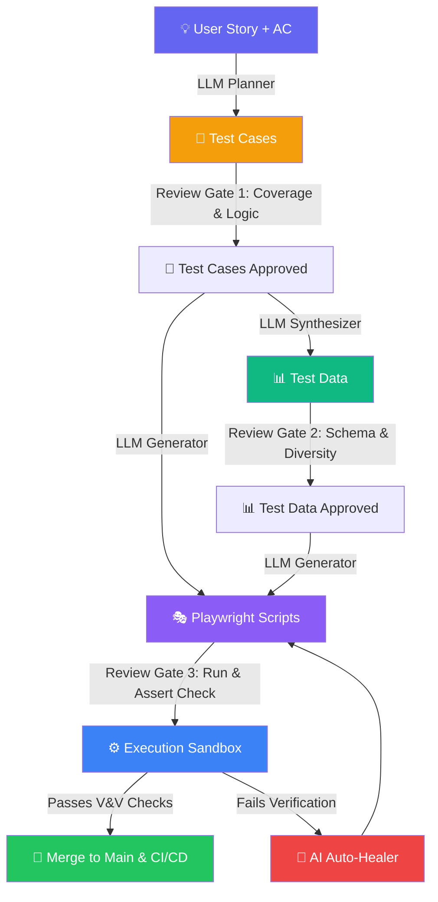

# Kiểm soát Chất lượng (QC) cho E2E Testing: Khi AI sinh Test, ai test lại AI?

## Mở Đầu: Mặt Tối Của Việc Để AI Tự Viết Test

Trong bài viết trước, chúng ta đã tìm hiểu cách kết hợp Playwright với AI Agent để tự động hóa quy trình viết E2E test từ User Story. Tốc độ tăng gấp 5-10 lần là điều có thật. Tuy nhiên, tốc độ cao luôn đi kèm với rủi ro lớn nếu thiếu kiểm soát.

Khi bạn giao toàn quyền sinh test cases, test data, và test script cho AI, bạn sẽ sớm đối mặt với 3 "bệnh" kinh điển:

1. **Test rỗng (Hollow Tests):** Test vẫn PASS xanh rì, nhưng thực tế là do assertion quá lỏng hoặc AI quên không assert logic nghiệp vụ (ví dụ: chỉ check URL thay vì check data hiển thị).
2. **Data "sạch" nhân tạo (Synthetically Clean Data):** Test data do AI sinh ra quá hoàn hảo, không phản ánh được sự hỗn loạn của dữ liệu thực tế (thiếu các ký tự đặc biệt, lỗi font, boundary limit).
3. **Mất kiểm soát locator (Brittle Selectors):** AI tự bịa ra các selector CSS/XPath trông có vẻ đúng nhưng sẽ vỡ ngay khi giao diện thay đổi nhẹ.

> [!IMPORTANT]
> **Nguyên tắc cốt lõi:** AI rất giỏi tối ưu hóa việc viết code (the "How"), nhưng con người phải là người kiểm soát mục tiêu và độ tin cậy (the "Why"). Chúng ta cần một quy trình **Quality Control (QC)** nghiêm ngặt để "test lại những gì AI đã test".

Bài viết này chia sẻ quy trình thực chiến và các công cụ giúp bạn kiểm soát 100% chất lượng đầu ra của AI Agent trong kiểm thử phần mềm.

**Nội dung chính:**
- Quy trình 3 lớp kiểm soát chất lượng: Test Cases, Test Data, Test Script.
- Kỹ thuật **Substitution Test** và **Mutation Testing** áp dụng cho AI.
- Phân vai thực chiến: khi nào tin tưởng AI, khi nào con người phải can thiệp.
- Khung thực chiến: Checklist đánh giá chất lượng test của AI.
- Code demo kiểm thử độ tin cậy của test script Playwright.

---

## 1. Quy Trình 3 Lớp Kiểm Soát Chất Lượng (Quality Control Pipeline)

Để đảm bảo các test artifacts do AI sinh ra đủ tiêu chuẩn đưa vào production, chúng phải đi qua một pipeline kiểm chứng tự động kết hợp với đánh giá của con người (Human-in-the-Loop).



### Lớp 1: Kiểm soát chất lượng Test Cases (Phần Planner)
*AI thường gặp lỗi "thiếu logic nghiệp vụ sâu" khi phân tích requirement sơ sài.*

- **Kiểm soát Prompt:** Yêu cầu AI luôn phải sinh ra 3 nhóm test case: *Happy Path*, *Negative Path*, và *Edge Cases / Boundary*.
- **Traceability Matrix:** Đảm bảo mỗi test case được sinh ra phải trỏ ngược lại chính xác một Acceptance Criteria (AC) của User Story. Nếu có test case "mồ côi", loại bỏ hoặc kiểm tra lại.
- **Rà soát thủ công:** QA Lead chỉ cần quét qua danh sách Test Cases (thường dạng Markdown/JSON) để bổ sung các case đặc thù của hệ thống cũ mà AI không thể biết qua prompt.

### Lớp 2: Kiểm soát chất lượng Test Data (Phần Dữ liệu)
*AI thường sinh dữ liệu quá sạch, thiếu tính đa dạng và thực tế.*

- **Đa dạng hóa dữ liệu (Diversity):** Cấu hình AI sinh dữ liệu có chứa ký tự có dấu (tiếng Việt), emoji, khoảng trắng thừa, độ dài tối đa/tối thiểu của trường.
- **Rule-based Validation:** Chạy dữ liệu sinh ra qua một script validate schema (ví dụ: dùng Zod hoặc Joi) trước khi nạp vào test database. Điều này chặn đứng lỗi sai format (sai cấu trúc email, ngày tháng không hợp lệ).
- **Zero Leakage:** Nếu dùng AI để sinh dữ liệu từ log sản xuất, bắt buộc phải qua bước ẩn danh hóa (anonymization) để tránh rò rỉ thông tin khách hàng (PII).

### Lớp 3: Kiểm soát chất lượng Test Script (Phần Playwright Code)
*AI viết code chạy được, nhưng chưa chắc đã kiểm thử đúng.*

- **Strict Locators:** Cấm AI sử dụng XPath hoặc CSS selector quá sâu (ví dụ: `div > div > span > button`). Ép AI dùng locator ngữ nghĩa của Playwright: `getByRole`, `getByLabel`, `getByTestId`.
- **Assertion Validation:** Rà soát xem test script có chứa assertion thực tế hay không. Nhiều script sinh bởi AI kết thúc bằng một lệnh `await page.click(...)` mà không có `expect(...)` nào ở cuối. Đó chỉ là "bot click dạo", không phải test.

---

## 2. Kỹ Thuật Thực Chiến Để Kiểm Chứng Test Của AI

Làm sao bạn biết một file test Playwright do AI viết có thực sự phát hiện được bug khi code chính bị lỗi? Hãy áp dụng hai kỹ thuật sau:

### 2.1 Kỹ thuật Substitution Test (Thử nghiệm Thế chỗ)

Đây là cách đơn giản và nhanh nhất để phát hiện các "Test rỗng" (Hollow Tests) — những test pass chỉ vì assertion quá lỏng lẻo.

**Cách thực hiện:**
1. Mở file test Playwright do AI sinh ra.
2. Tìm đến dòng assertion chính, ví dụ: `expect(statusText).toBe('Thành công')`.
3. Đổi giá trị mong muốn thành sai lệch: `expect(statusText).toBe('Thất bại')`.
4. Chạy lại test.
   - **Kết quả đúng:** Test phải **FAIL**. Điều này chứng tỏ assertion hoạt động hiệu quả.
   - **Kết quả sai (Nguy hiểm):** Test vẫn **PASS**. Nghĩa là assertion đang trỏ sai element, hoặc logic code không chạy qua dòng assertion đó. Bạn cần viết lại test ngay lập tức.

### 2.2 Kỹ thuật Mutation Testing (Kiểm thử Đột biến)

Mutation Testing nâng tầm Substitution Test lên mức tự động. Công cụ sẽ tự động chỉnh sửa code nguồn của bạn (tạo ra các bản đột biến - mutants) và chạy test suite của bạn chống lại các bản đột biến đó.

```
Code nguồn gốc:    if (score >= 50) { return 'Pass'; }
Bản đột biến (Mutant): if (score > 50) { return 'Pass'; }  // Sửa >= thành >
```

- Nếu test suite của bạn **FAIL** khi chạy với Mutant → Bạn đã **"tiêu diệt" (killed)** được mutant đó. Test suite tốt.
- Nếu test suite vẫn **PASS** → Mutant **"sống sót" (survived)**. Test suite của bạn đang thiếu test case ở điểm biên (boundary value) đó.

!!! warning "Lưu ý về Stryker Mutator và Playwright"
    **Stryker Mutator** là công cụ mutation testing hàng đầu cho JavaScript/TypeScript, nhưng nó được thiết kế chủ yếu cho **unit tests** (Jest, Vitest, Mocha). Stryker **không có plugin chính thức cho Playwright E2E tests** vì E2E tests chạy quá chậm để lặp qua hàng trăm mutants. **Khuyến nghị:** Dùng Stryker cho tầng unit/component tests, và áp dụng **Substitution Test thủ công hoặc bán tự động** (như script ở Mục 5) cho tầng E2E Playwright.

---

## 3. Phân Vai Thực Chiến: Tin Tưởng AI Ở Đâu và Khi Nào Con Người Phải Can Thiệp?

Để tối ưu hóa chi phí và đảm bảo chất lượng tuyệt đối, chúng ta cần phân chia ranh giới rõ ràng giữa **Khả năng tự động hóa của AI (Automation)** và **Khả năng phán đoán của Con người (Judgment)**. Không thể tin tưởng AI mù quáng, nhưng cũng không nên can thiệp quá sâu làm mất đi lợi thế về tốc độ.

### 3.1 Ma trận phân chia vai trò AI - Con người trong QA

```
┌───────────────────────────────────────┬───────────────────────────────────────┐
│           🤖 TIN TƯỞNG AI             │         👨‍💻 CON NGƯỜI CAN THIỆP        │
├───────────────────────────────────────┼───────────────────────────────────────┤
│ • Viết code thô (Boilerplate)         │ • Thẩm định logic nghiệp vụ (Intent) │
│ • Page Object Model scaffolding      │ • Thiết kế test cases bảo mật/phân quyền│
│ • Sinh dữ liệu mock số lượng lớn      │ • Seed dữ liệu biên phức tạp, DB state│
│ • Tự động sửa locator (Self-healing)  │ • Code review, duyệt PR cuối cùng     │
│ • Chạy test & ghi log/trace/video     │ • Substitution & Mutation validation  │
└───────────────────────────────────────┴───────────────────────────────────────┘
```

#### Khi nào bạn có thể tin tưởng giao phó cho AI?
- **Khởi tạo cấu trúc (Boilerplate & POM):** AI cực kỳ xuất sắc trong việc đọc DOM và tạo ra các Page Object classes mẫu sạch đẹp. Giao việc này cho AI giúp tiết kiệm 90% thời gian gõ code thô.
- **Tái thiết kế selector đơn giản (Self-healing):** Khi id của nút thay đổi từ `submit-btn` sang `submit-button`, AI Agent sử dụng MCP có thể tự tìm phần tử tương đương thông qua accessibility tree mà không cần bạn can thiệp.
- **Mocking dữ liệu diện rộng:** Sinh 1,000 dòng dữ liệu người dùng ngẫu nhiên đúng định dạng cho stress testing là việc AI làm rất tốt và nhanh hơn con người tự viết SQL script hay điền excel.

#### Khi nào con người BẮT BUỘC phải can thiệp kiểm soát?
- **Xác nhận "Ý đồ kiểm thử" (Intent & Logic Validation):** AI chỉ quan tâm đến việc chạy code từ điểm A đến điểm B mà không báo lỗi. Chỉ có con người mới biết: *"Liệu bước click này có thực sự kích hoạt lệnh thanh toán tiền hay chỉ là click ảo?"*. Bạn phải review kỹ các câu lệnh `expect`.
- **Dữ liệu biên và Trạng thái Database (Db State):** Với các test case phức tạp đòi hỏi database ở trạng thái đặc thù (ví dụ: tài khoản hết hạn đúng 1 ngày trước), AI rất dễ giả lập sai. Con người phải tự viết hoặc cấu hình các API seed data chính xác.
- **Bảo mật và Phân quyền (Security & Authorization):** Các kịch bản như kiểm tra xem User A có đọc được dữ liệu của User B hay không đòi hỏi tư duy tấn công (adversarial thinking). AI thường viết các test case rất "ngây thơ" và dễ bỏ qua các lỗ hổng phân quyền lớn.

---

## 4. Khung Thực Chiến: Checklist Đánh Giá Chất Lượng AI Test

Dưới đây là bảng checklist bạn nên tích hợp vào quy trình Code Review (Pull Request) mỗi khi AI Agent đề xuất test script mới.

### Bảng Checklist Đánh Giá (V&V Checklist)

| Hạng mục | Chỉ tiêu kiểm tra | Trạng thái | Ghi chú |
| :--- | :--- | :---: | :--- |
| **Test Cases** | 1. Có trace ngược về Acceptance Criteria không? | [ ] | Tránh test rác |
| | 2. Đã có ít nhất 2 Negative cases & 1 Edge case chưa? | [ ] | Tránh chỉ test Happy path |
| **Test Data** | 3. Dữ liệu đã bao gồm ký tự đặc biệt/tiếng Việt chưa? | [ ] | Kiểm tra hiển thị & encoding |
| | 4. Dữ liệu nhạy cảm đã được mask/anonymize chưa? | [ ] | An toàn thông tin |
| **Locators** | 5. 100% locators dùng user-centric APIs (`getByRole`...)? | [ ] | Tránh brittle selectors |
| | 6. Không dùng CSS/XPath động (`.button-xyz-123`)? | [ ] | Chống flaky khi build mới |
| **Assertions** | 7. Có ít nhất một assertion chính xác ở cuối luồng? | [ ] | Chặn Hollow Tests |
| | 8. Sử dụng Async Assertions (`expect(...).toBeVisible()`)? | [ ] | Tận dụng auto-waiting |
| **Execution** | 9. Test đã chạy pass 3 lần liên tiếp ở local chưa? | [ ] | Xác minh độ ổn định ban đầu |
| | 10. Chạy lệnh `--repeat-each=5` có tỷ lệ pass 100%? | [ ] | Phát hiện lỗi flaky timing |

---

## 5. Code Demo: Tự Động Hóa Kiểm Chứng Bằng Substitution Test

Dưới đây là một ví dụ thực tế. Chúng ta có một test script Playwright kiểm thử tính năng giỏ hàng do AI viết. Chúng ta sẽ viết một script NodeJS nhỏ để tự động "đột biến" (mutate) assertion của test script này nhằm kiểm tra xem test suite có thực sự phát hiện ra lỗi hay không.

### 5.1 Test Script do AI viết (tests/cart.spec.ts)

```typescript
import { test, expect } from '@playwright/test';

test('Thêm sản phẩm vào giỏ hàng thành công', async ({ page }) => {
  await page.goto('/products');
  
  // Click thêm sản phẩm đầu tiên
  await page.getByRole('button', { name: 'Thêm vào giỏ' }).first().click();
  
  // Kiểm tra số lượng trên icon giỏ hàng hiển thị là "1"
  const cartBadge = page.locator('#cart-count'); // ⚠️ Điểm yếu: dùng ID thô
  
  // Assertion do AI viết
  await expect(cartBadge).toHaveText('1');
});
```

### 5.2 Script tự động chạy Substitution Test (verify-test-quality.ts)

Script này sẽ đọc file test trên, thay đổi kỳ vọng từ `'1'` thành `'999'` (một giá trị sai rõ ràng), chạy test, và xác nhận rằng test phải **fail**. Nếu test vẫn pass, nó sẽ cảnh báo test chất lượng kém.

```typescript
import * as fs from 'fs';
import { execSync } from 'child_process';
import * as path from 'path';

const TEST_FILE_PATH = path.join(__dirname, 'tests/cart.spec.ts');
const BACKUP_FILE_PATH = path.join(__dirname, 'tests/cart.spec.ts.bak');

function runQualityCheck() {
  console.log('🔄 Đang tiến hành Substitution Test trên file:', TEST_FILE_PATH);

  // 1. Sao lưu file test gốc
  fs.copyFileSync(TEST_FILE_PATH, BACKUP_FILE_PATH);

  try {
    // 2. Đọc nội dung và tạo đột biến (thay '1' bằng '999')
    let testContent = fs.readFileSync(TEST_FILE_PATH, 'utf-8');
    
    // Đột biến dòng assertion
    const mutatedContent = testContent.replace(
      "toHaveText('1')", 
      "toHaveText('999')"
    );

    if (testContent === mutatedContent) {
      throw new Error('❌ Không tìm thấy assertion phù hợp để đột biến!');
    }

    fs.writeFileSync(TEST_FILE_PATH, mutatedContent, 'utf-8');
    console.log('✏️ Đã tiêm mã độc (Mutant injected): thay đổi kỳ vọng thành "999"');

    // 3. Chạy Playwright test
    console.log('⚡ Chạy Playwright test chống lại bản đột biến...');
    execSync('npx playwright test tests/cart.spec.ts', { stdio: 'pipe' });
    
    // Nếu dòng lệnh trên KHÔNG ném ra lỗi (nghĩa là test PASS)
    console.error('🚨 CẢNH BÁO NGUY HIỂM: Test vẫn PASS mặc dù assertion đã bị sửa sai!');
    console.error('👉 Test script do AI viết có chất lượng kém (Hollow Test). Hãy kiểm tra lại!');

  } catch (error: any) {
    // Nếu có lỗi (nghĩa là test FAIL - đúng kỳ vọng)
    if (error.status !== undefined) {
      console.log('✅ KẾT QUẢ ĐẠT: Test suite đã FAIL chính xác khi gặp assertion sai.');
      console.log('👍 Độ tin cậy của test script được xác minh.');
    } else {
      console.error('❌ Lỗi hệ thống khi chạy verification:', error.message);
    }
  } finally {
    // 4. Khôi phục lại file gốc
    fs.copyFileSync(BACKUP_FILE_PATH, TEST_FILE_PATH);
    fs.unlinkSync(BACKUP_FILE_PATH);
    console.log('♻️ Đã khôi phục trạng thái file test ban đầu.');
  }
}

runQualityCheck();
```

**Cách chạy kiểm tra:**

```bash
# Chạy script verify chất lượng
npx ts-node verify-test-quality.ts
```

!!! tip "Ý tưởng mở rộng"
    Bạn có thể tích hợp script này vào pre-commit hook hoặc chạy định kỳ trên CI để quét các test script do AI mới tạo ra trước khi phê duyệt Pull Request.

---

## Kết Luận: Hãy Làm Chủ AI Agent Của Bạn

Để AI Agent tự sinh và chạy test là một bước tiến vượt bậc của ngành QA. Nhưng hãy nhớ rằng: **AI không có trách nhiệm về chất lượng sản phẩm của bạn, bạn mới là người chịu trách nhiệm.**

Bằng cách áp dụng quy trình kiểm soát chất lượng 3 lớp và các kỹ thuật như **Substitution Test**, bạn sẽ biến AI từ một "trợ lý sinh code ẩu" thành một "cỗ máy sản xuất test suite tự động và đáng tin cậy".

**Tóm tắt hành động:**
1. Thiết lập **Playwright MCP** để AI "nhìn" DOM thật khi sinh test.
2. Áp dụng checklist PR nghiêm ngặt cho mọi file test sinh bởi AI.
3. Chạy định kỳ **Substitution Test** (bán tự động) cho E2E scripts, và **Stryker Mutator** cho unit/component tests.
4. Khi test fail trên CI, sử dụng **Playwright Trace Viewer** để debug — đây là nguồn chứng cứ đáng tin cậy nhất thay vì chỉ đọc log.

---

## Tham Khảo

- [Stryker Mutator Documentation](https://stryker-mutator.io/docs/) — Công cụ kiểm thử đột biến hàng đầu cho JavaScript/TypeScript.
- [Playwright Best Practices — Locators](https://playwright.dev/docs/best-practices#use-locators) — Hướng dẫn chính thức về cách chọn selector bền vững.
- [Great Expectations](https://greatexpectations.io/) — Framework kiểm soát chất lượng dữ liệu (Test Data Validation).
- Bài liên quan:
    - [Playwright + AI Agent: Tự động sinh và chạy End-to-End Test từ User Story](./2026-05-20-playwright-ai-agent-e2e-test.md)
    - [Test-Driven Development với AI Agent: Viết Test trước, để Agent tự code](./2026-05-16-tdd-voi-ai-agent.md)
