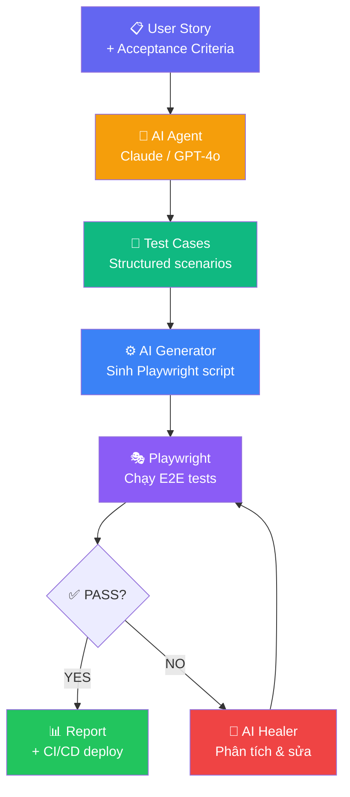
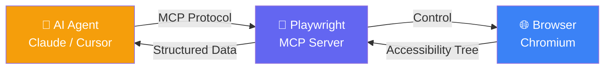
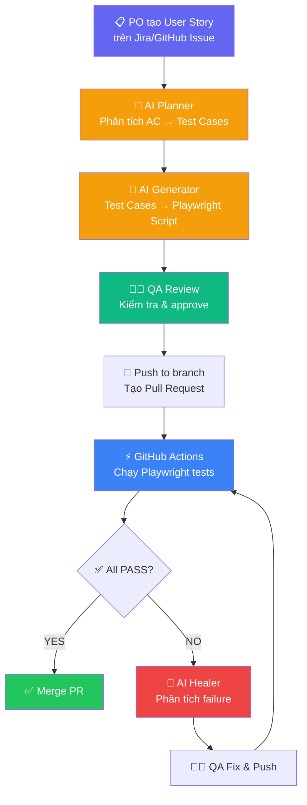

# Playwright + AI Agent: Tự động sinh và chạy End-to-End Test từ User Story

## Mở Đầu: QA Automation Đang Thay Đổi

Bạn là QA Automation Engineer. Mỗi sprint, PO giao 10 User Story mới. Bạn phải đọc từng story, phân tích Acceptance Criteria, viết test cases, rồi code Playwright script cho từng case. Mất 2-3 ngày — và sprint chỉ có 10 ngày.

**Nếu AI Agent có thể làm 70% công việc đó trong vài phút thì sao?**

Đây không phải viễn cảnh tương lai — nó đang xảy ra ngay bây giờ. Với sự kết hợp giữa **Playwright**, **Model Context Protocol (MCP)**, và các LLM như **Claude** hoặc **GPT-4o**, QA Engineer có thể tự động hóa pipeline từ User Story → Test Cases → Playwright Script → CI/CD.

**Nội dung chính:**

- Workflow tổng thể: User Story → AI Agent → Playwright Tests
- Cách dùng LLM phân tích User Story và sinh test cases
- Mã nguồn mẫu Playwright (TypeScript) hoàn chỉnh
- Tích hợp Playwright MCP Server với AI Agent
- CI/CD pipeline với GitHub Actions
- Chiến lược chống flaky tests

---

## 1. Tổng Quan Workflow: AI Agent + Playwright

### 1.1 Kiến Trúc Tổng Thể



### 1.2 Ba Agent Chính

Pipeline sử dụng 3 AI Agent chuyên biệt:

| Agent | Vai trò | Input | Output |
|:---|:---|:---|:---|
| **Planner** | Phân tích User Story → Test Scenarios | User Story + AC | Danh sách test cases có cấu trúc |
| **Generator** | Sinh Playwright code từ test cases | Test cases + Page context | File `.spec.ts` chạy được |
| **Healer** | Phân tích failure, tự sửa selector | Error log + DOM snapshot | Script đã fix |

!!! tip "Insight"
    Mô hình 3-agent này (Planner → Generator → Healer) là pattern phổ biến nhất hiện nay. Bạn có thể implement từng agent riêng hoặc dùng pipeline tích hợp qua Playwright MCP.

---

## 2. Bước 1 — Dùng LLM Phân Tích User Story

### 2.1 Input: User Story Mẫu

```markdown
## User Story: Login Feature

**As a** registered user
**I want to** log in with email and password
**So that** I can access my dashboard

### Acceptance Criteria:
1. User nhập email và password hợp lệ → redirect đến /dashboard
2. User nhập email sai → hiển thị "Invalid credentials"
3. User nhập password sai → hiển thị "Invalid credentials"
4. User để trống email → hiển thị "Email is required"
5. User để trống password → hiển thị "Password is required"
6. Sau 5 lần login sai liên tiếp → tài khoản bị khóa 15 phút
```

### 2.2 Prompt Cho AI Agent (Planner)

```text
Bạn là QA Automation Expert. Phân tích User Story sau và tạo danh sách
test cases chi tiết cho End-to-End testing với Playwright.

Yêu cầu:
- Mỗi test case gồm: ID, Title, Pre-conditions, Steps, Expected Result, Priority
- Bao gồm: Happy path, Negative cases, Edge cases, Boundary values
- Format output dạng JSON array
- Ưu tiên testable scenarios, bỏ qua UI cosmetic tests

USER STORY:
{paste user story ở trên}
```

### 2.3 Output: Test Cases Được Sinh Ra

AI Agent sẽ trả về danh sách test cases có cấu trúc:

```json
[
  {
    "id": "TC-LOGIN-001",
    "title": "Successful login with valid credentials",
    "priority": "Critical",
    "preconditions": ["User account exists with email test@example.com"],
    "steps": [
      "Navigate to /login",
      "Enter email: test@example.com",
      "Enter password: ValidPass123!",
      "Click Login button"
    ],
    "expected": "User is redirected to /dashboard, welcome message displayed"
  },
  {
    "id": "TC-LOGIN-002",
    "title": "Login fails with invalid email",
    "priority": "High",
    "preconditions": [],
    "steps": [
      "Navigate to /login",
      "Enter email: wrong@example.com",
      "Enter password: AnyPassword123",
      "Click Login button"
    ],
    "expected": "Error message 'Invalid credentials' is displayed, user stays on /login"
  },
  {
    "id": "TC-LOGIN-003",
    "title": "Login fails with empty email field",
    "priority": "High",
    "preconditions": [],
    "steps": [
      "Navigate to /login",
      "Leave email field empty",
      "Enter password: AnyPassword123",
      "Click Login button"
    ],
    "expected": "Validation message 'Email is required' is displayed"
  },
  {
    "id": "TC-LOGIN-004",
    "title": "Account lockout after 5 failed attempts",
    "priority": "High",
    "preconditions": ["User account exists and is not locked"],
    "steps": [
      "Navigate to /login",
      "Attempt login with wrong password 5 times consecutively",
      "Attempt login with correct password on 6th try"
    ],
    "expected": "Account locked message displayed, login rejected even with correct password"
  }
]
```

!!! info "Lưu ý"
    AI thường sinh 8-15 test cases từ một User Story có 5-6 Acceptance Criteria. Luôn review kết quả — AI có thể miss edge cases đặc thù domain của bạn.

---

## 3. Bước 2 — Sinh Playwright Script Từ Test Cases

### 3.1 Prompt Cho AI Agent (Generator)

```text
Bạn là Playwright Expert. Từ danh sách test cases sau, sinh Playwright
TypeScript test script hoàn chỉnh.

Yêu cầu:
- Dùng @playwright/test framework
- Sử dụng user-facing locators: getByRole, getByLabel, getByText
- KHÔNG dùng waitForTimeout — dùng web-first assertions
- Áp dụng Page Object Model pattern
- Mỗi test phải độc lập (test isolation)
- Thêm meaningful test descriptions

TEST CASES:
{paste JSON test cases}

URL gốc: http://localhost:3000
```

### 3.2 Output: Playwright Script Hoàn Chỉnh

**Page Object Model:**

```typescript
// pages/LoginPage.ts
import { type Page, type Locator } from '@playwright/test';

export class LoginPage {
  readonly page: Page;
  readonly emailInput: Locator;
  readonly passwordInput: Locator;
  readonly loginButton: Locator;
  readonly errorMessage: Locator;
  readonly emailError: Locator;
  readonly passwordError: Locator;

  constructor(page: Page) {
    this.page = page;
    this.emailInput = page.getByLabel('Email');
    this.passwordInput = page.getByLabel('Password');
    this.loginButton = page.getByRole('button', { name: 'Login' });
    this.errorMessage = page.getByRole('alert');
    this.emailError = page.getByText('Email is required');
    this.passwordError = page.getByText('Password is required');
  }

  async goto() {
    await this.page.goto('/login');
  }

  async login(email: string, password: string) {
    await this.emailInput.fill(email);
    await this.passwordInput.fill(password);
    await this.loginButton.click();
  }
}
```

**Test Script:**

```typescript
// tests/login.spec.ts
import { test, expect } from '@playwright/test';
import { LoginPage } from '../pages/LoginPage';

test.describe('Login Feature - User Story', () => {

  let loginPage: LoginPage;

  test.beforeEach(async ({ page }) => {
    loginPage = new LoginPage(page);
    await loginPage.goto();
  });

  // TC-LOGIN-001: Happy path
  test('TC-001: successful login redirects to dashboard', async ({ page }) => {
    await loginPage.login('test@example.com', 'ValidPass123!');

    // Web-first assertion — tự động chờ redirect
    await expect(page).toHaveURL('/dashboard');
    await expect(
      page.getByRole('heading', { name: /welcome/i })
    ).toBeVisible();
  });

  // TC-LOGIN-002: Invalid email
  test('TC-002: invalid email shows error message', async ({ page }) => {
    await loginPage.login('wrong@example.com', 'AnyPassword123');

    await expect(loginPage.errorMessage).toContainText('Invalid credentials');
    await expect(page).toHaveURL('/login');
  });

  // TC-LOGIN-003: Empty email
  test('TC-003: empty email shows validation error', async ({ page }) => {
    await loginPage.login('', 'AnyPassword123');

    await expect(loginPage.emailError).toBeVisible();
  });

  // TC-LOGIN-004: Empty password
  test('TC-004: empty password shows validation error', async ({ page }) => {
    await loginPage.login('test@example.com', '');

    await expect(loginPage.passwordError).toBeVisible();
  });

  // TC-LOGIN-005: Account lockout
  test('TC-005: account locks after 5 failed attempts', async ({ page }) => {
    // 5 lần login sai liên tiếp
    for (let i = 0; i < 5; i++) {
      await loginPage.login('test@example.com', 'WrongPass');
      // Chờ error hiển thị trước khi thử lại
      await expect(loginPage.errorMessage).toBeVisible();
      // Clear fields cho lần tiếp
      if (i < 4) await loginPage.goto();
    }

    // Lần thứ 6 với password đúng
    await loginPage.goto();
    await loginPage.login('test@example.com', 'ValidPass123!');

    await expect(loginPage.errorMessage).toContainText(/locked|khóa/i);
  });
});
```

!!! warning "Quan trọng"
    AI-generated tests là **bản nháp chất lượng cao**, không phải sản phẩm hoàn chỉnh. QA Engineer phải review locators, assertions, và test data trước khi commit.

---

## 4. Playwright MCP — AI Agent "Nhìn Thấy" Ứng Dụng

### 4.1 MCP Là Gì?

**Model Context Protocol (MCP)** cho phép AI Agent điều khiển browser thật thông qua Playwright. Thay vì "đoán" cấu trúc HTML, AI trực tiếp **navigate, inspect DOM, và tương tác** với ứng dụng.



### 4.2 Cài Đặt Playwright MCP Server

**Bước 1: Cài đặt dependencies**

```bash
# Cài Playwright
npm init -y
npm install -D @playwright/test
npx playwright install

# MCP server chạy qua npx, không cần cài riêng
```

**Bước 2: Cấu hình MCP cho IDE**

Tạo file `.mcp.json` tại root project:

```json
{
  "mcpServers": {
    "playwright": {
      "command": "npx",
      "args": ["@playwright/mcp@latest"]
    }
  }
}
```

Cấu hình theo IDE:

| IDE | Cách cấu hình |
|:---|:---|
| **VS Code + Copilot** | Command Palette → `MCP: Open Workspace Configuration` |
| **Cursor** | Settings → MCP → Add new MCP Server |
| **Claude Desktop** | Settings → Developer → Edit Config |

**Bước 3: Sử dụng**

Sau khi cấu hình, bạn có thể prompt AI Agent trực tiếp:

```text
Navigate to http://localhost:3000/login. 
Explore the login form, identify all input fields and buttons. 
Then generate a Playwright test covering:
1. Successful login
2. Invalid credentials
3. Empty field validation
```

AI Agent sẽ mở browser thật, inspect accessibility tree, và sinh test chính xác với locators thực tế.

!!! tip "Lợi thế MCP"
    Không còn cảnh AI hallucinate selector `#login-btn-v2` không tồn tại. MCP đảm bảo mọi locator đều lấy từ DOM thật.

---

## 5. Tích Hợp CI/CD Pipeline

### 5.1 Playwright Config Cho CI

```typescript
// playwright.config.ts
import { defineConfig, devices } from '@playwright/test';

export default defineConfig({
  testDir: './tests',
  fullyParallel: true,

  // Chặn test.only trong CI
  forbidOnly: !!process.env.CI,

  // Retry 2 lần trong CI, 0 khi local
  retries: process.env.CI ? 2 : 0,

  // Parallel workers
  workers: process.env.CI ? 2 : undefined,

  reporter: [
    ['html', { open: 'never' }],
    ['json', { outputFile: 'test-results/results.json' }],
  ],

  use: {
    baseURL: process.env.BASE_URL || 'http://localhost:3000',
    // Capture trace chỉ khi retry
    trace: 'on-first-retry',
    // Screenshot khi fail
    screenshot: 'only-on-failure',
  },

  projects: [
    {
      name: 'chromium',
      use: { ...devices['Desktop Chrome'] },
    },
    {
      name: 'firefox',
      use: { ...devices['Desktop Firefox'] },
    },
  ],

  // Dev server tự khởi động
  webServer: {
    command: 'npm run dev',
    url: 'http://localhost:3000',
    reuseExistingServer: !process.env.CI,
  },
});
```

### 5.2 GitHub Actions Workflow

```yaml
# .github/workflows/e2e-tests.yml
name: E2E Tests (Playwright)

on:
  push:
    branches: [main]
  pull_request:
    branches: [main]

jobs:
  e2e-tests:
    timeout-minutes: 30
    runs-on: ubuntu-latest
    steps:
      - uses: actions/checkout@v4

      - uses: actions/setup-node@v4
        with:
          node-version: 20

      - name: Install dependencies
        run: npm ci

      - name: Install Playwright browsers
        run: npx playwright install --with-deps chromium firefox

      - name: Run E2E tests
        run: npx playwright test
        env:
          BASE_URL: http://localhost:3000

      - name: Upload test report
        uses: actions/upload-artifact@v4
        if: ${{ !cancelled() }}
        with:
          name: playwright-report
          path: playwright-report/
          retention-days: 14

      - name: Upload test results
        uses: actions/upload-artifact@v4
        if: ${{ !cancelled() }}
        with:
          name: test-results
          path: test-results/
          retention-days: 7
```

### 5.3 Pipeline Hoàn Chỉnh Với AI Agent



---

## 6. Chiến Lược Chống Flaky Tests

Flaky tests — test lúc pass lúc fail — là kẻ thù số 1 của E2E testing. Với AI-generated tests, rủi ro flaky càng cao hơn nếu không kiểm soát.

### 6.1 Nguyên Tắc Vàng

| Nguyên tắc | ✅ Nên | ❌ Không nên |
|:---|:---|:---|
| **Locators** | `getByRole('button', { name: 'Submit' })` | `page.locator('#btn-submit-v2')` |
| **Chờ đợi** | `await expect(el).toBeVisible()` | `await page.waitForTimeout(3000)` |
| **Data** | Seed data qua API trước mỗi test | Phụ thuộc data từ test trước |
| **State** | Mỗi test bắt đầu từ trạng thái clean | Chia sẻ state giữa các tests |

### 6.2 Kỹ Thuật Cụ Thể

**1. Dùng Web-First Assertions:**

```typescript
// ❌ Flaky — hard-coded wait
await page.waitForTimeout(2000);
expect(await page.textContent('.message')).toBe('Success');

// ✅ Stable — auto-waiting assertion
await expect(page.getByText('Success')).toBeVisible();
```

**2. Retry thông minh trong CI:**

```typescript
// playwright.config.ts
export default defineConfig({
  retries: process.env.CI ? 2 : 0,
  // Bật trace khi retry để debug
  use: {
    trace: 'on-first-retry',
  },
});
```

**3. Stress-test locally trước khi commit:**

```bash
# Chạy mỗi test 10 lần để phát hiện flaky
npx playwright test --repeat-each=10

# Chạy toàn bộ suite nhiều lần
npx playwright test --repeat-each=5 --workers=4
```

**4. Quarantine flaky tests:**

```typescript
// Đánh dấu test flaky, skip tạm thời
test.skip('TC-005: account lockout', async ({ page }) => {
  // TODO: Fix race condition in lockout counter API
  // Ticket: JIRA-1234
});
```

!!! warning "Cảnh báo"
    AI-generated locators dễ bị flaky nếu AI không "thấy" DOM thật. **Luôn dùng Playwright MCP** thay vì để AI đoán selectors từ mô tả text.

### 6.3 Checklist Trước Khi Merge AI-Generated Tests

- [ ] Tất cả locators dùng `getByRole`, `getByLabel`, hoặc `getByText`
- [ ] Không có `waitForTimeout` trong code
- [ ] Mỗi test độc lập — chạy riêng vẫn pass
- [ ] Chạy `--repeat-each=5` không có flaky
- [ ] Test data được seed qua API, không qua UI
- [ ] Assertions kiểm tra đúng business logic, không chỉ UI state

---

## 7. Script Tự Động Hóa: Từ User Story Đến Tests

Dưới đây là script Node.js mẫu kết nối OpenAI API để tự động sinh test cases từ User Story:

```typescript
// scripts/generate-tests.ts
import OpenAI from 'openai';
import * as fs from 'fs';

const client = new OpenAI({ apiKey: process.env.OPENAI_API_KEY });

interface TestCase {
  id: string;
  title: string;
  priority: string;
  steps: string[];
  expected: string;
}

async function generateTestCases(userStory: string): Promise<TestCase[]> {
  const response = await client.chat.completions.create({
    model: 'gpt-4o',
    messages: [
      {
        role: 'system',
        content: `Bạn là QA Automation Expert. Phân tích User Story 
        và tạo test cases dạng JSON array. Mỗi case gồm: 
        id, title, priority (Critical/High/Medium/Low), 
        steps (string[]), expected (string).
        Bao gồm happy path, negative, edge cases.`
      },
      { role: 'user', content: userStory }
    ],
    response_format: { type: 'json_object' },
    temperature: 0.3, // Giữ output ổn định
  });

  const result = JSON.parse(response.choices[0].message.content || '{}');
  return result.testCases || [];
}

async function generatePlaywrightScript(
  testCases: TestCase[],
  baseUrl: string
): Promise<string> {
  const response = await client.chat.completions.create({
    model: 'gpt-4o',
    messages: [
      {
        role: 'system',
        content: `Sinh Playwright TypeScript test script từ test cases.
        Yêu cầu: dùng @playwright/test, Page Object Model,
        getByRole/getByLabel locators, web-first assertions.
        KHÔNG dùng waitForTimeout.`
      },
      {
        role: 'user',
        content: `Base URL: ${baseUrl}\n\nTest Cases:\n${JSON.stringify(testCases, null, 2)}`
      }
    ],
    temperature: 0.2,
  });

  return response.choices[0].message.content || '';
}

// --- Main ---
async function main() {
  const userStory = fs.readFileSync(
    process.argv[2] || 'user-story.md', 'utf-8'
  );

  console.log('📋 Generating test cases...');
  const testCases = await generateTestCases(userStory);
  console.log(`✅ Generated ${testCases.length} test cases`);

  fs.writeFileSync(
    'test-cases.json',
    JSON.stringify(testCases, null, 2)
  );

  console.log('⚙️ Generating Playwright script...');
  const script = await generatePlaywrightScript(
    testCases,
    'http://localhost:3000'
  );

  fs.writeFileSync('tests/generated.spec.ts', script);
  console.log('✅ Playwright script saved to tests/generated.spec.ts');
  console.log('🔍 Review script before running: npx playwright test');
}

main().catch(console.error);
```

**Chạy script:**

```bash
# Cài dependencies
npm install openai

# Chạy
OPENAI_API_KEY=sk-xxx npx tsx scripts/generate-tests.ts user-story.md
```

---

## Kết Luận

Kết hợp **Playwright + AI Agent** không thay thế QA Engineer — nó **nâng cấp** vai trò QA từ "người viết script" thành **"người thiết kế chiến lược test"**.

**Workflow tối ưu:**

1. **PO viết User Story** với Acceptance Criteria rõ ràng
2. **AI Planner phân tích** → sinh test cases có cấu trúc
3. **AI Generator sinh** Playwright script theo best practices
4. **QA Engineer review** — kiểm tra logic, locators, edge cases
5. **CI/CD chạy tự động** — với retry, trace, và report
6. **AI Healer phân tích failure** — đề xuất fix khi test break

**3 điều cần nhớ:**

- 🎯 **AI là bản nháp, QA là biên tập viên** — luôn review trước khi merge
- 🔌 **Dùng Playwright MCP** — để AI thấy DOM thật, tránh hallucinated selectors
- 🛡️ **Chống flaky là ưu tiên số 1** — web-first assertions, test isolation, stress-test

> [!IMPORTANT]
> **Takeaway:** AI Agent giảm 60-70% thời gian viết E2E tests, nhưng 30% còn lại — review, chiến lược, domain knowledge — chính là giá trị không thể thay thế của QA Engineer.

---

## Tham Khảo

- [Playwright Documentation — Getting Started](https://playwright.dev/docs/intro) — Hướng dẫn chính thức cài đặt và sử dụng Playwright
- [Playwright MCP Server](https://github.com/anthropics/playwright-mcp) — Tích hợp AI Agent với Playwright qua Model Context Protocol
- [Checkly — AI-Assisted Playwright Testing](https://www.checklyhq.com/) — Hướng dẫn dùng AI với Playwright trong monitoring
- [Playwright CI/CD — GitHub Actions](https://playwright.dev/docs/ci-intro) — Tài liệu chính thức về tích hợp CI/CD
- Bài liên quan:
    - [TDD với AI Agent: Viết Test trước, để Agent tự code](./2026-05-16-tdd-voi-ai-agent.md)
    - [AI Agent cho Code Review: GitHub Actions + AI](./2026-05-19-ai-agent-code-review-github-actions.md)
