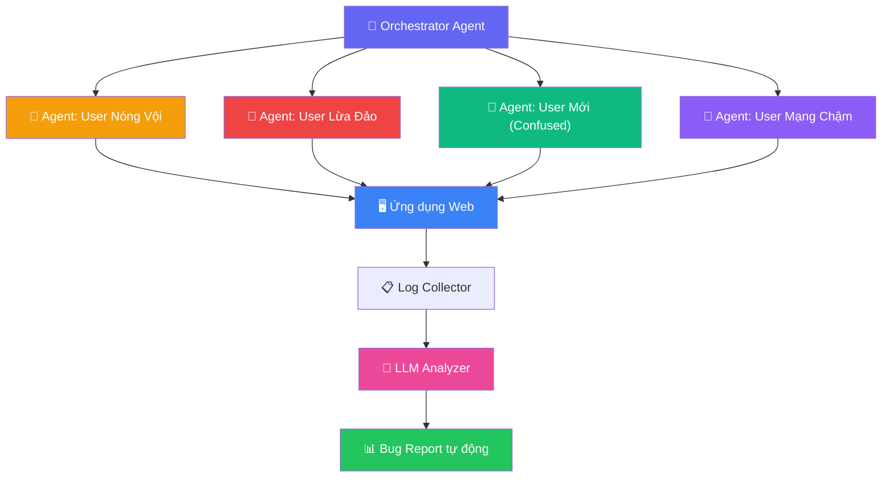
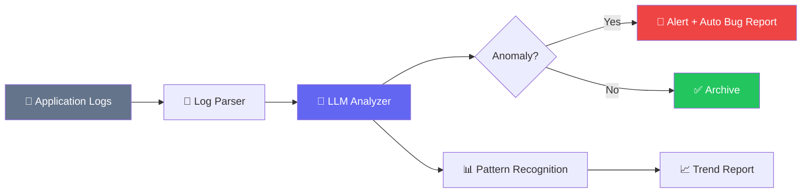
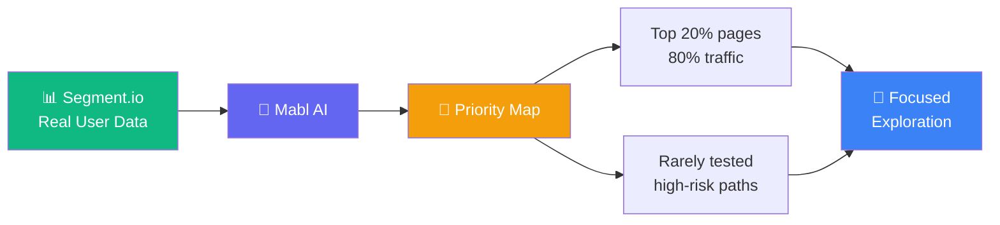
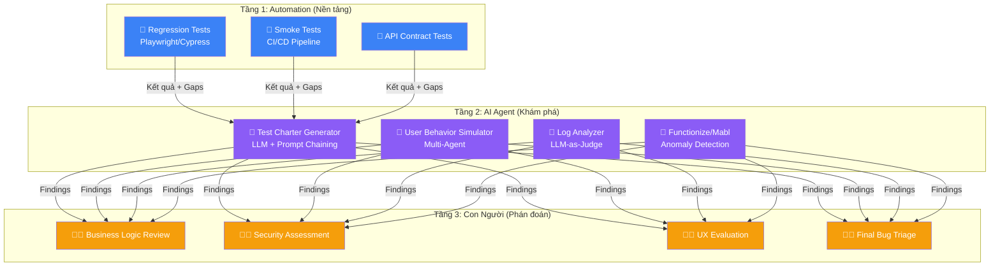

# AI Agent cho Exploratory Testing: Chiến lược dùng LLM để tìm Bug mà Automation bỏ sót

## Mở Đầu: "1.000 Test Case PASS Xanh" — Nhưng Bug Vẫn Lọt Production

Bạn có bao giờ ở trong tình huống này không? CI/CD pipeline xanh rực, test coverage trên 80%, cả team tự tin ship release — rồi khách hàng gọi điện báo lỗi mà không ai lường trước được. Một chuỗi thao tác "kỳ lạ" của người dùng thật đã phá vỡ toàn bộ flow thanh toán, trong khi 1.000 test case tự động đang ngồi bất lực bên cạnh vì chẳng test case nào nghĩ đến kịch bản đó.

Đó chính là **giới hạn cấu trúc** (structural limitation) của automation test truyền thống: nó chỉ kiểm tra được **những gì bạn đã lường trước**. Còn những "unknown unknowns" — những bug mà bạn thậm chí không biết là mình cần tìm — thì sao?

Với vai trò Test Lead đã trải qua hơn nhiều dự án lớn nhỏ, tôi nhận ra rằng **Exploratory Testing** luôn là vũ khí bí mật để tìm ra những bug "nguy hiểm nhất". Và bây giờ, với sự xuất hiện của **AI Agent dựa trên LLM**, chúng ta có thể nâng tầm khả năng khám phá đó lên một cấp độ hoàn toàn mới.

**Nội dung chính:**

- Phân tích 5 giới hạn cốt lõi của automation test truyền thống mà không thể khắc phục bằng cách viết thêm test.
- 3 kỹ thuật thực chiến dùng LLM: sinh Test Charter, mô phỏng hành vi người dùng bất thường, và phân tích log thông minh.
- Demo chiến lược triển khai với **Functionize** và **Mabl** — hai nền tảng AI Testing hàng đầu.
- Mô hình lai (Hybrid Model) kết hợp automation + AI Agent + con người.

---

## 1. Giới Hạn Cấu Trúc Của Automation Test Truyền Thống

Trước khi nói về giải pháp, hãy thành thật nhìn nhận vấn đề. Automation test không sai — nó chỉ **không đủ**.

### 1.1 Chỉ kiểm tra được "Known Knowns"

Automation test hoạt động theo mô hình **Deterministic Scripted Execution**: test chạy đúng kịch bản đã viết, với đầu vào đã biết, và kiểm tra đầu ra đã mong đợi. Điều này tuyệt vời cho regression testing, nhưng hoàn toàn bất lực trước các tình huống mà không ai nghĩ ra.

```
┌─────────────────────────────────────────────────────────┐
│               MA TRẬN KIẾN THỨC KIỂM THỬ                │
├─────────────────────────┬───────────────────────────────┤
│   Known Knowns          │   Known Unknowns              │
│   (Automation xử lý tốt)│   (Exploratory Testing)       │
│   ✅ Happy path          │   ⚠️ Edge cases đã biết       │
│   ✅ Regression          │   ⚠️ Rủi ro đã nhận diện     │
├─────────────────────────┼───────────────────────────────┤
│   Unknown Knowns        │   Unknown Unknowns            │
│   (Kinh nghiệm team)   │   🔴 AI AGENT KHAI PHÁ        │
│   ⚠️ Tribal knowledge   │   🔴 Bug chưa ai nghĩ tới    │
│   ⚠️ Assumption ẩn      │   🔴 Hành vi bất thường      │
└─────────────────────────┴───────────────────────────────┘
```

### 1.2 "Ảo tưởng Coverage"

Trong thực tế dự án, tôi từng thấy team tự hào vì đạt **85% code coverage**. Nhưng khi phân tích sâu, phần lớn test chỉ kiểm tra Happy Path — con đường mà user "ngoan ngoãn" đi qua. Theo thống kê từ các tổ chức kiểm thử phần mềm, các team trưởng thành thường dành **20-40% năng lực** cho exploratory testing bên cạnh automation vì họ hiểu rằng con số coverage cao không đồng nghĩa với chất lượng cao.

!!! warning "Bẫy Coverage"
    Executing 1.000 test cases không đảm bảo quality nếu những test đó không bao phủ được real-world usage patterns. Một test suite có 50% coverage nhưng thiết kế thông minh có thể phát hiện bug nhiều hơn test suite 90% coverage nhưng chỉ test Happy Path.

### 1.3 Thiếu khả năng phán đoán ngữ cảnh

Automation script có thể xác nhận rằng một button tồn tại và clickable. Nhưng nó **không thể** nhận ra rằng button đó đặt sai vị trí, label gây nhầm lẫn, hoặc flow UX khiến user bối rối. Đây là lĩnh vực đòi hỏi **nhận thức** (cognition) — thứ mà LLM đang dần tiếp cận được.

### 1.4 Chi phí bảo trì ngày càng phình to

Theo dữ liệu từ ngành, chi phí bảo trì có thể chiếm đến **80% tổng effort** của automation framework truyền thống. Mỗi khi UI thay đổi, locator gãy, pipeline đỏ — team phải dừng mọi thứ để sửa test thay vì tìm bug mới. Đây là vòng lặp tiêu cực mà nhiều team automation đang mắc kẹt.

### 1.5 Không mô phỏng được hành vi người dùng thực

Người dùng thật không bao giờ sử dụng phần mềm theo "Happy Path". Họ click nhanh, click đúp, quay lại trang trước, mở nhiều tab, dán text từ Word có ký tự ẩn, dùng mạng 3G chập chờn, xoay ngang màn hình giữa chừng. **Không một automation script nào mô phỏng được sự hỗn loạn này** — nhưng AI Agent có thể.

---

## 2. Ba Kỹ Thuật Dùng LLM Cho Exploratory Testing

Với kinh nghiệm triển khai AI Agent vào quy trình QA, tôi chia sẻ 3 kỹ thuật cốt lõi mà team tôi đang áp dụng thành công.

### 2.1 Kỹ thuật 1: Sinh Test Charter và Test Idea bằng Prompt Chaining

**Test Charter** là "tuyên ngôn sứ mệnh" cho mỗi phiên exploratory testing. Thay vì dựa hoàn toàn vào trí tưởng tượng của tester (thường bị giới hạn bởi kinh nghiệm cá nhân), hãy dùng LLM như một "External Imagination Engine".

**Kỹ thuật Prompt Chaining 3 bước:**

```
Bước 1 (Scope):    "Phân tích feature X, liệt kê các risk area"
     ↓
Bước 2 (Depth):    "Với mỗi risk area, sinh 5 'what-if' scenarios
                     mà tester ít kinh nghiệm sẽ bỏ qua"
     ↓
Bước 3 (Charter):  "Tổng hợp thành Test Charter 60 phút,
                     sắp xếp theo mức độ rủi ro cao→thấp"
```

**Ví dụ thực tế — Feature "Thanh toán online":**

```markdown
## Prompt gửi cho LLM:

Bạn là Senior QA Engineer với 10 năm kinh nghiệm testing hệ thống
e-commerce. Feature cần test: "Thanh toán online qua Visa/Mastercard
và MoMo E-wallet".

**Bước 1:** Liệt kê 8 risk area cho feature này, bao gồm cả
functional, security, performance, và UX.

**Bước 2:** Với mỗi risk area, sinh 3 kịch bản "What-if" mà
một tester thông thường sẽ không nghĩ tới. Ưu tiên các kịch bản
liên quan đến concurrent users, network instability, và race condition.

**Bước 3:** Tổng hợp thành Test Charter 60 phút cho phiên
Exploratory Testing, sắp xếp theo Risk Priority.
```

!!! example "Kết quả LLM trả về (trích)"
    **Risk Area #3: Race Condition khi thanh toán**

    - *What-if 1:* User click nút "Thanh toán" 2 lần liên tiếp trong 200ms — hệ thống có tạo 2 giao dịch hay chỉ 1?
    - *What-if 2:* User mở 2 tab cùng giỏ hàng, thanh toán đồng thời — tồn kho có bị trừ âm không?
    - *What-if 3:* Payment gateway timeout sau 29 giây (ngay trước threshold 30s), user refresh trang — trạng thái đơn hàng là gì?

    → Đây là những kịch bản mà **không automation script nào cover** trừ khi ai đó chủ động nghĩ ra và viết test.

### 2.2 Kỹ thuật 2: Mô phỏng hành vi người dùng bất thường bằng Multi-Agent Simulation

Đây là kỹ thuật mạnh nhất nhưng cũng phức tạp nhất. Ý tưởng: thay vì viết script cố định, ta tạo ra **các AI Agent đóng vai người dùng** với "tính cách" và "mục tiêu" khác nhau, để chúng tự do tương tác với ứng dụng.



**Cách triển khai với LLM:**

```python
# Pseudo-code: Multi-Agent User Simulation

user_profiles = [
    {
        "persona": "Impatient User",
        "behavior": [
            "Click buttons multiple times rapidly",
            "Navigate back before page fully loads",
            "Switch between tabs frequently",
            "Submit forms with Enter key while still typing"
        ],
        "goal": "Complete checkout as fast as possible"
    },
    {
        "persona": "Adversarial User", 
        "behavior": [
            "Input SQL injection in search fields",
            "Paste extremely long text in input fields",
            "Try to access other users' order history via URL",
            "Modify hidden form fields via browser DevTools"
        ],
        "goal": "Find security vulnerabilities"
    },
    {
        "persona": "Confused Elderly User",
        "behavior": [
            "Click on non-clickable elements",
            "Fill wrong data in wrong fields",
            "Use browser back button instead of app navigation",
            "Double-click on single-click buttons"
        ],
        "goal": "Buy a product but keep getting lost"
    }
]

for profile in user_profiles:
    agent = LLMAgent(
        system_prompt=f"""You are simulating a {profile['persona']}.
        Your behaviors: {profile['behavior']}
        Your goal: {profile['goal']}
        Interact with the application and report any:
        - Crashes or error messages
        - Confusing UI states
        - Unexpected behaviors
        - Data inconsistencies""",
        tools=["browser_interaction", "screenshot", "network_monitor"]
    )
    results = agent.explore(app_url="https://staging.example.com")
    log_findings(results)
```

!!! tip "Kinh nghiệm thực chiến"
    Trong một dự án e-commerce, kỹ thuật "Adversarial User Agent" đã phát hiện ra rằng khi user paste một chuỗi Unicode đặc biệt (zero-width space) vào ô mã giảm giá, hệ thống không trim đúng cách và apply discount 2 lần. Đây là bug mà **không ai trong team manual testing hay automation nghĩ tới**, nhưng LLM — khi được gán vai "kẻ lừa đảo" — đã tự sinh ra kịch bản này.

### 2.3 Kỹ thuật 3: Phân tích Log thông minh bằng LLM-as-a-Judge

Thay vì chờ bug report từ production, hãy cho LLM **chủ động phân tích log** để phát hiện anomaly trước khi chúng thành incident.

**Pipeline phân tích:**



**Ví dụ prompt phân tích log:**

```markdown
## Prompt cho LLM Log Analyzer:

Phân tích đoạn log server sau và xác định:
1. Có pattern bất thường nào không? (timing anomaly, error spike,
   unusual sequence)
2. Có dấu hiệu của race condition hoặc data corruption không?
3. Có request nào cho thấy hành vi người dùng đáng ngờ không?

**Log sample:**
[2026-05-22 10:00:01] POST /api/orders {user_id: 1234, total: 500000}
[2026-05-22 10:00:01] POST /api/orders {user_id: 1234, total: 500000}
[2026-05-22 10:00:02] POST /api/payment {order_id: ORD-5678, amount: 500000}
[2026-05-22 10:00:02] POST /api/payment {order_id: ORD-5679, amount: 500000}
[2026-05-22 10:00:03] UPDATE inventory SET stock = stock - 1 WHERE id = 99
[2026-05-22 10:00:03] UPDATE inventory SET stock = stock - 1 WHERE id = 99
[2026-05-22 10:00:04] 200 OK {order_id: ORD-5678, status: "paid"}
[2026-05-22 10:00:04] 200 OK {order_id: ORD-5679, status: "paid"}

Đánh giá mức độ nghiêm trọng: Critical / High / Medium / Low.
```

!!! info "LLM phát hiện được gì?"
    Với đoạn log trên, một LLM tốt sẽ nhận ra: cùng `user_id: 1234` tạo 2 đơn hàng trong **1 giây** (double-submit), dẫn đến 2 giao dịch thanh toán riêng biệt và tồn kho bị trừ 2 lần. Đây là dấu hiệu rõ ràng của **race condition do thiếu idempotency key** — một lỗi mà scanning log thủ công rất dễ bỏ qua vì log trông "bình thường" (toàn 200 OK).

---

## 3. Demo Thực Chiến: Functionize và Mabl

Hai nền tảng AI Testing hàng đầu hiện nay đã tích hợp sâu khả năng AI Agent vào quy trình kiểm thử. Dưới đây là cách tận dụng chúng cho Exploratory Testing.

### 3.1 Functionize — Biến phiên Exploratory thành Automation Asset

**Functionize** sử dụng Deep Learning và NLP để tạo, thực thi và bảo trì test tự động. Điểm mạnh của nó cho exploratory testing:

| Tính năng | Cách dùng cho Exploratory Testing |
| :--- | :--- |
| **Anomaly Detection** | Khi tester explore ứng dụng, Functionize thu thập hàng trăm thuộc tính của mỗi element và dùng ML để phát hiện anomaly tự động |
| **NLP Test Creation** | Viết test bằng ngôn ngữ tự nhiên: *"Verify that applying discount code 'SALE50' reduces total by 50%"* |
| **Self-Healing** | Khi UI thay đổi, AI tự sửa locator — giảm 80% thời gian bảo trì, giải phóng tester cho exploration |
| **Session Recording** | Ghi lại toàn bộ phiên exploratory và chuyển đổi thành automated regression test |

**Workflow thực chiến với Functionize:**

```
Bước 1: Tester thực hiện Exploratory Session trên Functionize
         → Platform ghi lại mọi interaction

Bước 2: AI phân tích session, phát hiện anomaly
         (VD: element rendering chậm bất thường, response time spike)

Bước 3: Tester đánh dấu các interaction quan trọng
         → Functionize tự động convert thành regression test

Bước 4: Regression tests được Self-Healing khi UI thay đổi
         → Tester tiếp tục explore thay vì sửa test
```

!!! example "Ví dụ thực tế với Functionize"
    Giả sử bạn đang explore tính năng **Search** trên e-commerce platform. Bạn gõ vào ô search: `"iPhone 15" OR (price < 100 AND category:electronics)`.

    Functionize AI phát hiện:

    - Response time tăng từ 200ms lên 3.5s (anomaly về performance)
    - Search result trả về sản phẩm không liên quan (anomaly về logic)
    - Element hiển thị kết quả bị vỡ layout trên mobile viewport (anomaly về UI)

    Những anomaly này được AI đánh dấu tự động — tester chỉ cần confirm và tạo bug report.

### 3.2 Mabl — Agentic Test Creation và Data-Informed Exploration

**Mabl** nổi bật với khả năng **Agentic AI** — tự động xây dựng end-to-end test từ ngôn ngữ tự nhiên và tích hợp dữ liệu hành vi người dùng thực.

**Các tính năng nổi bật cho Exploratory Testing:**

**① Autonomous Link Crawler:**

Mabl có link-crawler tự động quét toàn bộ ứng dụng web, mapping tất cả các path có thể truy cập, và tự động sinh test cho broken links. Điều này giúp tester biết được "bản đồ" của ứng dụng trước khi bắt đầu explore.

**② Data-Informed Exploration với Segment.io:**



Mabl tích hợp với Segment.io để **hiểu user behavior data thật**, từ đó gợi ý cho tester nên tập trung explore ở đâu. Thay vì explore "mò mẫm", bạn được data dẫn đường.

**③ GenAI Assertions:**

Đây là tính năng đột phá. Mabl cho phép bạn viết assertion bằng ngôn ngữ tự nhiên để kiểm tra nội dung động (dynamic content) — đặc biệt hữu ích khi test chatbot hoặc AI-generated content:

```
// Traditional assertion (brittle):
expect(response.text).toBe("Your order #12345 has been confirmed");

// Mabl GenAI assertion (flexible):
"Verify the chatbot response confirms the order 
 and includes the order number"
```

GenAI assertion kiểm tra **ý nghĩa** (intent) thay vì so khớp **chuỗi ký tự**, giải quyết được bài toán mà automation truyền thống luôn vật lộn: làm sao test nội dung dynamic mà không tạo ra flaky test?

---

## 4. Mô Hình Lai: Automation + AI Agent + Con Người

Qua kinh nghiệm thực chiến, tôi đề xuất mô hình **3 tầng** để tích hợp AI Agent vào quy trình QA hiện có:



**Phân bổ thời gian đề xuất:**

| Tầng | Phân bổ | Mục tiêu |
| :--- | :---: | :--- |
| Automation truyền thống | 50% | Chặn regression, đảm bảo stability |
| AI Agent Exploration | 30% | Phát hiện unknown unknowns, sinh test idea |
| Con người phán đoán | 20% | Security review, business logic, UX judgment |

!!! warning "Đừng tin AI mù quáng"
    AI Agent có thể sinh ra test idea rất sáng tạo, nhưng cũng có thể hallucinate — sinh ra bug report cho vấn đề không tồn tại, hoặc bỏ qua vấn đề nghiêm trọng vì thiếu domain knowledge. **Mọi finding của AI đều phải qua Human Review trước khi trở thành bug chính thức.** Vai trò của con người chuyển từ "người tìm bug" sang "người phán xét và ra quyết định".

---

## Kết Luận: AI Không Thay Thế Tester — AI Trao Siêu Năng Lực Cho Tester

Automation test truyền thống sẽ luôn có chỗ đứng vững chắc trong quy trình QA — với vai trò **người gác cổng regression**. Nhưng để tìm ra những bug thực sự nguy hiểm — những bug khiến khách hàng mất tiền, mất dữ liệu, mất niềm tin — chúng ta cần nhiều hơn script cố định.

**AI Agent cho Exploratory Testing** không phải viễn tưởng xa vời. Với các nền tảng như Functionize và Mabl, cùng sức mạnh của LLM qua kỹ thuật Prompt Chaining, Multi-Agent Simulation, và Log Analysis, bạn có thể bắt đầu ngay hôm nay.

**Tóm tắt hành động:**

1. **Bắt đầu nhỏ:** Dùng LLM (ChatGPT, Claude, Gemini) để sinh Test Charter cho phiên exploratory testing tiếp theo của bạn. So sánh chất lượng test idea với cách brainstorm thủ công.
2. **Pilot với Mabl hoặc Functionize:** Chạy thử nền tảng AI Testing trên một module nhỏ. Đo lường số anomaly phát hiện được so với automation hiện tại.
3. **Thiết lập LLM Log Analyzer:** Feed production log vào LLM với prompt phân tích anomaly. Chạy daily hoặc weekly — bạn sẽ ngạc nhiên về những pattern mà grep/regex bỏ lỡ.
4. **Xây dựng văn hóa Hybrid Testing:** Đừng ép team chọn giữa automation hay exploratory. Hãy xây dựng mô hình 3 tầng và để AI Agent làm cầu nối giữa hai thế giới.

> *"The best tester is not the one who finds the most bugs. It's the one who knows where the bugs are hiding."* — Với AI Agent, chúng ta giờ đây có thêm đôi mắt để nhìn vào những góc tối đó.

---

## Tham Khảo

- [Functionize — How to Boost Exploratory Testing with Autonomous Testing](https://www.functionize.com/automated-testing/how-to-boost-exploratory-testing-with-autonomous-testing) — Hướng dẫn kết hợp AI autonomous testing với exploratory testing.
- [Mabl — Intelligent Test Automation Platform](https://www.mabl.com/product) — Nền tảng AI-native testing với GenAI assertions và agentic test creation.
- [Ministry of Testing — AI in Testing](https://www.ministryoftesting.com/) — Cộng đồng testing lớn nhất thế giới, nhiều tài nguyên về AI trong kiểm thử.
- [TestQuality — Agentic AI in Software Testing](https://www.testquality.com/) — Phân tích xu hướng AI Agent trong software testing 2025–2026.
- Bài liên quan:
    - [Kiểm soát Chất lượng cho E2E Testing: Khi AI sinh Test, ai test lại AI?](./2026-05-20-kiem-soat-chat-luong-test-ai-playwright.md)
    - [Playwright + AI Agent: Tự động sinh và chạy E2E Test từ User Story](./2026-05-20-playwright-ai-agent-e2e-test.md)
    - [TDD với AI Agent: Viết Test trước, để Agent tự code](./2026-05-16-tdd-voi-ai-agent.md)
