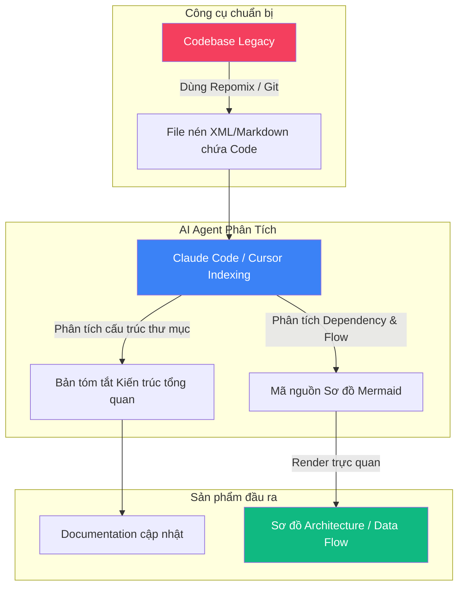
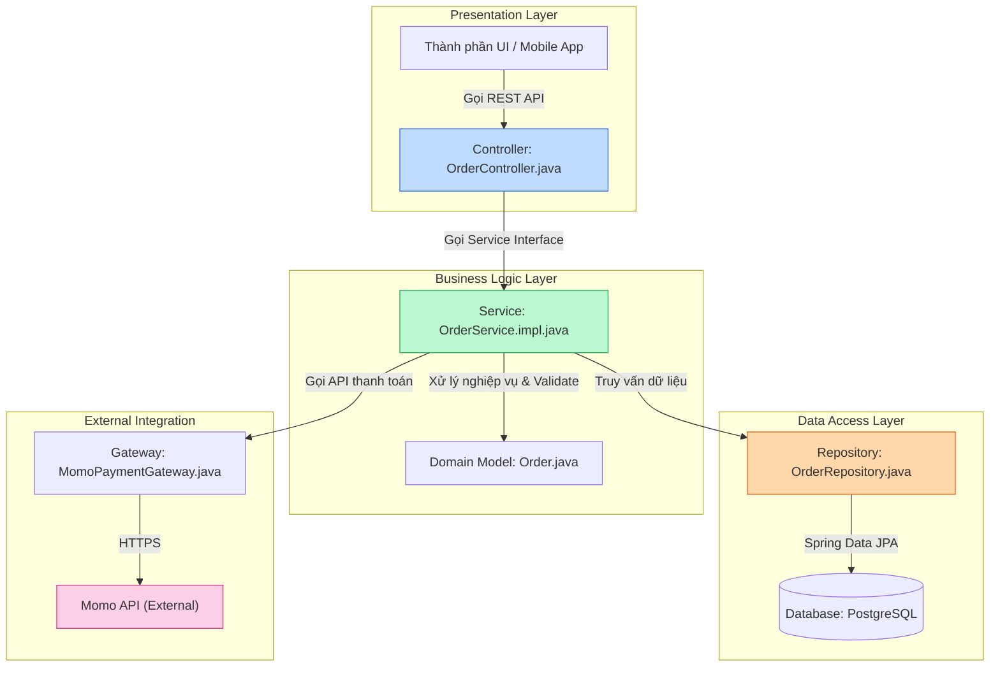
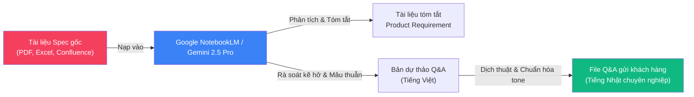

# Onboarding Dự án Mới trong 1 Ngày với AI Agent: BrSE/Dev nắm bắt toàn bộ codebase và spec

## Mở đầu

Tiếp nhận một dự án Legacy hoặc Brownfield luôn là "cơn ác mộng" đối với bất kỳ Bridge Software Engineer (BrSE) hay Developer nào. Bạn phải đối mặt với một codebase khổng lồ hàng triệu dòng code viết bằng những công nghệ cũ kỹ, hầu như không có tài liệu kiến trúc (hoặc tài liệu đã quá hạn từ nhiều năm trước), cùng với đó là hàng tá file Spec (đặc tả yêu cầu) chồng chéo, mâu thuẫn và thậm chí được viết bằng tiếng Nhật chuyên ngành khó hiểu.

Thông thường, một kỹ sư phải mất từ **2 tuần đến 1 tháng** chỉ để đọc hiểu code, chạy thử và chuẩn bị danh sách câu hỏi Q&A làm rõ yêu cầu với khách hàng. Trong suốt thời gian đó, dự án gần như bị đóng băng về mặt tiến độ thực tế, hoặc tệ hơn là dev offshore bắt đầu code trong sự mơ hồ dẫn đến hàng loạt lỗi nghiêm trọng khi tích hợp.

Với sự trưởng thành vượt bậc của các **AI Agent** trong năm 2026 (như Claude Code, Cursor, Gemini), chúng ta hoàn toàn có thể rút ngắn thời gian onboarding này xuống **chỉ còn 1 ngày (8 tiếng làm việc)**. AI Agent không chỉ giúp bạn đọc code nhanh hơn mà còn đóng vai trò là một "Software Architect" ảo để vẽ lại bản đồ kiến trúc và một "Business Analyst" ảo để tìm ra các kẽ hở logic trong spec.

Bài viết này sẽ hướng dẫn bạn chiến lược thực chiến từ góc nhìn của một Tech Lead chuyên tiếp nhận các dự án Brownfield khó nhằn.

**Nội dung chính:**
- Chiến lược sử dụng AI Agent để phân tích cấu trúc codebase legacy và tự động vẽ sơ đồ kiến trúc Mermaid.
- Cách tận dụng LLM context lớn để nuốt trọn Spec, đối chiếu logic chéo và tự tạo danh sách câu hỏi Q&A bằng tiếng Nhật chuyên nghiệp gửi khách hàng.
- Lộ trình (Workflow) từng giờ trong ngày đầu tiên tiếp nhận dự án để nắm bắt 80% kiến thức cốt lõi.

---

## 1. Phân Tích Codebase & Sinh Sơ Đồ Kiến Trúc

### 1.1 Vấn đề: Codebase legacy là một "hộp đen" khổng lồ
Khi nhảy vào một dự án Brownfield, bạn thường được bàn giao một repository git với hàng nghìn file nguồn mà không kèm theo bất kỳ tài liệu hướng dẫn nào. Việc mò mẫm cấu trúc thư mục bằng tay, đọc từng dòng code để hiểu data flow giống như việc đi trong rừng rậm không có la bàn. Bạn rất dễ bị lạc vào các chi tiết triển khai vụn vặt (ví dụ: cách định dạng ngày tháng) mà bỏ qua luồng kiến trúc tổng thể (ví dụ: mô hình Layered Architecture hay Clean Architecture, cách các dịch vụ giao tiếp với nhau).

### 1.2 Giải pháp: Dùng AI Agent vẽ lại "bản đồ địa hình"
Thay vì đọc code thủ công, ta sử dụng AI Agent làm người mở đường. AI Agent sở hữu khả năng phân tích ngữ nghĩa trên phạm vi toàn codebase (nhờ tính năng code indexing) để:
1. Xác định mô hình kiến trúc chủ đạo của dự án.
2. Chỉ ra các thành phần cốt lõi (Core Components), các điểm truy cập (Entry Points) và các dịch vụ bên ngoài (Third-party APIs/Databases).
3. Biểu diễn các mối quan hệ phức tạp này dưới dạng mã nguồn **Mermaid** để render trực quan.



### 1.3 Thực thi: Quy trình & Prompt mẫu

Để thực hiện việc này, bạn có thể sử dụng các AI Agent chạy terminal như **Claude Code** (gõ lệnh `claude` ngay tại root thư mục dự án) hoặc sử dụng tính năng **Codebase Chat (`@Codebase` / `Ctrl+Enter`)** của **Cursor**. 

Nếu sử dụng LLM dạng Chat thông thường (như ChatGPT hoặc Gemini Web), bạn cần dùng công cụ mã nguồn mở như **Repomix** hoặc **code2prompt** để đóng gói toàn bộ cấu trúc dự án và code quan trọng thành một file text duy nhất trước khi nạp vào AI.

#### Bước 1: Quét và Tóm tắt Kiến trúc Tổng quan
Mở AI Agent tại thư mục gốc của codebase và gửi prompt sau:

!!! example "Prompt 1: Phân tích kiến trúc và cấu trúc thư mục"
    ```markdown
    Bạn là một Software Architect chuyên nghiệp. Tôi vừa tiếp nhận codebase legacy này. 
    Hãy quét toàn bộ thư mục dự án và thực hiện các yêu cầu sau bằng tiếng Việt:
    1. Xác định ngôn ngữ lập trình, framework chính và các thư viện quan trọng nhất được sử dụng trong dự án.
    2. Giải thích mô hình kiến trúc chủ đạo của codebase này (ví dụ: MVC, Clean Architecture, Microservices, Layered...).
    3. Cung cấp một bản đồ cấu trúc thư mục rút gọn, giải thích ngắn gọn nhiệm vụ của các thư mục quan trọng nhất.
    4. Chỉ ra các file entry point (điểm chạy đầu tiên) của ứng dụng và nơi định nghĩa các API routes hoặc Controllers chính.
    ```

#### Bước 2: Tự động vẽ Sơ đồ Kiến trúc và Data Flow
Sau khi AI đã hiểu cấu trúc dự án, hãy yêu cầu nó vẽ sơ đồ bằng Mermaid để bạn dễ hình dung.

!!! example "Prompt 2: Tạo sơ đồ kiến trúc Mermaid"
    ```markdown
    Dựa trên cấu trúc codebase đã phân tích, hãy tạo một sơ đồ kiến trúc hệ thống (System Architecture) tổng quan và một sơ đồ luồng dữ liệu (Data Flow) cho tính năng cốt lõi của hệ thống (ví dụ: luồng Đặt hàng - Order Flow, hoặc luồng Đăng nhập - Auth Flow).
    
    Yêu cầu kỹ thuật:
    - Sử dụng cú pháp Mermaid.js (loại `graph TD` hoặc `sequenceDiagram`).
    - Phân chia rõ ràng các tầng (ví dụ: Presentation, Business Logic, Data Access, External Services).
    - Chỉ rõ tên của các class/module/file thực tế có trong codebase chịu trách nhiệm cho từng khối trong sơ đồ.
    - Trả về mã nguồn Mermaid nguyên bản đặt trong khối code ```mermaid để tôi có thể render được.
    ```

#### Bước 3: Phân tích Database Schema (ERD)
Database là xương sống của bất kỳ hệ thống legacy nào. Hiểu được cấu trúc bảng và mối quan hệ giữa các entity sẽ giúp bạn nắm bắt domain model nhanh chóng.

!!! example "Prompt 2b: Phân tích Database Schema và vẽ ERD"
    ```markdown
    Dựa trên các file migration, ORM model (Entity/Model classes) hoặc file SQL schema có trong codebase, hãy:
    1. Liệt kê các bảng (tables) chính và giải thích ngắn gọn vai trò của mỗi bảng.
    2. Chỉ ra các mối quan hệ giữa các bảng (1-1, 1-N, N-N) cùng các Foreign Key quan trọng.
    3. Tạo sơ đồ Entity-Relationship Diagram (ERD) bằng cú pháp Mermaid (loại `erDiagram`).
    4. Đánh dấu những bảng nào là "bảng lõi" (core tables) có số lượng quan hệ nhiều nhất — đó thường là trung tâm nghiệp vụ của hệ thống.
    ```

> **Ví dụ thực tế**: Dưới đây là sơ đồ kiến trúc lớp của một dự án Spring Boot Legacy được AI Agent phân tích và sinh ra dưới dạng Mermaid:



---

## 2. Tóm Tắt Spec & Tạo Danh Sách Q&A Với Khách Hàng

### 2.1 Vấn đề: Spec cập nhật dở dang và bất đồng ngôn ngữ
Đối với BrSE, việc đọc Spec của khách hàng Nhật (thường là các file Excel `Excel 仕様書` hoặc các trang Confluence dài dặc) cực kỳ tốn thời gian. Khó khăn nhân đôi khi:
*   Spec được viết bằng nhiều phiên bản khác nhau, thông tin cập nhật nằm rải rác ở các sheet phụ hoặc phần meeting memo ở cuối file.
*   Logic giữa các màn hình/tính năng bị mâu thuẫn (Ví dụ: Spec màn hình Đăng ký ghi số điện thoại là bắt buộc, nhưng Spec màn hình Profile lại ghi số điện thoại là tùy chọn).
*   BrSE phải tự mình tìm ra các điểm mâu thuẫn hoặc thiếu sót logic (Edge cases) này để làm file Q&A gửi khách hàng trước khi đội dev offshore bắt tay vào code.

### 2.2 Giải pháp: Dùng RAG và LLM Context lớn để rà soát logic chéo
Chúng ta sẽ sử dụng các LLM có kích thước context cực lớn và khả năng xử lý tài liệu xuất sắc như **Gemini 2.5 Pro** hoặc **Google NotebookLM** làm trợ lý Business Analyst. Chúng ta nạp toàn bộ Spec (PDF, Excel chuyển sang CSV/PDF, Word) vào AI để nó thực hiện việc phân tích toàn diện.



### 2.3 Thực thi: Quy trình & Prompt mẫu

#### Bước 1: Trích xuất và đối chiếu logic tìm lỗi
Sau khi tải tất cả các tài liệu đặc tả của dự án lên NotebookLM hoặc Gemini Chat, hãy sử dụng prompt dưới đây để bắt AI tìm kiếm các điểm bất hợp lý:

!!! example "Prompt 3: Tìm kiếm điểm mâu thuẫn và thiếu logic trong Spec"
    ```markdown
    Bạn là một Business Analyst kiêm Bridge Software Engineer (BrSE) dày dạn kinh nghiệm. 
    Dựa trên toàn bộ tài liệu đặc tả (Spec) tôi đã cung cấp, hãy rà soát kỹ lưỡng và chỉ ra:
    1. Có bất kỳ điểm mâu thuẫn logic nào giữa các tài liệu hoặc giữa các tính năng với nhau không? (Ví dụ: mâu thuẫn về kiểu dữ liệu, bắt buộc/không bắt buộc, trạng thái hệ thống).
    2. Các kịch bản ngoại lệ (Edge cases) quan trọng nào chưa được định nghĩa rõ ràng trong tài liệu? (Ví dụ: mất kết nối mạng khi thanh toán, xử lý khi bấm nút Submit liên tục, tài khoản bị khóa giữa chừng...).
    3. Tóm tắt ngắn gọn các luồng nghiệp vụ (Business Flows) chính mà lập trình viên cần đặc biệt lưu ý để tránh xảy ra lỗi.
    
    Hãy viết câu trả lời bằng tiếng Việt, cấu trúc rõ ràng dạng bảng hoặc danh mục gạch đầu dòng.
    ```

#### Bước 2: Soạn thảo danh sách Q&A bằng tiếng Nhật chuyên nghiệp (Business Japanese)
Khách hàng Nhật Bản đánh giá rất cao việc BrSE phát hiện lỗi sớm và hỏi một cách lịch sự, chuyên nghiệp. Dưới đây là prompt giúp bạn chuyển các câu hỏi ở Bước 1 thành một file Q&A hoàn chỉnh.

!!! example "Prompt 4: Tự động tạo file Q&A gửi khách hàng bằng tiếng Nhật"
    ```markdown
    Hãy đóng vai là một BrSE đang làm việc trực tiếp với khách hàng Nhật Bản. 
    Từ danh sách các điểm mơ hồ và mâu thuẫn logic đã tìm thấy ở trên, hãy soạn thảo một bảng danh sách Q&A (Question & Answer) bằng tiếng Nhật công sở chuyên nghiệp (Keigo - Kính ngữ).
    
    Định dạng đầu ra yêu cầu dạng bảng Markdown gồm các cột:
    - No (Số thứ tự)
    - Target (Màn hình/Tính năng liên quan - tiếng Nhật)
    - Current Spec (Đặc tả hiện tại theo tài liệu nào, chương nào - tiếng Nhật)
    - Question (Câu hỏi chi tiết và lý do hỏi - tiếng Nhật lịch sự)
    - Suggestion (Đề xuất giải pháp của chúng ta để khách hàng chọn - tiếng Nhật)
    
    Lưu ý: Ngôn từ cần trang trọng, thể hiện sự cầu thị và tôn trọng đối tác (sử dụng các cụm từ như 恐れ入りますが, ご確認いただけますでしょうか...).
    ```

> **Ví dụ kết quả đầu ra thực tế:**

| No | Target (対象) | Current Spec (現状の仕様) | Question (質問内容) | Suggestion (弊社提案) |
| :--- | :--- | :--- | :--- | :--- |
| 1 | 新規登録画面 (Màn hình đăng ký mới) | ユーザー登録仕様書 Ver 1.2: 「電話番号は必須項目である」と記載。 | 恐れ入りますが、会員情報編集仕様書 (Ver 1.0) では「電話番号は任意」となっております。登録時と編集時で仕様に不整合がございますが、どちらが正しいでしょうか。 | 登録時の段階でSMS認証を行うため、新規登録画面においては「電話番号は必須」とすることを提案いたします。 |
| 2 | 二重送信防止 (Chặn submit trùng) | 決済処理仕様書: 多重決済防止について言及あり（ただし具体的な制御方法の記載なし）。 | ユーザーが「決済ボタン」を連打した場合、APIが複数回呼び出され、二重決済が発生する懸念がございます。フロントエンドでのボタン制御、およびAPI側でのIdempotency-Keyによる制御は定義されていますでしょうか。ご確認いただけますと幸いです。 | 決済リクエスト送信時にフロント側でボタンを非活性化 (Disable) し、同時にAPIリクエストに一意のトークンを付与してサーバー側で重複を検知する仕様を提案いたします。 |

---

## 3. Workflow Thực Tế: 1 Ngày Onboarding Dự Án Mới

Để không bị rơi vào cái bẫy "quá tải thông tin" (Information Overload) hoặc mất thời gian đọc code không định hướng, bạn cần tuân thủ nghiêm ngặt lộ trình onboarding 8 tiếng dưới đây:

### Sáng: Khám phá địa hình (08:30 - 12:00)

*   **08:30 - 09:30 | Thiết lập môi trường & Code Indexing**: Clone codebase về máy. Cài đặt các công cụ AI Agent (Cursor, Claude Code). Cho phép các công cụ này chạy indexing toàn bộ dự án để xây dựng database vector local.
*   **09:30 - 11:00 | Quét kiến trúc tổng quan**: Sử dụng **Prompt 1** và **Prompt 2** để vẽ sơ đồ kiến trúc hệ thống và luồng đi của dữ liệu. Ghi chú lại các thư mục quan trọng nhất cần đọc.
*   **11:00 - 12:00 | Chạy thử ứng dụng (Build & Run Local)**: Dựa trên hướng dẫn của AI (hoặc file README), thực hiện cài đặt các dependency và chạy ứng dụng ở môi trường local.
    
    !!! tip "Mẹo nhỏ khi gặp lỗi cài đặt"
        Nếu quá trình build local bị lỗi (một điều cực kỳ phổ biến ở dự án legacy), hãy copy toàn bộ thông báo lỗi trong terminal dán vào AI Agent và gõ: `Tôi gặp lỗi này khi build dự án, hãy phân tích nguyên nhân và hướng dẫn tôi cách sửa từng bước.` AI Agent sẽ chỉ ra chính xác thư viện nào bị xung đột hoặc biến môi trường nào bị thiếu.

### Chiều: Đọc hiểu Specs & Tạo Q&A (13:00 - 16:30)

*   **13:00 - 14:30 | Đọc hiểu Specs cùng AI**: Nạp toàn bộ tài liệu đặc tả vào Google NotebookLM hoặc Gemini. Yêu cầu AI tóm tắt các tính năng chính và vẽ luồng hoạt động dưới dạng Markdown text.
*   **14:30 - 15:30 | Dò lỗi logic & Tạo Q&A nháp**: Sử dụng **Prompt 3** để tìm kiếm kẽ hở logic, các kịch bản ngoại lệ chưa được làm rõ trong tài liệu. Soạn thảo các câu hỏi sơ bộ bằng tiếng Việt.
*   **15:30 - 16:30 | Dịch và tối ưu Q&A tiếng Nhật**: Sử dụng **Prompt 4** để chuyển các câu hỏi nháp thành file Excel/Markdown Q&A chuẩn ngôn ngữ công sở Nhật Bản.

### Cuối ngày: Kiểm chứng & Bàn giao (16:30 - 17:30)

*   **16:30 - 17:00 | Đánh giá chéo chốt thông tin**: Dành 30 phút rà soát lại câu trả lời của AI. Đối chiếu mã nguồn thực tế ở phần core xem code hiện tại đang chạy theo logic nào để bổ sung dẫn chứng vào câu hỏi Q&A.
*   **17:00 - 17:30 | Tổng hợp & Lập kế hoạch**: Viết một tài liệu tổng quan onboarding (Onboarding Summary) lưu vào Wiki của team hoặc file `README_ONBOARDING.md` trong repo. Đặt lịch họp với đội offshore để giải thích kiến trúc vừa tìm ra, đồng thời gửi file Q&A cho khách hàng.

---

## 4. Giới Hạn Và Lưu Ý Quan Trọng

Trước khi áp dụng workflow này, bạn cần nhận thức rõ các giới hạn sau để tránh rơi vào sự tự tin thái quá:

!!! warning "AI có thể hiểu sai kiến trúc và nghiệp vụ"
    AI Agent phân tích codebase dựa trên cấu trúc file và code hiện tại. Tuy nhiên, nó **không có tribal knowledge** — những kiến thức ngầm mà chỉ thành viên cũ của team mới biết (ví dụ: module A đã bị deprecated nhưng chưa xóa, hoặc service B chỉ chạy vào ban đêm theo batch job). Sơ đồ kiến trúc do AI sinh ra cần được **đối chiếu với thành viên cũ** nếu có.

- **Hallucination trong phân tích Spec**: Khi rà soát logic chéo giữa nhiều tài liệu, AI có thể bịa ra mâu thuẫn không tồn tại hoặc bỏ sót mâu thuẫn thực sự. Mọi điểm AI phát hiện **phải được BrSE kiểm chứng lại** bằng cách đọc đoạn Spec gốc tương ứng.
- **Giới hạn context thực tế**: Dù Gemini 2.5 Pro và NotebookLM hỗ trợ context 1 triệu tokens, các codebase lớn (hàng triệu dòng code) vẫn có thể vượt quá giới hạn này. Bạn cần chia nhỏ và ưu tiên các module quan trọng nhất.
- **AI không thay thế được bước chạy thử**: Sơ đồ kiến trúc trên giấy chỉ là giả thuyết cho đến khi bạn thực sự build và chạy ứng dụng thành công ở môi trường local. Bước 3 trong Workflow (Build & Run Local) không được bỏ qua.
- **Chất lượng Q&A phụ thuộc vào chất lượng Spec đầu vào**: Nếu tài liệu Spec là ảnh scan mờ hoặc bảng Excel bị gộp ô phức tạp, AI sẽ đọc sai nội dung. Nguyên tắc **"Garbage In, Garbage Out"** áp dụng hoàn toàn ở đây.

---

## Kết Luận

Bước vào một dự án Legacy không còn là một công việc đáng sợ nếu bạn biết cách biến AI Agent thành trợ lý đắc lực của mình. Bằng cách áp dụng đúng cấu trúc chiến lược:
1. **Phân tích Codebase trước** để có cái nhìn tổng quan về mặt kỹ thuật.
2. **Đối chiếu Spec sau** để nắm bắt nghiệp vụ và tìm kiếm các điểm hổng logic.
3. Vận hành theo một **Workflow có kỷ luật** chia nhỏ theo thời gian.

Bạn có thể rút ngắn đáng kể thời gian onboarding — từ hàng tuần xuống còn vài ngày — đồng thời tạo ra một bộ tài liệu chất lượng (kiến trúc hệ thống, danh sách Q&A, tài liệu hướng dẫn chạy dự án) cho toàn bộ đội ngũ lập trình viên trong team. Tuy nhiên, hãy nhớ rằng **AI là trợ lý, không phải người thay thế tư duy phản biện**. Kết quả của AI luôn cần được kiểm chứng bởi con người trước khi gửi cho khách hàng hoặc sử dụng làm căn cứ kỹ thuật.

Hãy để bộ não của bạn tập trung vào việc đánh giá, quyết định và giao tiếp với khách hàng, còn việc "đọc code, mò tài liệu" — hãy để AI Agent lo phần nặng nhọc!

---

## Tham Khảo

- [Repomix (GitHub)](https://github.com/yamadashy/repomix) — Công cụ mã nguồn mở đóng gói toàn bộ codebase thành một file text (XML/Markdown/JSON) thân thiện với AI, hỗ trợ MCP.
- [code2prompt (GitHub)](https://github.com/mufeedvh/code2prompt) — Công cụ CLI viết bằng Rust để chuyển đổi codebase thành prompt cho LLM, hỗ trợ token counting và template tùy chỉnh.
- [Mermaid.js Documentation](https://mermaid.js.org/) — Hướng dẫn tạo sơ đồ và đồ thị bằng mã văn bản.
- [Google NotebookLM](https://notebooklm.google/) — Công cụ đắc lực để RAG và nghiên cứu dựa trên tài liệu cá nhân.
- Các bài viết liên quan trong Wiki:
    - [Cursor AI vs Claude Code vs GitHub Copilot: Lựa chọn nào cho Developer 2026?](./2026-05-15-cursor-ai-vs-claude-code-vs-github-copilot.md)
    - [Thiết kế hệ thống phần mềm hiệu quả với sự hỗ trợ của AI Agent](./2026-05-19-thiet-ke-he-thong-voi-ai-agent.md)
    - [Xây dựng Second Brain hiệu quả với AI: Lưu trữ, tìm kiếm và tái sử dụng kiến thức dự án](./2026-05-23-xay-dung-knowledge-base-cho-brse-voi-ai.md)
