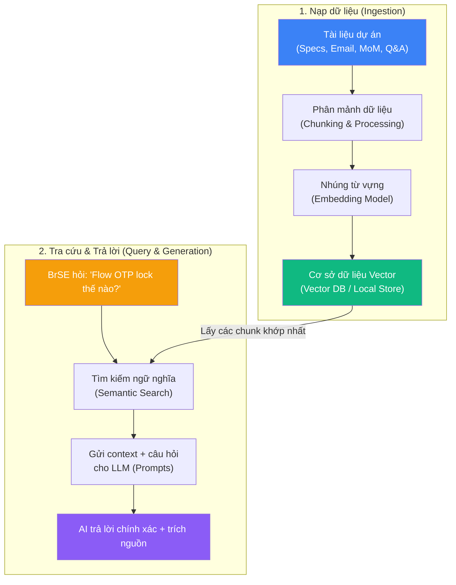

# Xây dựng Knowledge Base cho BrSE với AI: Lưu trữ, tìm kiếm và tái sử dụng kiến thức dự án

## Mở đầu

BrSE (Bridge Software Engineer) làm việc ở điểm giao thoa giữa hai ngôn ngữ, hai nền văn hóa và hai đội ngũ khác biệt. Một ngày làm việc của BrSE thường ngập tràn trong sự hỗn loạn của thông tin: hàng chục file Spec (đặc tả yêu cầu) liên tục cập nhật, hàng trăm email thảo luận yêu cầu từ khách hàng Nhật, hàng ngàn tin nhắn chat (Slack, Teams, Chatwork) chứa các quyết định kỹ thuật "ad-hoc", và hàng chục file Q&A, Meeting Notes (MoM) nằm rải rác khắp nơi.

Khi Dev Offshore hỏi về một logic hệ thống, BrSE thường mất từ 15-30 phút chỉ để lục lọi lại các email cũ hoặc các dòng chat để xác minh. Thậm chí, việc tìm kiếm từ khóa truyền thống thường thất bại do sự bất đồng thuật ngữ Nhật - Việt, dẫn đến việc BrSE phán đoán sai hoặc trả lời không nhất quán, gây ra những bug nghiêm trọng khi lên Production.

Để giải quyết triệt để vấn đề này, việc xây dựng một **Second Brain** chuyên biệt trợ lực bởi AI thông qua công nghệ **RAG (Retrieval-Augmented Generation)** là giải pháp tối ưu nhất. Bài viết này sẽ hướng dẫn bạn cách thiết lập hệ thống tri thức thông minh này để lưu trữ, tìm kiếm và tái sử dụng kiến thức dự án siêu tốc.

**Nội dung chính:**

- Thách thức về quản trị tri thức của Bridge Software Engineer (BrSE) và tại sao RAG là giải pháp.
- Đánh giá & So sánh đối đầu: Obsidian + Local AI (Ollama) vs Google NotebookLM.
- Cẩm nang hướng dẫn cách index tài liệu dự án (spec, email, meeting notes) tối ưu cho AI.
- Kịch bản thực tế khi vận hành hệ thống tra cứu AI trong công việc hàng ngày.

---

## 1. Thách Thức Quản Trị Tri Thức Của BrSE Và Sức Mạnh Của RAG

### 1.1 "Cơn ác mộng" mang tên Quá Tải Thông Tin (Information Overload)

Trong các dự án phần mềm làm việc với khách hàng Nhật Bản, vai trò truyền đạt thông tin của BrSE cực kỳ quan trọng. Tuy nhiên, khối lượng thông tin khổng lồ và phân tán luôn là rào cản lớn nhất:

- **Sự thay đổi liên tục**: Spec dự án không bao giờ đứng yên. Khách hàng có thể thay đổi yêu cầu qua một buổi họp nhanh hoặc một email lúc nửa đêm.
- **Phân tán dữ liệu**: Quyết định được đưa ra ở nhiều nơi khác nhau. Một phần nằm trong file Spec chính thức trên Confluence, một phần nằm trong file Excel Q&A gửi qua email, phần khác lại nằm trong thread chat của Slack.
- **Rào cản ngôn ngữ**: Tài liệu tiếng Nhật chuyên ngành kỹ thuật đôi khi khó diễn đạt sang tiếng Việt một cách chính xác, dẫn đến sự hiểu lầm của đội ngũ lập trình viên offshore.

Khi đối mặt với câu hỏi từ lập trình viên, BrSE thường rơi vào trạng thái "Context Switching" liên tục, làm giảm hiệu suất làm việc và tăng nguy cơ đưa ra thông tin sai lệch.

### 1.2 RAG (Retrieval-Augmented Generation) — Vị Cứu Tinh Của BrSE

RAG là một kỹ thuật trong AI kết hợp khả năng của Mô hình ngôn ngữ lớn (LLM) với một cơ sở dữ liệu tri thức bên ngoài. Thay vì chỉ dựa vào kiến thức có sẵn được học trong quá trình huấn luyện, mô hình RAG sẽ thực hiện tra cứu các tài liệu liên quan trong kho lưu trữ của bạn trước, sau đó dùng các tài liệu này làm ngữ cảnh (context) để tạo ra câu trả lời.



!!! info "Sự khác biệt giữa Search truyền thống và AI Search"
    Tìm kiếm truyền thống dựa trên so khớp từ khóa chính xác (Keyword Matching). Nếu bạn tìm "Mật khẩu", nó sẽ bỏ qua những tài liệu ghi "Password" hoặc "Mã bảo mật". Trái lại, AI Search sử dụng **Semantic Search** (Tìm kiếm theo ngữ nghĩa) để hiểu được ý định của bạn và tìm ra tài liệu liên quan dù từ khóa không khớp hoàn toàn.

---

## 2. So Sánh Đối Đầu: Obsidian + Local AI vs Google NotebookLM

Khi bắt tay vào xây dựng Second Brain tích hợp AI cho dự án, hai lựa chọn phổ biến và mạnh mẽ nhất hiện nay là **Obsidian (kết hợp Local AI qua Ollama)** và **Google NotebookLM**. Chúng đại diện cho hai hướng đi và triết lý công nghệ hoàn toàn khác nhau:

### 2.1 Bảng so sánh tổng quan

| Tiêu chí | Obsidian + Local AI (Ollama) | Google NotebookLM |
| :--- | :--- | :--- |
| **Bảo mật thông tin (NDA)** | 🛡️ **Tuyệt đối (Offline 100%)** - Không có dữ liệu nào rời khỏi máy tính của bạn. | ⚠️ **Trung bình** - Dữ liệu được tải lên đám mây của Google (dù cam kết không dùng để train AI). |
| **Độ dễ thiết lập** | 🛠️ **Khó** - Yêu cầu cài đặt Ollama, tải model và cài cấu hình plugin Obsidian. | ⚡ **Cực dễ (1-click)** - Đăng nhập tài khoản Google và upload tài liệu trực tiếp. |
| **Context Window** | 🧊 **Giới hạn** - Phụ thuộc vào RAM/VRAM phần cứng (thường từ 4k đến 32k tokens tùy model và cấu hình). | 🌊 **Rất lớn (1M tokens)** - Đọc hiểu đồng thời nhiều tài liệu Spec dày hàng trăm trang. |
| **Chi phí** | 💰 **Miễn phí hoàn toàn** - Obsidian miễn phí cho cá nhân, Ollama và model mã nguồn mở đều miễn phí. | 💳 **Freemium** - Bản Standard miễn phí (50 sources/notebook, 50 chats/ngày). Bản Plus/Pro/Ultra trả phí từ ~$8-$250/tháng. |
| **Khả năng liên kết** | 🕸️ **Xuất sắc** - Ghi chú Markdown liên kết mạng lưới (Graph View), tích lũy tri thức lâu dài. | 🧱 **Hạn chế** - Bị giới hạn trong từng "Notebook" dự án riêng lẻ, khó liên kết chéo. |
| **Yêu cầu phần cứng** | 💻 **Cao** - Cần máy tính có GPU tốt (Macbook Apple Silicon hoặc laptop Windows RTX). | ☁️ **Không** - Chạy hoàn toàn trên máy chủ đám mây của Google. |

### 2.2 Đánh giá chi tiết từng công cụ

#### Obsidian + Local AI: Pháo đài bảo mật cho dự án nghiêm ngặt

Nếu bạn đang làm việc trong dự án có điều khoản bảo mật (NDA) khắt khe — cấm tuyệt đối tải Spec hay Code lên bất kỳ dịch vụ đám mây công cộng nào — thì đây là con đường duy nhất dành cho bạn.

- **Cách thiết lập**: Bạn sử dụng Obsidian làm kho lưu trữ ghi chú Markdown. Cài đặt các plugin như **Smart Connections** hoặc **Obsidian Copilot**, sau đó kết nối với **Ollama** chạy trực tiếp trên máy tính của bạn. Cần cài hai loại model: một **Embedding Model** (khuyến nghị `nomic-embed-text`) để index nội dung ghi chú, và một **Chat Model** (như *Llama-3-8B*, *Gemma-3*, hoặc *Qwen-2.5-7B*) để trả lời câu hỏi.
- **Ưu điểm**: Bảo mật 100%. Toàn bộ dữ liệu Spec, Q&A và câu hỏi của bạn đều được xử lý cục bộ trên thiết bị cá nhân. Bạn sở hữu hoàn toàn dữ liệu của mình dưới định dạng plain text (.md), dễ dàng backup hoặc di chuyển.
- **Nhược điểm**: Yêu cầu phần cứng mạnh mẽ. Nếu máy tính của bạn là máy văn phòng thế hệ cũ, tốc độ sinh câu trả lời của local LLM sẽ rất chậm, đôi khi gây ức chế.

!!! warning "Lưu ý về tài nguyên phần cứng"
    Để chạy mượt mà một model local có kích thước 7B-8B (7-8 tỷ tham số) ở định dạng lượng tử hóa 4-bit (Q4_K_M — mặc định của Ollama), máy tính của bạn cần tối thiểu **16GB RAM**. Với Apple Silicon (M1/M2/M3/M4), 16GB Unified Memory là đủ tốt. Trên Windows/Linux, GPU có **VRAM từ 8GB trở lên** (ví dụ: RTX 3060/4060) sẽ cho tốc độ sinh text khoảng 30-60 tokens/giây. Nếu chỉ chạy trên CPU (không có GPU rời), tốc độ sẽ giảm đáng kể xuống khoảng 2-8 tokens/giây — vẫn dùng được nhưng cần kiên nhẫn.

#### Google NotebookLM: Trợ lý dự án siêu tốc

Google NotebookLM là dịch vụ web theo mô hình **freemium** (bản Standard miễn phí, bản Plus/Pro/Ultra trả phí) mang lại trải nghiệm sử dụng AI RAG xuất sắc nhất hiện nay mà không cần cài đặt phức tạp.

- **Cách thiết lập**: Bạn chỉ cần truy cập vào [notebooklm.google](https://notebooklm.google/), tạo một "Notebook" mới cho dự án, kéo thả các file PDF Spec, Word, Google Docs, link website, hoặc thậm chí là file ghi âm MP3 của buổi họp (NotebookLM hỗ trợ upload audio trực tiếp và tự động phiên âm thành text). Model Gemini 2.5 Pro sẽ lập tức xử lý và biến chúng thành nguồn kiến thức.
- **Ưu điểm**: Khả năng xử lý tài liệu khổng lồ cực tốt nhờ Context Window dài **1 triệu tokens** (tương đương hàng trăm trang tài liệu). Bạn có thể hỏi AI về các mối liên hệ phức tạp giữa nhiều tài liệu khác nhau. Ngoài ra, tính năng tạo **Audio Overview** (Podcast thảo luận tự động) giúp bạn nghe tóm tắt dự án một cách trực quan và sinh động. Bản miễn phí cho phép 50 nguồn/notebook, 50 chats/ngày — đủ dùng cho phần lớn dự án.
- **Nhược điểm**: Vì hoạt động trên Cloud, bạn cần được sự cho phép từ phía khách hàng và công ty trước khi upload các tài liệu nội bộ nhạy cảm lên hệ thống. Mỗi nguồn tài liệu upload tối đa 500.000 từ hoặc 200MB.

---

## 3. Hướng Dẫn Chi Tiết Cách Index Tài Liệu Tối Ưu Cho AI

Dù bạn sử dụng Obsidian + Local AI hay NotebookLM, chất lượng phản hồi của AI phụ thuộc rất lớn vào cách bạn chuẩn bị dữ liệu đầu vào. Dưới đây là quy trình chuẩn bị dữ liệu dành riêng cho BrSE:

### 3.1 Thiết kế tài liệu theo nguyên lý "AI-Friendly"

- **Ưu tiên Text-searchable**: Tránh dùng ảnh chụp màn hình Spec. Nếu Spec là file scan, bạn bắt buộc phải dùng các công cụ OCR để chuyển đổi chúng thành văn bản text trước khi nạp vào AI.
- **Cấu trúc Markdown rõ ràng**: Sử dụng các thẻ Heading (`#`, `##`, `###`) để phân cấp thông tin. AI sẽ đọc hiểu cấu trúc phân cấp này tốt hơn nhiều so với một đoạn text phẳng dài dằng dặc.
- **Tập tin thuật ngữ song ngữ (Glossary)**: AI thường dịch sai hoặc hiểu nhầm các thuật ngữ viết tắt hay thuật ngữ đặc thù của dự án. Hãy tạo một file `Glossary.md` để giải nghĩa và index nó trước tiên.

!!! example "Ví dụ File Glossary.md của dự án"
    ```markdown
    # Thuật Ngữ Dự Án Hệ Thống Thanh Toán (Glossary)
    
    - **仕様書 (shiyousho)**: Đặc tả kỹ thuật (Specification).
    - **不具合 (bug/issue)**: Lỗi hệ thống.
    - **振込 (furikomi)**: Chuyển khoản ngân hàng.
    - **Idempotency Key (Khóa đồng nhất)**: Khóa gửi kèm API để đảm bảo giao dịch không bị xử lý trùng lặp.
    - **OTP Lock**: Khóa tài khoản tạm thời khi người dùng nhập sai mã OTP quá 5 lần liên tiếp.
    ```

### 3.2 Kỹ thuật xử lý cụ thể cho từng nhóm tài liệu

#### ① Specifications (Spec/SRS)

Tài liệu Spec của dự án thường chứa nhiều bảng biểu phức tạp. AI rất dễ đọc nhầm dữ liệu nếu các bảng Excel bị gộp ô (merged cells) hoặc có cấu trúc quá rắc rối.

- **Giải pháp**: Hãy chuyển đổi các bảng Spec quan trọng thành định dạng bảng Markdown hoặc định dạng CSV đơn giản.
- **Chia nhỏ tài liệu**: Thay vì nạp một file Spec tổng hợp dài 500 trang, hãy chia nhỏ thành các file Markdown theo từng module/tính năng (Ví dụ: `spec-payment.md`, `spec-registration.md`, `spec-refund.md`). Điều này giúp công cụ RAG tìm kiếm chính xác phân đoạn chứa câu trả lời.

#### ② Q&A Sheets / Bug Trackers

Q&A chính là kho lưu trữ kiến thức sống động nhất của dự án. Khi lập trình viên hỏi một câu, khả năng cao là câu đó đã được giải quyết trong quá khứ.

- **Cấu trúc đề xuất**: Viết tài liệu Q&A dưới dạng các khối Markdown có cấu trúc rõ ràng:

```markdown
### QA-108: Xử lý Timeout khi gọi API MoMo
- **Ngày hỏi**: 2026-05-12
- **Người hỏi**: NamNV (Backend Developer)
- **Câu hỏi**: Khi gọi API MoMo mà bị timeout sau 30 giây, hệ thống có tự động retry không?
- **Câu trả lời (Tanaka-san)**: Không retry tự động. Trả lỗi về cho Client hiển thị màn hình báo lỗi hệ thống bận, đồng thời ghi log trạng thái giao dịch là `PENDING`.
```

#### ③ Emails & Chat Logs

Tránh việc copy thô hàng ngàn dòng chat Slack hay email không đầu không cuối vào database, việc đó sẽ làm nhiễu AI.

- **Giải pháp**: Chỉ chắt lọc những email chốt yêu cầu kỹ thuật hoặc các quyết định cuối cùng trong thread chat. Viết lại dưới dạng một file nhật ký quyết định (Decision Log):

```markdown
## 2026-05-18: Thống nhất logic gửi SMS OTP
- **Nguồn**: Thảo luận email tiêu đề "Re: SMS OTP Flow confirmation" từ Tanaka-san.
- **Quyết định**: Sử dụng dịch vụ Twilio để gửi SMS. Nếu dịch vụ lỗi, tự động fallback sang gửi mã OTP qua Email của người dùng.
```

#### ④ Meeting Notes (MoM)

Minutes of Meeting (Biên bản cuộc họp) thường chứa nhiều chi tiết vụn vặt và thảo luận chưa đi đến kết luận.

- **Giải pháp**: Trước khi đưa MoM vào hệ thống RAG, hãy dùng AI tóm tắt ngắn gọn cuộc họp theo cấu trúc: *Mục đích họp → Các quyết định đã chốt → Hành động cần làm (Action Items) → Người chịu trách nhiệm*. Chỉ lưu trữ phần tóm tắt đã tinh lọc này.

### 3.3 Hướng dẫn thiết lập từng bước (Quick Start Guide)

#### Phương án A: Obsidian + Ollama (Local, bảo mật cao)

```
Bước 1: Cài đặt Ollama
  → Tải từ https://ollama.com/, cài đặt theo hướng dẫn.

Bước 2: Tải model AI về máy (mở Terminal/PowerShell)
  → ollama pull nomic-embed-text    (model embedding — index nội dung)
  → ollama pull llama3.2             (model chat — trả lời câu hỏi)

Bước 3: Cài đặt Obsidian
  → Tải từ https://obsidian.md/, tạo Vault mới cho dự án.

Bước 4: Cài plugin Smart Connections
  → Settings > Community Plugins > Browse > "Smart Connections" > Install > Enable.
  → Trong cài đặt plugin:
     • Embedding Model: chọn Ollama (Local), model = nomic-embed-text
     • Chat Model: chọn Ollama (Local), model = llama3.2
     • Hostname: localhost, Port: 11434

Bước 5: Index Vault
  → Mở Command Palette (Ctrl+P) > "Smart Connections: Open Smart Chat"
  → Plugin sẽ tự index toàn bộ ghi chú trong Vault.
  → Chờ hoàn tất rồi bắt đầu hỏi AI.
```

#### Phương án B: Google NotebookLM (Cloud, nhanh gọn)

```
Bước 1: Truy cập https://notebooklm.google/ → đăng nhập Google.

Bước 2: Click "New Notebook" → đặt tên theo dự án (VD: "Project-ABC-Specs").

Bước 3: Upload tài liệu
  → Click nút "+" trong Sources panel.
  → Chọn file PDF, Google Docs, Website URL, hoặc file Audio (MP3).
  → Tối đa 50 nguồn/notebook (bản miễn phí), mỗi nguồn tối đa 500K từ.

Bước 4: Bắt đầu hỏi
  → Gõ câu hỏi trong khung chat, AI sẽ trả lời dựa trên nguồn đã upload.
  → Có thể tạo Audio Overview (podcast tự động) để nghe tóm tắt.
```

!!! tip "Mẹo cho BrSE"
    Nếu dự án có NDA nghiêm ngặt, hãy chọn **Phương án A** (Obsidian + Ollama). Nếu dự án cho phép sử dụng dịch vụ cloud và bạn muốn bắt đầu trong 5 phút, hãy chọn **Phương án B** (NotebookLM).

---

## 4. Kịch Bản Thực Chiến: Rút Ngắn Đáng Kể Thời Gian Tra Cứu

Hãy hình dung cách một BrSE vận hành hệ thống này trong thực tế công việc hàng ngày:

### Tình huống

Lập trình viên offshore nhắn tin khẩn cấp trên Slack:
> *"Anh Hoàn ơi, trong màn hình Đăng ký, nếu người dùng nhập số điện thoại đã tồn tại nhưng tài khoản đó đang ở trạng thái 'Chờ kích hoạt' (Pending Activation) thì hệ thống hiển thị lỗi trùng số hay cho phép đăng ký đè? Em tìm trong file Excel Spec Login mãi không thấy ghi rõ."*

### Cách xử lý truyền thống (Không có AI)

1. BrSE mở file Excel Spec Login (gồm 15 tabs).
2. Dùng tổ hợp phím `Ctrl + F` tìm từ khóa `"Pending"`, `"Chờ kích hoạt"`, `"Trùng số điện thoại"`.
3. Tìm kiếm không ra kết quả vì Spec tiếng Nhật dùng từ `仮登録` (Đăng ký tạm thời).
4. Phải lục lại email cũ từ 2 tháng trước khi thảo luận về flow đăng ký.
5. **Thời gian tiêu tốn**: 15 - 20 phút, gây gián đoạn công việc của cả BrSE lẫn lập trình viên.

### Cách xử lý với AI-powered Second Brain

BrSE mở khung chat AI (được kết nối với Obsidian hoặc NotebookLM dự án) và gõ câu hỏi bằng tiếng Việt:

`"Khi đăng ký, số điện thoại trùng với tài khoản đang ở trạng thái Chờ kích hoạt (仮登録) thì xử lý thế nào?"`

**AI Assistant phản hồi trong 3 giây:**

> [!NOTE]
> **Câu trả lời từ AI:**
> Theo tài liệu đặc tả **[spec-register.md](file:///docs/blog/posts/2026-05-23-xay-dung-knowledge-base-cho-brse-voi-ai.md)** (mục 3.2.1) và kết quả họp ngày 15/04/2026 **[mom-2026-04-15.md](file:///docs/blog/posts/2026-05-23-xay-dung-knowledge-base-cho-brse-voi-ai.md)**:
> 
> 1. Hệ thống **không báo lỗi trùng**.
> 2. Hệ thống sẽ ghi đè OTP mới, gửi lại SMS kích hoạt cho user và giữ nguyên trạng thái tài khoản là `Pending Activation` (Chờ kích hoạt).
> 3. Trích dẫn từ khách hàng Tanaka-san: *"Chúng ta cho phép đăng ký đè lên tài khoản chưa kích hoạt để tránh trường hợp user nhập sai số điện thoại của người khác."*

BrSE chỉ cần sao chép câu trả lời này gửi cho lập trình viên. 
**Thời gian tiêu tốn**: 30 giây. Thông tin chính xác 100%, có trích dẫn rõ ràng để lập trình viên tự kiểm chứng nếu cần.

---

## 5. Giới Hạn Và Lưu Ý Quan Trọng Khi Sử Dụng AI Tra Cứu

Trước khi tin tưởng hoàn toàn vào hệ thống AI Second Brain, bạn cần nhận thức rõ các giới hạn sau:

!!! warning "AI có thể Hallucinate (bịa thông tin)"
    Dù đã được cung cấp tài liệu nguồn qua RAG, LLM vẫn có khả năng sinh ra câu trả lời sai hoặc "tự bịa" chi tiết không có trong tài liệu gốc. **Mọi câu trả lời quan trọng của AI đều cần được BrSE kiểm chứng lại** bằng cách click vào trích dẫn nguồn mà AI cung cấp.

- **RAG không hoàn hảo**: Nếu bạn index tài liệu có chất lượng kém (scan mờ, bảng bị vỡ, thuật ngữ không nhất quán), AI sẽ trả lời kém theo. Nguyên tắc **"Garbage In, Garbage Out"** áp dụng hoàn toàn ở đây.
- **Giới hạn ngôn ngữ**: Các model local mã nguồn mở (7B-8B) hiện xử lý tiếng Nhật và tiếng Việt kém hơn đáng kể so với tiếng Anh. NotebookLM (sử dụng Gemini 2.5 Pro) có lợi thế hơn nhiều ở khả năng đa ngôn ngữ.
- **Không thay thế tư duy phản biện**: AI giúp tra cứu nhanh, nhưng việc đánh giá tính hợp lý của thông tin, phát hiện mâu thuẫn giữa các phiên bản Spec, hay quyết định kỹ thuật vẫn là trách nhiệm của BrSE.
- **Cập nhật liên tục**: Khi Spec hoặc quyết định kỹ thuật thay đổi, bạn cần cập nhật tài liệu trong hệ thống RAG ngay lập tức. Một hệ thống chứa thông tin cũ còn nguy hiểm hơn là không có hệ thống.

---

## Kết Luận

AI không ra đời để thay thế vai trò giao tiếp tinh tế hay khả năng quản trị con người của một BrSE. Tuy nhiên, AI kết hợp với phương pháp luận **Second Brain** và công nghệ **RAG** sẽ giải phóng bạn khỏi phần lớn các tác vụ tra cứu thủ công nhàm chán.

- Nếu bạn cần **sự nhanh chóng, tiện lợi, tài liệu lớn** và dự án cho phép sử dụng Cloud: Hãy bắt đầu ngay với **Google NotebookLM**.
- Nếu bạn cần **bảo mật tuyệt đối, xây dựng hệ thống tri thức lâu dài**: Hãy đầu tư thiết lập **Obsidian + Local AI (Ollama)**.
- Nếu điều kiện cho phép: **Kết hợp cả hai** — dùng NotebookLM làm "trạm xử lý" để phân tích nhanh tài liệu mới, sau đó chưng cất kết quả quan trọng vào Obsidian Vault để tích lũy mạng lưới tri thức dài hạn.

Hãy nhớ rằng: *Tri thức dự án chỉ có giá trị khi nó được truy xuất đúng lúc và sử dụng đúng chỗ.* Đừng biến bộ não của bạn thành một ổ cứng chứa Spec, hãy để AI làm việc đó và dành bộ não của bạn cho những quyết định mang tính chiến lược hơn.

---

## Tham Khảo

- [Retrieval-Augmented Generation for Knowledge-Intensive NLP Tasks](https://arxiv.org/abs/2005.11401) — Patrick Lewis et al., NeurIPS 2020. Paper gốc giới thiệu kỹ thuật RAG.
- [Obsidian Smart Connections Plugin](https://github.com/brianpetro/obsidian-smart-connections) — Plugin tích hợp AI RAG hàng đầu cho Obsidian, hỗ trợ kết nối Ollama.
- [Ollama — Run LLMs Locally](https://ollama.com/) — Công cụ chạy mô hình ngôn ngữ lớn local, hỗ trợ nhiều model mã nguồn mở.
- [Google NotebookLM](https://notebooklm.google/) — Nền tảng trợ lý nghiên cứu AI của Google, sử dụng Gemini 2.5 Pro.
- Bài viết liên quan:
    - [Xây dựng Second Brain hiệu quả với AI — Không chỉ là mở Obsidian rồi ghi chú](./2026-05-05-xay-dung-second-brain-hieu-qua-voi-ai.md)
    - [Cursor AI vs Claude Code vs GitHub Copilot: Lựa chọn nào cho Developer 2026?](./2026-05-15-cursor-ai-vs-claude-code-vs-github-copilot.md)
    - [Thiết kế hệ thống phần mềm hiệu quả với sự hỗ trợ của AI Agent](./2026-05-19-thiet-ke-he-thong-voi-ai-agent.md)
