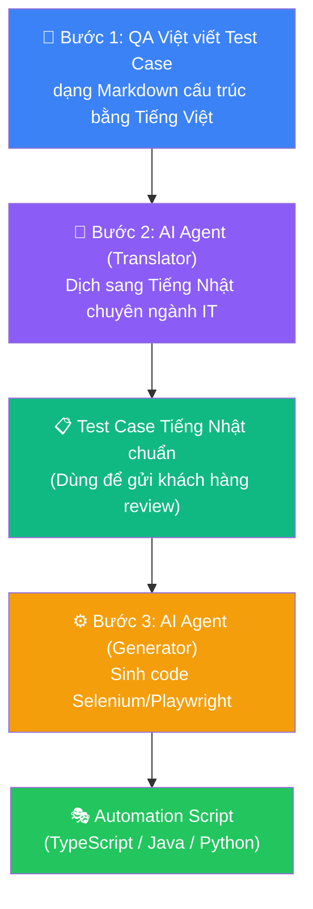

# Viết Test Case bằng Tiếng Việt, AI dịch và sinh Automation Script: Workflow cho BrSE và QA Offshore

## Mở Đầu: Nỗi Đau Giao Tiếp Trong Các Dự Án Offshore Việt-Nhật

Nếu bạn đang làm việc trong các dự án phát triển phần mềm cho thị trường Nhật Bản (offshore), chắc chắn bạn đã quen thuộc với những kịch bản "dở khóc dở cười" sau:

*   **Khách hàng gửi tài liệu/test case bằng tiếng Nhật (thường là file Excel khổng lồ)**: QA Việt Nam không đọc được, BrSE (Kỹ sư cầu nối) phải cắm đầu dịch tay hàng trăm dòng sang tiếng Việt hoặc tiếng Anh.
*   **QA viết test case bằng tiếng Việt/Anh**: BrSE phải dịch ngược lại sang tiếng Nhật để khách hàng review và phê duyệt.
*   **QA viết test automation script**: Vì rào cản ngôn ngữ và sự mơ hồ khi dịch thuật, script viết ra không khớp với business logic hoặc test case gốc của khách hàng, dẫn đến việc phải sửa đi sửa lại nhiều lần.

BrSE trở thành "nút thắt cổ chai" (bottleneck) của toàn bộ quy trình kiểm thử khi phải dành tới **40-50% thời gian** chỉ để làm công việc dịch thuật thủ công và làm rõ yêu cầu (Q&A).

**Giải pháp nào cho vấn đề này?**

Với sự phát triển mạnh mẽ của **AI Agent và các LLM thế hệ mới**, chúng ta hoàn toàn có thể xây dựng một workflow tự động hóa: **Viết test case bằng tiếng Việt -> AI dịch sang tiếng Nhật chuẩn tự nhiên -> AI tự động sinh mã nguồn test automation (Selenium/Playwright)**. Quy trình này không chỉ giải phóng sức lao động cho BrSE mà còn nâng cao độ chính xác và tính đồng bộ của dự án.

Trong bài viết này, tôi sẽ chia sẻ workflow thực chiến mà team chúng tôi đang áp dụng thành công.

---

## 1. Quy Trình Truyền Thống vs. Quy Trình AI-Powered

Hãy cùng nhìn vào bảng so sánh dưới đây để thấy sự khác biệt về năng suất giữa hai cách tiếp cận:

| Hoạt động | Quy trình cũ (Thủ công) | Quy trình mới (AI-Powered) | Hiệu quả mang lại |
| :--- | :--- | :--- | :--- |
| **Dịch Test Case** | BrSE đọc file Excel, dịch từng dòng Việt $\leftrightarrow$ Nhật. Dễ sai thuật ngữ chuyên ngành IT/QA. | AI Agent dịch tự động hàng loạt, giữ nguyên cấu trúc Markdown/Excel, tự động tra cứu bảng thuật ngữ (Glossary). | **Tiết kiệm 80% thời gian** dịch thuật của BrSE. |
| **Làm rõ yêu cầu** | BrSE/QA tự suy luận hoặc gửi sheet Q&A qua lại mất 1-2 ngày để làm rõ spec mơ hồ. | AI phân tích ngữ cảnh, tự động phát hiện các điểm thiếu logic hoặc mơ hồ trong test case để gợi ý Q&A ngay lập tức. | Giảm thiểu rủi ro hiểu sai spec ngay từ đầu. |
| **Viết Script Automation** | QA Automation đọc test case, tự thiết kế locators, tự code script Selenium/Playwright bằng tay. | AI đọc test case (tiếng Nhật/Việt), phân tích cấu trúc DOM (nếu có) và **tự sinh 80% code template** theo chuẩn POM. | **Tăng 2-3 lần tốc độ** viết script của QA. |
| **Bảo trì Script** | Khi spec thay đổi, QA phải dò tìm dòng code tương ứng để sửa thủ công. | Chỉ cần cập nhật test case ngôn ngữ tự nhiên, AI sẽ sinh lại hoặc đề xuất đoạn code cần thay đổi (Self-healing). | Giảm chi phí bảo trì script dài hạn. |

---

## 2. Chi Tiết Workflow 3 Bước Thực Chiến

Để quy trình hoạt động trơn tru và chính xác, chúng ta cần tuân thủ cấu trúc 3 bước sau:



### Bước 1: Chuẩn hóa Test Case bằng Tiếng Việt

Đầu vào quyết định đầu ra. Để AI dịch thuật và sinh code chính xác, QA Việt Nam cần viết test case theo một cấu trúc rõ ràng. Chúng tôi khuyến nghị sử dụng định dạng Markdown có cấu trúc hoặc định dạng Gherkin (Given-When-Then).

*Ví dụ cấu trúc test case chuẩn tiếng Việt:*
```markdown
# ID: TC_REG_001
# Tiêu đề: Đăng ký tài khoản thành công với email hợp lệ
- Tiền đề (Pre-condition): Khách ghé thăm trang đăng ký /register
- Các bước thực hiện (Steps):
  1. Nhập Họ và tên: "Nguyễn Văn A"
  2. Nhập Email: "test_dev@example.com"
  3. Nhập Mật khẩu: "SecurePass123!"
  4. Nhập Xác nhận mật khẩu: "SecurePass123!"
  5. Click checkbox "Đồng ý điều khoản sử dụng"
  6. Click nút "Đăng ký"
- Kết quả mong đợi (Expected Result):
  - Hệ thống đăng ký thành công.
  - Redirect người dùng đến trang dashboard `/welcome`.
  - Hiển thị thông báo "Chào mừng Nguyễn Văn A".
```

### Bước 2: Dịch Thuật Chuyên Ngành Việt-Nhật bằng LLM

Việc sử dụng Google Translate hay DeepL thông thường thường gặp vấn đề:
1. Thiếu thuật ngữ chuyên ngành IT/QA tiếng Nhật (ví dụ: họ hay dịch "nút" thành `ボタン` nhưng "nút Đăng ký" phải là `登録ボタン`, hoặc "textbox" dịch sai ngữ cảnh).
2. Mất cấu trúc Markdown/Excel ban đầu.

Để khắc phục, chúng ta sẽ gán vai trò (Persona) cho LLM là một **Senior BrSE Việt-Nhật** và cung cấp một bảng Glossary thuật ngữ chuyên ngành.

### Bước 3: Tự động Sinh Automation Script (Selenium/Playwright)

Sau khi có test case bằng tiếng Nhật (đã được khách hàng phê duyệt), QA Automation sẽ chuyển tiếp nội dung này vào AI Agent (Generator) kèm theo thông tin về framework đang sử dụng (Playwright TypeScript, Selenium Java,...). AI sẽ phân tích các bước hành động (Steps) và kết quả mong đợi (Expected) để sinh ra code script hoàn chỉnh.

---

## 3. Prompt Mẫu Chuẩn Cho BrSE & QA (Copy-Paste Dùng Ngay)

Dưới đây là 2 bộ prompt tối ưu mà team chúng tôi đang sử dụng trên Claude 3.5 Sonnet và GPT-4o.

### Prompt 1: Dịch Test Case chuyên ngành IT Việt -> Nhật

```text
Bạn là một Senior Bridge System Engineer (BrSE) Việt-Nhật với 10 năm kinh nghiệm trong các dự án phát triển phần mềm và QA offshore.
Nhiệm vụ của bạn là dịch tài liệu Test Case từ Tiếng Việt sang Tiếng Nhật một cách tự nhiên nhất, tuân thủ đúng văn phong kiểm thử phần mềm của người Nhật.

Hãy áp dụng bảng thuật ngữ (Glossary) sau đây để đảm bảo tính đồng nhất:
- Tiền đề (Pre-condition) -> 前提条件
- Các bước thực hiện (Steps) -> 操作手順
- Kết quả mong đợi (Expected Result) -> 期待される kết quả (hoặc 期待結果)
- TextBox / Input field -> 入力フィールド / テキストボックス
- Click / Tap -> クリック / タップ
- Điền / Nhập -> 入力する
- Hiển thị -> 表示される
- Thông báo lỗi -> エラーメッセージ
- Đăng nhập -> ログイン
- Đăng ký -> 新規登録 / アカウント登録
- Trang cá nhân -> マイページ

Yêu cầu đầu ra:
- Giữ nguyên định dạng Markdown của văn bản gốc.
- Sử dụng kính ngữ và văn phong kỹ thuật chuyên nghiệp (Văn phong Desu/Masu phù hợp hoặc dạng liệt kê danh từ ở kết quả mong đợi).

DƯỚI ĐÂY LÀ TEST CASE TIẾNG VIỆT CẦN DỊCH:
[PASTE TEST CASE CỦA BẠN VÀO ĐÂY]
```

### Prompt 2: Sinh Playwright Script từ Test Case Tiếng Nhật

```text
Bạn là một QA Automation Expert chuyên nghiệp về Playwright (TypeScript).
Hãy đọc test case bằng Tiếng Nhật dưới đây và sinh ra mã nguồn Playwright TypeScript test script hoàn chỉnh.

Yêu cầu kỹ thuật:
1. Áp dụng Page Object Model (POM) pattern: Tách riêng cấu trúc trang (selectors, actions) và file spec chạy test.
2. Sử dụng các locators ưu tiên của Playwright (User-facing locators): getByRole, getByLabel, getByPlaceholder, getByText thay vì dùng css selector thô.
3. Không sử dụng hard-coded wait (waitForTimeout) - Hãy sử dụng Web-first Assertions của Playwright (ví dụ: expect(locator).toBeVisible()).
4. Thêm chú thích (comment) rõ ràng tương ứng với từng bước trong test case.
5. URL cơ sở (baseUrl) giả định: http://localhost:3000

TEST CASE TIẾNG NHẬT:
[PASTE TEST CASE TIẾNG NHẬT ĐÃ DỊCH VÀO ĐÂY]
```

---

## 4. Demo Thực Tế: Từ Test Case Tiếng Việt Đến Playwright Script

Hãy cùng xem kết quả chạy thực tế của workflow này.

### Đầu vào: Test Case Tiếng Việt (QA viết)
```markdown
# ID: TC_LOGIN_002
# Tiêu đề: Đăng nhập thất bại do sai mật khẩu
- Tiền đề: Tài khoản "user@example.com" đã tồn tại trên hệ thống.
- Các bước thực hiện:
  1. Truy cập trang đăng nhập `/login`
  2. Nhập Email: "user@example.com"
  3. Nhập Mật khẩu: "WrongPassword123"
  4. Click nút "Đăng nhập"
- Kết quả mong đợi:
  - Hệ thống không đăng nhập thành công.
  - Vẫn hiển thị tại trang `/login`.
  - Xuất hiện thông báo lỗi: "Email hoặc mật khẩu không chính xác".
```

### Đầu ra 1: Bản dịch Tiếng Nhật của AI Agent (BrSE dùng gửi khách hàng)
```markdown
# ID: TC_LOGIN_002
# タイトル: パスワード誤りによるログイン失敗
- 前提条件: アカウント「user@example.com」がシステム内に既に存在していること。
- 操作手順:
  1. ログイン画面「/login」にアクセスする
  2. メールアドレスに入力する: "user@example.com"
  3. パスワードに入力する: "WrongPassword123"
  4. 「ログイン」ボタンをクリックする
- 期待結果:
  - ログインに失敗すること。
  - ログイン画面「/login」に留まること。
  - エラーメッセージ「メールアドレスまたはパスワードが正しくありません」が表示されること。
```

### Đầu ra 2: Playwright Script sinh bởi AI Agent (QA sử dụng)

**1. File Page Object Model (`pages/LoginPage.ts`):**
```typescript
import { type Page, type Locator } from '@playwright/test';

export class LoginPage {
  readonly page: Page;
  readonly emailInput: Locator;
  readonly passwordInput: Locator;
  readonly loginButton: Locator;
  readonly errorMessage: Locator;

  constructor(page: Page) {
    this.page = page;
    // Sử dụng getByLabel và getByRole để tăng tính ổn định
    this.emailInput = page.getByLabel('メールアドレス');
    this.passwordInput = page.getByLabel('パスワード');
    this.loginButton = page.getByRole('button', { name: 'ログイン' });
    this.errorMessage = page.locator('.error-message-container'); // Hoặc getByRole('alert')
  }

  async goto() {
    await this.page.goto('/login');
  }

  async login(email: string, password: string) {
    await this.emailInput.fill(email);
    await this.passwordInput.fill(password);
    await this.loginButton.click();
  }
}
```

**2. File Spec Test (`tests/login.spec.ts`):**
```typescript
import { test, expect } from '@playwright/test';
import { LoginPage } from '../pages/LoginPage';

test.describe('ログイン機能 - パスワード誤りテスト', () => {
  let loginPage: LoginPage;

  test.beforeEach(async ({ page }) => {
    loginPage = new LoginPage(page);
    await loginPage.goto();
  });

  test('TC_LOGIN_002: パスワード誤りによるログイン失敗', async ({ page }) => {
    // 1. メールアドレスと誤ったパスワードを入力してログインを試みる
    await loginPage.login('user@example.com', 'WrongPassword123');

    // 2. 期待結果の検証: ログイン画面に留まっていること
    await expect(page).toHaveURL('/login');

    // 3. 期待結果の検証: エラーメッセージが表示されること
    await expect(loginPage.errorMessage).toBeVisible();
    await expect(loginPage.errorMessage).toContainText('メールアドレスまたはパスワードが正しくありません');
  });
});
```

> [!TIP]
> Bạn có thể thấy đoạn code được sinh ra rất sạch sẽ, tuân thủ đúng Page Object Model và các best practices của Playwright như Web-first assertions. QA chỉ cần chạy lệnh verify locator trên môi trường staging là có thể tích hợp ngay vào CI/CD pipeline.

---

## Kết Luận: Lợi Ích Vượt Trội Của Mô Hình Tự Động Hóa

Áp dụng AI Agent vào quy trình dịch thuật và sinh code test đem lại 3 giá trị to lớn cho dự án offshore:

1.  **Giải phóng BrSE**: Giảm tới **70% thời gian dịch tài liệu kiểm thử**. BrSE có nhiều thời gian hơn để tập trung vào phân tích business và quản lý chất lượng dự án.
2.  **Đồng bộ hóa dữ liệu**: Test case Tiếng Việt, Tiếng Nhật và Automation Code hoàn toàn đồng nhất về mặt ngữ nghĩa và logic. Khách hàng Nhật có thể dễ dàng review spec kiểm thử mà QA Việt Nam đang thực thi.
3.  **Tăng tốc độ bàn giao**: QA không phải chờ đợi bản dịch thủ công để viết script, rút ngắn thời gian chuẩn bị môi trường kiểm thử tự động từ vài ngày xuống vài giờ.

Hãy thử áp dụng bộ prompt trên vào dự án của bạn ngay hôm nay để trải nghiệm sự thay đổi đột phá này!

---

## Tham Khảo

*   [Playwright Best Practices — Locators](https://playwright.dev/docs/locators) — Tài liệu chính thức về cách sử dụng locator tối ưu.
*   [Software Testing Terminology (English-Japanese)](https://www.jstqb.jp/) — Bảng thuật ngữ kiểm thử phần mềm chuẩn của Hội đồng Kiểm thử Phần mềm Nhật Bản (JSTQB).
*   [Model Context Protocol (MCP)](https://modelcontextprotocol.io/) — Giao thức kết nối AI Agent với các công cụ lập trình ngoại vi.
*   Các bài viết liên quan trong series:
    *   [Playwright + AI Agent: Tự động sinh và chạy E2E Test từ User Story](./2026-05-20-playwright-ai-agent-e2e-test.md)
    *   [AI Agent cho Exploratory Testing: LLM tìm Bug thế nào?](./2026-05-22-ai-agent-exploratory-testing-llm-tim-bug.md)
    *   [Xây dựng Knowledge Base cho BrSE với AI và RAG](./2026-05-23-xay-dung-knowledge-base-cho-brse-voi-ai.md)
