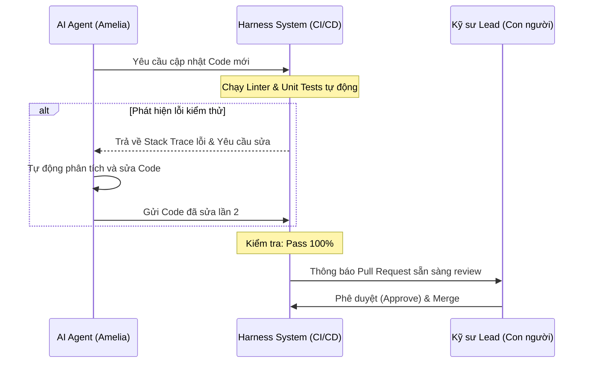

# Harness Engineering: \"Hệ Khung Xương\" Cho Kỷ Nguyên AI Agent Đáng Tin Cậy

## Mở Đầu: Khi AI Agent \"Vượt Ngoài Tầm Kiểm Soát\"

Sự bùng nổ của các công cụ lập trình AI Agent tự trị (như Claude Code, Cursor, hay các framework Multi-Agent) đã mở ra một kỷ nguyên mới cho ngành phát triển phần mềm. Giờ đây, thay vì chỉ tạo ra những đoạn code ngắn, AI Agent đã có thể tự lên kế hoạch, đọc hiểu codebase, chạy terminal, viết test và sửa lỗi. 

Tuy nhiên, khi đưa các Agent này vào thực tế dự án sản xuất của doanh nghiệp, các kỹ sư nhanh chóng vấp phải những tình huống dở khóc dở cười:
*   **Lặp vô hạn (Infinite Loop)**: Agent cố gắng sửa một lỗi kiểm thử nhưng lại làm phát sinh lỗi khác, tạo thành một vòng lặp chạy lệnh tốn hàng triệu token mà không có kết quả.
*   **Phá vỡ cấu trúc dự án**: Agent tự ý cài đặt thêm thư viện lạ, thay đổi cấu trúc thư mục hoặc viết lại các file cốt lõi không theo quy chuẩn chung.
*   **Thiếu an toàn bảo mật**: Agent vô tình thực hiện các lệnh hủy diệt như xóa cơ sở dữ liệu (`rm -rf` bừa bãi) hoặc gửi các thông tin nhạy cảm của hệ thống lên máy chủ AI công cộng.

Tại sao một LLM cực kỳ thông minh khi đóng vai trò Agent lại có thể tạo ra những kết quả hỗn loạn như vậy? Câu trả lời nằm ở việc: **Chúng ta đang thả một con ngựa chiến dũng mãnh (Core Model) chạy tự do ngoài thảo nguyên mà không trang bị cho nó một bộ yên cương và dây dắt (Harness).**

Để giải quyết bài toán này, khái niệm **Harness Engineering (Kỹ nghệ Khung kiểm soát)** đã ra đời như một chiếc chìa khóa vàng giúp doanh nghiệp thuần hóa sức mạnh của AI một cách an toàn và tin cậy.

---

## 1. Harness và Harness Engineering Là Gì?

Để giải thích một cách dễ hiểu nhất, chúng ta có thể sử dụng hình ảnh ẩn dụ về môn đua ngựa:

*   **Model (Mô hình LLM)** giống như **con ngựa chiến**. Nó sở hữu sức mạnh cơ bắp vượt trội, tốc độ kinh ngạc (khả năng tư duy logic và sinh code).
*   **Harness (Bộ yên cương)** là **hệ thống dây cương, yên ngựa, móng sắt và roi da**. Không có bộ yên cương này, kỵ sĩ không thể điều khiển hướng chạy của con ngựa, và bản thân con ngựa cũng dễ bị hoảng loạn hoặc vấp ngã.
*   **Harness Engineering** chính là **nghệ thuật thiết kế và chế tạo bộ yên cương đó**.

 Trong lĩnh vực phát triển phần mềm:
> **AI Agent = Core Model (LLM) + Harness (Scaffolding & Infrastructure)**

Harness chính là toàn bộ hệ thống phần mềm, công cụ, quyền hạn, cơ chế phản hồi và các rào cản bao quanh mô hình AI, giúp nó tương tác một cách an toàn và chính xác với môi trường lập trình thực tế.

```
┌────────────────────────────────────────────────────────┐
│                      AI AGENT                          │
│  ┌──────────────────────────────────────────────────┐  │
│  │                     HARNESS                      │  │
│  │  ┌────────────────────────────────────────────┐  │  │
│  │  │                 CORE MODEL                 │  │  │
│  │  │                   (LLM)                    │  │  │
│  │  │  - Suy luận logic                          │  │  │
│  │  │  - Đề xuất giải pháp                       │  │  │
│  │  └─────────────────────▲──────────────────────┘  │  │
│  │                        │                         │  │
│  │  - Giới hạn quyền      - Tự động chạy test       │  │
│  │  - Sandbox bảo mật     - Lọc dữ liệu đầu vào     │  │
│  │  - Đọc file / Ghi file - Quan sát hành trình      │  │
│  └────────────────────────▲─────────────────────────┘  │
└───────────────────────────┼────────────────────────────┘
                            │
               [Thực thi thế giới thực]
           (File System, Terminal, API, Git)
```

### Phân biệt 3 cấp độ tối ưu hóa AI:

| Khái niệm | Trọng tâm | Cách thức hoạt động | Ví dụ |
| :--- | :--- | :--- | :--- |
| **Prompt Engineering** | Hướng dẫn đầu vào (Input) | Tối ưu hóa chuỗi ký tự, câu lệnh gửi đến LLM để nhận được câu trả lời tốt nhất. | *"Hãy đóng vai là một Senior Developer..."* |
| **Context Engineering** | Quản lý thông tin (Context) | Lọc và cung cấp đúng dữ liệu cần thiết tại đúng thời điểm cho LLM. | Sử dụng RAG, Semantic Search để nhét code liên quan vào prompt. |
| **Harness Engineering** | Thiết kế môi trường (Environment) | Tạo ra một hệ thống phần mềm khép kín để Agent chạy thử, nhận phản hồi từ hệ thống, tự sửa sai và tuân thủ các quy tắc bảo mật. | Tự động chạy `pytest` -> trích xuất lỗi -> gửi ngược lại để Agent tự debug. |

---

## 2. 5 Thành Phần Cốt Lõi Của Một Bộ Harness Tiêu Chuẩn

Một bộ Harness tiêu chuẩn trong phát triển phần mềm không thể thiếu các cấu phần sau đây:

### 2.1 Môi Trường Thực Thi Bọc Kín (Sandboxed Execution Environment & Tool Orchestration)
AI Agent cần các công cụ để tương tác với code (đọc/ghi file, cài đặt thư viện, chạy thử ứng dụng). Bộ Harness phải cung cấp các API kết nối an toàn này, lý tưởng nhất là chạy trong một container cô lập (Docker sandbox) để tránh việc Agent phá hỏng máy chủ của người dùng.

### 2.2 Vòng Lặp Phản Hồi Kiểm Chứng Tự Động (Automated Feedback & Verification Loops)
Đây là trái tim giúp Agent có khả năng "tự học và tự sửa". Khi Agent thay đổi code, Harness sẽ tự động kích hoạt các công cụ kiểm thử:
1.  **Linter check**: Đảm bảo code viết ra đúng format quy chuẩn (ESLint, Pylint).
2.  **Compiler/Type check**: Đảm bảo không lỗi cú pháp hoặc sai kiểu dữ liệu (TypeScript compiler).
3.  **Unit/Integration Test**: Chạy các test case có sẵn (Jest, PyTest).

Nếu bất kỳ bước nào thất bại, Harness sẽ gom thông tin lỗi (Error Stack Trace) làm đầu vào mới cho Agent thực hiện chu kỳ sửa lỗi tiếp theo (Self-healing).

### 2.3 Quản Lý Bộ Nhớ và Trạng Thái (State & Memory Management)
Để tránh hiện tượng Agent bị "lú lẫn" khi hội thoại quá dài (Context Pollution), Harness thực hiện nhiệm vụ:
*   Chỉ chọn lọc các file đang chỉnh sửa đưa vào cửa sổ ngữ cảnh (Context Window).
*   Lưu trữ lịch sử hành động (State Machine) để Agent biết mình đang ở bước nào trong bản kế hoạch tổng thể.

### 2.4 Hệ Thống Rào Cản và Quyền Hạn (Guardrails & Permission Gateways)
Quy định rõ ràng những gì Agent được làm và không được làm thông qua chính sách phân quyền:
*   **Read-only**: Các thư mục nhạy cảm chỉ cho phép đọc.
*   **Write-restricted**: Chỉ được sửa code trong một số directory cụ thể.
*   **Human-in-the-loop (HITL)**: Khi Agent thực hiện các lệnh nguy hiểm (như `git push`, gọi API thanh toán, chạy script xóa dữ liệu), Harness sẽ tạm dừng hoạt động và hiển thị popup yêu cầu lập trình viên xác nhận bằng tay.

### 2.5 Khả Năng Giám Sát và Kiểm Toán (Observability & Audit Trail)
Harness ghi lại toàn bộ nhật ký hành động (Trajectory Logs) của Agent. Điều này không chỉ giúp lập trình viên giám sát tiến độ mà còn phục vụ việc kiểm tra bảo mật (Audit), phân tích nguyên nhân nếu Agent phát sinh lỗi nghiêm trọng.

---

## 3. Best Practices Ứng Dụng Harness Tại Thị Trường Nhật Bản

Nhật Bản là một thị trường cực kỳ đặc thù. Triết lý quản lý chất lượng **品質第一 (Hinshitsu Daiichi - Chất lượng là số một)** và các yêu cầu nghiêm ngặt về bảo mật thông tin (Compliance, ISO 27001) khiến các doanh nghiệp Nhật rất e dè trong việc áp dụng AI tự do. Tuy nhiên, họ lại là những người đi đầu trong việc chuẩn hóa và ứng dụng **Harness Engineering** để đưa AI Agent vào quy trình vận hành thực tế.

Dưới đây là các Best Practice thực chiến đã và đang được triển khai tại thị trường Nhật Bản:

### Best Practice 1: Thiết Lập Repository-level Harness Với Quy Tắc Nghiêm Ngặt
Thay vì để AI tự do suy diễn, các dự án Offshore Việt-Nhật thiết lập các tập tin quy chuẩn dự án đóng vai trò như một Harness tĩnh tại thư mục gốc (Root Repository), phổ biến nhất là file `CLAUDE.md`, `.claudecoderc` hoặc `AGENTS.md`.

*   **Cách hoạt động**: Các file này mô tả cấu trúc thư mục, quy tắc đặt tên biến, lệnh build dự án, cách chạy test và thậm chí là **quy trình làm việc khi gặp spec mơ hồ (Q&A)**. 
*   **Hiệu quả**: Khi các công cụ như Claude Code hay Cursor khởi chạy, bộ Harness nội bộ của chúng sẽ tự động đọc file này trước tiên, ép Agent hành động chuẩn xác 100% theo phong cách thiết kế của dự án, loại bỏ hoàn toàn các lỗi lệch chuẩn coding style.

!!! example "Ví dụ về một cấu trúc quy tắc trong `CLAUDE.md` tại dự án Nhật"
    ```markdown
    # Quy định phát triển dự án (Development Rules)
    - Chỉ chỉnh sửa code trong thư mục `/src/components/`
    - Tuyệt đối không được thay đổi các file cấu hình hệ thống tại `/config/`
    - Mọi chức năng mới BẮT BUỘC phải viết Unit Test tương ứng trong `/tests/`
    - Khi viết code, luôn sử dụng ngôn ngữ Tiếng Anh cho biến/hàm, nhưng chú thích (JSDoc) phải dùng Tiếng Nhật chuẩn văn phong kỹ thuật (Desu/Masu).
    ```

### Best Practice 2: Vòng Lặp Sửa Lỗi Tự Động Với Chất Lượng Cực Hạn (Zero-defect Self-healing Loop)
Trong các dự án phát triển phần mềm cho đối tác Nhật Bản, quy trình kiểm soát lỗi tự động được nâng lên mức tối đa.

*   **Cách hoạt động**: Khi AI Agent thông báo đã code xong một tính năng, bộ Harness CI/CD sẽ tự động kích hoạt. Nó chạy song song ba tầng kiểm tra: static analysis (linter), type check, và unit tests. 
*   **Cơ chế Self-healing**: Nếu phát hiện bất kỳ lỗi nhỏ nào (dù chỉ là thiếu một dấu chấm phẩy hoặc cảnh báo linter), Harness sẽ tự tạo một prompt đóng gói lỗi này gửi trả về Agent. Agent phải tự sửa cho đến khi toàn bộ pipeline chuyển sang màu xanh (Pass).
*   **Human-in-the-loop**: Chỉ khi vượt qua vòng kiểm tra tự động của Harness, code mới được đẩy lên Git dưới dạng Pull Request để BrSE hoặc Tech Lead người Nhật thực hiện review thủ công. Quy trình này giảm tải tới 80% công sức review những lỗi vặt cho các kỹ sư.



### Best Practice 3: Áp Dụng Named Agents & Phân Tách Cấu Trúc Agent
Thay vì sử dụng một Agent đa năng (General Agent) chịu trách nhiệm cho toàn bộ dự án, các doanh nghiệp Nhật ưa chuộng các mô hình phân vai cụ thể, ví dụ như áp dụng **[BMad Method](file:///Users/tranvanhoan/Documents/Projects/Learning/MyWiki/docs/blog/posts/2026-05-06-bmad-method-phat-trien-phan-mem-voi-ai-agent.md)**.

*   **Cách hoạt động**: Dự án được vận hành bởi một tổ hợp các Agent chuyên biệt:
    *   **Mary (Analyst)**: Chỉ có quyền đọc tài liệu spec và viết Product Brief.
    *   **Oliver (Architect)**: Chỉ thiết kế kiến trúc hệ thống (`architecture.md`).
    *   **Amelia (Developer)**: Có quyền viết code trong Sandbox nhưng không được tự ý deploy.
    *   **Thomas (QA)**: Chỉ có quyền chạy test và đọc log, không được phép chỉnh sửa source code.
*   **Hiệu quả**: Việc giới hạn quyền hạn và công cụ cho từng Agent (Role-based Harness) giúp giảm thiểu rủi ro bảo mật thông tin và hạn chế tối đa việc AI "làm loạn" codebase.

### Best Practice 4: Cổng Kết Nối Trung Gian Bảo Mật Tuyệt Đối (Data Masking & Cost Governance Gateway)
Để bảo vệ bí mật kinh doanh và thông tin cá nhân của khách hàng Nhật (PII), các doanh nghiệp không cho phép AI Agent kết nối trực tiếp với API của các nhà cung cấp như OpenAI hay Anthropic.

*   **Cách hoạt động**: Họ xây dựng một "External Harness" đóng vai trò là API Gateway nội bộ (thường sử dụng Azure OpenAI hoặc AWS Bedrock chạy trong mạng riêng ảo VPN).
*   **Data Masking**: Khi Agent gửi truy vấn đi, Gateway sẽ tự động phát hiện và che giấu (mask) các thông tin nhạy cảm như IP khách hàng, mã số thẻ, API Key hoặc tên thật của khách hàng trước khi đẩy dữ liệu lên LLM bên ngoài.
*   **Cost Governance**: Gateway này đồng thời giới hạn số lượng token tối đa mà một Agent có thể tiêu thụ trong ngày, ngăn chặn rủi ro hóa đơn API tăng đột biến do Agent bị lặp vô tận.

---

## Kết Luận: Tương Lai Thuộc Về Harness Engineering

Nếu như năm 2024-2025 là thời kỳ hoàng kim của **Prompt Engineering** – nơi mọi người tìm cách viết những câu lệnh thật khéo léo để AI hiểu, thì từ năm 2026 trở đi, thế giới công nghệ đã chuyển dịch mạnh mẽ sang **Harness Engineering**. 

Một mô hình AI thông minh đến đâu cũng không thể tự vận hành an toàn trong doanh nghiệp nếu thiếu đi một "bộ khung xương" kiểm soát vững chắc. Việc hiểu rõ và áp dụng thành thạo các best practice về Harness không chỉ giúp nâng cao chất lượng phần mềm mà còn là tấm vé thông hành giúp các đơn vị IT Offshore Việt Nam tự tin đấu thầu và triển khai các dự án quy mô lớn cho những khách hàng khó tính nhất tại thị trường Nhật Bản.

---

## Tham Khảo

*   [BMad Method — Official Documentation](https://docs.bmad-method.org/) — Tài liệu chính thức về framework phát triển phần mềm bằng Multi-Agent chuyên biệt.
*   [Model Context Protocol (MCP)](https://modelcontextprotocol.io/) — Giao thức kết nối AI Agent với các công cụ ngoại vi do Anthropic phát triển.
*   [Zenn.dev — AIエージェント開発におけるハーネスエンジニアリング](https://zenn.dev/) — Các bài viết thảo luận chuyên sâu về Harness Engineering tại cộng đồng lập trình viên Nhật Bản.
*   Các bài viết liên quan trong series AI Wiki:
    *   [BMad Method — Framework Phát triển Phần mềm Bằng AI Agent Chuyên biệt](file:///Users/tranvanhoan/Documents/Projects/Learning/MyWiki/docs/blog/posts/2026-05-06-bmad-method-phat-trien-phan-mem-voi-ai-agent.md)
    *   [Viết Test Case bằng Tiếng Việt, AI dịch và sinh Automation Script](file:///Users/tranvanhoan/Documents/Projects/Learning/MyWiki/docs/blog/posts/2026-06-14-viet-test-case-tieng-viet-ai-dich-sinh-automation-script.md)
    *   [Phát triển Test-Driven Development (TDD) với AI Agent](file:///Users/tranvanhoan/Documents/Projects/Learning/MyWiki/docs/blog/posts/2026-05-16-tdd-voi-ai-agent.md)
