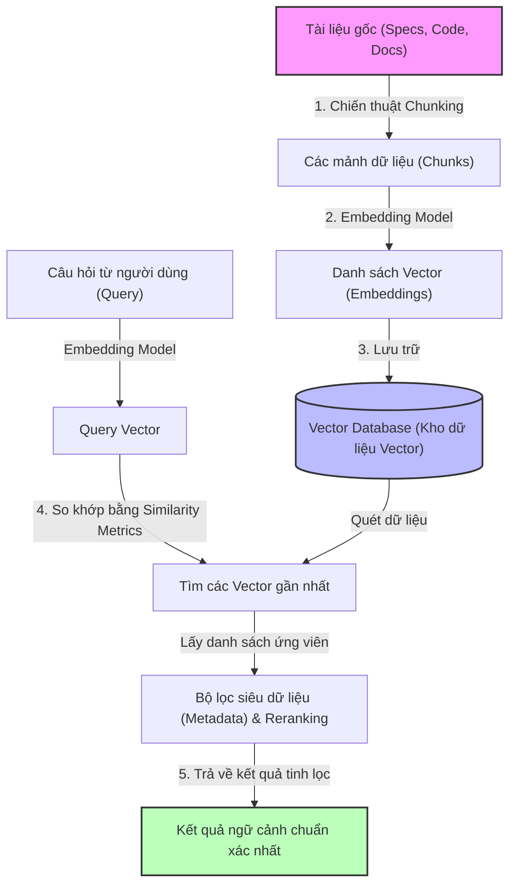

# Semantic Search trong Kiến trúc AI: Từ Nguyên lý Cốt lõi đến Ứng dụng Thiết kế Hệ thống và Reverse Engineering

## Mở đầu

Trong kỷ nguyên của các AI Agent và các hệ thống RAG (Retrieval-Augmented Generation), việc tìm kiếm thông tin không còn đơn thuần là việc so khớp các ký tự (Keyword Matching) trên cơ sở dữ liệu. Khi đối mặt với các kho lưu trữ tri thức khổng lồ của doanh nghiệp — từ file tài liệu đặc tả (Specification), biên bản họp (Meeting Notes), email trao đổi với đối tác cho đến hàng triệu dòng mã nguồn (Codebase) phức tạp — phương pháp tìm kiếm truyền thống thường bộc lộ những hạn chế rõ rệt.

Để xây dựng một **Knowledge Base** thực sự thông minh, giúp kiến trúc sư (Architect), kỹ sư cầu nối (BrSE) và lập trình viên tra cứu siêu tốc hoặc tự động sinh tài liệu thiết kế hệ thống (kể cả dự án mới phát triển - Greenfield, dự án bảo trì - Maintenance, hay dự án đảo ngược mã nguồn - Reverse Engineering), **Semantic Search (Tìm kiếm ngữ nghĩa)** chính là chiếc chìa khóa vạn năng. 

Bài viết này sẽ mổ xẻ Semantic Search dưới góc nhìn của một chuyên gia kiến trúc AI: giải thích nguyên lý hoạt động một cách trực quan, điểm mặt các thành phần cốt lõi không thể thiếu, cập nhật các best practices từ các công cụ AI hàng đầu và phác thảo giải pháp ứng dụng vào thiết kế hệ thống cũng như kỹ thuật đảo ngược mã nguồn (reverse engineering).

**Nội dung chính:**
* **Bản chất của Semantic Search**: Giải thích dễ hiểu nhất và so sánh với Keyword Search.
* **5 Thành phần cốt lõi không thể thiếu** của một hệ thống Semantic Search chuẩn sản xuất (production-ready).
* **Các Best Practices** đã và đang được ứng dụng trong các công cụ AI hàng đầu (Vite, Cursor, Claude Code, NotebookLM).
* **Ứng dụng thực chiến**: Xây dựng Knowledge Base để sinh tài liệu thiết kế (Greenfield, Maintenance và đặc biệt là Reverse Engineering codebase).

---

## 1. Semantic Search Là Gì? Giải Thích Dễ Hiểu Nhất

### 1.1 Từ So Khớp Ký Tự đến Thấu Hiểu Ý Định

Tìm kiếm truyền thống (Lexical/Keyword Search) giống như một người thủ thư chỉ biết đọc chữ cái mà không hiểu nghĩa. Nếu bạn tìm kiếm cụm từ `"khóa tài khoản do nhập sai OTP"`, hệ thống truyền thống (như thuật toán BM25) sẽ quét toàn bộ tài liệu để tìm các từ chính xác: `"khóa"`, `"tài khoản"`, `"OTP"`. Nếu tài liệu của bạn ghi: `"Tài khoản bị tạm ngưng do vượt quá số lần nhập mã xác thực cho phép"`, hệ thống từ khóa sẽ bỏ qua tài liệu này vì các từ khóa không khớp, mặc dù về mặt ý nghĩa, chúng hoàn toàn trùng khớp.

**Semantic Search (Tìm kiếm ngữ nghĩa)** giải quyết triệt để bài toán này bằng cách tập trung vào **ý định của người dùng (user intent)** và **ngữ cảnh của khái niệm (conceptual context)** thay vì các ký tự thô. Nó hiểu được:
* **Đồng nghĩa & Gần nghĩa**: "tạm ngưng" tương đồng với "khóa", "mã xác thực" tương đồng với "OTP".
* **Ý nghĩa ngữ cảnh**: Hiểu được mối quan hệ giữa các từ trong câu thay vì xem chúng là các từ đơn lẻ.
* **Đa ngôn ngữ (Cross-lingual)**: Tìm kiếm bằng tiếng Việt vẫn có thể truy xuất ra tài liệu gốc bằng tiếng Anh hoặc tiếng Nhật nếu ý nghĩa của chúng tương đương.

### 1.2 Không Gian Vector (Vector Space) — Nơi Từ Ngữ Có Tọa Độ

Để máy tính hiểu được ngữ nghĩa, chúng ta cần chuyển đổi ngôn ngữ tự nhiên thành các con số. Quá trình này được thực hiện bởi các mô hình nhúng (Embedding Models), biến mỗi đoạn văn bản thành một chuỗi số thực (gọi là **Vector** hay **Embedding**) nằm trong một không gian đa chiều (thường từ 384 đến 1536 chiều).

Trong không gian này, các khái niệm có ý nghĩa gần nhau sẽ được xếp gần nhau. 

```
                                [Không gian Vector đa chiều]

            (Ý tưởng: Đăng nhập thất bại)                (Ý tưởng: Cơ sở dữ liệu)
        * "Tài khoản bị khóa"                       * "Kết nối DB bị timeout"
        * "Nhập sai mật khẩu"                       * "Lỗi truy vấn SQL"
        * "Quá số lần OTP"                          * "Postgres không phản hồi"
```

Khi người dùng nhập một câu truy vấn (Query), hệ thống sẽ biến câu query đó thành một vector và tìm kiếm các tài liệu có vector nằm gần vector của query nhất. Độ "gần" này được tính toán thông qua các phép toán hình học.

---

## 2. 5 Thành Phần Cốt Lõi Không Thể Thiếu Của Semantic Search

Để xây dựng một hệ thống Semantic Search chạy thực tế trong môi trường production, bạn cần 5 mảnh ghép cốt lõi sau:



### 2.1 Bộ Chuyển Đổi Ngôn Ngữ Thành Số (Embedding Model)
Đây là động cơ chính của hệ thống. Nó chịu trách nhiệm đọc văn bản đầu vào và biểu diễn chúng dưới dạng vector toán học sao cho giữ nguyên được mối liên hệ ngữ nghĩa.
* **Các lựa chọn phổ biến**: 
    * *Đám mây (API-based)*: OpenAI `text-embedding-3-large`, Cohere Embed v3 (cực mạnh về đa ngôn ngữ và tìm kiếm code).
    * *Local/Mã nguồn mở*: `nomic-embed-text` (nhẹ và hiệu quả), `bge-large-en-v1.5` (top đầu trên bảng xếp hạng MTEB).

### 2.2 Kho Lưu Trữ Vector (Vector Database)
Khác với cơ sở dữ liệu quan hệ (SQL) lưu trữ dữ liệu dạng bảng, Vector Database được tối ưu hóa để lưu trữ hàng triệu vector đa chiều và thực hiện tìm kiếm các láng giềng gần nhất (Approximate Nearest Neighbor - ANN) cực nhanh với độ trễ tính bằng mili-giây.
* **Các lựa chọn phổ biến**: Pinecone (SaaS dễ dùng), Qdrant (mạnh mẽ, hỗ trợ local/cloud và rất nhanh), Milvus (dành cho quy mô siêu lớn), pgvector (tiện lợi nếu dự án đang dùng PostgreSQL).

### 2.3 Phép Đo Độ Tương Đồng (Similarity Metrics)
Đây là thước đo toán học để tính toán khoảng cách hoặc góc giữa hai vector nhằm xác định mức độ liên quan về mặt ngữ nghĩa.
* **Cosine Similarity**: Phép đo phổ biến nhất trong RAG. Nó đo góc giữa hai vector trong không gian đa chiều, bất chấp độ dài văn bản ngắn hay dài. Thang điểm từ -1 đến 1 (càng gần 1 càng tương đồng).
* **Dot Product (Tích vô hướng)**: Rất nhanh nếu các vector đã được chuẩn hóa (normalized).
* **Euclidean Distance (L2 Distance)**: Đo khoảng cách thẳng giữa hai điểm. Khoảng cách càng nhỏ, mức độ tương đồng càng cao.

### 2.4 Chiến Thuật Phân Mảnh Dữ Liệu (Chunking Strategy)
Mô hình ngôn ngữ có giới hạn về kích thước đầu vào (Context Window) và các mô hình embedding cũng có giới hạn số lượng token tối đa cho mỗi lần nhúng (thường là 512 hoặc 8192 tokens). Vì thế, bạn không thể nạp cả một cuốn tài liệu Spec 500 trang hay một file code 10.000 dòng vào một vector duy nhất. Bạn phải chia nhỏ chúng ra thành các mảnh (Chunks).
* **Fixed-size Chunking**: Chia đều theo độ dài ký tự cố định (ví dụ: 500 ký tự một chunk, gối đầu 10% để tránh mất ngữ cảnh ở biên).
* **Semantic Chunking**: Chia nhỏ dựa trên sự thay đổi về mặt ngữ nghĩa giữa các câu liên tiếp (khi ngữ nghĩa thay đổi quá một ngưỡng cho phép, một chunk mới sẽ được tạo).
* **Structure/Code-aware Chunking**: Chia theo cấu trúc ngữ pháp của mã nguồn hoặc phân cấp tài liệu (như tiêu đề Markdown, Class, Function).

### 2.5 Thuật Toán Tra Cứu Và Tích Hợp (Retrieval & Fusion Algorithm)
Đây là quy trình kết hợp nhiều phương pháp tìm kiếm khác nhau và sắp xếp lại kết quả để đảm bảo thông tin trả về có độ chính xác cao nhất (Precision) và bao phủ tốt nhất (Recall). Nó bao gồm các kỹ thuật như **Hybrid Search** (kết hợp Vector và Keyword) và **Reranker** (sắp xếp lại kết quả bằng mô hình Cross-Encoder chuyên biệt).

---

## 3. Các Best Practices Ứng Dụng Semantic Search Trong Các Công Cụ AI Hàng Đầu

Các công cụ AI xuất sắc hiện nay như Cursor, Claude Code, hay NotebookLM không sử dụng hệ thống RAG ngây thơ (Naive RAG). Họ áp dụng những kỹ thuật tối ưu hóa phức tạp dưới đây:

### 3.1 Tìm Kiếm Lai (Hybrid Search)
Vector search rất xuất sắc trong việc hiểu ý tưởng nhưng lại rất kém khi tìm kiếm các từ khóa chính xác tuyệt đối như: mã lỗi (`ERR_009`), ID phiên bản (`v2.4.1`), mã định danh trong code (`userId`), hoặc tên biến cụ thể. 

!!! tip "Giải pháp Best Practice: Kết hợp Vector + BM25"
    Hãy chạy song song hai luồng tìm kiếm:
    1. **Dense Retrieval (Semantic Search)** để bắt lấy các ý tưởng và từ đồng nghĩa.
    2. **Sparse Retrieval (BM25 Keyword Search)** để định vị chính xác từ khóa và ký tự đặc biệt.
    
    Sau đó kết hợp kết quả của cả hai lại.

### 3.2 Hợp Nhất Bằng Xếp Hạng Nghịch Đảo (Reciprocal Rank Fusion - RRF)
Khi có hai danh sách kết quả từ Vector Search và BM25, chúng ta không thể cộng điểm của chúng lại trực tiếp vì thang điểm của hai hệ thống này hoàn toàn khác nhau.

**RRF** giải quyết vấn đề này bằng cách xếp hạng lại các tài liệu dựa trên thứ hạng (Rank) của chúng trong từng danh sách, thay vì dùng điểm số thô. Công thức tính điểm RRF:

$$RRF\_Score(d \in D) = \sum_{m \in M} \frac{1}{k + r_m(d)}$$

*(Trong đó $r_m(d)$ là thứ hạng của tài liệu $d$ trong danh sách tìm kiếm $m$, và $k$ thường là hằng số bằng 60).*

Phương pháp này cực kỳ bền vững, giúp lọc ra những tài liệu xuất hiện ở thứ hạng cao trong cả hai danh sách tìm kiếm.

### 3.3 Hệ Thống Tra Cứu Hai Giai Đoạn (Two-Stage Retrieval với Reranker)
Mô hình Embedding (Bi-Encoder) rất nhanh và nhẹ vì các vector tài liệu đã được tính toán trước và lưu trữ trong DB. Tuy nhiên, chúng không thể tính toán được mối liên hệ sâu sắc giữa các từ trong câu truy vấn và các từ trong tài liệu.

Để tối ưu hóa, các công cụ AI áp dụng quy trình:
1. **Giai đoạn 1 (Retrieve)**: Sử dụng Hybrid Search quét nhanh trên Vector DB để lấy ra top 50 hoặc 100 tài liệu tiềm năng nhất (Recall cao).
2. **Giai đoạn 2 (Rerank)**: Sử dụng một mô hình **Reranker (Cross-Encoder)** để so sánh trực tiếp từng cặp `(Query, Document)` của top 100 đó. Mô hình này tuy chậm và đắt hơn nhưng có độ chính xác cực cao. Nó sẽ chấm điểm và sắp xếp lại để trả về top 5-10 tài liệu chất lượng nhất cho LLM sinh câu trả lời.

### 3.4 Bộ Lọc Siêu Dữ Liệu Trước Khi Quét (Metadata Pre-filtering)
Nếu bạn có 1 triệu file tài liệu thuộc nhiều dự án khác nhau, việc quét tìm kiếm ngữ nghĩa trên toàn bộ 1 triệu vector sẽ gây lãng phí tài nguyên và dễ bị nhiễu thông tin (lấy nhầm spec của dự án A sang dự án B).

!!! warning "Quy tắc lọc dữ liệu"
    Luôn đính kèm siêu dữ liệu (metadata) như `project_id`, `file_type`, `created_date`, `module` vào mỗi chunk khi index. Khi người dùng hỏi: *"Log lỗi đăng nhập của dự án ABC là gì?"*, hệ thống phải thực hiện lọc (pre-filter) trên database chỉ giữ lại các chunk có `project_id == 'ABC'`, sau đó mới thực hiện quét tìm kiếm tương đồng vector trên tập con này.

### 3.5 Bộ Nhớ Đệm Ngữ Nghĩa (Semantic Caching)
Nếu nhiều người dùng hỏi các câu hỏi có cùng ý nghĩa bằng các cách diễn đạt khác nhau (ví dụ: *"Cách reset password thế nào?"* và *"Làm sao để đổi lại mật khẩu bị quên?"*), việc gọi LLM liên tục sẽ rất tốn kém và chậm.

**Semantic Caching** (như GPTCache) sẽ lưu trữ các câu hỏi và câu trả lời đã được sinh ra trước đó. Khi có câu hỏi mới, hệ thống quét tìm kiếm tương đồng trên danh sách câu hỏi cũ. Nếu độ tương đồng vượt quá 95% (ngưỡng cao), nó sẽ trả về câu trả lời đã được cache ngay lập tức mà không cần gọi LLM hay quét lại hệ thống tài liệu.

---

## 4. Ứng Dụng Xây Dựng Knowledge Base & Sinh Tài Liệu Thiết Kế Hệ Thống

Dưới đây là kiến trúc thực chiến ứng dụng Semantic Search để giải quyết bài toán quản trị tri thức và sinh tài liệu thiết kế tự động cho 3 dạng dự án đặc thù:

### 4.1 Dự án Greenfield (Phát triển mới)
* **Bài toán**: Từ tài liệu yêu cầu (Business Requirement Document - BRD) ban đầu rất sơ sài và mơ hồ bằng tiếng Việt, cần sinh ra tài liệu thiết kế hệ thống chi tiết gồm: API Specification (OpenAPI format), Entity Relationship Diagram (ERD) và System Architecture.
* **Cách ứng dụng Semantic Search**:
    1. **Index tài liệu tiêu chuẩn cấu trúc**: Nạp vào Knowledge Base các tài liệu template chuẩn thiết kế của công ty và các tài liệu thiết kế của các hệ thống tương tự đã thành công trong quá khứ.
    2. **Tra cứu ngữ nghĩa mẫu thiết kế (Design Pattern Retrieval)**: Khi AI Agent phân tích yêu cầu mới (ví dụ: *"Thiết kế flow đăng ký qua OTP"*), hệ thống Semantic Search sẽ tự động quét trong Knowledge Base để tìm các tài liệu thiết kế flow OTP cũ, các quy định bảo mật của công ty về độ dài OTP, thời gian hết hạn.
    3. **Tái sử dụng & Sinh tài liệu**: Agent sử dụng ngữ cảnh các quy định kỹ thuật được tra cứu về để viết OpenAPI Spec chuẩn xác, đảm bảo tuân thủ đúng kiến trúc chung của doanh nghiệp.

### 4.2 Dự án Maintenance (Bảo trì & Phát triển tiếp)
* **Bài toán**: Hệ thống đã chạy được nhiều năm. Tài liệu Spec chính thức đã lỗi thời và không khớp với code thực tế. Các quyết định thay đổi logic nằm rải rác trong hàng ngàn email, thread chat Slack và file Q&A Excel của dự án.
* **Cách ứng dụng Semantic Search**:
    1. **Nạp dữ liệu phi cấu trúc**: Định kỳ nạp toàn bộ email kỹ thuật, quyết định trên Slack (sau khi đã lọc nhiễu) và file Q&A vào Vector DB.
    2. **Truy vết quyết định (Decision Tracing)**: Khi Dev Offshore hỏi: *"Tại sao tính năng thanh toán này lại giới hạn hạn mức 10 triệu/giao dịch?"*, BrSE sử dụng Semantic Search để hỏi: *"Quyết định về hạn mức thanh toán 10 triệu"* -> Hệ thống sẽ tìm ra email chốt yêu cầu giữa PM và Khách hàng cách đây 6 tháng.
    3. **Cập nhật Spec tự động**: AI Agent sẽ lấy thông tin từ email đó, kết hợp với file Spec cũ để sinh ra file Spec cập nhật mới nhất cho team phát triển.

### 4.3 Dự án Reverse Engineering (Đảo ngược mã nguồn)
Đây là bài toán phức tạp nhất. Bạn nhận được một codebase cũ (legacy code) khổng lồ, không hề có tài liệu thiết kế, và nhiệm vụ của bạn là phải vẽ lại kiến trúc hệ thống và giải thích logic code cho khách hàng.

!!! caution "Thách thức của RAG truyền thống đối với Source Code"
    Nếu sử dụng phương pháp cắt nhỏ văn bản thông thường (ví dụ: cứ 100 dòng code cắt một phát), bạn sẽ xé nát cấu trúc của một Class hoặc một Function. Một hàm có thể bị chia làm đôi nằm ở hai chunk khác nhau. Khi AI đọc các chunk này, nó hoàn toàn mất đi ngữ cảnh logic và cú pháp của ngôn ngữ lập trình, dẫn đến việc sinh tài liệu sai lệch.

#### Giải pháp thiết lập pipeline Semantic Search cho Codebase:

```
[Codebase cũ] ──> [AST Parsing (tree-sitter)] ──> [Code Blocks: Classes/Methods]
                                                          │
   [Knowledge Graph (Neo4j)] ◄── [Dependency Extraction] ◄┘
            │
            ▼
    [Hybrid Retrieval] ◄── [User Query: "Vẽ sequence diagram flow checkout"]
            │
            ▼
    [Agentic Synthesis] ──> [Tài liệu Sequence Diagram (Mermaid)]
```

##### Bước 1: AST-Aware Parser (Phân tích cú pháp dựa trên cây cú pháp trừu tượng)
Không sử dụng bộ cắt text thông thường. Sử dụng các parser chuyên dụng (như thư viện `tree-sitter` hoặc LSP - Language Server Protocol) để phân tích code thành các thành phần cú pháp hoàn chỉnh:
* Tách riêng từng Class, từng Method/Function.
* Mỗi hàm hoặc lớp là một chunk duy nhất, tự chứa đầy đủ mã nguồn từ khi mở ngoặc nhọn `{` đến khi đóng ngoặc nhọn `}`.

##### Bước 2: Bọc ngữ cảnh (Contextual Padding / Code Summarization)
Khi lưu trữ một hàm vào Vector DB, nếu chỉ lưu mỗi code của hàm đó, AI sẽ thiếu ngữ cảnh: *"Hàm này thuộc class nào? Class này nằm ở file nào trong cấu trúc thư mục? Hàm này được gọi bởi những hàm nào?"*.

**Best Practice**: Trước khi chạy embedding model, hãy dùng một LLM nhanh (như Gemini Flash hoặc Claude Haiku) để đọc hàm đó và sinh ra một đoạn mô tả ngắn (docstring) về chức năng của nó. Sau đó, lưu chunk dưới cấu trúc:

```markdown
File Path: /src/services/payment.js
Class: PaymentService
Method: processRefund(transactionId, amount)
Summary: Hàm này thực hiện hoàn tiền cho khách hàng thông qua cổng thanh toán Stripe. 
Nó sẽ kiểm tra trạng thái giao dịch cũ, gọi API Stripe và ghi nhận lịch sử vào DB.

[MÃ NGUỒN THỰC TẾ]
async processRefund(transactionId, amount) {
    // ... code thực tế ...
}
```
Nhúng (embed) toàn bộ khối Markdown này. Sự có mặt của phần mô tả bằng ngôn ngữ tự nhiên sẽ giúp Semantic Search tìm thấy hàm này dễ dàng hơn khi người dùng tìm kiếm bằng câu hỏi thông thường.

##### Bước 3: Kết hợp với Knowledge Graph (GraphRAG)
Vector Search chỉ tìm được các đoạn code **tương đồng** với câu hỏi. Nhưng để vẽ một sơ đồ tuần tự (Sequence Diagram), AI cần biết **mối quan hệ tuần tự**: *"Hàm A gọi hàm B, hàm B truy vấn bảng C trong Database"*. Đây là điểm yếu chết người của Vector DB thông thường.

**Giải pháp**: Xây dựng một **Knowledge Graph** (ví dụ dùng Neo4j) chạy song song với Vector DB.
* Các node trên đồ thị là: `File`, `Class`, `Function`, `Database Table`, `API Endpoint`.
* Các mối quan hệ (edges) là: `CALLS` (gọi), `INHERITS` (kế thừa), `DEFINED_IN` (định nghĩa trong), `WRITES_TO` (ghi vào).

Khi người dùng yêu cầu: *"Vẽ sơ đồ luồng dữ liệu của chức năng đặt hàng (Order Checkout)"*:
1. Hệ thống dùng Semantic Search trên Vector DB để định vị hàm bắt đầu của flow đặt hàng (ví dụ: `checkoutController.processOrder`).
2. Từ node đó, hệ thống truy vấn đồ thị Graph để lấy ra toàn bộ nhánh cây cuộc gọi: `checkoutController` -> gọi `orderService` -> gọi `paymentService` -> ghi vào bảng `Orders`.
3. Gom toàn bộ thông tin quan hệ này nạp vào context cho LLM.
4. LLM sinh ra đoạn code **Mermaid Sequence Diagram** chuẩn xác 100% mô tả đúng flow thực tế trong codebase.

---

## Kết Luận & Khuyến Nghị Thực Chiến

Semantic Search không còn là một công nghệ xa xỉ, mà đã trở thành nền móng bắt buộc phải có cho bất kỳ hệ thống quản trị tri thức hiện đại nào.

Để triển khai hiệu quả hệ thống này cho đội ngũ của bạn:
1. **Nếu muốn xây dựng nhanh để thử nghiệm**: Sử dụng các framework như **LlamaIndex** hoặc **LangChain** kết hợp với một Vector DB miễn phí chạy local như **Qdrant** hoặc **pgvector**.
2. **Nếu dữ liệu của bạn chủ yếu là Codebase**: Hãy áp dụng giải pháp **AST-aware chunking** và nghiên cứu kiến trúc **GraphRAG**. Đừng tiếc thời gian viết bộ parser tốt ở đầu vào, vì *"Garbage In, Garbage Out"* luôn đúng với AI.
3. **Đừng quên Reranker**: Việc bổ sung một mô hình Reranker (như `cohere-rerank-v3` hoặc `bge-reranker-large`) vào pipeline tra cứu sẽ nâng độ chính xác của tài liệu trả về lên từ 20% đến 30% so với chỉ dùng Vector Search đơn thuần.

---

## Tham Khảo

* [Retrieval-Augmented Generation for Knowledge-Intensive NLP Tasks](https://arxiv.org/abs/2005.11401) — Lewis et al. (Paper nền tảng của kỹ thuật RAG).
* [tree-sitter: A incremental parsing system for programming tools](https://tree-sitter.github.io/tree-sitter/) — Công cụ đắc lực để xây dựng AST-aware chunking cho source code.
* [From Local Llama to GraphRAG: A Guide to Graph-based Retrieval-Augmented Generation](https://microsoft.github.io/graphrag/) — Tài liệu kỹ thuật của Microsoft về phương pháp kết hợp đồ thị tri thức với RAG.
* [Reciprocal Rank Fusion (RRF) explained](https://learn.microsoft.com/en-us/azure/search/hybrid-search-ranking) — Tài liệu giải thích chi tiết thuật toán RRF trong tìm kiếm lai.
