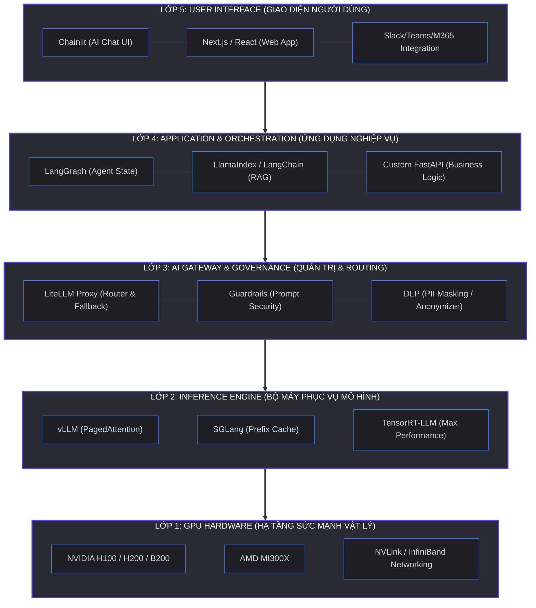
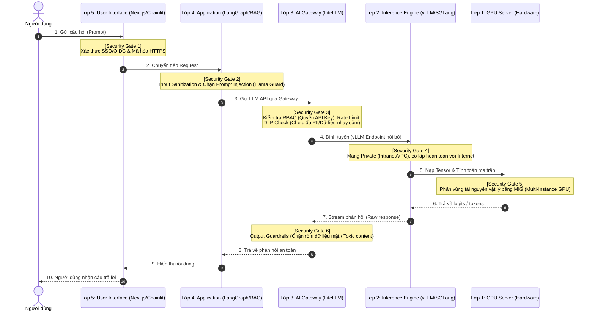

# Kiến Trúc Tổng Thể Hệ Thống AI Nội Bộ: Từ GPU Server Đến Ứng Dụng Nghiệp Vụ

## Mở Đầu: Khi AI Trở Thành Hạ Tầng Cốt Lõi

Năm 2023 và 2024 là kỷ nguyên của các bản thử nghiệm (Proof of Concept - PoC) chạy trên nền tảng Cloud API của bên thứ ba. Thiết lập nhanh chóng, chi phí ban đầu cực rẻ và không cần lo lắng về hạ tầng phần cứng. Tuy nhiên, khi bước sang giai đoạn production với tải thực tế lớn và các quy định pháp lý ngày càng nghiêm ngặt về bảo mật thông tin, việc phụ thuộc hoàn toàn vào Cloud API đã bộc lộ những hạn chế chí mạng: **chi phí tăng đột biến**, **rủi ro rò rỉ dữ liệu nhạy cảm**, và **sự thiếu ổn định của dịch vụ bên thứ ba**.

Đối với các doanh nghiệp lớn, tổ chức tài chính hoặc y tế, việc xây dựng một hạ tầng **AI nội bộ (Self-hosted/On-premise)** không còn là lựa chọn mà đã trở thành yêu cầu bắt buộc để tự chủ công nghệ (AI Independence). 

Là một Platform Architect thiết kế hệ thống AI doanh nghiệp, tôi muốn chia sẻ bản blueprint kiến trúc 5 lớp tiêu chuẩn, so sánh các topology triển khai và cung cấp checklist thực tế giúp bạn thiết kế một hệ thống AI nội bộ ổn định, bảo mật và tối ưu chi phí.

**Nội dung chính:**
- Phân tích chi tiết 5 lớp kiến trúc (GPU -> Serving -> Gateway -> App -> UI).
- So sánh 3 dạng Topology triển khai hệ thống AI nội bộ.
- Sơ đồ luồng dữ liệu (Dataflow) tuần tự đi qua các Security Gates.
- Bảng đánh giá các giải pháp công nghệ kèm Pros/Cons.
- Cấu hình mẫu LiteLLM Proxy (JSON format).
- Checklist 10 điều bắt buộc phải thiết kế trước khi bắt tay xây dựng.

---

## 1. Kiến Trúc 5 Lớp (5-Layer AI Architecture)

Một hệ thống AI nội bộ doanh nghiệp không đơn thuần là việc cài đặt một mô hình ngôn ngữ lớn (LLM) trên một máy chủ GPU. Để hệ thống hoạt động ổn định, bảo mật và đáp ứng tải cao từ nhiều ứng dụng nghiệp vụ khác nhau, hệ thống cần được phân rã thành **5 lớp chức năng rõ ràng (Separation of Concerns)**:



### Lớp 1: GPU Hardware (Hạ tầng phần cứng vật lý)
Đây là "cơ bắp" của toàn bộ hệ thống. Nhiệm vụ của lớp này là cung cấp năng lực tính toán ma trận thô và bộ nhớ băng thông cao để chạy các tham số của mô hình lớn.
*   **Công nghệ tiêu biểu:** Các dòng GPU chuyên dụng cho AI như NVIDIA H100/H200, siêu chip Blackwell B200, dòng GPU tối ưu chi phí L40S, hoặc giải pháp thay thế từ AMD Instinct MI300X.
*   **Yếu tố quyết định:** Băng thông bộ nhớ (Memory Bandwidth) và dung lượng VRAM đóng vai trò cực kỳ quan trọng đối với tác vụ suy luận (Inference), vì nó quyết định dung lượng KV Cache lưu trữ ngữ cảnh hội thoại. Băng thông giao tiếp trong máy chủ (NVLink/NVSwitch) và băng thông mạng liên kết cụm (InfiniBand hoặc RoCE v2) sẽ quyết định hiệu năng khi chia mô hình chạy trên nhiều card GPU (Tensor Parallelism/Pipeline Parallelism).

!!! example "Ví dụ thực tế: Lựa chọn GPU cho mô hình 70B"
    Một tổ chức tài chính tại Singapore triển khai Llama-3.1-70B-Instruct cho tác vụ phân tích hợp đồng. Mô hình 70B ở FP16 chiếm ~140GB VRAM. Với 2x NVIDIA H200 (mỗi card 141GB HBM3e), họ vừa đủ chứa model weights nhưng không còn VRAM cho KV Cache khi có nhiều người dùng đồng thời. Giải pháp: chuyển sang **4x H200** với Tensor Parallelism, giải phóng ~420GB VRAM cho KV Cache — đủ phục vụ ~200 phiên hội thoại song song.

### Lớp 2: Inference Serving Layer (Bộ máy phục vụ mô hình)
Lớp này nằm ngay trên phần cứng, chịu trách nhiệm tải trọng số mô hình lên VRAM và thực thi thuật toán suy luận hiệu quả.
*   **Công nghệ tiêu biểu:** vLLM, SGLang, TensorRT-LLM, HuggingFace TGI.
*   **Cơ chế hoạt động chính:** Áp dụng các thuật toán đột phá như **Continuous Batching** (ghép các request mới vào lô tính toán ngay lập tức mà không cần đợi lô cũ hoàn thành) và **Paged KV Caching** (quản lý bộ nhớ KV Cache giống như phân trang RAM ảo trong hệ điều hành để tránh phân mảnh bộ nhớ VRAM). Nhờ đó, hiệu năng suy luận có thể tăng gấp 3-5 lần so với việc tải mô hình chạy bằng mã nguồn PyTorch thông thường.

!!! warning "Anti-pattern phổ biến: Chạy mô hình trực tiếp bằng HuggingFace Transformers"
    Nhiều đội kỹ thuật ban đầu dùng `model.generate()` của HuggingFace Transformers để serve mô hình. Đây là sai lầm nghiêm trọng trong production vì nó không có Continuous Batching — mỗi request phải chờ request trước hoàn thành, dẫn đến TTFT lên tới 10-30 giây khi có 5-10 người dùng đồng thời. **Luôn dùng Inference Engine chuyên dụng** (vLLM, SGLang, hoặc TensorRT-LLM) cho bất kỳ workload nào vượt quá giai đoạn thử nghiệm cá nhân.

### Lớp 3: AI Gateway & Governance Layer (Lớp Quản trị và API Gateway)
Đây chính là "Bộ não điều phối" (Control Plane) của toàn bộ kiến trúc hạ tầng. Lớp này đóng vai trò làm proxy trung gian để các ứng dụng phía trên gọi mô hình một cách an toàn và đồng nhất.
*   **Công nghệ tiêu biểu:** LiteLLM Proxy, Kong API Gateway (với AI Plugins), Apache APISIX.
*   **Chức năng cốt lõi:**
    *   **Thống nhất API:** Cung cấp chuẩn endpoint tương thích với OpenAI API cho mọi mô hình nội bộ (vLLM) lẫn bên ngoài (Azure OpenAI, Anthropic).
    *   **Quản trị và Bảo mật:** Quản lý tập trung API Key cho từng phòng ban, phân quyền truy cập (RBAC), giới hạn lượt gọi (Rate Limiting) và kiểm soát ngân sách chi tiêu (Budgeting).
    *   **Tối ưu tải:** Cân bằng tải (Load Balancing) giữa các cụm GPU, tự động chuyển vùng khi có sự cố (Automatic Fallbacks/Failover), và định tuyến ngữ nghĩa thông minh (Semantic Routing - ví dụ: gửi câu hỏi đơn giản tới model Llama-3-8B nội bộ, gửi câu hỏi lập luận phức tạp tới GPT-4o).

### Lớp 4: Application Layer (Lớp Ứng dụng & Điều phối Nghiệp vụ)
Nơi chứa logic nghiệp vụ thực tế của doanh nghiệp. Lớp này không quan tâm mô hình chạy ở card GPU nào hay có bị lỗi kết nối không (vì Gateway đã xử lý), mà tập trung vào việc tạo ra giá trị nghiệp vụ.
*   **Công nghệ tiêu biểu:** LangChain, LlamaIndex, LangGraph, CrewAI, Custom API (FastAPI/Go/NestJS).
*   **Kỹ thuật ứng dụng:** Triển khai quy trình **RAG (Retrieval-Augmented Generation)** để tích hợp kiến thức doanh nghiệp vào câu trả lời, thiết lập hệ thống **Agent đa nhiệm (Multi-Agent Workflows)** có khả năng lập kế hoạch và gọi các API nội bộ để giải quyết tác vụ phức tạp.

!!! info "Thành phần thường bị bỏ sót: Vector Database"
    RAG không thể hoạt động nếu thiếu **Vector Database** — nơi lưu trữ và truy vấn các embedding vector của tài liệu doanh nghiệp. Các lựa chọn phổ biến: **Qdrant** (nhẹ, dễ self-host, hỗ trợ filtering mạnh), **Milvus** (tối ưu cho quy mô lớn hàng tỷ vector), **pgvector** (tích hợp thẳng vào PostgreSQL sẵn có — lựa chọn tốt nếu đội đã quen với PostgreSQL), và **Weaviate** (hỗ trợ hybrid search kết hợp keyword + vector). Đây là thành phần cốt lõi của Layer 4 mà nhiều kiến trúc sư bỏ sót khi vẽ sơ đồ.

### Lớp 5: User Interface (Giao diện người dùng)
Mặt tiền của hệ thống, giúp người dùng cuối (nhân viên, khách hàng) tương tác với hệ thống AI một cách trực quan và dễ dàng nhất.
*   **Công nghệ tiêu biểu:** Chainlit, Streamlit, Next.js / React, các plugin tích hợp thẳng vào Microsoft 365 Copilot, Slack, Teams hoặc hệ thống CRM/ERP hiện tại của doanh nghiệp.

### Lớp xuyên suốt: Observability & Monitoring (Giám sát hệ thống)
Đây không phải là một "lớp" riêng biệt mà là thành phần **xuyên suốt (cross-cutting concern)** bắt buộc phải có ở mọi lớp trong kiến trúc.
*   **Công nghệ tiêu biểu:** **Langfuse** hoặc **Langsmith** (giám sát LLM: tracking token usage, latency, prompt/response chains), **Prometheus + NVIDIA DCGM Exporter** (giám sát GPU: VRAM utilization, nhiệt độ, clock speed), **Grafana** (dashboard tổng hợp), **Arize AI** (phát hiện model drift và chất lượng câu trả lời suy giảm theo thời gian).
*   **Tại sao quan trọng:** Bạn không thể tối ưu những gì bạn không đo lường được. Nếu không có Observability, bạn sẽ không biết TTFT đang là 0.8s hay 8s, không biết GPU utilization chỉ đạt 30% (lãng phí tiền), và không biết chất lượng câu trả lời đang xuống cấp cho đến khi người dùng phàn nàn.

---

## 2. So Sánh 3 Topology Triển Khai Thực Chiến

Tùy thuộc vào quy mô nhân sự, lưu lượng tải và yêu cầu bảo mật, bạn có thể lựa chọn một trong ba dạng Topology hạ tầng sau đây để triển khai hệ thống AI nội bộ:

!!! example "Ví dụ thực tế: Lộ trình chuyển đổi Topology"
    Một công ty bảo hiểm tại Việt Nam (~300 nhân viên) đã bắt đầu với **Single-node** (1 server Dell T4 với 4x L40S) để pilot chatbot nội bộ cho 20 nhân viên phòng Claims. Sau 6 tháng pilot thành công, họ mở rộng lên **Multi-node Cluster** (3 nodes, tổng 12x L40S, quản lý bằng K8s) để phục vụ toàn công ty. Hiện tại họ đang chuẩn bị chuyển sang **Hybrid Topology** — giữ cụm On-prem cho dữ liệu hợp đồng bảo hiểm, kết hợp Azure OpenAI cho các tác vụ tóm tắt email không nhạy cảm.

| Tiêu Chí So Sánh | Single-node (Đơn nút) | Multi-node Cluster (Cụm đa nút) | Hybrid Topology (Lai ghép) |
| :--- | :--- | :--- | :--- |
| **Kiến trúc tổng quan** | Một máy chủ vật lý duy nhất lắp từ 1 đến 8 GPU (ví dụ: Dell PowerEdge XE9680 với 8x H100 SXM5). | Cụm nhiều máy chủ GPU liên kết qua switch mạng tốc độ cao (InfiniBand/RoCE), quản lý bởi Kubernetes. | Kết hợp máy chủ GPU tại chỗ (On-premises) với Private Cloud (Azure Private Cloud/AWS VPC). |
| **Quy mô phù hợp** | Startup, doanh nghiệp nhỏ hoặc giai đoạn R&D, thử nghiệm PoC nội bộ phòng ban. | Doanh nghiệp lớn (>500 nhân sự dùng hàng ngày) hoặc hệ thống Automation tự động chạy 24/7. | Tập đoàn đa quốc gia có chi nhánh phân tán, ngân hàng, hoặc đơn vị có tải biến động mạnh theo mùa. |
| **Chi phí đầu tư ban đầu** | **Thấp (CapEx trung bình)**. Không cần đầu tư thiết bị mạng chuyên dụng đắt đỏ. | **Rất cao (CapEx lớn)**. Chi phí cho nhiều node GPU và hệ thống Switch InfiniBand rất đắt đỏ. | **Cân bằng**. CapEx vừa phải cho core hạ tầng tại chỗ, kết hợp OpEx linh hoạt cho Private Cloud khi cần co giãn. |
| **Mức độ phức tạp vận hành** | **Thấp**. Cài đặt đơn giản bằng Docker Compose hoặc chạy trực tiếp bằng script vLLM. | **Rất cao**. Đòi hỏi đội ngũ MLOps/K8s có kinh nghiệm cấu hình mạng InfiniBand và các Kubernetes Operator (KubeRay, MPI Operator). | **Cao**. Phức tạp trong việc thiết lập kết nối VPN an toàn, mã hóa kênh truyền và đồng bộ dữ liệu giữa On-prem và Cloud. |
| **Khả năng co giãn (Scalability)** | **Kém**. Bị giới hạn bởi số khe cắm card GPU trên một mainboard duy nhất. | **Xuất sắc**. Có thể thêm node vào cụm Kubernetes một cách dễ dàng khi tải tăng lên. | **Vô hạn**. Tận dụng khả năng co giãn tức thì của Private Cloud (Cloud Bursting) khi tải đột biến. |
| **Tính sẵn sàng cao (High Availability)** | **Không có (SPOF)**. Nếu server lỗi nguồn hoặc mất kết nối, toàn bộ hệ thống AI tê liệt. | **Rất cao**. Tự động phát hiện lỗi node, tự động phục hồi pod và cân bằng tải động (Load Balancing). | **Tối ưu**. Nếu cụm On-premises quá tải hoặc gặp sự cố, Gateway tự động chuyển vùng (failover) lên Cloud. |
| **Bảo mật & Chủ quyền dữ liệu** | **Tuyệt đối**. Dữ liệu hoàn toàn không ra ngoài và nằm trọn trong ổ cứng server nội bộ. | **Tuyệt đối**. Toàn bộ dữ liệu nằm trong mạng Private Cluster của doanh nghiệp. | **Cần kiểm soát**. Dữ liệu nhạy cảm được route về On-prem, dữ liệu thông thường được gửi lên Cloud qua kết nối bảo mật. |

---

## 3. Luồng Dữ Liệu Toàn Vẹn & Các Chốt Chặn Bảo Mật (Security Gates)

Trong hạ tầng AI doanh nghiệp, dữ liệu là tài sản vô giá nhưng cũng là nguồn rủi ro pháp lý lớn nhất. Một request đi từ giao diện người dùng đến khi nhận được phản hồi từ LLM phải đi qua một chuỗi các bước được bảo vệ nghiêm ngặt bằng các chốt chặn bảo mật (Security Gates):



### Chi tiết các chốt chặn bảo mật (Security Gates):

*   **Security Gate 1 (SSO & HTTPS Encryption):** Xác thực định danh người dùng bằng hệ thống Single Sign-On (Okta, Keycloak) của doanh nghiệp trước khi cho phép vào giao diện. Toàn bộ kênh truyền dẫn dùng giao thức TLS 1.3 để mã hóa dữ liệu.
*   **Security Gate 2 (Prompt Firewall & Input Guardrails):** Bộ phận này quét câu hỏi của người dùng để lọc mã độc hoặc ngăn chặn các cuộc tấn công **Prompt Injection** (cố tình lừa mô hình bỏ qua hướng dẫn bảo mật ban đầu để tiết lộ thông tin mật). Có thể dùng các mô hình nhỏ chuyên dụng như **Llama Guard** hoặc thư viện **NeMo Guardrails**.
*   **Security Gate 3 (DLP & API Authorization):** Đây là nhiệm vụ của AI Gateway. Nó kiểm tra xem ứng dụng gọi API có quyền dùng mô hình này không (RBAC). Đồng thời, chạy thuật toán **Data Loss Prevention (DLP)** để quét các thông tin nhận dạng cá nhân nhạy cảm (PII) như số căn cước, số thẻ tín dụng, email nội bộ... để ẩn danh hóa (masking/anonymizing) trước khi chuyển tiếp.
*   **Security Gate 4 (Isolated Private Network):** Máy chủ suy luận (Inference Engine) và mô hình được đặt trong phân vùng mạng nội bộ bị cô lập (Private VPC / Intranet). Không cấu hình IP public, chặn hoàn toàn truy cập từ internet để tránh bị tấn công trực tiếp vào API của vLLM/SGLang.
*   **Security Gate 5 (Resource Partitioning):** Trên lớp phần cứng GPU, áp dụng cơ chế **MIG (Multi-Instance GPU)** hoặc ảo hóa vGPU để phân vùng tài nguyên phần cứng. Việc này giúp tách biệt VRAM và luồng xử lý của các phòng ban khác nhau, đảm bảo dữ liệu của ứng dụng Tài chính không thể bị truy cập chéo bởi ứng dụng Nhân sự thông qua lỗi tràn bộ nhớ cache của GPU.
*   **Security Gate 6 (Output Guardrails & PII Scan):** Quét câu trả lời do LLM sinh ra trước khi gửi về cho ứng dụng. Bộ lọc này kiểm tra xem câu trả lời có bị rò rỉ dữ liệu nội bộ không (nếu mô hình tự ý trích xuất tài liệu mật ra câu trả lời), hoặc kiểm tra độ độc hại (toxic output), thông tin sai lệch nghiêm trọng (hallucinations) để chặn lại kịp thời.

---

## 4. Đánh Giá & Đề Xuất Công Nghệ Theo Từng Lớp

Để giúp bạn đưa ra lựa chọn công nghệ phù hợp, tôi đã tổng hợp bảng so sánh ưu/nhược điểm thực chiến của các giải pháp hàng đầu hiện nay:

| Lớp Kiến Trúc | Công Nghệ Đề Xuất | Ưu Điểm (Pros) | Nhược Điểm (Cons) | Lời Khuyên Của Kiến Trúc Sư |
| :--- | :--- | :--- | :--- | :--- |
| **Layer 1: GPU** | **NVIDIA H200 SXM5** | Băng thông bộ nhớ 4.8 TB/s cực lớn (HBM3e), 141GB VRAM. Tối ưu xuất sắc cho việc chứa các mô hình cỡ trung (70B) và KV cache dài. | Chi phí rất cao, thời gian đặt hàng và bàn giao thiết bị từ hãng lâu (lead time dài). | Nên chọn làm core hạ tầng cho các tác vụ suy luận tải lớn, yêu cầu tốc độ phản hồi cực nhanh. |
| | **AMD MI300X** | 192GB VRAM dung lượng khổng lồ với mức giá cạnh tranh hơn NVIDIA. | Hệ sinh thái phần mềm ROCm tuy đã cải thiện nhiều nhưng vẫn chưa tối ưu và phổ biến như CUDA của NVIDIA. | Lựa chọn tuyệt vời để chạy các mô hình nguồn mở siêu lớn mà không cần chia tách card quá phức tạp, giúp tiết kiệm chi phí phần cứng đáng kể. |
| **Layer 2: Engine**| **vLLM** | Dễ triển khai nhất, hỗ trợ hầu hết mọi kiến trúc mô hình mới ngay lập tức. Hỗ trợ đa dạng phần cứng (NVIDIA, AMD, TPU). | Hiệu năng lập lịch suy luận trong các kịch bản RAG phức tạp hoặc tác vụ Agent đa turn vẫn có thể tối ưu thêm. | **Lựa chọn mặc định tốt nhất** cho 80% các trường hợp sử dụng cơ bản của doanh nghiệp. |
| | **SGLang** | Tốc độ xử lý cực nhanh nhờ công nghệ **RadixAttention** giúp chia sẻ và tái sử dụng KV Cache của các đoạn prompt trùng lặp (ví dụ: System Prompt hoặc file tài liệu RAG dài). | Cộng đồng nhỏ hơn vLLM, tài liệu hướng dẫn và tích hợp hệ thống chưa phong phú bằng. | Khuyên dùng nếu hệ thống của bạn chạy rất nhiều tác vụ RAG hoặc hội thoại liên tục (multi-turn), giúp giảm TTFT (Time to First Token) tới 3-5 lần. |
| | **TensorRT-LLM** | Hiệu năng suy luận cao nhất trên phần cứng NVIDIA nhờ biên dịch mô hình trước (AOT Compilation) thành engine tối ưu cho từng kiến trúc GPU cụ thể. | Quy trình triển khai phức tạp: phải biên dịch lại engine khi đổi model hoặc đổi batch size. Không hỗ trợ phần cứng ngoài NVIDIA. | Chỉ nên dùng khi workload đã ổn định, model ít thay đổi, và đội có đủ năng lực vận hành pipeline biên dịch. ROI cao nhất ở quy mô rất lớn (>1000 req/s). |
| **Layer 3: Gateway**| **LiteLLM Proxy** | Cực kỳ nhẹ, tương thích 100% với định dạng API của OpenAI. Tích hợp sẵn cơ chế Load Balancing, Fallbacks, và công cụ quản trị giao diện trực quan. | Phiên bản nguồn mở giới hạn một số tính năng nâng cao (SAML/SSO, Enterprise Audit log). | Thiết bị trung tâm bắt buộc phải có để quản lý tập trung tài nguyên mô hình và phân bổ chi phí nội bộ. |
| **Layer 4: App** | **LangGraph** | Quản lý trạng thái Agent (State Management) xuất sắc, cho phép xây dựng các luồng lặp (loops) và điều hướng phức tạp một cách tin cậy. | Đường cong học tập dốc, cấu hình phức tạp hơn so với LangChain cơ bản. | Phù hợp nhất cho các ứng dụng AI Agent tự động hóa quy trình nghiệp vụ phức tạp có tính tương tác nhiều bước. |
| | **Qdrant** | Vector Database tự host, nhẹ, hiệu năng tốt, hỗ trợ filtering metadata mạnh mẽ. API đơn giản, tài liệu rõ ràng. | Thiếu một số tính năng nâng cao của Milvus (ví dụ: GPU-accelerated indexing) cho tập dữ liệu cực lớn (>100M vectors). | **Lựa chọn mặc định cho Vector DB** khi self-host. Nếu đã có PostgreSQL, xem xét **pgvector** để giảm số thành phần vận hành. |
| **Layer 5: UI** | **Chainlit** | Tích hợp sẵn giao diện chat chuyên dụng cho AI, hỗ trợ streaming token, hiển thị các bước suy nghĩ của Agent (Thought steps) và nút đánh giá chất lượng. | Khả năng tùy biến giao diện sâu theo bộ nhận diện thương hiệu doanh nghiệp bị hạn chế. | Thích hợp để dựng nhanh các ứng dụng AI Chat nội bộ cho nhân viên sử dụng mà không tốn công dev frontend từ đầu. |
| **Observability** | **Langfuse** | Nguồn mở, tự host được, tracking chi tiết từng prompt/response chain, token usage, latency. Dashboard trực quan. | Chưa hỗ trợ giám sát GPU metrics (cần kết hợp thêm Prometheus + DCGM Exporter). | **Bắt buộc phải có** từ ngày đầu tiên. Không có Observability = bay mù. Kết hợp Langfuse (LLM metrics) + Prometheus/DCGM Exporter (GPU metrics) + Grafana (dashboard). |

---

## 5. Cấu Hình Mẫu API Gateway Với LiteLLM Proxy

Dưới đây là một file cấu hình thực tế dạng JSON (`config.json`) dành cho **LiteLLM Proxy**. Cấu hình này mô tả cách thiết lập cân bằng tải giữa 2 máy chủ chạy vLLM nội bộ, đồng thời thiết lập Azure OpenAI làm endpoint dự phòng khi cả hai cụm nội bộ quá tải hoặc gặp sự cố:

```json
{
  "model_list": [
    {
      "model_name": "enterprise-llama3",
      "litellm_params": {
        "model": "openai/llama-3.1-70b-instruct",
        "api_base": "http://10.0.10.15:8000/v1",
        "api_key": "sk-vllm-primary-key",
        "rpm": 300,
        "tpm": 100000,
        "metadata": {
          "environment": "production",
          "region": "on-prem-dc1"
        }
      }
    },
    {
      "model_name": "enterprise-llama3",
      "litellm_params": {
        "model": "openai/llama-3.1-70b-instruct",
        "api_base": "http://10.0.10.16:8000/v1",
        "api_key": "sk-vllm-secondary-key",
        "rpm": 300,
        "tpm": 100000,
        "metadata": {
          "environment": "production",
          "region": "on-prem-dc2"
        }
      }
    },
    {
      "model_name": "azure-gpt-fallback",
      "litellm_params": {
        "model": "azure/gpt-4o",
        "api_base": "https://enterprise-openai-fallback.openai.azure.com/",
        "api_key": "azure-secret-api-key-here",
        "api_version": "2024-05-01-preview"
      }
    }
  ],
  "litellm_settings": {
    "fallbacks": [
      {
        "enterprise-llama3": [
          "azure-gpt-fallback"
        ]
      }
    ],
    "success_callback": [
      "langfuse"
    ],
    "failure_callback": [
      "slack"
    ],
    "telemetry": false,
    "request_timeout": 60.0,
    "cache": true,
    "cache_params": {
      "type": "redis",
      "host": "10.0.10.20",
      "port": 6379,
      "password": "redis-password-here"
    }
  },
  "router_settings": {
    "routing_strategy": "latency-based-routing",
    "redis_host": "10.0.10.20",
    "redis_port": 6379,
    "redis_password": "redis-password-here"
  }
}
```

!!! tip "Ý nghĩa của cấu hình trên trong môi trường Production"
    1. **Load Balancing:** Khi ứng dụng gọi mô hình `enterprise-llama3`, LiteLLM sẽ tự động định tuyến dựa trên độ trễ thực tế (latency-based-routing) giữa hai máy chủ vLLM nội bộ ở DC1 (`10.0.10.15`) và DC2 (`10.0.10.16`).
    2. **High Availability / Fallbacks:** Nếu cả hai cụm nội bộ đều quá tải (trả về lỗi HTTP 429 hoặc lỗi kết nối 5xx), LiteLLM sẽ tự động chuyển hướng request sang mô hình `azure-gpt-fallback` trên Azure OpenAI mà ứng dụng phía trên không hề biết và không bị gián đoạn.
    3. **Observability & Alerting:** Mọi lượt gọi thành công sẽ gửi log tới **Langfuse** để giám sát TTFT, số lượng token sử dụng, và nếu có lỗi hệ thống xảy ra, nó sẽ gửi cảnh báo tức thì vào kênh **Slack** của đội vận hành.
    4. **Response Caching:** Bật tính năng cache qua Redis — nếu cùng một câu hỏi được hỏi lại trong khoảng thời gian ngắn, LiteLLM trả về kết quả từ cache mà không cần gọi lại GPU, giúp giảm đáng kể chi phí tính toán và tăng tốc phản hồi.

!!! warning "Lưu ý khi dùng Azure OpenAI làm Fallback"
    Nếu bạn định tuyến dữ liệu nhạy cảm sang Azure OpenAI trong trường hợp failover, hãy đảm bảo đã ký **Data Processing Agreement (DPA)** với Microsoft và cấu hình Azure OpenAI trong region tuân thủ quy định dữ liệu của quốc gia bạn (ví dụ: Southeast Asia region cho doanh nghiệp Việt Nam). Nếu không, hãy cấu hình Gateway chặn các request chứa PII/dữ liệu mật thay vì chuyển tiếp sang Cloud khi failover.

---

## 6. Checklist 10 Điều Cần Thiết Kế Trước Khi Xây Dựng Hệ Thống

Trước khi bạn đặt bút ký hợp đồng mua máy chủ GPU hay tuyển dụng kỹ sư MLOps, hãy đảm bảo đội ngũ kiến trúc sư của bạn đã trả lời rõ ràng 10 câu hỏi cốt lõi sau:

### 1. Tính toán dung lượng VRAM & Cấu hình KV Cache
Trọng lượng tham số mô hình (Model weights) chỉ là một phần của dung lượng bộ nhớ VRAM cần dùng. Khi có hàng trăm người dùng đồng thời, dung lượng bộ nhớ dành cho **KV Cache** (dùng để lưu trữ lịch sử hội thoại của các phiên đang hoạt động) sẽ tăng lên rất nhanh.
*   *Công thức tính nhanh:* Một mô hình 70B chạy ở định dạng FP16 chiếm khoảng 140GB VRAM thô. Nếu chạy trên hệ thống 8x GPU H100 (tổng 640GB VRAM), bạn còn khoảng 500GB VRAM cho KV Cache. Hãy đảm bảo cấu hình tham số `--max-num-seqs` và `--gpu-memory-utilization` trên vLLM khớp với tải concurrency tối đa mà doanh nghiệp kỳ vọng.

### 2. Thiết kế băng thông mạng nội bộ (Intra-node) và liên kết cụm (Inter-node)
Khi chạy mô hình lớn cần chia sẻ tài nguyên qua nhiều card GPU, tốc độ mạng là nút thắt cổ chai lớn nhất.
*   *Yêu cầu:* Trong cùng một node, các GPU phải kết nối qua **NVIDIA NVLink** (tốc độ lên tới 900 GB/s trên thế hệ H100). Giữa các máy chủ với nhau (Inter-node), bắt buộc phải có kết nối mạng chuyên dụng **InfiniBand** hoặc **RoCE v2** tốc độ tối thiểu 400 Gbps. Tránh tuyệt đối việc dùng mạng Ethernet 10Gbps truyền thống vì nó sẽ khiến GPU lãng phí 80% thời gian chỉ để đợi truyền nhận dữ liệu.

### 3. Chủ quyền dữ liệu và Pháp lý (Data Sovereignty & Compliance)
Bạn cần làm việc với bộ phận Pháp chế (Legal) để phân loại rõ ràng các nhóm dữ liệu nghiệp vụ.
*   *Yêu cầu:* Những dữ liệu thuộc nhóm Tuyệt mật (Ví dụ: thông tin giao dịch tài chính ngân hàng, hồ sơ bệnh án) bắt buộc phải cấu hình định tuyến cứng chỉ chạy trên hạ tầng On-premises. Những dữ liệu thông thường (Ví dụ: dịch thuật tài liệu công cộng) mới được phép chuyển vùng sang Private Cloud/Public Cloud.

### 4. Thiết lập hệ thống đo lường chuyên biệt cho LLM (Observability Metrics)
Các công cụ giám sát CPU/RAM truyền thống (Prometheus/Grafana cơ bản) không đủ để đo lường sức khỏe hệ thống AI.
*   *Yêu cầu:* Bạn phải xây dựng hệ thống đo lường để tracking các chỉ số: **TTFT (Time to First Token)** - thời gian từ lúc gõ phím đến khi chữ đầu tiên hiện ra (kỳ vọng < 1.5 giây), **ITL (Inter-Token Latency)** - tốc độ sinh chữ tiếp theo (kỳ vọng > 30 tokens/giây/user), và tỷ lệ cache hit của KV Cache để đánh giá hiệu năng phần cứng.

### 5. Thiết lập lớp trừu tượng mô hình (Model Abstraction Layer)
Không để các nhà phát triển phần mềm gọi trực tiếp API của một mô hình cụ thể trong mã nguồn ứng dụng.
*   *Yêu cầu:* Bắt buộc cấu hình mọi ứng dụng gọi qua Gateway với tên mô hình mang tính trừu tượng (Ví dụ: `enterprise-rag-core`, `general-chat-model`). Khi bạn nâng cấp mô hình từ Llama-3 sang Llama-4 ở hạ tầng bên dưới, bạn chỉ cần cấu hình lại Gateway mà không cần sửa một dòng code nào của các ứng dụng phía trên.

### 6. Chiến lược co giãn hạ tầng & Trễ khởi động (Auto-scaling & Cold Starts)
Kích thước container của các bộ máy suy luận AI là rất lớn (thường từ 20GB đến hơn 150GB để chứa trọng số mô hình).
*   *Yêu cầu:* Việc tự động scale-up thêm pod mới trên Kubernetes không thể diễn ra trong vài giây như web app thông thường, mà có thể mất từ 5-15 phút để kéo mô hình từ registry về VRAM (hiện tượng Cold Start). Hãy thiết lập cơ chế dự phòng tài nguyên (Over-provisioning) hoặc giữ một lượng nhỏ node luôn ở trạng thái ấm (Warm standby) để sẵn sàng gánh tải.

### 7. Thiết kế độ sẵn sàng cao và Khắc phục thảm họa (HA & DR)
Nếu cụm máy chủ GPU vật lý gặp sự cố cháy nổ phòng server hoặc mất điện diện rộng, kế hoạch dự phòng là gì?
*   *Yêu cầu:* Thiết lập cơ chế định tuyến Active-Active hoặc Active-Passive ở lớp Gateway. Khi cụm GPU On-prem gặp sự cố vật lý, Gateway phải có khả năng chuyển tiếp mượt mà các request nghiệp vụ quan trọng sang Cloud API (Azure OpenAI / AWS Bedrock) trong chế độ khẩn cấp (Emergency Mode).

### 8. Lựa chọn kỹ thuật lượng hóa mô hình (Quantization Strategy)
Chạy mô hình ở độ chính xác gốc (FP16/BF16) đòi hỏi phần cứng cực kỳ đắt tiền.
*   *Yêu cầu:* Thử nghiệm và đánh giá chất lượng mô hình khi chạy lượng hóa xuống định dạng **FP8**, **AWQ**, hoặc **GPTQ**. Lượng hóa FP8 hiện nay là tiêu chuẩn vàng trên card H100/H200, giúp giảm 50% dung lượng VRAM cần thiết mà hầu như không làm suy giảm độ chính xác của câu trả lời, giúp bạn tiết kiệm hàng tỷ đồng mua sắm GPU.

### 9. Quản trị KV Cache dùng chung & Prefix Caching
Trong các hệ thống RAG, người dùng thường đặt câu hỏi dựa trên cùng một bộ tài liệu tham khảo dài.
*   *Yêu cầu:* Bật tính năng **Prefix Caching** trên vLLM hoặc sử dụng cơ chế **RadixAttention** trên SGLang. Việc này giúp hệ thống lưu lại KV Cache của phần tài liệu chung đó trong VRAM. Người dùng tiếp theo hỏi về tài liệu đó sẽ được xử lý ngay lập tức mà không cần mô hình phải đọc lại từ đầu, giúp tăng throughput hệ thống lên gấp nhiều lần.

### 10. Kế hoạch quản lý vòng đời và thay đổi mô hình (Model Lifecycle & Deprecation)
Mỗi quý, các mô hình ngôn ngữ lớn mới tốt hơn, rẻ hơn liên tục ra đời. Bạn cần có quy trình chuẩn để thay thế mô hình cũ mà không làm gián đoạn kinh doanh.
*   *Yêu cầu:* Thiết lập pipeline kiểm thử tự động (A/B Testing cho LLM). Trước khi public mô hình mới, chạy một tập câu hỏi mẫu gồm 500-1000 câu để đánh giá độ chính xác, tốc độ và độ an toàn của mô hình mới so với mô hình cũ, sau đó dịch chuyển dần lưu lượng tải qua Gateway (Ví dụ: 10% tải chạy model mới, 90% chạy model cũ) trước khi thay thế hoàn toàn.

---

## Kết Luận

Xây dựng hạ tầng AI nội bộ cho doanh nghiệp là một hành trình dài hạn, đòi hỏi sự đầu tư đồng bộ từ thiết kế phần cứng cho đến logic ứng dụng và quy trình vận hành bảo mật. Bằng cách áp dụng mô hình phân tách **5 lớp rõ ràng** và lựa chọn giải pháp **AI Gateway** phù hợp như LiteLLM kết hợp với bộ máy suy luận mạnh mẽ như vLLM hay SGLang, doanh nghiệp của bạn có thể dễ dàng kiểm soát chi phí, bảo vệ dữ liệu nhạy cảm và xây dựng nền tảng vững chắc để tự chủ trong kỷ nguyên trí tuệ nhân tạo.

Ba bài học cốt lõi từ bài viết này:

1. **Tách biệt Inference Engine và AI Gateway là nguyên tắc quan trọng nhất.** Khi hai lớp này bị gộp lại, bạn mất khả năng swap model, kiểm soát chi phí và thiết lập fallback — những thứ sẽ cứu bạn vào lúc 2 giờ sáng khi hệ thống gặp sự cố.
2. **Observability không phải "nice-to-have", đó là "must-have" từ ngày đầu tiên.** Đầu tư thiết lập Langfuse + DCGM Exporter trước khi đưa ra production. Chi phí gần như bằng 0 (đều là open-source, self-host), nhưng giá trị mang lại là vô giá.
3. **Bắt đầu bằng Single-node + vLLM + LiteLLM**, chứng minh giá trị với 1 use case cụ thể, sau đó mới mở rộng Topology. Đừng bao giờ thiết kế Multi-node Cluster cho một workload chưa được validate.

!!! tip "Bước tiếp theo"
    Nếu bạn mới bắt đầu, hãy triển khai ngay bộ ba **vLLM + LiteLLM + Langfuse** trên một máy chủ duy nhất với Docker Compose. Ba công cụ này đủ để bạn có một hệ thống AI nội bộ hoàn chỉnh cho giai đoạn pilot. Từ đó, mở rộng dần theo Checklist 10 điểm ở phần 6.

---

## Tham Khảo

- [vLLM Documentation: PagedAttention & Continuous Batching](https://docs.vllm.ai/) — Tài liệu kỹ thuật chi tiết về cơ chế tối ưu hóa bộ nhớ KV Cache.
- [LiteLLM Proxy Server Settings](https://docs.litellm.ai/) — Hướng dẫn cấu hình Load Balancing, Fallbacks và quản trị API Key tập trung.
- [SGLang RadixAttention Architecture](https://github.com/sgl-project/sglang) — Phân tích chi tiết về cơ chế prefix caching giúp tối ưu cho các tác vụ Agent và RAG.
- [NVIDIA Architecture Whitepapers (H200/Blackwell)](https://www.nvidia.com/) — Thông số băng thông bộ nhớ và năng lực tính toán FP8 phục vụ suy luận mô hình lớn.
- [Langfuse: Open Source LLM Observability](https://langfuse.com/) — Nền tảng giám sát LLM nguồn mở, self-host, tracking prompt chains và token usage.
- [Qdrant: Vector Database for AI Applications](https://qdrant.tech/) — Vector Database tự host, hiệu năng cao cho RAG và Semantic Search.
- [NVIDIA DCGM Exporter for Prometheus](https://github.com/NVIDIA/dcgm-exporter) — Công cụ export GPU metrics (VRAM, utilization, temperature) sang Prometheus/Grafana.
