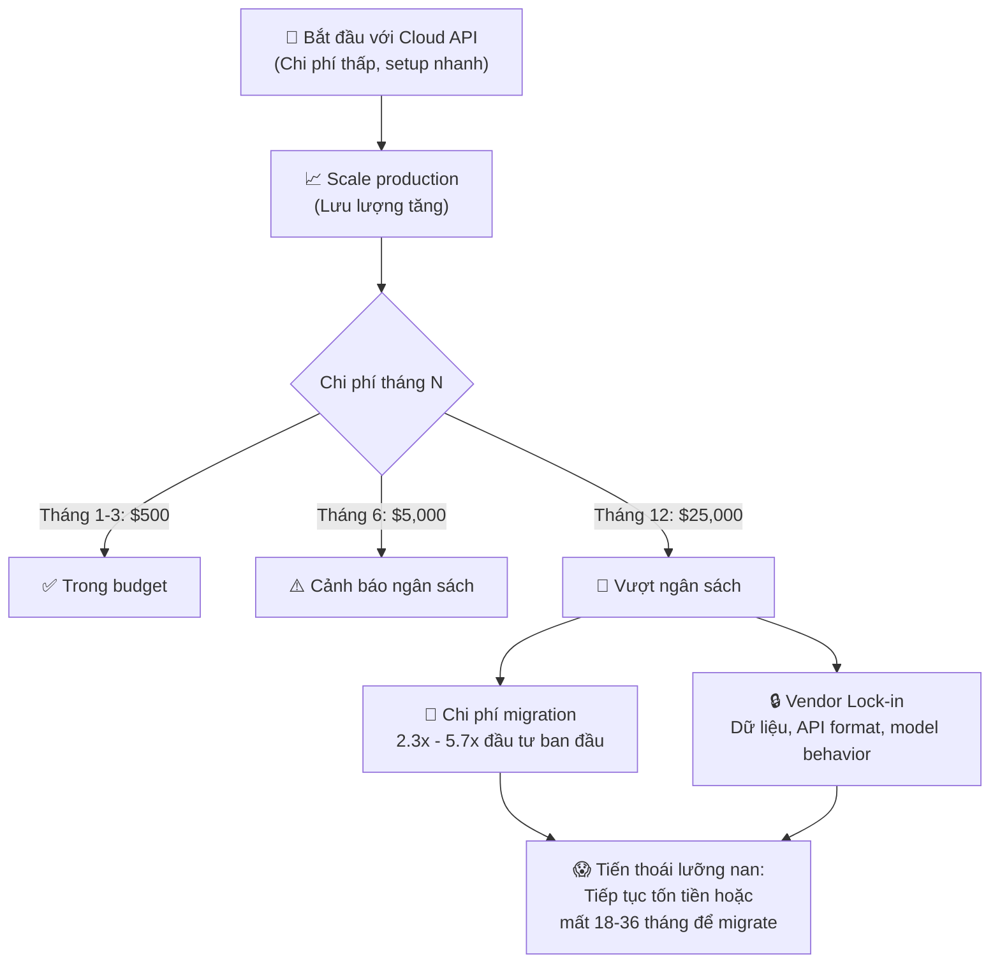
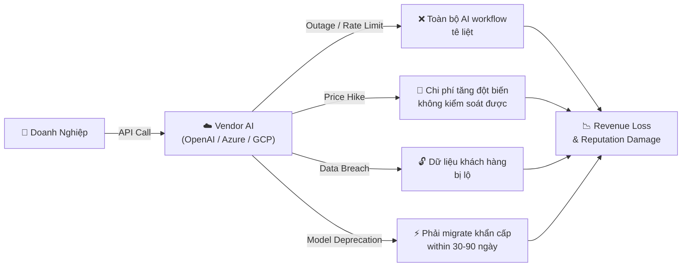
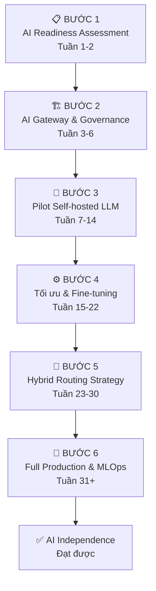

# Tại Sao Doanh Nghiệp Cần Tự Chủ AI? Phân tích Chi Phí, Rủi Ro & Chiến Lược "AI Independence"

## Mở Đầu: Cái Bẫy Ngọt Ngào Của "AI-as-a-Service"

Năm 2023, nhiều tổ chức tài chính và IT tại Đông Nam Á đổ xô tích hợp OpenAI API, Azure Cognitive Services, hay Google Vertex AI vào hệ thống cốt lõi của mình. Lý do hoàn toàn hợp lý: nhanh, rẻ, không cần đội MLOps, và kết quả thấy ngay trong vài tuần.

Hai năm sau, bức tranh đã thay đổi.

Hóa đơn token tăng 3–5x so với dự toán ban đầu. Một sự cố outage của vendor làm toàn bộ nghiệp vụ tê liệt vài giờ. Bộ phận pháp chế phát hiện dữ liệu khách hàng đã đi qua server nước ngoài mà không có biên bản xử lý dữ liệu rõ ràng. Giờ thì sao?

**Bài viết này sẽ phân tích:**

- 3 rủi ro cốt lõi khi phụ thuộc vendor AI bên ngoài (kèm ví dụ thực tế)
- So sánh TCO Cloud API vs Self-hosted LLM trong 3 năm
- Framework quyết định "Build vs Buy vs Hybrid" theo quy mô tổ chức
- Roadmap 6 bước triển khai AI tự chủ từ zero đến production

Không tô hồng. Không quảng cáo sản phẩm. Chỉ có phân tích thực chiến.

---

## 1. Ba Rủi Ro Lớn Khi Phụ Thuộc Vendor AI Bên Ngoài

### 1.1 Rủi Ro Chi Phí Leo Thang — "The Boiling Frog Problem"

Vendor AI định giá theo token — một đơn vị nhỏ đến mức ban đầu cảm giác gần như miễn phí. Nhưng khi hệ thống đi vào production với lưu lượng thực, con số đó bùng nổ theo cấp số nhân.

Dữ liệu từ Gartner (cuối 2025) cho thấy: **các nhà cung cấp phần mềm đang nhúng AI vào sản phẩm hiện có và tăng giá ~30% tại thời điểm gia hạn hợp đồng**, thường không thông báo rõ ràng trước. IBM ước tính chi phí điện toán trung bình của doanh nghiệp tăng **89% trong giai đoạn 2023–2025**, với GenAI là nguyên nhân chính.

**Ví dụ thực tế:** Một công ty fintech ASEAN (không tiết lộ tên) đã tích hợp ChatGPT API để xử lý hợp đồng khách hàng. Trong giai đoạn pilot với 500 tài liệu/ngày, chi phí chỉ khoảng $200/tháng. Khi scale lên 15,000 tài liệu/ngày sau 6 tháng, hóa đơn leo lên $18,000/tháng — gấp 90 lần. Không ai dự toán con số này trong business case ban đầu.

**Cơ chế bẫy giá:**

- Không có giới hạn chi tiêu mặc định — dùng bao nhiêu tính bấy nhiêu
- "Shadow AI": Nhân viên dùng AI tools không chính thức dẫn đến chi phí không kiểm soát. Gần 50% doanh nghiệp lớn thiếu visibility vào AI tools đang được dùng nội bộ
- Chi phí migration nếu muốn chuyển đổi: ước tính 2.3x–5.7x tổng đầu tư ban đầu, thời gian 18–36 tháng



### 1.2 Rủi Ro Dữ Liệu Nhạy Cảm Bị Lộ — "The Hidden Data Pipeline"

!!! warning "Cảnh Báo Bảo Mật Dữ Liệu Nghiêm Trọng"
    Khi bạn gửi prompt đến Cloud API, **dữ liệu đi qua infrastructure của vendor** — dù có Enterprise Agreement, dù có DPA (Data Processing Agreement). Với các tổ chức tài chính, y tế, hoặc chính phủ, điều này có thể vi phạm nghiêm trọng quy định pháp lý: GDPR, PCI-DSS, HIPAA, Nghị định 13/2023/NĐ-CP (Việt Nam), hoặc PDPA (Thái Lan, Philippines).

**Ví dụ thực tế đã xảy ra:**

**Incident 1 — OpenAI/Mixpanel Breach (Nov 2025):** OpenAI xác nhận sự cố bảo mật liên quan đến third-party analytics provider Mixpanel, trong đó thông tin nhận diện khách hàng API (tên, email, organization ID) bị truy cập trái phép. Đây là minh chứng cho rủi ro supply chain: bạn không chỉ tin tưởng vendor chính, mà còn tin vào toàn bộ sub-processor của họ.

**Incident 2 — Azure HaaS Campaign (Dec 2024):** Microsoft phải đưa ra hành động pháp lý chống lại một nhóm hacker đã exploit Azure OpenAI services thông qua API keys bị đánh cắp. Các attacker dùng key này để bypass AI safety filters và tạo nội dung độc hại theo dạng "Hacking-as-a-Service". Nếu API key của tổ chức bạn bị compromise, hệ quả có thể tương tự.

**Incident 3 — Azure Global Outage (Oct 2025):** Một thay đổi cấu hình trong Azure Front Door khiến Microsoft 365, Copilot và Azure bị gián đoạn toàn cầu trong nhiều giờ. Các doanh nghiệp có workflow phụ thuộc hoàn toàn vào Copilot không có fallback.

**Vấn đề "Shadow AI" đặc biệt nguy hiểm:** Khoảng 1/5 vụ breach doanh nghiệp năm 2025 bắt nguồn từ nhân viên dùng AI tools không được phê duyệt, upload source code và tài liệu nội bộ lên các dịch vụ AI công cộng.

### 1.3 Rủi Ro Gián Đoạn Dịch Vụ — "Single Point of Failure"

Phụ thuộc vendor AI nghĩa là bạn đang xây dựng hệ thống với một điểm thất bại duy nhất nằm ngoài tầm kiểm soát của mình.

**Ví dụ thực tế:**

- **OpenAI API outages (2024):** ChatGPT và API gián đoạn nhiều lần, mỗi lần vài chục phút đến vài giờ. Các chatbot customer service, hệ thống phân loại ticket, công cụ content generation đều bị ảnh hưởng theo.
- **Azure DDoS (2024):** Sau sự kiện CrowdStrike vào tháng 7/2024, Azure và Microsoft 365 tiếp tục chịu tấn công DDoS với lỗi trong cơ chế tự bảo vệ, gây outage nhiều giờ.
- **Model deprecation:** Vendor có quyền deprecate model bất kỳ lúc nào. OpenAI đã nhiều lần "sunset" các model như GPT-3.5 Turbo (0301), Codex, và các phiên bản cũ, buộc khách hàng phải re-test và migrate prompt trong thời gian ngắn.

Chỉ có **7% doanh nghiệp** hiện tại có đủ linh hoạt hạ tầng để swap AI model dễ dàng. Những tổ chức này bảo vệ được **55% lợi nhuận hoạt động** nhiều hơn so với đối thủ kém linh hoạt hơn khi có sự cố.



---

## 2. So Sánh Chi Phí TCO: Cloud API vs Self-Hosted LLM (3 Năm)

> **Giả định:** Tổ chức xử lý trung bình **500M tokens/tháng** (tương đương ~250 nhân viên dùng AI hàng ngày hoặc một hệ thống automation cỡ vừa). Số liệu dựa trên benchmark thực tế Q2/2026.

### Kịch Bản A: Cloud API (OpenAI GPT-4o / Azure OpenAI)

| Hạng Mục Chi Phí                      | Năm 1                                  | Năm 2                                            | Năm 3                           | Ghi Chú |
| ---------------------------------------- | --------------------------------------- | ------------------------------------------------- | -------------------------------- | -------- |
| **API Token Cost**                 | $72,000 | $86,400                       | $103,680 | ~$0.012/1K tokens, tăng giá 20%/năm |                                  |          |
| **Enterprise Agreement & Support** | $24,000 | $24,000                       | $24,000                                           | EA tier để có SLA và DPA     |          |
| **Integration & DevOps**           | $18,000 | $6,000                        | $6,000                                            | Setup năm 1 cao hơn            |          |
| **Security Audit & Compliance**    | $15,000 | $10,000                       | $10,000                                           | DPA review, penetration test     |          |
| **Migration Risk Reserve**         | $0 | $0                                 | $30,000                                           | Dự phòng khi vendor thay đổi |          |
| **Tổng Năm**                     | **$129,000** | **$126,400** | **$173,680**                                |                                  |          |
| **🔢 Tổng 3 Năm**                |                                         |                                                   | **$429,080**               |          |

### Kịch Bản B: Self-Hosted LLM (Llama 4 / Qwen 2.5 / Mistral)

| Hạng Mục Chi Phí                       | Năm 1                                  | Năm 2                               | Năm 3                             | Ghi Chú |
| ----------------------------------------- | --------------------------------------- | ------------------------------------ | ---------------------------------- | -------- |
| **GPU Hardware (CapEx)**            | $120,000 | $0                           | $0                                   | 4x NVIDIA A100 80GB                |          |
| **Depreciation (khấu hao)**        | $24,000 | $24,000                       | $24,000                              | Khấu hao 5 năm                   |          |
| **Colocation / Cloud GPU**          | $18,000 | $18,000                       | $18,000                              | Thuê rack hoặc cloud bare metal  |          |
| **Điện & Làm Mát**              | $14,400 | $14,400                       | $14,400 | ~$1,200/tháng cho 4x A100 |                                    |          |
| **MLOps Engineer**                  | $60,000 | $60,000                       | $60,000                              | 1 FTE MLOps (salary + benefits)    |          |
| **Model Fine-tuning & Maintenance** | $20,000 | $15,000                       | $12,000                              | Giảm dần khi pipeline ổn định |          |
| **Security & Compliance Setup**     | $25,000 | $8,000                        | $8,000                               | Cao năm 1 vì setup               |          |
| **Tổng Năm**                      | **$281,400** | **$139,400** | **$136,400**                   |                                    |          |
| **🔢 Tổng 3 Năm**                 |                                         |                                      | **$557,200**                 |          |

### Phân Tích & Điểm Hòa Vốn (Break-even)

| Chỉ Số                        | Cloud API           | Self-Hosted     |
| ------------------------------- | ------------------- | --------------- |
| **Tổng 3 năm**          | $429,080 | $557,200 |                 |
| **Chi phí năm 1**       | $129,000 | $281,400 |                 |
| **Chi phí năm 3**       | $173,680 | $136,400 |                 |
| **Break-even**            | —                  | Tháng 28–30   |
| **Kiểm soát dữ liệu** | ❌ Thấp            | ✅ Tuyệt đối |
| **Tùy biến model**      | ❌ Hạn chế        | ✅ Toàn quyền |
| **Rủi ro vendor**        | 🔴 Cao              | 🟢 Rất thấp   |
| **Thời gian setup**      | ✅ 1–2 tuần       | ❌ 3–6 tháng  |

!!! info "Quan Trọng Khi Đọc Bảng TCO"
    Bảng trên chỉ có giá trị khi **GPU utilization ≥ 70%**. Nếu workload bất định (dùng nhiều giờ cao điểm, nhàn rỗi ban đêm), self-hosting sẽ kém hiệu quả hơn nhiều. Tổ chức xử lý **dưới 100M tokens/tháng** nên ở lại với Cloud API trước khi xem xét self-hosting.

---

## 3. Framework "Build vs Buy vs Hybrid" Theo Quy Mô Tổ Chức

### Ma Trận Quyết Định

| Tiêu Chí                             | < 50 người                   | 50–500 người    | > 500 người              |
| -------------------------------------- | ------------------------------ | ------------------ | -------------------------- |
| **Chiến lược khuyến nghị**  | 🟦**Buy**                | 🟨**Hybrid** | 🟩**Hybrid / Build** |
| **Ngân sách AI/năm**          | < $50K | $50K–$500K | > $500K |                    |                            |
| **Đội MLOps nội bộ**         | Không cần                    | 1–2 FTE           | 3–10+ FTE                 |
| **Token volume/tháng**          | < 50M                          | 50M–300M          | > 300M                     |
| **Độ nhạy cảm dữ liệu**    | Thấp–Trung                   | Trung–Cao         | Cao–Tuyệt mật           |
| **Thời gian setup chấp nhận** | < 2 tuần                      | 1–4 tháng        | 3–12 tháng               |

### Routing Use Case Theo Quy Mô

| Use Case                   | < 50 người    | 50–500 người | > 500 người  |
| -------------------------- | --------------- | --------------- | -------------- |
| Coding Assistant           | ☁️ Cloud      | ☁️ Cloud      | 🏠 Self-hosted |
| Customer Support Bot       | ☁️ Cloud      | 🔀 Hybrid       | 🏠 Self-hosted |
| Document Analysis (PII)    | ⚠️ Cẩn thận | 🏠 Self-hosted  | 🏠 Self-hosted |
| Internal Knowledge Base    | ☁️ Cloud      | 🔀 Hybrid       | 🏠 Self-hosted |
| Financial/Legal Processing | ⚠️ Cẩn thận | 🏠 Self-hosted  | 🏠 Self-hosted |
| R&D / Experimentation      | ☁️ Cloud      | ☁️ Cloud      | 🔀 Hybrid      |

### Hướng Dẫn Chi Tiết Theo Từng Quy Mô

**🟦 Startup / SME (< 50 người): BUY — nhưng làm đúng cách**

- Triển khai **AI Gateway** (LiteLLM, PortKey) để có visibility vào token consumption
- Thiết lập **budget caps** và alert tự động trước khi đến cuối tháng
- Ưu tiên vendor có **Data Processing Agreement (DPA)** rõ ràng, không ký mù
- Dùng **model routing**: task đơn giản → model nhỏ, task phức tạp → flagship model (tiết kiệm 60–80%)

**🟨 Mid-size Enterprise (50–500 người): HYBRID**

- **Luồng dữ liệu nhạy cảm** (hợp đồng, PII, tài chính): Self-hosted LLM nhỏ (Qwen2.5-7B, Mistral-7B)
- **Luồng dữ liệu thông thường** (tóm tắt, dịch thuật): Cloud API với gateway kiểm soát
- Bắt đầu xây **đội MLOps 1–2 người** để chuẩn bị scale
- Áp dụng **model abstraction layer** để decoupling ứng dụng khỏi vendor cụ thể

**🟩 Large Enterprise / Financial Institution (> 500 người): BUILD / HYBRID nâng cao**

- Triển khai **Private LLM Cluster** on-premise hoặc sovereign cloud
- Fine-tune model trên domain knowledge riêng (pháp lý, tài chính, nghiệp vụ nội bộ)
- Xây **AI Platform** nội bộ với full observability, access control, audit log
- Duy trì **multi-vendor strategy**: không phụ thuộc hoàn toàn vào bất kỳ vendor nào

---

## 4. Roadmap 6 Bước Triển Khai AI Tự Chủ Từ Zero Đến Production



**Bước 1 — AI Readiness Assessment (2 tuần)**

Trước khi mua GPU hay thuê MLOps engineer, bạn cần biết mình đang ở đâu:

- Inventory tất cả AI tools đang được dùng (bao gồm cả "shadow AI" không chính thức)
- Đo lường token volume thực tế, không phải ước tính
- Phân loại dữ liệu: Public / Internal / Confidential / Top Secret
- Đánh giá khả năng kỹ thuật của team hiện tại

**Bước 2 — Xây AI Gateway & Governance (4 tuần)**

AI Gateway là "vũ khí bí mật" giúp bạn kiểm soát chi phí và bảo mật ngay lập tức mà không cần thay đổi code ứng dụng. Tools tham khảo: **LiteLLM**, **PortKey**, **Kong AI Gateway**.

!!! tip "ROI Nhanh Nhất Trước Khi Self-host"
    Chỉ cần thêm AI Gateway mà không đổi vendor, nhiều tổ chức đã giảm được **40–70% chi phí API** nhờ intelligent model routing và caching. Làm bước này trước khi đầu tư vào hardware.

**Bước 3 — Pilot Self-hosted LLM (8 tuần)**

Đừng bắt đầu bằng cách tự host model 70B cho toàn bộ hệ thống. Hãy chọn **1 use case có dữ liệu nhạy cảm nhất** và pilot với model nhỏ:

- **Ollama**: Đơn giản nhất, phù hợp cho dev/test
- **vLLM**: Production-grade, hỗ trợ high throughput, batch inference
- **llama.cpp**: Tối ưu cho CPU-only hoặc edge deployment

Model nhỏ đề xuất để bắt đầu: **Qwen2.5-14B-Instruct** hoặc **Llama-3.1-8B-Instruct** — cân bằng tốt giữa quality và hardware requirement.

**Bước 4 — Tối ưu & Fine-tuning (8 tuần)**

Model open-source cơ bản thường thua Cloud API về domain knowledge. Fine-tuning với data nội bộ sẽ đảo ngược điều đó:

- **LoRA/QLoRA**: Fine-tune với VRAM thấp (1x A100 80GB là đủ cho 7B–13B model)
- **GGUF quantization**: Giảm VRAM 50–70% với mất mát chất lượng dưới 5%
- **RAG trước, fine-tune sau**: Thêm knowledge qua RAG (chi phí thấp) trước khi đầu tư fine-tuning

**Bước 5 — Hybrid Routing Strategy (8 tuần)**

Đây là trạng thái ổn định nhất cho đại đa số tổ chức:

```python
# Ví dụ logic routing đơn giản
def route_request(request: LLMRequest) -> str:
    if request.data_sensitivity == "CONFIDENTIAL":
        return "self-hosted"       # Dữ liệu nhạy cảm không ra ngoài
    elif request.expected_tokens > 10_000:
        return "self-hosted"       # Volume lớn → self-host tiết kiệm hơn
    elif request.requires_latest_knowledge:
        return "cloud-api"         # Cần knowledge mới nhất → Cloud API
    else:
        return "self-hosted"       # Default: tự host
```

**Bước 6 — Full Production & MLOps (ongoing)**

Đây không phải đích đến — đây là bắt đầu của hành trình vận hành:

- CI/CD pipeline cho model updates và versioning
- Automated regression testing khi model thay đổi
- Cost & performance dashboard cho leadership
- Quarterly model evaluation và re-training schedule
- Disaster recovery: fallback về Cloud API khi self-hosted cluster có sự cố

---

## Kết Luận

Tự chủ AI không phải là mốt hay "buzzword". Đó là quyết định chiến lược về **data sovereignty, risk management, và long-term economics**.

Không phải mọi tổ chức đều cần full self-hosting. Nhưng **mọi tổ chức đều cần** hiểu rõ rủi ro của mình, kiểm soát chi phí API của mình, và có kế hoạch giảm phụ thuộc vendor theo thời gian.

Ba sự thật không dễ nghe:

1. **Chi phí Cloud API sẽ tăng** — không phải "có thể", mà là "chắc chắn" khi vendor đã nắm giữ được lock-in của bạn.
2. **Một breach dữ liệu từ vendor** có thể cost bạn nhiều hơn 3 năm đầu tư self-hosting.
3. **Bắt đầu từ hôm nay với Bước 1 và Bước 2** — dù bạn là startup 10 người hay enterprise 5,000 người, đây là investment có ROI ngay lập tức.

---

## Prompt Mẫu: Đánh Giá Mức Độ Sẵn Sàng Tự Chủ AI Của Tổ Chức

Dùng prompt sau với ChatGPT/Claude để tự đánh giá và nhận kế hoạch hành động cụ thể:

```text
Bạn là một AI Strategy Consultant có 10 năm kinh nghiệm với các tổ chức
tài chính và IT. Hãy đánh giá mức độ sẵn sàng "AI Independence" của tổ
chức tôi dựa trên thông tin sau:

**Tổ Chức:**
- Quy mô: [số nhân viên]
- Ngành: [tài chính / IT / sản xuất / khác]
- Ngân sách IT hàng năm: [$USD]

**Hiện Trạng AI:**
- AI tools đang dùng: [liệt kê tên tools]
- Chi phí API/tháng hiện tại: [$]
- Token volume/tháng ước tính: [số]
- Loại dữ liệu gửi qua AI: [công khai / nội bộ / khách hàng / tài chính]

**Năng Lực Kỹ Thuật:**
- Team size: [số người]
- Có kỹ sư MLOps/DevOps không: [có/không]
- Kinh nghiệm với Docker/Kubernetes: [có/không]
- Kinh nghiệm với Python/ML: [beginner/intermediate/expert]

**Ưu Tiên:**
- Mục tiêu chính: [giảm chi phí / tăng bảo mật / tự chủ dữ liệu / tất cả]
- Timeline kỳ vọng: [3/6/12 tháng]

Dựa trên thông tin trên, hãy:
1. Chấm điểm AI Independence Readiness từ 1-10 kèm giải thích
2. Xác định TOP 3 rủi ro cấp bách nhất cần xử lý ngay
3. Đề xuất roadmap 3-6 bước phù hợp với quy mô và ngân sách
4. Ước tính ROI sau 12 tháng nếu thực hiện roadmap
5. Đề xuất model open-source phù hợp nhất (kèm hardware requirements cụ thể)
```

---

## Tham Khảo

- [Gartner: AI Software Cost Uplift Analysis 2025](https://www.gartner.com/en/information-technology/insights/ai-cost-management) — Phân tích xu hướng tăng giá ~30% tại thời điểm gia hạn
- [IBM Institute for Business Value: AI Adoption Index 2025](https://www.ibm.com/thought-leadership/institute-business-value/report/ai-adoption-index) — Dữ liệu chi phí điện toán tăng 89%
- [Microsoft On The Issues: Protecting Against Azure OpenAI Abuse (Dec 2024)](https://blogs.microsoft.com/on-the-issues/2024/12/19/protecting-the-public-from-abusive-ai-generated-content/) — Vụ exploit Azure OpenAI API
- [OpenAI Security Update: Third-party Incident (Nov 2025)](https://openai.com/index/keeping-your-account-secure/) — Sự cố bảo mật Mixpanel
- [Zartis: Build vs Buy AI Strategy 2025](https://www.zartis.com/ai-build-vs-buy/) — Framework quyết định build vs buy
- [vLLM Documentation](https://docs.vllm.ai/) — Production-grade self-hosted LLM serving
- [LiteLLM: Open Source AI Gateway](https://docs.litellm.ai/) — AI Gateway cho cost optimization và routing
