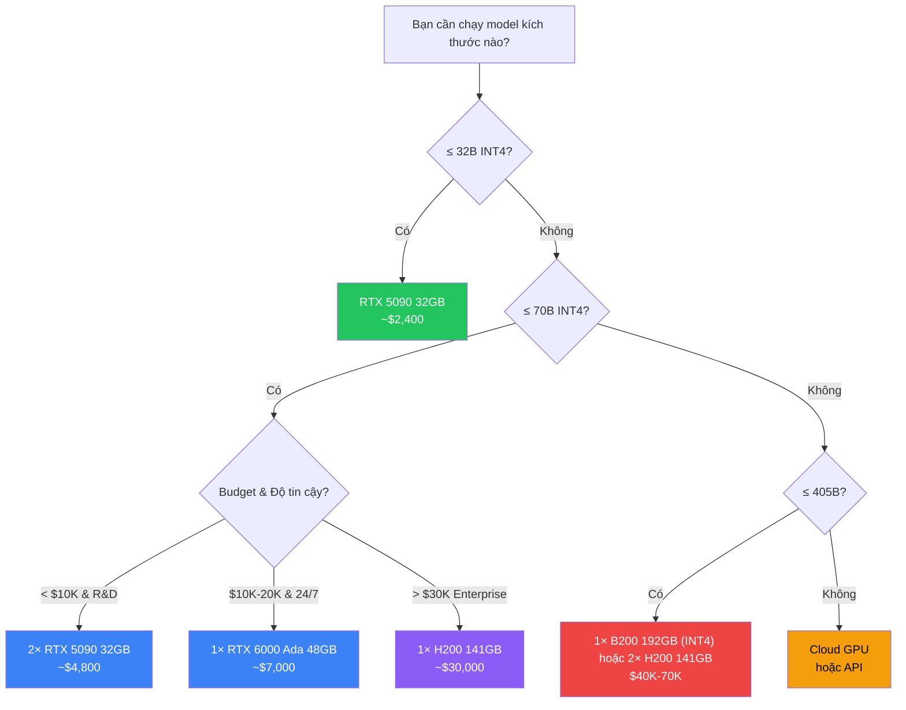
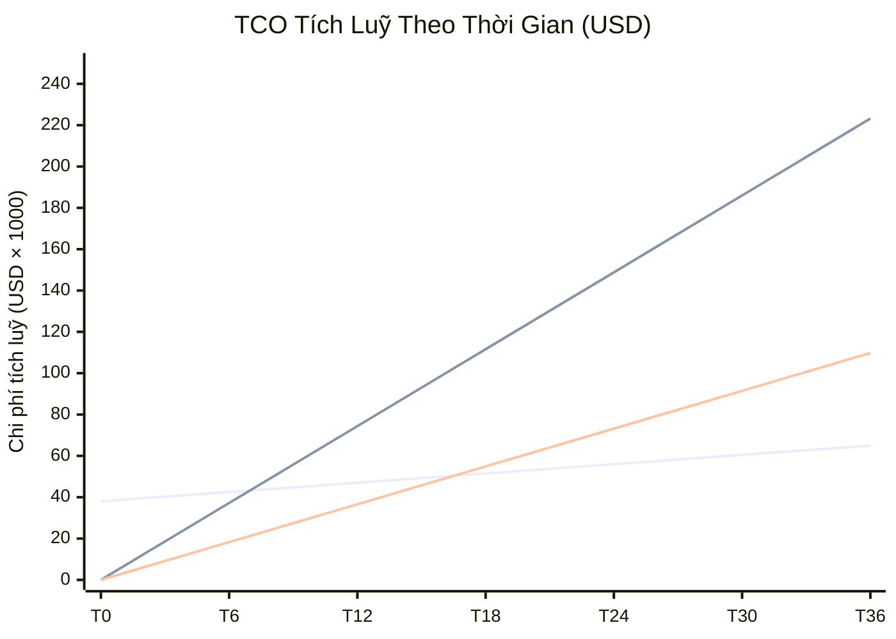

# Chọn Phần Cứng & Cài Đặt GPU Server: Hướng Dẫn Thực Chiến Cho Doanh Nghiệp Vừa & Nhỏ

## Mở Đầu: GPU Server — Khoản Đầu Tư Quyết Định Thành Bại

Trong kỷ nguyên AI tự chủ, phần cứng GPU Server không chỉ là "một chiếc máy tính mạnh" — nó là **xương sống hạ tầng** quyết định doanh nghiệp có thể triển khai AI nội bộ hay không. Chọn sai GPU, thiếu VRAM, hay tính toán nguồn điện không kỹ có thể biến khoản đầu tư hàng trăm triệu thành một cục sắt đắt tiền nằm phòng máy lạnh.

Là một Infrastructure Engineer chuyên tư vấn phần cứng cho các dự án AI doanh nghiệp, tôi đã chứng kiến không ít trường hợp mua GPU server sai thông số, thiếu UPS, hay chọn GPU "overkill" lãng phí ngân sách. Bài viết này tổng hợp kinh nghiệm thực chiến giúp bạn **chọn đúng, mua đủ, và triển khai hiệu quả** ngay từ lần đầu.

**Nội dung chính:**

- Công thức tính VRAM cần thiết cho từng kích thước model LLM (bổ sung model kích thước lớn).
- Bảng so sánh chi tiết 6 GPU từ phổ thông đến cao cấp: RTX 4090, RTX 5090, RTX A6000, H100, H200, B200.
- Cấu hình server khuyến nghị theo 3 quy mô doanh nghiệp cập nhật năm 2026.
- Phân tích TCO (Total Cost of Ownership) 3 năm: On-premise vs Cloud vs API.
- Checklist mua hàng 15 điểm + các sai lầm phổ biến (bổ sung lưu ý về TDP và làm mát chất lỏng).

---

## 1. VRAM Là Tài Nguyên Quan Trọng Nhất — Hiểu Đúng Để Chọn Đúng

### 1.1 Tại Sao VRAM Quyết Định Tất Cả?

Khi chạy một mô hình ngôn ngữ lớn (LLM), **toàn bộ trọng số (weights) của model phải nằm trong VRAM** của GPU để inference đạt tốc độ tối ưu. Nếu model không vừa VRAM, hệ thống phải "offload" sang RAM hệ thống hoặc ổ cứng — **giảm tốc độ inference từ 10x đến 100x**, khiến trải nghiệm người dùng không thể chấp nhận được.

!!! info "VRAM vs RAM vs Storage"
    - **VRAM (Video RAM)**: Bộ nhớ trên GPU — nơi model **phải** nằm để inference nhanh. Bandwidth: 1–3 TB/s.
    - **System RAM**: Bộ nhớ hệ thống — có thể offload model nhưng cực chậm. Bandwidth: 50–100 GB/s.
    - **Storage (SSD/NVMe)**: Nơi lưu trữ file model — chỉ dùng để load ban đầu. Bandwidth: 3–7 GB/s.

### 1.2 Công Thức Tính VRAM

Công thức tổng quát để ước tính VRAM cần thiết:

```
VRAM (GB) = (Số tham số (tỷ) × Bytes/tham số) + Overhead (15-20%)
```

Trong đó **Bytes/tham số** phụ thuộc vào precision:

| Precision | Bits | Bytes/tham số | Ghi chú |
|-----------|------|---------------|---------|
| **FP32** (Full) | 32-bit | 4 bytes | Chỉ dùng cho training, rất tốn VRAM |
| **FP16 / BF16** (Half) | 16-bit | 2 bytes | Cân bằng chất lượng — tốc độ |
| **INT8** (8-bit Quantization) | 8-bit | 1 byte | Phổ biến cho inference production |
| **INT4 / Q4_K_M** (4-bit) | 4-bit | ~0.5 byte | Tiết kiệm VRAM nhất, chất lượng vẫn tốt |

!!! example "Ví Dụ Tính VRAM Thực Tế"

    **Scenario 1: Chạy Llama 3.1 70B ở FP16**

    - Weights: 70B × 2 bytes = **140 GB** → ❌ Không GPU đơn nào chứa nổi!
    - Cần ít nhất 2× A100 80GB hoặc 2× H100 80GB.

    **Scenario 2: Chạy Llama 3.1 70B ở Q4_K_M (4-bit quantization)**

    - Weights: 70B × 0.5 byte = **35 GB**
    - Overhead (20%): 35 × 0.2 = **7 GB**
    - Tổng: **~42 GB** → ✅ Vừa 1× RTX A6000 48GB hoặc 1× A100 80GB.

    **Scenario 3: Chạy Qwen2.5 32B ở Q4_K_M**

    - Weights: 32B × 0.5 = **16 GB**
    - Overhead (20%): 16 × 0.2 = **3.2 GB**
    - Tổng: **~19.2 GB** → ✅ Dư sức chạy mượt trên 1× RTX 5090 32GB hoặc RTX 4090 24GB.

    **Scenario 4: Chạy Llama 3.1 70B ở Q4_K_M trên RTX 5090**

    - Weights: 70B × 0.5 = **35 GB**
    - Overhead (20%): 35 × 0.2 = **7 GB**
    - Tổng: **~42 GB** → ❌ Vượt quá 32GB VRAM của 1× RTX 5090. Nhưng nếu cắm **2× RTX 5090 (64GB VRAM)**, hệ thống sẽ chạy cực kỳ mượt mà và còn dư tới 22GB cho context window dài.

### 1.3 Bảng VRAM Cần Thiết Theo Kích Thước Model (Cập nhật 2026)

| Model Size | FP16 (2 bytes) | INT8 (1 byte) | INT4 (~0.5 byte) | GPU Tối Thiểu (INT4) | Đề xuất tối ưu (2026) |
|-----------|----------------|---------------|-------------------|----------------------|-----------------------|
| **3B – 4B** | 6 – 8 GB | 3 – 4 GB | 1.5 – 2 GB | RTX 4060 Ti 16GB | 1× RTX 4060 Ti 16GB |
| **7B – 8B** | 14 – 16 GB | 7 – 8 GB | 3.5 – 4 GB | RTX 4060 Ti 16GB | 1× RTX 5090 32GB (Dư xăng) |
| **13B – 14B** | 26 – 28 GB | 13 – 14 GB | 7 – 8 GB | RTX 5090 32GB | 1× RTX 5090 32GB |
| **32B – 34B** | 64 – 68 GB | 32 – 34 GB | 16 – 18 GB | RTX 5090 32GB | 1× RTX 5090 32GB (Còn dư cache) |
| **70B – 72B** | 140 – 144 GB | 70 – 72 GB | 35 – 42 GB | RTX A6000 48GB | 2× RTX 5090 32GB hoặc 1× H200 141GB |
| **405B+** | 810+ GB | 405+ GB | 200+ GB | Multi-GPU (8×H100) | 4× H200 141GB hoặc 2× B200 192GB |

!!! tip "Quy Tắc Nhanh"
    - **FP16**: ~2 GB VRAM cho mỗi 1B tham số.
    - **INT4**: ~0.5–0.6 GB VRAM cho mỗi 1B tham số.
    - **Luôn cộng thêm 15–20%** cho KV Cache và activation memory, đặc biệt với context window dài (32K–128K tokens). Với kiến trúc Blackwell mới, việc chạy FP4 (4-bit native) trên RTX 5090 và B200 giúp tối ưu hóa VRAM hơn nữa mà không làm suy giảm nhiều độ chính xác.

---

## 2. Bảng So Sánh GPU Phổ Biến Cho AI Server (Cập nhật 2026)

Để doanh nghiệp có cái nhìn toàn diện, chúng tôi chia bảng so sánh thành 2 phân khúc rõ rệt: **Phân khúc Workstation/Consumer** (dành cho R&D, Dev, quy mô nhỏ) và **Phân khúc Datacenter Enterprise** (dành cho production tải cao).

### 2.1 Bảng So Sánh Phân Khúc Workstation & Consumer

| Thông số | GeForce RTX 4090 | GeForce RTX 5090 | RTX A6000 | RTX 6000 Ada |
|----------|------------------|------------------|-----------|--------------|
| **Kiến trúc** | Ada Lovelace | Blackwell (GB202) | Ampere | Ada Lovelace |
| **VRAM** | 24 GB GDDR6X | **32 GB GDDR7** | 48 GB GDDR6 (ECC) | 48 GB GDDR6 (ECC) |
| **Memory Bandwidth** | 1,008 GB/s | **1,792 GB/s** | 768 GB/s | 960 GB/s |
| **TDP** | 450W | **575W** | 300W | 300W |
| **FP16 TFLOPS** | 82.6 | **120.5** | 38.7 | 91.1 |
| **Giá tham khảo (MSRP/Market)**| ~$1,599 / ~$1,900 | **~$1,999 / ~$2,400** | ~$4,000–$5,000 | ~$6,800–$8,000 |
| **ECC Memory** | ❌ | ❌ | ✅ | ✅ |
| **NVLink** | ❌ | ❌ | ✅ (Bridge) | ❌ |
| **Form Factor** | Desktop 3-slot (Dày) | Desktop 3-slot (Dày) | Workstation 2-slot | Workstation 2-slot |

### 2.2 Bảng So Sánh Phân Khúc Datacenter Enterprise

| Thông số | NVIDIA H100 (SXM) | NVIDIA H200 (SXM) | NVIDIA B200 (Blackwell) |
|----------|-------------------|-------------------|-------------------------|
| **VRAM** | 80 GB HBM3 | **141 GB HBM3e** | **192 GB HBM3e** |
| **Memory Bandwidth** | 3.35 TB/s | **4.8 TB/s** | **8.0 TB/s** |
| **TDP** | 700W | 700W | **1000W – 1200W** (Rất nóng) |
| **FP16 / FP8 TFLOPS**| 267 / 989 | 267 / 989 | **450 / 1800** (FP4: 3600) |
| **Giá tham khảo (USD)** | ~$25,000–$30,000 | **~$30,000–$35,000** | **~$35,000–$45,000+** |
| **ECC Memory** | ✅ | ✅ | ✅ |
| **NVLink Speed** | 900 GB/s | 900 GB/s | **1.8 TB/s (NVLink 5)** |
| **Phương thức tản nhiệt**| Gió (Air) / Nước | Gió (Air) / Nước | **Bắt buộc tản nhiệt nước** |

### 2.3 Phân Tích Performance/Dollar & Khả Năng Vận Hành

| GPU | Giá/GB VRAM | Model Lớn Nhất Chạy Được (INT4) | Phù Hợp Cho | Performance/Dollar |
|-----|-------------|----------------------------------|-------------|-------------------|
| **RTX 4090** | ~$80/GB | 32B (nửa tải), 70B (cần 2 card) | Dev/Test, Cá nhân, Budget hẹp | ⭐⭐⭐⭐ Tốt |
| **RTX 5090** | **~$75/GB** | **32B (tối đa), 70B (cần 2 card)** | Dev/Test, Workstation cao cấp | ⭐⭐⭐⭐⭐ Xuất sắc nhất |
| **RTX A6000** | ~$100/GB | 70B (vừa vặn) | Workstation SMB chạy 24/7 | ⭐⭐⭐ Trung bình |
| **H200 141GB**| ~$248/GB | 70B FP16, 405B INT4 (cần 2 card) | Production Enterprise, RAG tải cao | ⭐⭐⭐⭐ Rất tốt |
| **B200 192GB**| ~$234/GB | 405B INT4 (chạy mượt trên 1 card)| State-of-the-art Inference/Training| ⭐⭐⭐⭐ Rất tốt (mạnh nhất) |

!!! warning "Lưu Ý Quan Trọng Khi Chọn GPU (Cập nhật 2026)"
    - **RTX 5090 và 4090 không có ECC Memory**: Không phù hợp cho workload production chạy liên tục 24/7 yêu cầu độ chính xác dữ liệu tuyệt đối (không bị bit-flip).
    - **RTX 5090 ngốn điện khủng khiếp (TDP 575W)**: Lắp 2 card RTX 5090 yêu cầu nguồn tối thiểu **1600W-2000W** và đầu cấp điện 12V-2x6 thế hệ mới để tránh cháy nổ đầu nối.
    - **Blackwell B200 tỏa nhiệt cực lớn (1000W-1200W per GPU)**: Hầu như không thể làm mát bằng gió truyền thống ở mật độ cao. Các doanh nghiệp đầu tư Blackwell bắt buộc phải thiết kế hệ thống **tản nhiệt chất lỏng Direct-to-Chip** hoặc đặt phòng máy chuyên dụng.
    - **EULA của NVIDIA**: NVIDIA cấm sử dụng dòng GeForce (RTX 4090/5090) trong trung tâm dữ liệu thương mại. Doanh nghiệp chỉ nên dùng cho R&D nội bộ hoặc chuyển sang RTX 6000 Ada / Datacenter GPU.

### 2.4 Sơ Đồ Quyết Định Chọn GPU



---

## 3. Cấu Hình Server Khuyến Nghị Theo Quy Mô (Cập nhật 2026)

### 3.1 Quy Mô Team (< 20 người dùng)

**Use case**: Dev/Test, prototype, chạy model ≤ 32B cho internal chatbot.

| Thành phần | Khuyến nghị | Lý do |
|-----------|-------------|-------|
| **GPU** | 1× RTX 5090 (32GB) hoặc RTX 4090 (24GB) | Đủ cho model ≤ 32B INT4, VRAM GDDR7 tốc độ cực cao |
| **CPU** | AMD Threadripper 7960X (24 cores) hoặc Intel Xeon w5-3435X | Đủ xử lý preprocessing và CPU inference offload nếu cần |
| **RAM** | 128 GB DDR5 ECC | Đủ cho OS + loading model lớn + KV cache buffer |
| **Storage** | 2TB Gen5 NVMe SSD | Tốc độ load model cực nhanh (10-14 GB/s) |
| **Network** | 2.5 GbE hoặc 10 GbE | Đủ băng thông cho team nội bộ |
| **PSU** | 1200W – 1600W 80+ Titanium | RTX 5090 peak 575W, cần nguồn chất lượng cao |
| **Chassis** | Tower Workstation chuyên dụng | Dễ đặt tại phòng làm việc (độ ồn thấp) |
| **Ước tính giá** | **$6,000 – $9,000** | |

### 3.2 Quy Mô Department (20–100 người dùng)

**Use case**: Production inference 70B INT4 chạy ổn định 24/7, multi-model serving, RAG pipeline.

| Thành phần | Khuyến nghị | Lý do |
|-----------|-------------|-------|
| **GPU** | 2× RTX 5090 (64GB VRAM) hoặc 1× RTX 6000 Ada (48GB) | Đủ VRAM cho 70B INT4 chạy mượt, 6000 Ada hỗ trợ ECC |
| **CPU** | AMD EPYC 9354 (32 cores) hoặc 2× Intel Xeon Silver 4514Y | Xử lý đa luồng tốt cho concurrent requests |
| **RAM** | 256 GB DDR5 ECC | Multi-model loading, vector DB caching |
| **Storage** | 2× 2TB NVMe SSD (RAID 1 cho OS+Models) + 8TB Enterprise U.3 SSD | Đảm bảo an toàn dữ liệu và vector search IOPS cao |
| **Network** | Dual 10 GbE (LACP Bonded) | Tránh nghẽn băng thông khi nhiều client gọi API |
| **PSU** | 2000W+ Redundant (80+ Titanium) | Dự phòng nguồn khi chạy full load |
| **Chassis** | 4U Rackmount Server Chassis | Lắp tủ rack tiêu chuẩn phòng server |
| **Ước tính giá** | **$18,000 – $35,000** | |

### 3.3 Quy Mô Enterprise (> 100 người dùng)

**Use case**: Multi-model serving (70B + 32B + embedding), high concurrency, fine-tuning định kỳ, SLA 99.9%.

| Thành phần | Khuyến nghị | Lý do |
|-----------|-------------|-------|
| **GPU** | 2× H200 (SXM 141GB HBM3e) hoặc 1× B200 (192GB HBM3e) | Đỉnh cao hiệu năng, băng thông bộ nhớ khủng (4.8 - 8 TB/s) |
| **CPU** | 2× AMD EPYC 9554 (Tổng 128 cores) | Phục vụ xử lý dữ liệu và concurrency cực lớn |
| **RAM** | 512 GB – 1 TB DDR5 ECC | Cực kỳ thoải mái cho các dịch vụ phụ trợ |
| **Storage** | 4× 3.84TB U.3 NVMe SSD RAID 10 + Vector DB NAS | Tốc độ đọc ghi enterprise, chịu lỗi phần cứng |
| **Network** | Dual 25GbE/100GbE hoặc InfiniBand | Đảm bảo latency cực thấp |
| **PSU** | 3000W+ Redundant (2N+1) | Bảo vệ an toàn điện cấp độ Datacenter |
| **Chassis** | 8U GPU Server (Supermicro/Dell PowerEdge/NVIDIA HGX) | Hệ thống tối ưu tản nhiệt (chất lỏng direct-to-chip cho B200) |
| **Ước tính giá** | **$90,000 – $200,000+** | |

!!! warning "Cảnh Báo: Điện, Làm Mát & UPS — Yếu Tố Bị Bỏ Quên Nhất (Cập nhật 2026)"

    **⚡ Điện năng:**
    - 1× RTX 5090 peak 575W → server tổng ~900W → **bắt buộc dùng mạch điện 20A riêng**.
    - 2× H200 hoặc 1× B200 server peak ~2,500W–3,500W → **yêu cầu ổ cắm công nghiệp NEMA L6-30R (30A, 208V/240V)**.
    - Tiền điện GPU server chạy 24/7 có thể lên tới **$200–$800/tháng**.

    **❄️ Làm mát và Tản nhiệt chất lỏng:**
    - Các GPU Blackwell như B200 tỏa nhiệt từ **1000W-1200W** trên một chip. Tản nhiệt khí (air cooling) không còn khả thi.
    - Doanh nghiệp phải chuyển hướng sang **tản nhiệt chất lỏng Direct-to-Chip (DLC)** hoặc hệ thống làm mát tủ rack chuyên dụng (In-Row Cooling).
    - Rule of thumb: Phòng máy cần duy trì dưới 22°C. BTU/h tỏa ra từ server 3kW là ~10,200 BTU/h, cần điều hòa tối thiểu **1.5 HP hoạt động 24/7**.

    **🔋 UPS (Uninterruptible Power Supply):**
    - GPU server cần UPS loại **Online Double-Conversion** (không dùng Line-Interactive rẻ tiền) để triệt tiêu nhiễu điện và có thời gian chuyển mạch bằng 0ms.
    - Sizing: Luôn chạy UPS ở mức **60–75% công suất tối đa** để đảm bảo an toàn trước dòng khởi động (inrush current) đột biến của GPU.
    - Ví dụ: Server tiêu thụ 2,000W → UPS tối thiểu phải có công suất thực **3,000VA / 3,000W**.

---

## 4. Phân Tích TCO 3 Năm: On-Premise vs Cloud vs API

### 4.1 Kịch Bản So Sánh

**Giả định chung:**

- Model: 70B parameters, INT4 quantization (~42 GB VRAM).
- Sử dụng: 8 giờ/ngày, 22 ngày/tháng (business hours) → ~176 giờ/tháng.
- Số người dùng: ~50 người (quy mô Department).
- Throughput cần thiết: ~100 requests/giờ, ~500 tokens/response.

### 4.2 Bảng TCO 3 Năm Chi Tiết

| Hạng mục | On-Premise (1× H200 141GB) | Cloud GPU (RunPod/Lambda 1× H100)| API Call (GPT-4o / Claude) |
|----------|---------------------------|----------------------------------|---------------------------|
| **Chi phí ban đầu** | | | |
| Hardware (GPU Server) | $45,000 | $0 | $0 |
| UPS + Cooling setup | $6,000 | $0 | $0 |
| Network + Rack | $3,000 | $0 | $0 |
| **Chi phí hàng tháng** | | | |
| Điện (~1.5 kW × 176h) | ~$50 | $0 (included) | $0 |
| Internet/Network | ~$100 | ~$100 | ~$50 |
| Cloud GPU rental | $0 | ~$528 ($3.00/h × 176h) | $0 |
| API cost | $0 | $0 | ~$3,000 (100 req/h × 176h × $0.015/req avg) |
| IT Staff (phần GPU) | ~$500 | ~$200 | $0 |
| Software licenses | ~$100 | ~$200 | $0 |
| **Tổng tháng (ongoing)** | **~$750** | **~$1,028** | **~$3,050** |
| **Tổng 3 năm** | | | |
| CapEx (ban đầu) | $54,000 | $0 | $0 |
| OpEx (36 tháng) | $27,000 | $37,008 | $109,800 |
| **TỔNG TCO 3 NĂM** | **~$81,000** | **~$37,008** | **~$109,800** |
| **Chi phí/tháng trung bình** | **~$2,250** | **~$1,028** | **~$3,050** |

*Ghi chú: Nếu doanh nghiệp chạy workloads 24/7 liên tục (như RAG agent trực tổng đài tự động), Cloud GPU lúc này sẽ tốn: $3.00/h × 720 giờ = ~$2,160/tháng (chưa tính egress fee). Lúc này, tổng TCO 3 năm của Cloud GPU tăng lên tới ~$85,000+, vượt qua mốc On-Premise sau khoảng 14 tháng.*

### 4.3 Biểu Đồ Break-Even



### 4.4 Khi Nào Chọn Phương Án Nào?

| Tiêu chí | On-Premise ✅ | Cloud GPU ✅ | API Call ✅ |
|----------|--------------|-------------|-----------|
| **Utilization** | > 70% thời gian (24/7 hoặc gần) | Bursty, không đều | Thấp, thử nghiệm |
| **Data Sensitivity** | Dữ liệu mật, compliance nghiêm ngặt | Dữ liệu ít nhạy cảm | Dữ liệu công khai |
| **Budget profile** | Có CapEx, chấp nhận đầu tư ban đầu | Ưu tiên OpEx, linh hoạt | Tối thiểu budget |
| **Team IT** | Có đội ngũ IT/DevOps | Có DevOps cloud | Không cần IT |
| **Timeline** | 4–8 tuần setup | Vài giờ | Vài phút |
| **Scale flexibility** | Khó scale nhanh | Rất dễ scale | Unlimited scale |
| **Break-even** | ~8–10 tháng vs Cloud | Không bao giờ rẻ hơn On-prem (nếu dùng 24/7) | Rẻ nhất nếu < 50 req/giờ |

!!! tip "Chiến Lược Hybrid — Lựa Chọn Thông Minh Nhất"
    Hầu hết doanh nghiệp vừa và nhỏ nên áp dụng **chiến lược Hybrid**:

    1. **On-premise** cho workload ổn định, dự đoán được (inference 24/7, data nhạy cảm).
    2. **Cloud GPU** cho burst capacity (training định kỳ, peak load).
    3. **API call** cho use case thử nghiệm, model frontier mới nhất mà chưa có open-source tương đương.

    → Tối ưu chi phí tổng thể mà vẫn đảm bảo tính linh hoạt.

---

## 5. Checklist Mua Hàng 15 Điểm & Sai Lầm Phổ Biến

### 5.1 Checklist Mua GPU Server

#### Giai đoạn 1: Xác Định Nhu Cầu (Trước khi mua)

- [ ] **1. Xác định model mục tiêu**: Liệt kê các model sẽ chạy (kèm kích thước: 7B, 13B, 70B…) và precision (FP16, INT8, INT4).
- [ ] **2. Tính VRAM cần thiết**: Dùng công thức ở Phần 1. Cộng 20% buffer cho KV cache với context dài.
- [ ] **3. Ước tính concurrent users**: Mỗi concurrent session cần thêm VRAM cho KV cache (~0.5–2 GB tuỳ context length).
- [ ] **4. Xác định SLA uptime**: 99% (cho phép ~7h downtime/tháng) hay 99.9% (chỉ ~43 phút downtime/tháng)?
- [ ] **5. Kiểm tra compliance**: GDPR, HIPAA, ISO 27001 — dữ liệu có được phép ra ngoài network không?

#### Giai đoạn 2: Chọn Phần Cứng

- [ ] **6. GPU phù hợp**: Chọn theo bảng ở Phần 2. Ưu tiên "vừa đủ + buffer" thay vì "overkill".
- [ ] **7. Kiểm tra EULA GPU**: RTX 4090 bị hạn chế datacenter use. Workstation GPU (A6000, RTX 6000 Ada) không bị.
- [ ] **8. RAM đủ lớn**: Tối thiểu 2× VRAM tổng. Ví dụ: 2× A6000 48GB → RAM ≥ 192 GB.
- [ ] **9. Storage đúng loại**: NVMe cho model files (tốc độ load), SSD cho data, HDD cho backup.
- [ ] **10. PSU đúng công suất**: Tính tổng TDP tất cả components + 30% headroom. Chọn 80+ Platinum trở lên.

#### Giai đoạn 3: Hạ Tầng Phụ Trợ

- [ ] **11. UPS online double-conversion**: Công suất ≥ 130% tổng TDP server. Kiểm tra crest factor ≥ 3:1.
- [ ] **12. Cooling chuyên dụng**: Phòng server cần precision cooling. Đo BTU/h = Watts × 3.41.
- [ ] **13. Mạch điện riêng**: GPU server cần mạch riêng từ tủ điện, không share với thiết bị văn phòng.
- [ ] **14. Network đủ bandwidth**: 10 GbE tối thiểu cho production. Switch managed để VLAN tách traffic.
- [ ] **15. Remote management**: Server phải có IPMI/BMC/iDRAC để quản lý từ xa khi không có mặt tại phòng server.

### 5.2 Top 8 Sai Lầm Phổ Biến Khi Mua GPU Server Lần Đầu

!!! warning "Những Sai Lầm Đắt Giá"

    **❌ Sai lầm #1: Chọn GPU theo TFLOPS thay vì VRAM & Băng thông bộ nhớ**
    > "RTX 4090 có 82 TFLOPS, A100 chỉ có 78 TFLOPS, vậy 4090 mạnh hơn!"
    > → **SAI**. Với LLM inference, VRAM và Memory Bandwidth quan trọng hơn TFLOPS rất nhiều. HBM3 trên H100/H200 cho băng thông 3.3 - 4.8 TB/s gấp nhiều lần GDDR6/GDDR7 trên card consumer, giúp trả token nhanh hơn rất nhiều khi chịu tải nặng.

    **❌ Sai lầm #2: Quên tính KV Cache**
    > Tính chỉ model weights rồi nghĩ VRAM "còn dư nhiều". Thực tế KV cache cho context dài hoặc đa phiên sử dụng đồng thời có thể ngốn thêm 8–16 GB VRAM ngoài dự kiến.

    **❌ Sai lầm #3: Không nâng cấp hệ thống làm mát cho GPU thế hệ mới**
    > "Cứ dùng quạt gió thường thôi, lắp phòng máy lạnh là đủ."
    > → **SAI**. Với Blackwell B200 tỏa nhiệt tới 1000W-1200W, quạt gió sẽ rú lên như động cơ phản lực và nhanh chóng bị quá nhiệt (thermal throttling). Blackwell bắt buộc phải dùng tản nhiệt nước.

    **❌ Sai lầm #4: Không kiểm tra nguồn điện phòng server**
    > Mua server RTX 5090 kép tiêu thụ peak 1,500W rồi cắm vào ổ điện văn phòng 15A (max ~1,800W) → trip breaker liên tục hoặc gây nóng chảy đường dây do quá tải dòng điện.

    **❌ Sai lầm #5: Dùng UPS "văn phòng" cho GPU server**
    > UPS line-interactive giá rẻ không chịu nổi non-linear load của PSU server → UPS shutdown bất ngờ hoặc cháy nổ khi GPU đột ngột chuyển sang full load (training/fine-tuning).

    **❌ Sai lầm #6: Mua RTX 5090/4090 cho production 24/7**
    > Card consumer không có ECC memory. Sau nhiều tuần chạy liên tục không restart, hiện tượng bit-flip (lỗi bộ nhớ do bức xạ nền) sẽ xuất hiện, gây lỗi logic hoặc crash hệ thống đột ngột.

    **❌ Sai lầm #7: Không có redundancy**
    > 1 GPU server duy nhất, không backup, không failover. GPU chết hoặc mất điện = toàn bộ hệ thống AI nghiệp vụ của công ty ngưng hoạt động.

    **❌ Sai lầm #8: Mua "overkill" ngay từ đầu**
    > Mua 8× H100/H200 $300K cho team 10 người chỉ chạy chatbot RAG văn bản hành chính. Lãng phí 95% tài nguyên. Hãy bắt đầu nhỏ, scale dần.

---

## 6. Prompt Mẫu: Hỏi AI Tư Vấn Cấu Hình Server

Khi bạn cần tư vấn nhanh, có thể sử dụng prompt sau để hỏi AI:

```text
Bạn là Infrastructure Engineer chuyên tư vấn phần cứng GPU Server cho doanh nghiệp.

Hãy tư vấn cấu hình GPU Server phù hợp với yêu cầu sau:

## Thông tin doanh nghiệp:
- Quy mô: [Số nhân viên sẽ sử dụng AI]
- Ngành: [Ngành nghề, ví dụ: tài chính, y tế, sản xuất]
- Budget dự kiến: [Ví dụ: $10,000 - $20,000]
- Yêu cầu compliance: [GDPR/HIPAA/ISO 27001/Không]

## Yêu cầu kỹ thuật:
- Model mục tiêu: [Ví dụ: Llama 3.1 70B, Qwen2.5 32B, Embedding model]
- Precision: [FP16 / INT8 / INT4]
- Concurrent users dự kiến: [Ví dụ: 10-20 người cùng lúc]
- Context length cần thiết: [Ví dụ: 8K / 32K / 128K tokens]
- Use case chính: [Chatbot / RAG / Code Assistant / Document Analysis]
- Uptime SLA: [99% / 99.9% / 99.99%]

## Hạ tầng hiện tại:
- Phòng server: [Có / Không / Đang xây]
- Nguồn điện: [1-phase / 3-phase, Amperage]
- Cooling hiện tại: [Điều hoà thường / Precision cooling / Chưa có]
- UPS hiện tại: [Có (công suất?) / Không]
- Network: [1GbE / 10GbE / Khác]

## Output mong muốn:
1. Đề xuất cấu hình server chi tiết (GPU, CPU, RAM, Storage, PSU).
2. Ước tính chi phí hardware + hạ tầng phụ trợ.
3. So sánh TCO 3 năm với Cloud GPU.
4. Cảnh báo rủi ro và điểm cần lưu ý.
5. Lộ trình triển khai đề xuất.
```

!!! example "Ví Dụ Sử Dụng Prompt"

    **Input:**
    ```
    - Quy mô: 30 nhân viên
    - Budget: $15,000
    - Model: Qwen2.5 32B INT4 + BGE-M3 embedding
    - Concurrent users: 10
    - Use case: RAG chatbot nội bộ + code assistant
    - Phòng server: Có, điều hoà thường, 1-phase 30A
    - UPS: Chưa có
    ```

    **AI sẽ trả về:**

    - GPU: 2× RTX 4090 24GB (~$5,000) — đủ VRAM cho 32B INT4 + embedding model song song.
    - CPU: AMD EPYC 7313P 16-core (~$800).
    - RAM: 128 GB DDR5 ECC (~$400).
    - Storage: 2TB NVMe + 4TB SSD (~$500).
    - PSU: 1600W 80+ Platinum Redundant (~$300).
    - Chassis: Supermicro 4U GPU Tower (~$1,500).
    - UPS: APC Smart-UPS 3000VA Online (~$2,000).
    - Cooling upgrade: Precision AC unit (~$3,000).
    - **Tổng ước tính: ~$13,500** ✅ Trong budget.

---

## Kết Luận: Mua Đúng Từ Đầu, Tiết Kiệm Hàng Trăm Triệu

Đầu tư GPU Server cho AI không phải là cuộc chạy đua sở hữu GPU mạnh nhất — mà là bài toán **tối ưu hoá giữa VRAM đủ dùng, chi phí hợp lý, và hạ tầng phụ trợ tin cậy**. 

Ba nguyên tắc vàng:

1. **VRAM là vua** — Tính đúng VRAM cần thiết trước, rồi mới chọn GPU. Không bao giờ mua GPU mà không biết mình sẽ chạy model gì.
2. **Hạ tầng phụ trợ chiếm 30–40% chi phí** — Điện, cooling, UPS, network không phải "phụ kiện" mà là thành phần sống còn.
3. **Bắt đầu nhỏ, scale dần** — RTX 4090 cho team nhỏ, nâng cấp lên A6000/A100 khi nhu cầu thực sự tăng. Đừng mua H100 cho chatbot 7B.

GPU Server đúng cấu hình sẽ là khoản đầu tư hoàn vốn trong 8–10 tháng so với Cloud GPU — và mang lại quyền tự chủ AI hoàn toàn cho doanh nghiệp của bạn.

---

## Tham Khảo

- [NVIDIA GPU Specifications](https://www.nvidia.com/en-us/data-center/) — Thông số kỹ thuật chính thức các dòng GPU datacenter NVIDIA.
- [Spheron Network — GPU Cloud vs On-Premise TCO Analysis](https://spheron.network/) — Phân tích chi tiết TCO so sánh cloud vs on-premise GPU.
- [GMI Cloud — Hidden Costs of GPU Infrastructure](https://gmicloud.ai/) — Phân tích chi phí ẩn khi triển khai GPU server.
- [VamsiTalksTech — Cloud GPU Price Drops 2025](https://vamsitalkstech.com/) — Xu hướng giảm giá Cloud GPU từ các hyperscaler.
- [ITLibra — VRAM Requirements for LLM 2025](https://itlibra.com/) — Bảng VRAM cần thiết cho các model LLM phổ biến.
