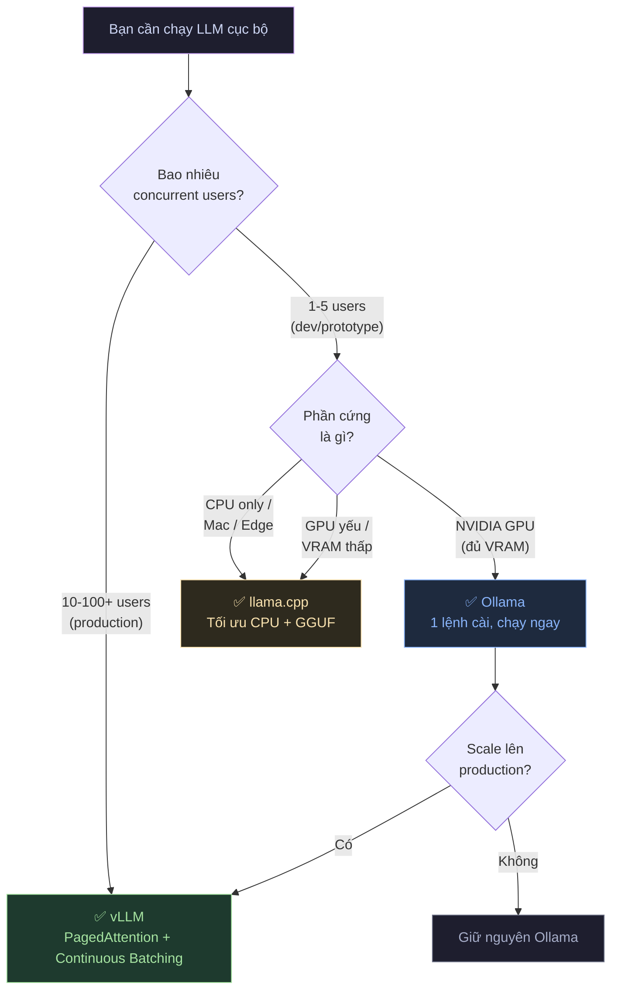
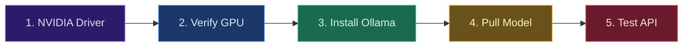
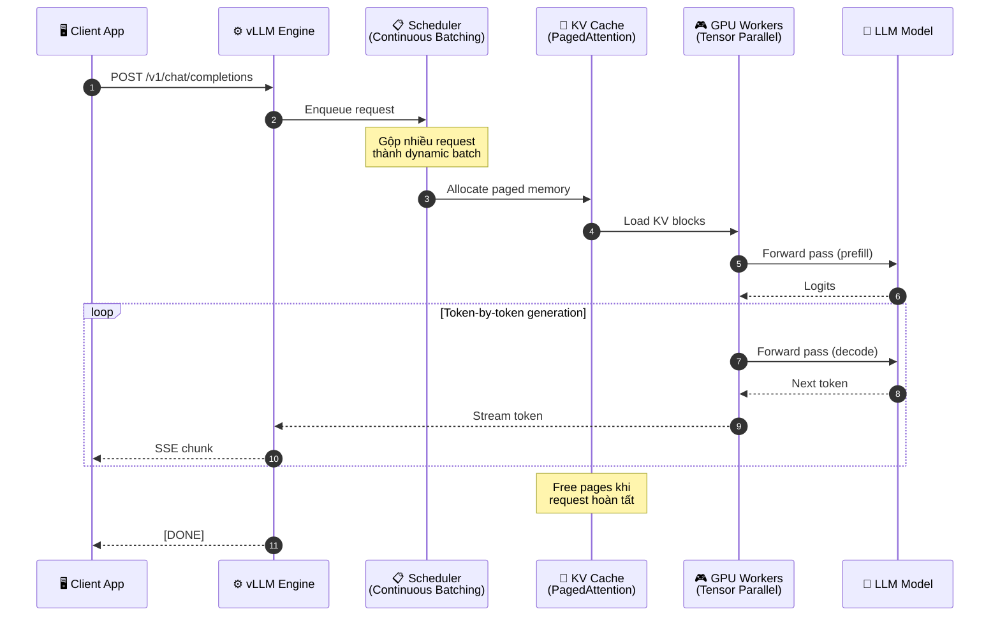
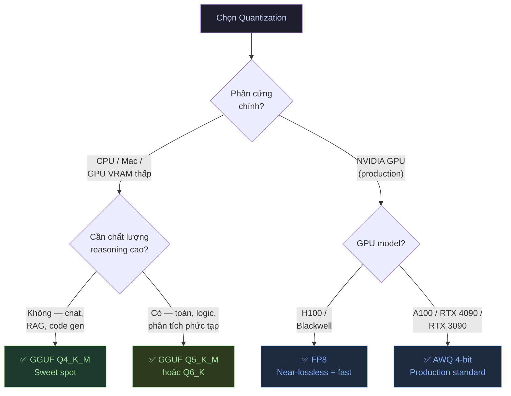

# Ollama & vLLM Thực Chiến: Cài Đặt Inference Engine và Chạy LLM Cục Bộ Trong 30 Phút

## Mở Đầu: Inference Engine — "Động Cơ" Quyết Định Hiệu Năng AI Của Bạn

Bạn đã mua GPU, đã chọn được model — nhưng đặt model lên GPU bằng cách nào? Đây chính là vai trò của **Inference Engine** (hay Serving Engine) — lớp phần mềm biến file trọng số nặng hàng chục GB thành một API endpoint sẵn sàng nhận request.

Là một DevOps Engineer đã triển khai LLM inference server cho nhiều dự án production từ startup đến enterprise, tôi nhận ra rằng việc chọn đúng inference engine quan trọng không kém việc chọn đúng model. Chọn sai engine, bạn sẽ lãng phí GPU, tăng latency, và không thể scale khi cần.

Bài viết này sẽ dẫn bạn đi từ zero đến production-ready trong 30 phút — bao gồm cả việc hiểu khi nào dùng Ollama, khi nào cần vLLM, và tại sao quantization lại là "vũ khí bí mật" giúp bạn chạy model lớn trên phần cứng nhỏ.

**Nội dung chính:**

- Bảng so sánh Ollama vs vLLM vs llama.cpp theo use case, độ khó, và performance.
- Hướng dẫn step-by-step cài đặt Ollama trên Ubuntu 22.04 với GPU NVIDIA.
- Cài đặt vLLM cho production: Docker Compose, tensor parallelism, benchmark.
- Giải thích quantization: GGUF, AWQ, GPTQ — đánh đổi giữa chất lượng và tốc độ.
- Script Bash tự động hóa cài đặt và health check.

---

## 1. So Sánh Ollama vs vLLM vs llama.cpp: Khi Nào Dùng Cái Nào?

Trước khi cài đặt bất cứ thứ gì, bạn cần trả lời một câu hỏi: **"Ai sẽ dùng model này, và dùng như thế nào?"** Câu trả lời sẽ quyết định engine phù hợp.

### 1.1 Bảng So Sánh Tổng Quan

| Tiêu chí | **Ollama** | **vLLM** | **llama.cpp** |
|---|---|---|---|
| **Mô tả ngắn** | "Xe thể thao" — nhanh, gọn, dễ lái | "Tàu cao tốc" — tải lớn, tốc độ ổn định | "Xe Jeep" — chạy được mọi địa hình |
| **Use case chính** | Dev local, prototype, 1-5 users | Production API, 10-100+ concurrent users | Edge device, CPU-only, Mac, thiết bị VRAM thấp |
| **Độ khó cài đặt** | ⭐ Cực dễ (1 lệnh) | ⭐⭐⭐ Trung bình (Docker + config) | ⭐⭐ Dễ-Trung bình (build từ source) |
| **Concurrent users** | 1-5 (FIFO queue) | 50-100+ (continuous batching) | 1-3 (sequential) |
| **Throughput (token/s)** | Tốt cho single-user | **Cao nhất** khi nhiều user | Tốt nhất cho CPU inference |
| **Quản lý KV Cache** | Static | **PagedAttention** (tối ưu VRAM) | Static + offload RAM |
| **Model format** | GGUF | HuggingFace (safetensors), AWQ, GPTQ | GGUF |
| **Multi-GPU** | Có (cơ bản) | **Tensor Parallelism** (native) | Có (layer splitting) |
| **Phần cứng** | GPU + CPU + Apple Silicon | GPU-first (NVIDIA/ROCm) | CPU + GPU + Apple Silicon |
| **OpenAI-compatible API** | ✅ | ✅ | ✅ (qua server mode) |

### 1.2 Biểu Đồ Quyết Định



!!! tip "Quy tắc vàng: Prototype → Ollama, Production → vLLM"
    Hầu hết các team bắt đầu với Ollama để thử nghiệm nhanh, sau đó "tốt nghiệp" lên vLLM khi cần scale. Nhờ cả hai đều cung cấp **OpenAI-compatible API**, việc migrate chỉ cần thay đổi `base_url` — không cần viết lại application code.

---

## 2. Cài Đặt Ollama Trên Ubuntu 22.04 Với GPU NVIDIA

### 2.1 Tổng Quan Các Bước



### Bước 1: Cài đặt NVIDIA Driver

```bash
# Cập nhật hệ thống
sudo apt update && sudo apt upgrade -y

# Cài đặt driver tự động (chọn driver phù hợp với GPU)
sudo ubuntu-drivers autoinstall

# Reboot bắt buộc để load kernel module mới
sudo reboot
```

### Bước 2: Verify GPU đã nhận

```bash
# Kiểm tra GPU đã hoạt động
nvidia-smi
```

Output mong đợi:

```text
+-----------------------------------------------------------------------------------------+
| NVIDIA-SMI 550.xx       Driver Version: 550.xx       CUDA Version: 12.4                |
|   GPU  Name        Persistence-M | Bus-Id        Disp.A | Volatile Uncorr. ECC          |
|   0    NVIDIA RTX 4090       Off | 00000000:01:00.0  On |                  N/A          |
|        24576MiB /  24576MiB      |    512MiB /  24576MiB |                  N/A          |
+-----------------------------------------------------------------------------------------+
```

!!! warning "Nếu `nvidia-smi` báo lỗi"
    Thường do kernel module không load đúng sau update. Chạy lại `sudo ubuntu-drivers autoinstall` rồi `sudo reboot`. Nếu vẫn lỗi, kiểm tra Secure Boot trong BIOS — một số máy cần disable Secure Boot để load NVIDIA driver.

### Bước 3: Cài đặt Ollama

```bash
# Cài đặt Ollama bằng script chính thức (1 lệnh duy nhất)
curl -fsSL https://ollama.com/install.sh | sh

# Verify version (phiên bản mới nhất năm 2026 đã là v0.31.x)
ollama --version

# Kiểm tra service đã chạy
sudo systemctl status ollama
```

!!! info "Cập nhật Ollama mới nhất (Giữa năm 2026)"
    - **Ollama đã bundle sẵn CUDA runtime**: Bạn **không cần** cài đặt CUDA Toolkit riêng. Ollama tự đóng gói các thư viện CUDA cần thiết. Chỉ cần NVIDIA Driver là đủ.
    - **Apple Silicon & Gemma 4**: Từ phiên bản v0.30.x/v0.31.x, Ollama tích hợp sâu engine MLX và hỗ trợ **Multi-Token Prediction (MTP)** giúp sinh token nhanh hơn tới 90% cho các tác vụ lập trình (coding) trên Mac M-series.
    - **Lệnh `ollama launch`**: Lệnh mới giúp khởi động nhanh các agent lập trình local như *Claude Code*, *OpenCode*, tự động hóa cấu hình môi trường và tải model chỉ trong một dòng lệnh.
    - **Hybrid Cloud & Ollama Pro/Max**: Ollama hiện tại hỗ trợ cơ chế định tuyến (routing) thông minh lên Ollama Cloud (các gói Pro/Max) khi chạy các model quá lớn hoặc khi GPU local bị quá tải.

### Bước 4: Pull model và chạy thử

```bash
# Pull model Qwen 2.5 7B (phổ biến, hỗ trợ tiếng Việt tốt)
ollama pull qwen2.5:7b

# Hoặc Llama 3.1 8B (model đa năng)
ollama pull llama3.1:8b

# Kiểm tra danh sách model đã pull
ollama list

# Chạy interactive chat
ollama run qwen2.5:7b
```

### Bước 5: Test API endpoint

Ollama expose REST API tại `http://localhost:11434`. Bạn có thể test bằng `curl`:

```bash
# Health check — kiểm tra server sống
curl http://localhost:11434
# Expected: "Ollama is running"

# Liệt kê model đã cài
curl http://localhost:11434/api/tags | jq .

# Test generate (non-streaming)
curl -s http://localhost:11434/api/generate \
  -d '{
    "model": "qwen2.5:7b",
    "prompt": "Giải thích ngắn gọn DevOps là gì?",
    "stream": false
  }' | jq .response

# Test OpenAI-compatible endpoint (cho tích hợp app)
curl -s http://localhost:11434/v1/chat/completions \
  -H "Content-Type: application/json" \
  -d '{
    "model": "qwen2.5:7b",
    "messages": [
      {"role": "system", "content": "Bạn là trợ lý AI chuyên về DevOps."},
      {"role": "user", "content": "So sánh Docker và Kubernetes trong 3 câu."}
    ]
  }' | jq .choices[0].message.content
```

!!! example "Prompt mẫu: Test chất lượng tiếng Việt"
    Dùng câu hỏi nghiệp vụ thực tế để đánh giá model:
    ```bash
    curl -s http://localhost:11434/api/generate \
      -d '{
        "model": "qwen2.5:7b",
        "prompt": "Bạn là Senior DevOps Engineer. Công ty có 50 microservices chạy trên Kubernetes. Gần đây, hệ thống thường xuyên gặp lỗi OOMKilled ở một số pod vào giờ cao điểm (10h-12h sáng). Hãy phân tích 3 nguyên nhân có thể và đề xuất giải pháp cụ thể cho từng nguyên nhân.",
        "stream": false
      }' | jq .response
    ```
    Đánh giá theo tiêu chí: (1) Trả lời đúng tiếng Việt không lỗi, (2) Phân tích logic đúng kỹ thuật, (3) Giải pháp thực tế có thể áp dụng.

---

## 3. Cài Đặt vLLM Cho Production

Khi hệ thống cần phục vụ **nhiều người dùng đồng thời** với latency ổn định, vLLM là lựa chọn tiêu chuẩn nhờ hai công nghệ cốt lõi:

- **PagedAttention**: Quản lý KV cache như virtual memory — không lãng phí VRAM.
- **Continuous Batching**: Gộp nhiều request cùng lúc thay vì xử lý tuần tự.

### 3.1 Kiến Trúc Luồng Request



### 3.2 Prerequisites

```bash
# 1. Đảm bảo NVIDIA Driver đã cài (xem Section 2)
nvidia-smi

# 2. Cài đặt Docker và Docker Compose
sudo apt install -y docker.io docker-compose-v2

# 3. Cài NVIDIA Container Toolkit
curl -fsSL https://nvidia.github.io/libnvidia-container/gpgkey | \
  sudo gpg --dearmor -o /usr/share/keyrings/nvidia-container-toolkit-keyring.gpg

curl -s -L https://nvidia.github.io/libnvidia-container/stable/deb/nvidia-container-toolkit.list | \
  sed 's#deb https://#deb [signed-by=/usr/share/keyrings/nvidia-container-toolkit-keyring.gpg] https://#g' | \
  sudo tee /etc/apt/sources.list.d/nvidia-container-toolkit.list

sudo apt update && sudo apt install -y nvidia-container-toolkit

# 4. Configure Docker runtime
sudo nvidia-ctk runtime configure --runtime=docker
sudo systemctl restart docker

# 5. Verify GPU trong Docker
docker run --rm --gpus all nvidia/cuda:12.4.0-base-ubuntu22.04 nvidia-smi
```

### 3.3 Docker Compose Setup

Tạo file `docker-compose.yml` cho vLLM:

```yaml
# docker-compose.yml — vLLM Production Setup
version: "3.8"

services:
  vllm:
    image: vllm/vllm-openai:latest
    container_name: vllm-server
    restart: unless-stopped
    
    # GPU access
    deploy:
      resources:
        reservations:
          devices:
            - driver: nvidia
              count: all          # Dùng tất cả GPU
              capabilities: [gpu]
    
    # Shared memory cho multi-GPU tensor parallelism
    ipc: host
    
    ports:
      - "8000:8000"
    
    environment:
      - HUGGING_FACE_HUB_TOKEN=${HF_TOKEN}
      - VLLM_USE_V2_MODEL_RUNNER=1        # Kích hoạt Model Runner V2 (MRv2) tối ưu nhất năm 2026
    
    volumes:
      # Cache model weights — tránh download lại
      - ./models-cache:/root/.cache/huggingface
    
    command: >
      --model meta-llama/Llama-3.1-8B-Instruct
      --tensor-parallel-size 1
      --dtype auto
      --max-model-len 8192
      --gpu-memory-utilization 0.90
      --port 8000
      --api-key ${VLLM_API_KEY:-default-key}
    
    healthcheck:
      test: ["CMD", "curl", "-f", "http://localhost:8000/health"]
      interval: 30s
      timeout: 10s
      retries: 5
      start_period: 120s    # Model cần thời gian load vào GPU

  # Optional: Monitoring
  prometheus:
    image: prom/prometheus:latest
    container_name: vllm-prometheus
    ports:
      - "9090:9090"
    volumes:
      - ./prometheus.yml:/etc/prometheus/prometheus.yml
    depends_on:
      - vllm
```

Tạo file `.env` đi kèm:

```bash
# .env
HF_TOKEN=hf_xxxxxxxxxxxxxxxxxxxx
VLLM_API_KEY=your-secure-api-key-here
```

### 3.4 Cấu Hình Multi-GPU (Tensor Parallelism)

Khi model quá lớn cho 1 GPU (ví dụ: Llama 3.1 70B cần ~140GB VRAM ở FP16), bạn cần **tensor parallelism** — chia model qua nhiều GPU:

```yaml
# docker-compose.multi-gpu.yml — 2x GPU setup cho model 70B
services:
  vllm:
    image: vllm/vllm-openai:latest
    container_name: vllm-70b
    restart: unless-stopped
    
    deploy:
      resources:
        reservations:
          devices:
            - driver: nvidia
              count: 2            # Sử dụng 2 GPU
              capabilities: [gpu]
    
    ipc: host                     # BẮT BUỘC cho multi-GPU communication
    
    ports:
      - "8000:8000"
    
    environment:
      - HUGGING_FACE_HUB_TOKEN=${HF_TOKEN}
      - NCCL_DEBUG=INFO           # Debug multi-GPU communication
    
    volumes:
      - ./models-cache:/root/.cache/huggingface
    
    command: >
      --model meta-llama/Llama-3.1-70B-Instruct
      --tensor-parallel-size 2
      --dtype bfloat16
      --max-model-len 16384
      --gpu-memory-utilization 0.92
      --port 8000
      --enforce-eager
      --enable-chunked-prefill
      --max-num-batched-tokens 32768
```

!!! warning "ipc: host là BẮT BUỘC"
    Khi dùng tensor parallelism, các GPU process cần shared memory để giao tiếp qua NCCL. Nếu không có `ipc: host`, bạn sẽ gặp crash hoặc performance cực kém. Thay thế: `shm_size: "10g"` (ít nhất 30% RAM hệ thống).

!!! info "Cập nhật vLLM mới nhất v0.24.0 (Giữa năm 2026)"
    - **Model Runner V2 (MRv2)**: Được bật mặc định qua biến môi trường `VLLM_USE_V2_MODEL_RUNNER=1`. MRv2 sử dụng GPU-native Triton kernels và cơ chế bất đồng bộ (async scheduling) giúp tăng throughput đáng kể, đặc biệt trên các dòng GPU mới như NVIDIA Blackwell hay AMD MI350/400.
    - **Cài đặt siêu tốc với `uv`**: Thay vì `pip` truyền thống, tài liệu vLLM khuyến nghị sử dụng công cụ quản lý package `uv` của Astral để cài đặt nhanh hơn gấp 10 lần:
      ```bash
      uv pip install vllm --torch-backend auto
      ```
    - **Vá lỗi bảo mật**: Các phiên bản v0.24.0 trở lên đã xử lý triệt để lỗ hổng nghiêm trọng CVE-2026-54234 liên quan đến crash engine worker trong các kịch bản speculative decoding dưới tải cao.

### 3.5 Benchmark Throughput

Sau khi deploy, benchmark để đảm bảo performance đạt yêu cầu:

```bash
# Cài benchmark tool bằng uv (nhanh và sạch hơn pip thường)
uv pip install vllm --torch-backend auto

# Benchmark offline throughput
python -m vllm.entrypoints.openai.api_server &  # Nếu chưa chạy Docker

# Test throughput với vegeta hoặc curl loop
# Đơn giản: 10 request song song
for i in $(seq 1 10); do
  curl -s http://localhost:8000/v1/chat/completions \
    -H "Content-Type: application/json" \
    -H "Authorization: Bearer ${VLLM_API_KEY}" \
    -d '{
      "model": "meta-llama/Llama-3.1-8B-Instruct",
      "messages": [{"role": "user", "content": "Explain DevOps in 50 words."}],
      "max_tokens": 100
    }' &
done
wait
```

#### Bảng Benchmark Tham Khảo

Số liệu dưới đây là **ước tính dựa trên benchmark cộng đồng và tài liệu chính thức** — throughput thực tế phụ thuộc vào batch size, prompt length, và cấu hình cụ thể:

| Model | GPU | Quantization | Throughput (output token/s) | Ghi chú |
|---|---|---|---|---|
| Llama 3.1 8B | RTX 4090 (24GB) | FP16 | ~80-120 | Single user, đủ VRAM |
| Llama 3.1 8B | RTX 4090 (24GB) | AWQ 4-bit | ~120-160 | Nhanh hơn ~30% nhờ ít VRAM |
| Llama 3.1 8B | A100 (80GB) | FP16 | ~150-200 | Bandwidth HBM2e vượt trội |
| Llama 3.1 70B | 2x A100 (80GB) | FP16 | ~40-60 | Tensor parallelism, NVLink |
| Llama 3.1 70B | 2x A100 (80GB) | AWQ 4-bit | ~70-100 | Giảm VRAM, tăng batch size |
| Llama 3.1 70B | 2x H100 (80GB) | BF16 | ~80-120 | FP8 Engine + NVLink 900GB/s |
| Qwen 2.5 7B | RTX 4090 (24GB) | GGUF Q4_K_M | ~90-130 | Ollama, single user |
| Qwen 2.5 72B | 4x H100 (80GB) | FP8 | ~100-150 | Enterprise-grade |

!!! info "Throughput = Output tokens, không phải total tokens"
    Con số trên là **output generation speed** (decode phase). Prefill speed (xử lý input) thường nhanh hơn 5-10x. Khi benchmark, luôn phân biệt rõ hai phase này.

---

## 4. Quantization: GGUF, AWQ, GPTQ — Chọn Loại Nào?

**Quantization** (lượng tử hóa) là kỹ thuật nén trọng số model từ FP16 (16-bit) xuống 8-bit, 4-bit, thậm chí 2-bit — giảm VRAM, tăng tốc inference, đánh đổi một phần chất lượng.

### 4.1 Bảng So Sánh Các Định Dạng

| Định dạng | Engine tương thích | Phần cứng tối ưu | Chất lượng (vs FP16) | Tốc độ | Khi nào dùng |
|---|---|---|---|---|---|
| **GGUF Q4_K_M** | Ollama, llama.cpp | CPU + GPU + Mac | ~92-95% | ⭐⭐⭐⭐ | Default cho local, "sweet spot" giữa chất lượng và VRAM |
| **GGUF Q5_K_M** | Ollama, llama.cpp | CPU + GPU + Mac | ~95-97% | ⭐⭐⭐ | Khi cần reasoning chính xác hơn Q4 |
| **GGUF Q8_0** | Ollama, llama.cpp | GPU (cần nhiều VRAM) | ~99.5% | ⭐⭐ | Gần lossless, chỉ dùng khi dư VRAM |
| **AWQ 4-bit** | vLLM, TGI | NVIDIA GPU | ~93-96% | ⭐⭐⭐⭐⭐ | **Production GPU standard** — tốt nhất cho vLLM |
| **GPTQ 4-bit** | vLLM, TGI, ExLlama | NVIDIA GPU | ~90-94% | ⭐⭐⭐⭐ | Legacy, đã bị AWQ thay thế phần lớn |
| **FP8** | vLLM (H100+) | H100/Blackwell | ~99% | ⭐⭐⭐⭐⭐ | "Gold standard" nếu có phần cứng hỗ trợ |

### 4.2 Giải Thích Chi Tiết

#### GGUF — "Tiêu Chuẩn Cộng Đồng" Cho Local

GGUF (GPT-Generated Unified Format) là format native của **llama.cpp** và **Ollama**. Điểm mạnh lớn nhất: **chạy được trên CPU**, có thể offload một phần layer lên GPU (partial offloading).

```bash
# Ollama tự động dùng GGUF — bạn chọn quantization qua tag
ollama pull qwen2.5:7b-instruct-q4_K_M    # 4-bit, sweet spot
ollama pull qwen2.5:7b-instruct-q8_0      # 8-bit, gần lossless
ollama pull qwen2.5:7b                     # Default (thường Q4_K_M)
```

!!! tip "Q4_K_M là lựa chọn mặc định cho 90% trường hợp"
    - Giảm ~70% VRAM so với FP16.
    - Giữ lại ~92-95% chất lượng — đủ tốt cho chatbot, code generation, RAG.
    - Chỉ nên lên Q5/Q6/Q8 nếu bạn cần reasoning phức tạp (toán, logic) VÀ có dư VRAM.

#### AWQ — "Production Standard" Cho GPU

AWQ (Activation-Aware Weight Quantization) phân tích activation patterns để xác định trọng số nào **quan trọng nhất** rồi bảo toàn chúng ở precision cao hơn. Kết quả: chất lượng tốt hơn GPTQ ở cùng mức nén.

```bash
# Pull model AWQ trên HuggingFace cho vLLM
# Trong docker-compose.yml, thay đổi --model:
# --model TheBloke/Llama-3.1-8B-Instruct-AWQ
# hoặc model AWQ chính thức từ tác giả model
```

#### GPTQ — "Legacy" Nhưng Vẫn Hữu Ích

GPTQ (Generalized Post-Training Quantization) từng là tiêu chuẩn cho GPU quantization trước khi AWQ xuất hiện. Vẫn hoạt động tốt nhưng **AWQ thường cho chất lượng cao hơn ở cùng bit-width**.

### 4.3 Sơ Đồ Quyết Định Quantization



!!! warning "Lầm tưởng phổ biến: Q8 nhanh hơn Q4"
    Sai. LLM inference bị giới hạn bởi **memory bandwidth** (tốc độ đọc VRAM), không phải compute. Q8 cần đọc gấp đôi dữ liệu so với Q4 → **chậm hơn hoặc bằng** — trong khi chất lượng chỉ tốt hơn không đáng kể cho hầu hết use case. Q4_K_M là Pareto optimal.

---

## 5. Script Bash Tự Động Hóa

### 5.1 Script Cài Đặt Tự Động Ollama

```bash
#!/usr/bin/env bash
# setup-ollama.sh — Tự động cài Ollama trên Ubuntu 22.04 với GPU NVIDIA
# Usage: chmod +x setup-ollama.sh && sudo ./setup-ollama.sh

set -euo pipefail

# ============================================================
# CẤU HÌNH — Thay đổi theo nhu cầu
# ============================================================
MODELS=("qwen2.5:7b" "llama3.1:8b")   # Danh sách model cần pull
OLLAMA_HOST="0.0.0.0"                   # Bind address (0.0.0.0 = cho phép remote)
LOG_FILE="/var/log/ollama-setup.log"

# ============================================================
# HÀM TIỆN ÍCH
# ============================================================
log() { echo "[$(date '+%Y-%m-%d %H:%M:%S')] $*" | tee -a "$LOG_FILE"; }
check_root() { [[ $EUID -eq 0 ]] || { echo "❌ Chạy với sudo!"; exit 1; }; }
separator() { log "============================================================"; }

# ============================================================
# BƯỚC 1: Kiểm tra & cài NVIDIA Driver
# ============================================================
install_nvidia_driver() {
    separator
    log "🔍 Kiểm tra NVIDIA Driver..."
    
    if command -v nvidia-smi &>/dev/null; then
        log "✅ NVIDIA Driver đã cài: $(nvidia-smi --query-gpu=driver_version --format=csv,noheader | head -1)"
        nvidia-smi --query-gpu=name,memory.total --format=csv,noheader | while read -r line; do
            log "   GPU: $line"
        done
    else
        log "⚠️  NVIDIA Driver chưa cài. Đang cài đặt..."
        apt update && apt install -y ubuntu-drivers-common
        ubuntu-drivers autoinstall
        log "✅ NVIDIA Driver đã cài. CẦN REBOOT!"
        log "   Sau khi reboot, chạy lại script này."
        exit 0
    fi
}

# ============================================================
# BƯỚC 2: Cài đặt Ollama
# ============================================================
install_ollama() {
    separator
    log "📦 Cài đặt Ollama..."
    
    if command -v ollama &>/dev/null; then
        log "✅ Ollama đã cài: $(ollama --version)"
    else
        curl -fsSL https://ollama.com/install.sh | sh
        log "✅ Ollama đã cài: $(ollama --version)"
    fi
    
    # Cấu hình bind address (cho phép remote access nếu cần)
    mkdir -p /etc/systemd/system/ollama.service.d
    cat > /etc/systemd/system/ollama.service.d/override.conf << EOF
[Service]
Environment="OLLAMA_HOST=${OLLAMA_HOST}"
EOF
    
    systemctl daemon-reload
    systemctl restart ollama
    sleep 3
    
    log "✅ Ollama service đang chạy trên ${OLLAMA_HOST}:11434"
}

# ============================================================
# BƯỚC 3: Pull models
# ============================================================
pull_models() {
    separator
    log "📥 Pull models..."
    
    for model in "${MODELS[@]}"; do
        log "   Đang pull: $model ..."
        ollama pull "$model" 2>&1 | tail -1 | tee -a "$LOG_FILE"
        log "   ✅ $model đã sẵn sàng"
    done
}

# ============================================================
# BƯỚC 4: Health check
# ============================================================
health_check() {
    separator
    log "🏥 Health Check..."
    
    # Check API responding
    local response
    response=$(curl -s -o /dev/null -w "%{http_code}" http://localhost:11434 2>/dev/null || echo "000")
    
    if [[ "$response" == "200" ]]; then
        log "✅ API endpoint: OK (HTTP 200)"
    else
        log "❌ API endpoint: FAIL (HTTP $response)"
        return 1
    fi
    
    # Check models loaded
    local model_count
    model_count=$(curl -s http://localhost:11434/api/tags | python3 -c "import sys,json; print(len(json.load(sys.stdin).get('models',[])))" 2>/dev/null || echo "0")
    log "✅ Models available: $model_count"
    
    # Quick inference test
    log "🧪 Test inference..."
    local test_response
    test_response=$(curl -s --max-time 60 http://localhost:11434/api/generate \
      -d "{\"model\":\"${MODELS[0]}\",\"prompt\":\"Say hello in Vietnamese.\",\"stream\":false}" \
      | python3 -c "import sys,json; print(json.load(sys.stdin).get('response','FAIL')[:100])" 2>/dev/null || echo "FAIL")
    
    if [[ "$test_response" != "FAIL" ]]; then
        log "✅ Inference test: PASSED"
        log "   Response: $test_response"
    else
        log "❌ Inference test: FAILED"
        return 1
    fi
    
    separator
    log "🎉 SETUP HOÀN TẤT! Ollama sẵn sàng tại http://localhost:11434"
}

# ============================================================
# MAIN
# ============================================================
main() {
    check_root
    log "🚀 Bắt đầu cài đặt Ollama..."
    install_nvidia_driver
    install_ollama
    pull_models
    health_check
}

main "$@"
```

### 5.2 Script Health Check Định Kỳ (Cron)

```bash
#!/usr/bin/env bash
# healthcheck-llm.sh — Kiểm tra sức khỏe Ollama hoặc vLLM
# Usage: Thêm vào crontab: */5 * * * * /path/to/healthcheck-llm.sh

set -euo pipefail

# ============================================================
# CẤU HÌNH
# ============================================================
SERVICE_NAME="${1:-ollama}"       # ollama hoặc vllm
OLLAMA_URL="http://localhost:11434"
VLLM_URL="http://localhost:8000"
WEBHOOK_URL=""                    # Slack/Teams webhook (tuỳ chọn)
LOG_FILE="/var/log/llm-healthcheck.log"

# ============================================================
# HÀM
# ============================================================
log() { echo "[$(date '+%Y-%m-%d %H:%M:%S')] [$SERVICE_NAME] $*" >> "$LOG_FILE"; }

send_alert() {
    local message="$1"
    log "🚨 ALERT: $message"
    
    # Gửi alert qua Slack webhook (nếu có)
    if [[ -n "$WEBHOOK_URL" ]]; then
        curl -s -X POST "$WEBHOOK_URL" \
          -H 'Content-Type: application/json' \
          -d "{\"text\": \"🚨 LLM Health Alert: $message\"}" \
          >/dev/null 2>&1
    fi
}

check_ollama() {
    # 1. API alive?
    local http_code
    http_code=$(curl -s -o /dev/null -w "%{http_code}" --max-time 5 "$OLLAMA_URL" 2>/dev/null || echo "000")
    
    if [[ "$http_code" != "200" ]]; then
        send_alert "Ollama API không phản hồi (HTTP $http_code). Đang restart..."
        sudo systemctl restart ollama
        sleep 5
        return
    fi
    
    # 2. GPU utilization check
    local gpu_temp
    gpu_temp=$(nvidia-smi --query-gpu=temperature.gpu --format=csv,noheader 2>/dev/null | head -1 || echo "0")
    
    if [[ "$gpu_temp" -gt 85 ]]; then
        send_alert "GPU nhiệt độ CAO: ${gpu_temp}°C. Kiểm tra quạt tản nhiệt!"
    fi
    
    log "✅ OK | HTTP=$http_code | GPU_Temp=${gpu_temp}°C"
}

check_vllm() {
    # 1. Health endpoint
    local http_code
    http_code=$(curl -s -o /dev/null -w "%{http_code}" --max-time 5 "$VLLM_URL/health" 2>/dev/null || echo "000")
    
    if [[ "$http_code" != "200" ]]; then
        send_alert "vLLM API không phản hồi (HTTP $http_code). Đang restart container..."
        docker restart vllm-server 2>/dev/null || true
        sleep 10
        return
    fi
    
    # 2. GPU memory check
    local gpu_mem_used gpu_mem_total
    gpu_mem_used=$(nvidia-smi --query-gpu=memory.used --format=csv,noheader,nounits 2>/dev/null | head -1 || echo "0")
    gpu_mem_total=$(nvidia-smi --query-gpu=memory.total --format=csv,noheader,nounits 2>/dev/null | head -1 || echo "1")
    local gpu_mem_pct=$(( gpu_mem_used * 100 / gpu_mem_total ))
    
    if [[ "$gpu_mem_pct" -gt 98 ]]; then
        send_alert "GPU VRAM sắp đầy: ${gpu_mem_pct}% (${gpu_mem_used}/${gpu_mem_total} MiB)"
    fi
    
    log "✅ OK | HTTP=$http_code | VRAM=${gpu_mem_pct}% (${gpu_mem_used}/${gpu_mem_total} MiB)"
}

# ============================================================
# MAIN
# ============================================================
case "$SERVICE_NAME" in
    ollama) check_ollama ;;
    vllm)   check_vllm ;;
    *)      echo "Usage: $0 {ollama|vllm}"; exit 1 ;;
esac
```

Cài crontab:

```bash
# Chạy health check mỗi 5 phút
chmod +x /opt/scripts/healthcheck-llm.sh

# Crontab cho Ollama
(crontab -l 2>/dev/null; echo "*/5 * * * * /opt/scripts/healthcheck-llm.sh ollama") | crontab -

# Crontab cho vLLM
(crontab -l 2>/dev/null; echo "*/5 * * * * /opt/scripts/healthcheck-llm.sh vllm") | crontab -
```

---

## 6. Tổng Kết: Cheat Sheet Cho DevOps

| Bạn muốn... | Dùng cái này | Lệnh/file |
|---|---|---|
| Chạy LLM nhanh để test | Ollama | `curl -fsSL https://ollama.com/install.sh \| sh && ollama run qwen2.5:7b` |
| Serve API cho 50+ users | vLLM + Docker Compose | `docker compose up -d` (file ở Section 3) |
| Chạy model 70B trên 2 GPU | vLLM + Tensor Parallelism | `--tensor-parallel-size 2` |
| Giảm VRAM 70% | GGUF Q4_K_M (Ollama) hoặc AWQ (vLLM) | `ollama pull model:q4_K_M` |
| Health check tự động | Script ở Section 5 | Crontab mỗi 5 phút |
| Migrate Ollama → vLLM | Đổi `base_url` trong app | `localhost:11434` → `localhost:8000` |

!!! tip "Con đường tiến hoá tiêu biểu"
    **Tháng 1**: Dev dùng Ollama trên laptop → **Tháng 2**: Demo cho team bằng Ollama trên server GPU → **Tháng 3**: 20 người dùng, migrate sang vLLM + Docker Compose → **Tháng 6**: Scale lên vLLM + Kubernetes với auto-scaling. Mỗi bước chỉ cần thay engine, **không viết lại application code** nhờ OpenAI-compatible API.

---

## Kết Luận

Ollama và vLLM không phải là đối thủ — chúng là **hai giai đoạn** trong hành trình AI nội bộ của bạn. Ollama cho bạn tốc độ khởi đầu (từ zero đến inference trong 2 phút), vLLM cho bạn sức mạnh production (PagedAttention, continuous batching, tensor parallelism).

Điều quan trọng nhất tôi học được sau nhiều lần triển khai: **đừng over-engineer từ đầu**. Bắt đầu với Ollama, validate use case, rồi mới invest vào vLLM khi thực sự cần scale. Quantization (đặc biệt Q4_K_M và AWQ) là "vũ khí bí mật" giúp bạn chạy model lớn hơn trên phần cứng nhỏ hơn — với mức giảm chất lượng mà hầu hết người dùng cuối không nhận ra.

Hãy bắt đầu bằng 1 lệnh: `ollama run qwen2.5:7b`. Từ đó, mọi thứ sẽ tự nhiên.

## Tham khảo

- [Ollama Official Documentation](https://ollama.com) — Trang chủ và hướng dẫn cài đặt Ollama.
- [vLLM Official Documentation](https://docs.vllm.ai/) — Tài liệu chính thức vLLM, bao gồm API reference và deployment guide.
- [vLLM GitHub Repository](https://github.com/vllm-project/vllm) — Source code và release notes.
- [NVIDIA Container Toolkit](https://docs.nvidia.com/datacenter/cloud-native/container-toolkit/latest/install-guide.html) — Hướng dẫn cài đặt GPU support cho Docker.
- [Ollama vs vLLM Comparison — Exxact Corporation](https://www.exxactcorp.com/) — Phân tích chi tiết so sánh hai engine.
- [GGUF Quantization Guide — GingerLabs](https://gingerlabs.ai/) — Giải thích các mức quantization GGUF.
- [AWQ: Activation-aware Weight Quantization — MIT Han Lab](https://github.com/mit-han-lab/llm-awq) — Paper gốc và implementation AWQ.
- [Red Hat: Choosing LLM Inference Engine](https://www.redhat.com/) — So sánh inference engine từ góc nhìn enterprise.
