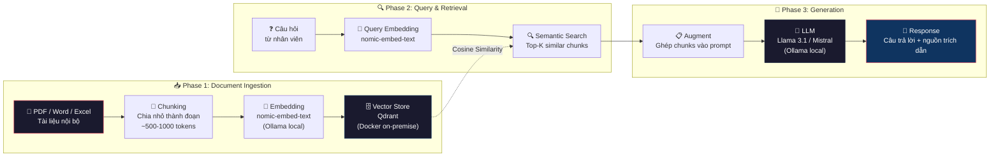
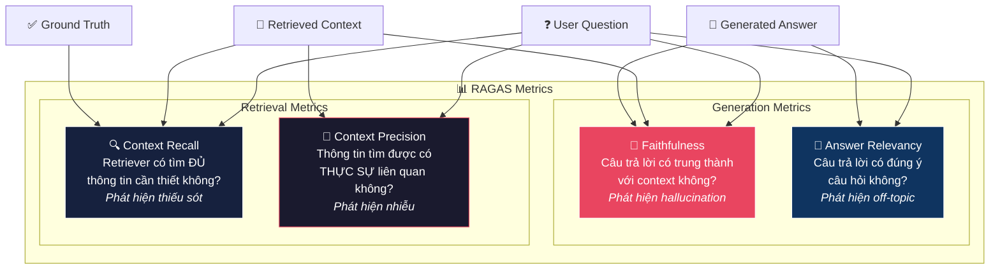

# RAG Nội Bộ: Xây Dựng "Bộ Não Doanh Nghiệp" — AI Trả Lời Từ Tài Liệu Nội Bộ Của Bạn

## Mở Đầu: Bạn Muốn AI Biết Về *Công Ty Bạn* — Không Chỉ Biết Về Thế Giới

Hãy tưởng tượng bạn mới vào công ty và có một câu hỏi đơn giản: *"Nhân viên nghỉ thai sản được hưởng bao nhiêu ngày?"*. Bạn có hai lựa chọn:

- **Hỏi ChatGPT** — nó sẽ trả lời theo Bộ luật Lao động Việt Nam: *"6 tháng"*. Đúng, nhưng công ty bạn có thể cho thêm 2 tuần lương 100% theo nội quy riêng — **ChatGPT không biết điều này**.
- **Hỏi "thủ thư thông minh" nội bộ** — AI tra cứu đúng trang 47 của Nội quy công ty phiên bản 2026, trích dẫn: *"Nhân viên nghỉ thai sản hưởng 6 tháng theo luật + 2 tuần hưởng lương 100% theo chính sách công ty (Điều 12, Mục 3.2)"*. **Chính xác, có nguồn, kiểm chứng được**.

"Thủ thư thông minh" đó chính là **RAG — Retrieval-Augmented Generation**. Và bài viết này sẽ hướng dẫn bạn xây dựng nó từ đầu, chạy hoàn toàn on-premise, cho toàn tổ chức.

**Nội dung chính:**

- RAG là gì — ẩn dụ "thủ thư thông minh" vs "sinh viên chỉ nhớ sách giáo khoa".
- Pipeline RAG on-premise đầy đủ: Ingestion → Chunking → Embedding → Vector Store → Retrieval → LLM → Response.
- Cài đặt Qdrant + Python ingestion pipeline hoàn chỉnh.
- 3 use case thực chiến: HR Bot, IT Support Bot, Insurance Policy Bot.
- Đánh giá chất lượng RAG bằng RAGAS framework.

---

## 1. RAG Là Gì? — "Thủ Thư Thông Minh" vs "Sinh Viên Chỉ Nhớ SGK"

### 1.1 Ẩn Dụ: Hai Cách Trả Lời Câu Hỏi

Hãy so sánh hai "nhân viên" trong thư viện công ty:

| | 🎓 "Sinh viên nhớ SGK" (LLM thuần) | 📚 "Thủ thư thông minh" (RAG) |
|---|---|---|
| **Kiến thức** | Chỉ biết những gì đã học từ sách giáo khoa (training data) | Biết cách **tìm đúng cuốn sách, mở đúng trang** rồi mới trả lời |
| **Khi hỏi về nội quy công ty** | Bịa một câu trả lời nghe hợp lý (hallucination) | Tra cứu file Nội quy, trích dẫn chính xác điều khoản |
| **Cập nhật thông tin** | Phải "học lại" (fine-tune) — tốn GPU và thời gian | Upload file mới → có ngay kiến thức mới |
| **Trích dẫn nguồn** | Không thể — không biết lấy từ đâu | Kèm nguồn: "Theo Nội quy v2026, trang 47, Điều 12" |
| **Chi phí cập nhật** | $$$$ (fine-tuning) | $ (upload tài liệu) |

### 1.2 Định Nghĩa Kỹ Thuật

**RAG (Retrieval-Augmented Generation)** là kiến trúc kết hợp 2 thành phần:

1. **Retrieval (Truy xuất)**: Tìm kiếm các đoạn tài liệu liên quan nhất đến câu hỏi từ một cơ sở dữ liệu nội bộ.
2. **Generation (Sinh)**: Đưa các đoạn tài liệu đó vào context window của LLM, yêu cầu LLM trả lời **chỉ dựa trên thông tin được cung cấp**.

Kết quả: LLM không "bịa" — nó **trả lời dựa trên bằng chứng** (evidence-based), và bạn có thể kiểm chứng bằng cách đọc lại nguồn tài liệu.

!!! info "RAG vs Fine-tuning — Khi nào dùng gì?"
    - **RAG**: Khi kiến thức thay đổi thường xuyên (nội quy, sản phẩm, giá cả), khi cần trích dẫn nguồn, khi không muốn tốn chi phí GPU cho fine-tuning.
    - **Fine-tuning**: Khi cần model hiểu **phong cách**, **ngôn ngữ chuyên ngành** sâu (ví dụ: viết email theo tone của công ty), hoặc khi kiến thức ổn định ít thay đổi.
    - **Tốt nhất**: Kết hợp cả hai — fine-tune model để hiểu ngôn ngữ chuyên ngành + RAG để cung cấp dữ liệu mới nhất.

---

## 2. Pipeline RAG On-Premise: Từ Tài Liệu Đến Câu Trả Lời

### 2.1 Kiến Trúc End-to-End



### 2.2 Chi Tiết Từng Bước

| Bước | Component | Công cụ | Mô tả |
|:----:|-----------|---------|-------|
| 1 | **Document Loading** | `unstructured`, `PyMuPDF` | Đọc PDF, Word, Excel → plain text |
| 2 | **Chunking** | `langchain.text_splitter` | Chia text thành chunks 500–1000 tokens, overlap 100 tokens |
| 3 | **Embedding** | `nomic-embed-text` (Ollama) | Chuyển mỗi chunk thành vector 768 chiều |
| 4 | **Vector Store** | Qdrant (Docker) | Lưu trữ và index vectors với metadata |
| 5 | **Retrieval** | Qdrant search | Tìm top-K chunks gần nhất với câu hỏi (Cosine Similarity) |
| 6 | **Augmentation** | Prompt engineering | Ghép chunks vào system prompt + user query |
| 7 | **Generation** | Llama 3.1 / Mistral (Ollama) | LLM sinh câu trả lời dựa trên context |
| 8 | **Citation** | Post-processing | Trích xuất nguồn tài liệu từ metadata |

---

## 3. Cài Đặt Qdrant & Ingestion Pipeline

### 3.1 Bảng So Sánh Vector Database

Trước khi chọn Qdrant, hãy so sánh với các lựa chọn phổ biến:

| Tiêu chí | **Qdrant** | **ChromaDB** | **Milvus** | **Weaviate** |
|----------|:----------:|:------------:|:----------:|:------------:|
| **Ngôn ngữ** | Rust | Python | Go + C++ | Go |
| **Triển khai** | Docker / K8s / Cloud | Embedded / Docker | Docker / K8s | Docker / K8s / Cloud |
| **Hiệu năng** | ⭐⭐⭐⭐⭐ | ⭐⭐⭐ | ⭐⭐⭐⭐⭐ | ⭐⭐⭐⭐ |
| **Khả năng mở rộng** | Tốt (sharding) | Hạn chế | Xuất sắc (tỷ vectors) | Tốt |
| **Filtering metadata** | Xuất sắc (payload index) | Cơ bản | Tốt | Tốt (GraphQL) |
| **Hybrid Search** | ✅ (Sparse + Dense) | ❌ | ✅ | ✅ (BM25 built-in) |
| **Self-hosted** | ✅ Dễ dàng | ✅ Rất dễ | ✅ Phức tạp hơn | ✅ Dễ dàng |
| **Production-ready** | ✅ | ⚠️ (phù hợp MVP) | ✅ | ✅ |
| **Phù hợp cho** | SME → Enterprise | Prototype, MVP | Enterprise lớn (tỷ records) | Ứng dụng AI phức tạp |
| **RAM tiêu thụ** | Thấp (mmap) | Trung bình | Cao | Trung bình |

!!! tip "Tại sao chọn Qdrant?"
    Với doanh nghiệp 100–5000 nhân viên, Qdrant là lựa chọn **cân bằng tốt nhất**: hiệu năng cao (Rust), dễ triển khai (single Docker container), filtering metadata mạnh (quan trọng cho RBAC trên tài liệu), và đủ khả năng mở rộng cho hàng triệu documents. ChromaDB phù hợp hơn cho prototype; Milvus phù hợp khi bạn có hàng tỷ records.

### 3.2 Cài Đặt Qdrant Bằng Docker

```yaml title="docker-compose.qdrant.yml" linenums="1"
version: "3.9"

services:
  qdrant:
    image: qdrant/qdrant:v1.12.5
    container_name: rag-qdrant
    restart: unless-stopped
    ports:
      - "6333:6333"    # HTTP API + Dashboard
      - "6334:6334"    # gRPC (cho Python client)
    volumes:
      - qdrant_data:/qdrant/storage
    environment:
      QDRANT__SERVICE__GRPC_PORT: 6334
      # Bật API key trong production
      # QDRANT__SERVICE__API_KEY: "your-qdrant-api-key"
    healthcheck:
      test: ["CMD", "curl", "-f", "http://localhost:6333/healthz"]
      interval: 10s
      timeout: 5s
      retries: 5

volumes:
  qdrant_data:
```

```bash
# Khởi động Qdrant
docker compose -f docker-compose.qdrant.yml up -d

# Kiểm tra: truy cập Dashboard
# http://localhost:6333/dashboard
```

### 3.3 Python Ingestion Pipeline — Hoàn Chỉnh

Dưới đây là pipeline Python **có thể chạy ngay**, xử lý PDF/Word → chunking → embedding → lưu vào Qdrant:

```python title="rag_ingestion.py" linenums="1"
"""
RAG Ingestion Pipeline — Enterprise Document Indexing
=====================================================
Pipeline xử lý tài liệu nội bộ (PDF, Word, Text) → chunking → embedding
→ lưu vào Qdrant vector database.

Yêu cầu:
    pip install qdrant-client langchain-text-splitters pymupdf python-docx
    requests tqdm

    # Ollama đang chạy với model nomic-embed-text:
    # ollama pull nomic-embed-text
"""

import hashlib
import json
import os
import re
from dataclasses import dataclass, field
from datetime import datetime
from pathlib import Path
from typing import Optional

import fitz  # PyMuPDF
import requests
from docx import Document as DocxDocument
from langchain_text_splitters import RecursiveCharacterTextSplitter
from qdrant_client import QdrantClient
from qdrant_client.models import (
    Distance,
    FieldCondition,
    Filter,
    MatchValue,
    PointStruct,
    VectorParams,
)
from tqdm import tqdm


# ============================================================
# 1. Cấu hình
# ============================================================
@dataclass
class RAGConfig:
    """Cấu hình cho RAG pipeline."""
    # Qdrant
    qdrant_url: str = "http://localhost:6333"
    collection_name: str = "company_docs"

    # Embedding (Ollama local)
    ollama_url: str = "http://localhost:11434"
    embedding_model: str = "nomic-embed-text"
    embedding_dim: int = 768  # nomic-embed-text v1.5

    # Chunking
    chunk_size: int = 800       # ~800 characters ≈ ~200 tokens
    chunk_overlap: int = 150    # Overlap giữa các chunks
    separators: list = field(default_factory=lambda: [
        "\n\n",   # Đoạn văn
        "\n",     # Dòng mới
        ". ",     # Câu
        ", ",     # Mệnh đề
        " ",      # Từ
    ])


config = RAGConfig()


# ============================================================
# 2. Document Loaders — Đọc PDF, Word, Text
# ============================================================
def load_pdf(file_path: str) -> str:
    """Đọc toàn bộ text từ file PDF."""
    doc = fitz.open(file_path)
    text_parts = []
    for page_num, page in enumerate(doc, 1):
        page_text = page.get_text("text")
        if page_text.strip():
            text_parts.append(f"[Trang {page_num}]\n{page_text}")
    doc.close()
    return "\n\n".join(text_parts)


def load_docx(file_path: str) -> str:
    """Đọc toàn bộ text từ file Word (.docx)."""
    doc = DocxDocument(file_path)
    paragraphs = []
    for para in doc.paragraphs:
        if para.text.strip():
            # Giữ heading level nếu có
            if para.style.name.startswith("Heading"):
                level = para.style.name.replace("Heading ", "")
                paragraphs.append(f"{'#' * int(level)} {para.text}")
            else:
                paragraphs.append(para.text)
    return "\n\n".join(paragraphs)


def load_text(file_path: str) -> str:
    """Đọc file text thuần."""
    with open(file_path, "r", encoding="utf-8") as f:
        return f.read()


def load_document(file_path: str) -> str:
    """Đọc tài liệu dựa trên extension."""
    ext = Path(file_path).suffix.lower()
    loaders = {
        ".pdf": load_pdf,
        ".docx": load_docx,
        ".doc": load_docx,
        ".txt": load_text,
        ".md": load_text,
    }
    loader = loaders.get(ext)
    if not loader:
        raise ValueError(f"Unsupported file type: {ext}")
    return loader(file_path)


# ============================================================
# 3. Chunking — Chia nhỏ tài liệu
# ============================================================
def chunk_document(
    text: str,
    chunk_size: int = config.chunk_size,
    chunk_overlap: int = config.chunk_overlap,
) -> list[str]:
    """Chia text thành các chunks với overlap."""
    splitter = RecursiveCharacterTextSplitter(
        chunk_size=chunk_size,
        chunk_overlap=chunk_overlap,
        separators=config.separators,
        length_function=len,
        is_separator_regex=False,
    )
    chunks = splitter.split_text(text)
    return [c.strip() for c in chunks if c.strip()]


# ============================================================
# 4. Embedding — Gọi Ollama local
# ============================================================
def get_embeddings(
    texts: list[str],
    model: str = config.embedding_model,
    prefix: str = "search_document",
    batch_size: int = 32,
) -> list[list[float]]:
    """
    Tạo embedding vectors từ Ollama.

    Args:
        texts: Danh sách text cần embedding.
        prefix: 'search_document' cho ingestion, 'search_query' cho query.
        batch_size: Số texts mỗi batch (giảm nếu GPU yếu).
    """
    all_embeddings = []

    for i in range(0, len(texts), batch_size):
        batch = texts[i : i + batch_size]
        # Thêm prefix theo yêu cầu của nomic-embed-text
        prefixed = [f"{prefix}: {t}" for t in batch]

        response = requests.post(
            f"{config.ollama_url}/api/embed",
            json={
                "model": model,
                "input": prefixed,
            },
            timeout=120,
        )
        response.raise_for_status()
        data = response.json()
        all_embeddings.extend(data["embeddings"])

    return all_embeddings


def get_query_embedding(query: str) -> list[float]:
    """Tạo embedding cho câu hỏi (search query)."""
    embeddings = get_embeddings([query], prefix="search_query")
    return embeddings[0]


# ============================================================
# 5. Qdrant — Tạo collection và lưu vectors
# ============================================================
def init_qdrant_collection(
    client: QdrantClient,
    collection_name: str = config.collection_name,
    vector_size: int = config.embedding_dim,
) -> None:
    """Tạo collection trong Qdrant (nếu chưa tồn tại)."""
    collections = [c.name for c in client.get_collections().collections]

    if collection_name not in collections:
        client.create_collection(
            collection_name=collection_name,
            vectors_config=VectorParams(
                size=vector_size,
                distance=Distance.COSINE,
            ),
        )
        print(f"✅ Collection '{collection_name}' created.")
    else:
        print(f"ℹ️  Collection '{collection_name}' already exists.")


def ingest_document(
    client: QdrantClient,
    file_path: str,
    department: str,
    doc_type: str,
    collection_name: str = config.collection_name,
) -> int:
    """
    Ingest một tài liệu vào Qdrant.

    Args:
        file_path: Đường dẫn file.
        department: Phòng ban sở hữu (hr, it, legal, insurance...).
        doc_type: Loại tài liệu (policy, runbook, contract...).

    Returns:
        Số chunks đã index.
    """
    file_name = Path(file_path).name
    print(f"\n📄 Processing: {file_name}")

    # Step 1: Load
    text = load_document(file_path)
    print(f"   📖 Loaded: {len(text):,} characters")

    # Step 2: Chunk
    chunks = chunk_document(text)
    print(f"   🔪 Chunked: {len(chunks)} chunks")

    if not chunks:
        print("   ⚠️  No chunks generated. Skipping.")
        return 0

    # Step 3: Embed
    print(f"   🧮 Embedding {len(chunks)} chunks...")
    embeddings = get_embeddings(chunks)

    # Step 4: Prepare points with metadata
    points = []
    for idx, (chunk, embedding) in enumerate(zip(chunks, embeddings)):
        # Tạo deterministic ID từ nội dung (tránh duplicate)
        point_id = hashlib.md5(
            f"{file_name}:{idx}:{chunk[:100]}".encode()
        ).hexdigest()

        points.append(
            PointStruct(
                id=point_id,
                vector=embedding,
                payload={
                    "text": chunk,
                    "source_file": file_name,
                    "source_path": str(file_path),
                    "chunk_index": idx,
                    "total_chunks": len(chunks),
                    "department": department,
                    "doc_type": doc_type,
                    "indexed_at": datetime.now().isoformat(),
                    "char_count": len(chunk),
                },
            )
        )

    # Step 5: Upsert vào Qdrant
    client.upsert(
        collection_name=collection_name,
        points=points,
    )
    print(f"   ✅ Indexed: {len(points)} chunks → Qdrant")

    return len(points)


# ============================================================
# 6. Search — Truy vấn tài liệu
# ============================================================
def search_documents(
    client: QdrantClient,
    query: str,
    top_k: int = 5,
    department: Optional[str] = None,
    score_threshold: float = 0.5,
    collection_name: str = config.collection_name,
) -> list[dict]:
    """
    Tìm kiếm tài liệu liên quan nhất.

    Args:
        query: Câu hỏi của người dùng.
        top_k: Số kết quả trả về.
        department: Lọc theo phòng ban (None = tất cả).
        score_threshold: Ngưỡng similarity tối thiểu.

    Returns:
        Danh sách kết quả [{text, source, score, ...}].
    """
    # Embedding câu hỏi
    query_vector = get_query_embedding(query)

    # Filter theo department nếu có
    query_filter = None
    if department:
        query_filter = Filter(
            must=[
                FieldCondition(
                    key="department",
                    match=MatchValue(value=department),
                )
            ]
        )

    # Search
    results = client.query_points(
        collection_name=collection_name,
        query=query_vector,
        query_filter=query_filter,
        limit=top_k,
        score_threshold=score_threshold,
    ).points

    # Format results
    return [
        {
            "text": r.payload["text"],
            "source_file": r.payload["source_file"],
            "department": r.payload["department"],
            "chunk_index": r.payload["chunk_index"],
            "score": r.score,
        }
        for r in results
    ]


# ============================================================
# 7. Main — Chạy pipeline
# ============================================================
def main():
    """Ví dụ: Ingest tài liệu HR và tìm kiếm."""
    client = QdrantClient(url=config.qdrant_url)

    # Tạo collection
    init_qdrant_collection(client)

    # --- Ingest tài liệu mẫu ---
    docs_to_ingest = [
        # (file_path, department, doc_type)
        ("docs/hr/noi-quy-cong-ty-2026.pdf", "hr", "policy"),
        ("docs/hr/quy-che-luong-thuong.pdf", "hr", "policy"),
        ("docs/it/runbook-incident-response.pdf", "it", "runbook"),
        ("docs/it/huong-dan-vpn-setup.docx", "it", "runbook"),
        ("docs/insurance/dieu-khoan-bao-hiem-nhan-tho-A01.pdf",
         "insurance", "contract"),
    ]

    total_chunks = 0
    for file_path, dept, doc_type in docs_to_ingest:
        if Path(file_path).exists():
            total_chunks += ingest_document(
                client, file_path, dept, doc_type
            )
        else:
            print(f"⚠️  File not found: {file_path}")

    print(f"\n{'='*50}")
    print(f"📊 Total chunks indexed: {total_chunks}")

    # --- Demo tìm kiếm ---
    print(f"\n{'='*50}")
    print("🔍 Demo Search:")

    query = "Nhân viên nghỉ thai sản được hưởng bao nhiêu ngày?"
    results = search_documents(client, query, department="hr")

    print(f"\n❓ Query: {query}")
    for i, r in enumerate(results, 1):
        print(f"\n📌 Result #{i} (score: {r['score']:.4f})")
        print(f"   Source: {r['source_file']}")
        print(f"   Text: {r['text'][:200]}...")


if __name__ == "__main__":
    main()
```

!!! warning "Lưu ý quan trọng khi dùng nomic-embed-text"
    1. **Luôn dùng prefix**: `search_document:` khi embedding tài liệu, `search_query:` khi embedding câu hỏi. Bỏ prefix sẽ **giảm đáng kể chất lượng retrieval**.
    2. **Context window**: nomic-embed-text hỗ trợ tối đa **8,192 tokens** nhưng Ollama mặc định chỉ 2,048. Set `num_ctx: 8192` nếu chunk dài.
    3. **Dimensions**: Model tạo vector 768 chiều. Hỗ trợ Matryoshka (có thể truncate xuống 256, 512) để tiết kiệm storage — nhưng giữ 768 cho chất lượng tốt nhất.

---

## 4. Thực Chiến: 3 Use Case Enterprise

### 4.1 Use Case 1: HR Chatbot — Tra Cứu Nội Quy

**Bài toán**: Nhân viên thường xuyên hỏi HR những câu hỏi lặp đi lặp lại: nghỉ phép, thai sản, bảo hiểm, quy trình onboarding... HR mất trung bình 2 giờ/ngày trả lời Slack.

**Tài liệu ingest**: Nội quy công ty, Quy chế lương thưởng, Handbook nhân viên, Chính sách phúc lợi.

!!! example "Ví dụ thực tế: Query HR Bot"
    **Nhân viên hỏi**: *"Nhân viên nghỉ thai sản được hưởng bao nhiêu ngày?"*

    **System tìm được** (top-3 chunks từ Qdrant, score > 0.85):

    - 📌 **Chunk 1** (score: 0.92) — `noi-quy-cong-ty-2026.pdf`, trang 47:
      > *"Điều 12, Mục 3.2 — Chế độ thai sản: Nhân viên nữ được nghỉ thai sản 6 tháng (180 ngày) theo quy định của Bộ luật Lao động. Ngoài ra, công ty hỗ trợ thêm 14 ngày nghỉ hưởng 100% lương cơ bản."*

    - 📌 **Chunk 2** (score: 0.87) — `chinh-sach-phuc-loi-2026.pdf`, trang 12:
      > *"Mục 5.1 — Hỗ trợ sinh con: Nhân viên nam được nghỉ 7 ngày hưởng lương khi vợ sinh con. Nhân viên nữ được nhận quà tặng trị giá 5,000,000 VNĐ khi sinh con."*

    - 📌 **Chunk 3** (score: 0.85) — `noi-quy-cong-ty-2026.pdf`, trang 48:
      > *"Điều 12, Mục 3.3 — Thủ tục nghỉ thai sản: Nhân viên cần nộp đơn cho HR trước ngày dự sinh ít nhất 30 ngày, kèm giấy khám thai của bệnh viện."*

    **HR Bot trả lời**:

    > Theo Nội quy công ty 2026 (Điều 12, Mục 3.2), nhân viên nữ nghỉ thai sản được hưởng:
    >
    > - **180 ngày** (6 tháng) theo Bộ luật Lao động
    > - **Thêm 14 ngày** nghỉ hưởng 100% lương cơ bản theo chính sách công ty
    > - **Tổng cộng: 194 ngày**
    >
    > Ngoài ra, nhân viên nữ được nhận quà tặng trị giá 5,000,000 VNĐ khi sinh con (Chính sách phúc lợi 2026, Mục 5.1).
    >
    > 📎 Nguồn: `noi-quy-cong-ty-2026.pdf` (trang 47-48), `chinh-sach-phuc-loi-2026.pdf` (trang 12)

**System prompt chuẩn cho HR Bot**:

```text title="HR Bot System Prompt"
Bạn là trợ lý HR nội bộ của [Tên Công Ty]. Nhiệm vụ của bạn là trả lời
câu hỏi của nhân viên dựa HOÀN TOÀN trên tài liệu nội quy, chính sách
và quy chế được cung cấp trong context.

QUY TẮC BẮT BUỘC:
1. CHỈ trả lời dựa trên thông tin trong context được cung cấp.
   Nếu context không chứa câu trả lời, nói rõ: "Tôi không tìm thấy
   thông tin này trong tài liệu nội bộ. Vui lòng liên hệ phòng HR
   qua email hr@company.com."
2. LUÔN trích dẫn nguồn: tên file, số trang, số điều/mục.
3. KHÔNG BAO GIỜ bịa thông tin hoặc suy đoán.
4. Trả lời bằng tiếng Việt, rõ ràng, dễ hiểu.
5. Nếu câu hỏi liên quan đến pháp luật, nhắc nhân viên tham khảo
   thêm với bộ phận pháp chế.

FORMAT TRẢ LỜI:
- Câu trả lời ngắn gọn, có bullet points
- Cuối cùng: 📎 Nguồn: [tên file] (trang X)
```

### 4.2 Use Case 2: IT Support Bot — Tra Cứu Runbook

**Bài toán**: Khi hệ thống gặp sự cố lúc 2 giờ sáng, kỹ sư trực cần tra cứu nhanh runbook xử lý incident — nhưng tài liệu nằm rải rác trong Confluence, SharePoint, và Google Drive.

**Tài liệu ingest**: Runbook xử lý incident, SOP các hệ thống, Network diagram docs, CMDB (cấu hình hạ tầng).

**Ví dụ query**:

| Câu hỏi | Tài liệu nguồn | Kỳ vọng trả lời |
|---------|-----------------|------------------|
| "Database PostgreSQL bị full disk, xử lý thế nào?" | `runbook-postgres-ops.pdf` | Step-by-step: check disk → identify large tables → VACUUM FULL → alert DBA |
| "VPN không kết nối được, check gì trước?" | `huong-dan-vpn-setup.docx` | Checklist: certificate expiry → firewall rules → DNS resolution → escalation |
| "Prometheus alert OOMKilled trên pod X, xử lý ra sao?" | `runbook-k8s-troubleshoot.md` | kubectl describe → check resource limits → restart → scale → notify team |

### 4.3 Use Case 3: Insurance Policy Bot — Tra Cứu Điều Khoản Hợp Đồng

**Bài toán**: Tư vấn viên bảo hiểm cần tra cứu nhanh điều khoản hợp đồng khi khách hàng hỏi về quyền lợi, loại trừ, hoặc thủ tục bồi thường — nhưng mỗi sản phẩm có hàng trăm trang điều khoản.

**Tài liệu ingest**: Điều khoản sản phẩm bảo hiểm nhân thọ, phi nhân thọ, sức khỏe; Quy trình bồi thường; FAQ nội bộ.

**Ví dụ query**:

| Câu hỏi | Tài liệu nguồn | Kỳ vọng |
|---------|-----------------|---------|
| "Bảo hiểm nhân thọ A01 có bồi thường tai nạn giao thông không?" | `dieu-khoan-A01.pdf` | Trích dẫn điều khoản quyền lợi + các trường hợp loại trừ |
| "Thời hạn chờ bảo hiểm sức khỏe B02 là bao lâu?" | `dieu-khoan-B02.pdf` | "Thời hạn chờ: 30 ngày cho bệnh thông thường, 365 ngày cho bệnh có sẵn" |
| "Hồ sơ bồi thường viện phí cần những giấy tờ gì?" | `quy-trinh-boi-thuong.pdf` | Checklist giấy tờ: đơn yêu cầu, hóa đơn, giấy ra viện, CMND/CCCD |

!!! tip "Best Practice cho Insurance Bot"
    - **Chunk theo điều khoản**: Thay vì chunk cố định 800 ký tự, chunk theo ranh giới "Điều", "Mục", "Khoản" — giữ nguyên context pháp lý.
    - **Metadata chi tiết**: Lưu `product_code`, `article_number`, `effective_date` trong payload để filter chính xác.
    - **Disclaimer tự động**: Mỗi response phải kèm: *"Đây là tham khảo từ tài liệu nội bộ. Quyết định bồi thường cuối cùng thuộc về bộ phận thẩm định."*

---

## 5. Đánh Giá Chất Lượng RAG Bằng RAGAS

### 5.1 Tại Sao Cần Đánh Giá?

Xây dựng RAG xong chưa đủ — bạn cần **đo lường** để biết:

- Model có **bịa** thêm thông tin không? (Faithfulness)
- Câu trả lời có **đúng ý** người hỏi không? (Answer Relevancy)
- Hệ thống có **tìm đúng** tài liệu không? (Context Recall/Precision)

### 5.2 RAGAS Framework — 4 Metrics Cốt Lõi

[RAGAS](https://docs.ragas.io/) (Retrieval-Augmented Generation Assessment) là framework đánh giá RAG mã nguồn mở, sử dụng **LLM-as-a-Judge** — nghĩa là dùng chính LLM để chấm điểm, không cần annotate thủ công.



### 5.3 Code Đánh Giá Bằng RAGAS

```python title="evaluate_rag.py" linenums="1"
"""
Đánh giá chất lượng RAG bằng RAGAS framework.

Yêu cầu:
    pip install ragas langchain-community datasets
"""

from datasets import Dataset
from ragas import evaluate
from ragas.metrics import (
    answer_relevancy,
    context_precision,
    context_recall,
    faithfulness,
)

# ============================================================
# Dữ liệu test — Câu hỏi + Ground Truth + Context + Answer
# ============================================================
eval_data = {
    "question": [
        "Nhân viên nghỉ thai sản được hưởng bao nhiêu ngày?",
        "Quy trình xin nghỉ phép năm như thế nào?",
        "Bảo hiểm nhân thọ A01 có bồi thường tai nạn không?",
    ],
    "answer": [
        (
            "Theo Nội quy công ty 2026 (Điều 12, Mục 3.2), nhân viên nữ "
            "nghỉ thai sản được hưởng 180 ngày theo Bộ luật Lao động, "
            "cộng thêm 14 ngày hưởng 100% lương theo chính sách công ty. "
            "Tổng cộng 194 ngày."
        ),
        (
            "Nhân viên cần gửi đơn xin nghỉ phép trên hệ thống HRM "
            "trước ít nhất 3 ngày làm việc. Quản lý trực tiếp duyệt "
            "trong vòng 24 giờ. Nghỉ phép trên 5 ngày cần thêm duyệt "
            "của Giám đốc phòng ban."
        ),
        (
            "Bảo hiểm nhân thọ A01 bồi thường tai nạn với mức chi trả "
            "100% mệnh giá hợp đồng cho tử vong do tai nạn, và theo "
            "bảng tỷ lệ thương tật cho thương tật vĩnh viễn. Loại trừ: "
            "tai nạn do sử dụng chất kích thích."
        ),
    ],
    "contexts": [
        [
            "Điều 12, Mục 3.2 — Chế độ thai sản: Nhân viên nữ được nghỉ "
            "thai sản 6 tháng (180 ngày) theo quy định của Bộ luật Lao động. "
            "Ngoài ra, công ty hỗ trợ thêm 14 ngày nghỉ hưởng 100% lương "
            "cơ bản."
        ],
        [
            "Điều 8, Mục 2.1 — Quy trình nghỉ phép: Nhân viên nộp đơn "
            "trên hệ thống HRM tối thiểu 3 ngày làm việc trước ngày nghỉ. "
            "Quản lý duyệt trong 24h. Nghỉ trên 5 ngày cần thêm phê duyệt "
            "của Giám đốc phòng ban."
        ],
        [
            "Điều 5 — Quyền lợi bảo hiểm tai nạn: Trường hợp tử vong do "
            "tai nạn, công ty bảo hiểm chi trả 100% mệnh giá hợp đồng. "
            "Thương tật vĩnh viễn: theo bảng tỷ lệ thương tật quy định. "
            "Loại trừ: tai nạn xảy ra khi sử dụng chất kích thích."
        ],
    ],
    "ground_truth": [
        "Nhân viên nữ nghỉ thai sản 180 ngày + 14 ngày thêm = 194 ngày.",
        (
            "Nộp đơn trên HRM trước 3 ngày. Quản lý duyệt trong 24h. "
            "Trên 5 ngày cần thêm duyệt của GĐ phòng ban."
        ),
        (
            "Có bồi thường. Tử vong: 100% mệnh giá. Thương tật: theo bảng "
            "tỷ lệ. Loại trừ: tai nạn do chất kích thích."
        ),
    ],
}

# ============================================================
# Chạy đánh giá
# ============================================================
dataset = Dataset.from_dict(eval_data)

result = evaluate(
    dataset,
    metrics=[
        faithfulness,
        answer_relevancy,
        context_recall,
        context_precision,
    ],
)

print("\n📊 RAGAS Evaluation Results:")
print(f"{'='*50}")
print(f"  Faithfulness:       {result['faithfulness']:.4f}")
print(f"  Answer Relevancy:   {result['answer_relevancy']:.4f}")
print(f"  Context Recall:     {result['context_recall']:.4f}")
print(f"  Context Precision:  {result['context_precision']:.4f}")
print(f"{'='*50}")
```

### 5.4 Cách Đọc Kết Quả & Khắc Phục

| Metric | Điểm tốt | Nếu điểm thấp → Nguyên nhân | Cách khắc phục |
|--------|:---------:|------------------------------|----------------|
| **Faithfulness** | > 0.85 | Model hallucinate — bịa thêm thông tin ngoài context | Cải thiện system prompt (nhấn mạnh "chỉ dùng context"), giảm temperature |
| **Answer Relevancy** | > 0.80 | Câu trả lời lạc đề hoặc quá dài dòng | Cải thiện prompt engineering, thêm instruction cụ thể hơn |
| **Context Recall** | > 0.75 | Retriever KHÔNG tìm đủ tài liệu cần thiết | Cải thiện chunking (nhỏ hơn), thử embedding model khác, dùng hybrid search |
| **Context Precision** | > 0.75 | Retriever tìm được nhưng kết quả nhiễu, không liên quan | Thêm reranker (cross-encoder), giảm top-K, cải thiện metadata filtering |

!!! note "Chu trình đánh giá liên tục"
    Đừng chỉ chạy RAGAS một lần. Mỗi khi thay đổi chunking strategy, embedding model, hoặc system prompt → chạy lại RAGAS để so sánh. Xây dựng **golden test set** (50–100 câu hỏi + ground truth) cho mỗi use case và tích hợp vào CI/CD pipeline.

---

## Kết Luận

RAG không phải là "thêm search rồi nhét vào prompt" — nó là **cả một hệ thống kỹ thuật** đòi hỏi thiết kế cẩn thận ở mọi tầng. Ba bài học quan trọng nhất:

1. **Chunking quyết định 80% chất lượng** — Chunk quá lớn → model bị "ngập" thông tin, chunk quá nhỏ → mất context. Hãy chunk theo ngữ nghĩa (paragraph, heading, article) thay vì cắt cứng theo ký tự.

2. **Metadata là "vũ khí bí mật"** — Lưu `department`, `doc_type`, `page_number`, `effective_date` vào mỗi chunk. Khi query, filter theo metadata trước → tìm kiếm chính xác hơn gấp nhiều lần so với chỉ dùng vector similarity.

3. **Đo lường trước khi production** — Không có metric → không biết hệ thống tốt hay dở. RAGAS cho phép bạn **đo lường tự động** và so sánh giữa các lần cải tiến. Hãy xây golden test set cho mỗi use case và chạy đánh giá mỗi sprint.

Bước tiếp theo trong series: **Advanced RAG** — Hybrid Search (BM25 + Dense), Reranking với Cross-Encoder, và GraphRAG cho reasoning liên tài liệu.

---

## Tham Khảo

- [RAGAS Documentation](https://docs.ragas.io/) — Tài liệu chính thức của RAGAS framework, bao gồm hướng dẫn tích hợp với LangChain và LlamaIndex.
- [Qdrant Documentation](https://qdrant.tech/documentation/) — Tài liệu chính thức Qdrant: cài đặt, Python client, filtering, và best practices cho production.
- [Nomic Embed Text — Hugging Face](https://huggingface.co/nomic-ai/nomic-embed-text-v1.5) — Model card chính thức, bao gồm thông tin về Matryoshka dimensions và task prefixes.
- [LangChain — RAG Tutorial](https://python.langchain.com/docs/tutorials/rag/) — Hướng dẫn xây dựng RAG pipeline với LangChain, bao gồm chunking strategies.
- [OWASP Top 10 for LLM — Sensitive Information Disclosure](https://genai.owasp.org/llm-top-10/) — Rủi ro bảo mật liên quan đến RAG và cách phòng tránh data leakage.
