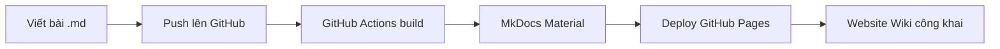
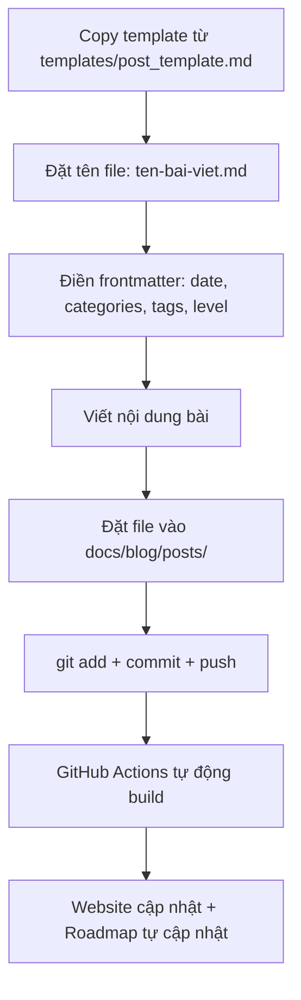

# MyWiki — AI Knowledge Base

Xây dựng một repo GitHub tổ chức dưới dạng Wiki, lưu trữ các bài viết về AI bằng tiếng Việt, sử dụng **MkDocs Material** để deploy thành website tĩnh trên GitHub Pages.

## Tổng quan kiến trúc



**Tại sao chọn MkDocs Material?**
- Blog plugin: tự động sắp xếp bài theo **timeline** (archive theo năm/tháng)
- Tags plugin: tự động tạo trang **tags index** để search theo chủ đề
- Search plugin: full-text search hỗ trợ tiếng Việt
- Giao diện đẹp, responsive, dark mode
- Deploy tự động qua GitHub Actions → GitHub Pages

---

## Proposed Changes

### 1. Cấu trúc thư mục

```
MyWiki/
├── docs/
│   ├── index.md                    # Trang chủ Wiki
│   ├── roadmap.md                  # Learning Roadmap (auto-generated)
│   ├── about.md                    # Giới thiệu bản thân & mục đích
│   ├── tags.md                     # Trang index tags
│   ├── blog/
│   │   ├── index.md                # Trang listing blog (auto by plugin)
│   │   └── posts/
│   │       ├── .authors.yml        # Thông tin tác giả
│   │       └── *.md                # Các bài viết
│   └── assets/
│       ├── images/                 # Hình minh hoạ
│       └── diagrams/               # Sơ đồ Mermaid exports
├── scripts/
│   └── generate_roadmap.py         # Script tạo roadmap từ metadata
├── templates/
│   └── post_template.md            # Template cho bài viết mới
├── mkdocs.yml                      # Cấu hình MkDocs
├── requirements.txt                # Python dependencies
├── .gitignore
├── README.md                       # Giới thiệu repo trên GitHub
└── .github/
    └── workflows/
        └── deploy.yml              # GitHub Actions auto-deploy
```

---

### 2. Cấu hình MkDocs Material

#### [NEW] [mkdocs.yml](file:///Users/tranvanhoan/Documents/Projects/Learning/MyWiki/mkdocs.yml)

Cấu hình chính bao gồm:
- **Theme**: Material với dark/light mode toggle, ngôn ngữ Việt
- **Plugins**: `blog` (timeline + archive), `tags` (phân loại), `search` (tìm kiếm)
- **Navigation**: Trang chủ → Blog → Roadmap → Tags → About
- **Markdown extensions**: admonitions, code highlighting, Mermaid diagrams, table of contents
- **Blog plugin config**:
  - `blog_dir: blog`
  - `post_date_format: "dd/MM/yyyy"` (format Việt Nam)
  - `archive_date_format: "yyyy"` 
  - `categories_allowed`: danh sách chủ đề được phép (tránh lỗi chính tả)

> [!IMPORTANT]
> **Danh sách categories gợi ý** (bạn duyệt và chỉnh sửa):
> - `LLM` — Large Language Models
> - `Prompt Engineering`
> - `RAG` — Retrieval-Augmented Generation  
> - `Agent` — AI Agents
> - `MLOps`
> - `Computer Vision`
> - `NLP`
> - `Kỹ năng AI` — Tips, workflow, productivity với AI
> - `AI Cơ bản` — Kiến thức nền tảng
> - `Case Study` — Phân tích thực tế

---

### 3. Template bài viết

#### [NEW] [post_template.md](file:///Users/tranvanhoan/Documents/Projects/Learning/MyWiki/templates/post_template.md)

Mỗi bài viết sẽ có frontmatter chuẩn:

```yaml
---
date: 2026-05-05
categories:
  - LLM
tags:
  - transformer
  - attention
level: intermediate    # beginner | intermediate | advanced
status: published      # draft | published
description: "Mô tả ngắn gọn về bài viết"
---
```

Sau đó là nội dung bài theo cấu trúc đã thống nhất:
1. **Tiêu đề** (H1) — sát chủ đề, có thể sáng tạo nhẹ
2. **Mở đầu** — nêu vấn đề, thu hút + mục lục
3. **Nội dung chính** — kiến thức, ví dụ thực tế, hình minh hoạ
4. **Kết luận** — tóm tắt, ý nghĩa
5. **Tham khảo** — nguồn tham khảo

---

### 4. Learning Roadmap tự động

#### [NEW] [generate_roadmap.py](file:///Users/tranvanhoan/Documents/Projects/Learning/MyWiki/scripts/generate_roadmap.py)

Script Python chạy trong quá trình build MkDocs (qua plugin `mkdocs-gen-files`):

**Cách hoạt động:**
1. Quét tất cả file `.md` trong `docs/blog/posts/`
2. Đọc frontmatter: `date`, `categories`, `tags`, `level`, `title`
3. Tạo trang `roadmap.md` với nội dung:
   - **Thống kê tổng quan**: số bài theo level, theo category
   - **Timeline**: liệt kê bài theo thứ tự thời gian
   - **Ma trận kiến thức**: bảng Category × Level, đánh dấu ✅ đã có bài, ❌ chưa có

**Ví dụ output:**

```
## 📊 Tổng quan
- Tổng số bài: 15
- 🟢 Beginner: 5 | 🟡 Intermediate: 7 | 🔴 Advanced: 3

## 🗺️ Ma trận kiến thức

| Chủ đề            | Cơ bản | Trung bình | Nâng cao |
|--------------------|--------|------------|----------|
| LLM                | ✅ (2) | ✅ (3)     | ✅ (1)   |
| Prompt Engineering | ✅ (1) | ❌         | ❌       |
| RAG                | ❌     | ✅ (1)     | ❌       |

## 📅 Timeline
### 2026
- **05/2026**: Transformer Architecture (LLM, Intermediate)
- **05/2026**: Prompt Engineering 101 (Prompt Engineering, Beginner)
```

> [!TIP]
> **Đây là cách giải quyết vấn đề maintain roadmap**: Roadmap được **tự động generate** mỗi khi build. Bạn chỉ cần viết bài với đúng frontmatter, roadmap sẽ tự cập nhật. Không cần maintain thủ công gì cả.

---

### 5. Trang chủ

#### [NEW] [index.md](file:///Users/tranvanhoan/Documents/Projects/Learning/MyWiki/docs/index.md)

Trang chủ bao gồm:
- Tiêu đề + giới thiệu ngắn về Wiki
- Quick links đến: Blog (bài mới nhất), Roadmap, Tags
- Badge thống kê (tổng bài, chủ đề...)

---

### 6. GitHub Actions Deploy

#### [NEW] [deploy.yml](file:///Users/tranvanhoan/Documents/Projects/Learning/MyWiki/.github/workflows/deploy.yml)

Workflow tự động:
- Trigger khi push lên `main`
- Cài Python + dependencies
- Chạy `mkdocs build`
- Deploy lên GitHub Pages

---

### 7. Các file hỗ trợ

#### [NEW] [requirements.txt](file:///Users/tranvanhoan/Documents/Projects/Learning/MyWiki/requirements.txt)
```
mkdocs-material
mkdocs-gen-files
mkdocs-literate-nav
```

#### [NEW] [.gitignore](file:///Users/tranvanhoan/Documents/Projects/Learning/MyWiki/.gitignore)
Ignore `site/`, `__pycache__/`, `.venv/`

#### [NEW] [README.md](file:///Users/tranvanhoan/Documents/Projects/Learning/MyWiki/README.md)
Giới thiệu repo, hướng dẫn contribute, link đến website.

---

## Quy trình viết bài mới



---

## Open Questions

> [!IMPORTANT]
> **1. Tên repo & URL GitHub Pages**
> Bạn muốn đặt tên repo là gì? Ví dụ:
> - `ai-wiki` → URL: `username.github.io/ai-wiki`
> - `ai-knowledge-base`
> - `my-ai-journal`
> - Hoặc tên khác?

> [!IMPORTANT]
> **2. Danh sách categories**
> Tôi đã gợi ý 10 categories ở phần trên. Bạn muốn thêm/bớt/sửa gì không?

> [!NOTE]
> **3. Thông tin tác giả**
> MkDocs blog plugin hỗ trợ hiển thị avatar + tên tác giả. Bạn muốn dùng tên gì và có link GitHub avatar không?

---

## Verification Plan

### Automated Tests
1. Chạy `mkdocs build --strict` để kiểm tra không có lỗi
2. Chạy `mkdocs serve` để preview local tại `localhost:8000`
3. Tạo 1 bài viết mẫu để test toàn bộ flow: frontmatter → blog listing → tags → roadmap

### Manual Verification
1. Kiểm tra giao diện website: dark/light mode, responsive
2. Kiểm tra search hoạt động với tiếng Việt
3. Kiểm tra roadmap tự động generate đúng
4. Kiểm tra tags index hiển thị đúng
5. Sau khi push lên GitHub, kiểm tra GitHub Actions deploy thành công
